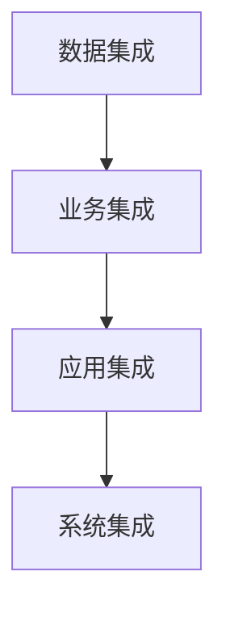

# 整合和管理信息化管理系统搭建信息化平台

## 1.背景介绍

在当今数字化时代,信息技术已经深深融入到各行各业的方方面面。企业和组织需要建立高效的信息化管理系统来整合和管理海量的数据、流程和资源,从而提高运营效率、降低成本、优化决策过程。信息化管理系统的核心目标是通过采集、存储、处理和分析数据,为企业提供准确及时的信息支持,实现信息资源的高效利用和有效管理。

构建一个完整的信息化管理平台是一项复杂的系统工程,需要将多个子系统和模块无缝集成,并实现数据的统一管理和共享。这对信息技术的应用能力、系统集成能力和管理能力提出了很高的要求。

## 2.核心概念与联系

信息化管理平台的核心概念包括:

1. **数据集成(Data Integration)**: 将来自不同源系统的数据集中到统一的数据存储中,实现数据的共享和交换。
2. **业务集成(Business Integration)**: 将不同业务系统和流程无缝连接,实现业务协同和自动化。
3. **应用集成(Application Integration)**: 将多个应用系统集成到统一的平台中,提供统一的用户界面和数据访问接口。
4. **系统集成(System Integration)**: 将硬件、软件、网络、安全等不同系统组件集成到一个完整的解决方案中。

这些核心概念相互关联、相互依赖,共同构建了一个完整的信息化管理平台。数据集成是基础,业务集成是核心,应用集成提供了用户界面,而系统集成则将所有组件集成到一个整体解决方案中。



## 3.核心算法原理具体操作步骤

构建信息化管理平台的核心算法和原理包括:

### 3.1 数据集成算法

1. **ETL(Extract-Transform-Load)**:
   - 抽取(Extract): 从各种异构数据源提取数据
   - 转换(Transform): 对抽取的数据执行清理、转换、集成等操作
   - 加载(Load): 将转换后的数据加载到目标数据存储中

2. **数据质量管理**:
   - 数据profiling: 分析数据的完整性、一致性、准确性等质量指标
   - 数据清理: 标准化、去重、填补缺失值等操作
   - 数据审计: 跟踪数据变更情况,确保数据的可追溯性

3. **元数据管理**:
   - 收集和管理有关数据的元数据(数据字典、数据线

```

4. **数据建模**:
   - 概念建模: 确定业务概念和实体之间的关系
   - 逻辑建模: 定义数据对象、属性和关系
   - 物理建模: 将逻辑模型映射到物理数据库结构

### 3.2 业务集成算法

1. **业务流程管理(BPM)**:
   - 流程建模: 使用标准符号(BPMN)对业务流程进行可视化建模
   - 流程执行: 根据模型自动执行和监控业务流程
   - 流程优化: 分析流程数据,持续优化流程效率

2. **业务规则管理(BRM)**:
   - 规则建模: 将业务策略和决策逻辑形式化为可执行的规则
   - 规则引擎: 在运行时评估和执行业务规则
   - 规则维护: 持续更新和优化业务规则

3. **主数据管理(MDM)**:
   - 主数据建模: 定义主数据对象、属性和关系
   - 主数据集成: 从多个源系统收集和整合主数据
   - 主数据质量: 确保主数据的完整性、一致性和准确性

### 3.3 应用集成算法

1. **服务导向架构(SOA)**:
   - 服务识别: 根据业务需求识别可重用的服务
   - 服务建模: 定义服务接口、操作和数据模型
   - 服务组合: 将多个服务组合成复杂的业务流程

2. **企业服务总线(ESB)**:
   - 消息路由: 在应用程序和服务之间路由和转换消息
   - 协议转换: 实现不同协议和数据格式之间的转换
   - 安全和监控: 提供安全控制、日志记录和监控功能

3. **用户界面集成**:
   - 门户集成: 将多个应用程序集成到统一的门户界面中
   - 单点登录(SSO): 实现跨应用程序的单一身份认证和授权
   - 个性化和自定义: 根据用户角色和偏好定制界面和功能

### 3.4 系统集成算法

1. **虚拟化技术**:
   - 服务器虚拟化: 在单个物理服务器上运行多个虚拟机
   - 存储虚拟化: 将多个存储设备集中到统一的存储池中
   - 网络虚拟化: 在物理网络基础上构建虚拟网络

2. **云计算技术**:
   - 基础设施即服务(IaaS): 提供虚拟化的计算、存储和网络资源
   - 平台即服务(PaaS): 提供开发、测试和部署环境
   - 软件即服务(SaaS): 通过网络交付应用程序服务

3. **DevOps实践**:
   - 持续集成(CI): 自动化构建、测试和部署流程
   - 持续交付(CD): 将软件快速、可靠地交付到生产环境
   - 监控和反馈: 实时监控系统性能,快速响应并优化

## 4.数学模型和公式详细讲解举例说明

在信息化管理平台的建设过程中,需要应用多种数学模型和算法来支持数据分析、优化决策和系统运维等关键任务。以下是一些常用的数学模型和公式:

### 4.1 数据质量评估模型

数据质量是信息化管理平台的基础,可以使用多维度的指标来评估数据质量。常用的数据质量维度包括:完整性、准确性、一致性、及时性、可解释性等。

可以使用以下公式来计算数据完整性:

$$
完整性 = \frac{无缺失值记录数}{总记录数}
$$

其中,无缺失值记录数指没有任何字段缺失值的记录数量。

同样,可以使用以下公式来计算数据准确性:

$$
准确性 = \frac{正确记录数}{总记录数}
$$

正确记录数指符合业务规则和约束的记录数量。

### 4.2 业务流程优化模型

业务流程优化是提高运营效率和降低成本的关键。可以使用队列理论、马尔可夫链等数学模型来分析和优化业务流程。

例如,可以使用小波分析技术对业务流程数据进行时间序列分解,从而识别周期性模式和异常情况。具体公式如下:

$$
X(t) = S(t) + T(t) + R(t)
$$

其中,$X(t)$表示原始时间序列数据,$S(t)$表示平滑分量(趋势),$T(t)$表示周期分量,$R(t)$表示残差分量。

通过分析各个分量,可以发现流程中的瓶颈和改进空间,从而优化流程设计和资源分配。

### 4.3 数据挖掘与机器学习模型

在信息化管理平台中,可以应用数据挖掘和机器学习算法来发现数据中的隐藏模式和规律,支持决策分析和预测建模。

常用的监督学习算法包括:

- 线性回归: $y = w_0 + w_1x_1 + w_2x_2 + ... + w_nx_n$
- 逻辑回归: $P(y=1|x) = \sigma(w_0 + w_1x_1 + w_2x_2 + ... + w_nx_n)$
- 决策树: 基于特征值递归分割数据集
- 支持向量机: $f(x) = \sum_{i=1}^{n}\alpha_iy_iK(x_i,x) + b$

无监督学习算法包括:

- 聚类算法(K-Means,层次聚类等)
- 关联规则挖掘(Apriori,FP-Growth等)
- 降维算法(PCA,SVD等)

通过应用这些算法,可以从海量数据中发现有价值的知识,为业务决策提供数据支持。

## 5.项目实践:代码实例和详细解释说明

为了更好地理解信息化管理平台的构建过程,我们将通过一个实际项目案例来演示关键技术和代码实现。

### 5.1 项目概述

本项目旨在为一家制造企业构建一个集成的信息化管理平台,包括以下子系统:

- 企业资源计划(ERP)系统: 管理生产计划、物料需求、库存等核心业务流程
- 客户关系管理(CRM)系统: 管理销售、营销和客户服务流程
- 供应链管理(SCM)系统: 管理采购、物流和供应商关系
- 人力资源管理(HRM)系统: 管理员工招聘、培训和绩效考核
- 商业智能(BI)系统: 提供数据分析、报表和仪表板功能

这些子系统将通过集成平台无缝连接,实现数据共享和业务协同。

### 5.2 数据集成实现

我们将使用Apache Kafka作为企业服务总线(ESB),实现各子系统之间的数据集成和消息传递。

以下是一个使用Python编写的Kafka Producer示例代码:

```python
from kafka import KafkaProducer
import json

# 创建Kafka Producer实例
producer = KafkaProducer(bootstrap_servers='kafka_broker_ip:9092',
                         value_serializer=lambda v: json.dumps(v).encode('utf-8'))

# 发送消息到Kafka Topic
message = {'order_id': 1234, 'customer_id': 567, 'amount': 99.99}
producer.send('orders', value=message)
```

在上面的代码中,我们首先创建了一个KafkaProducer实例,并设置了Kafka Broker的IP地址和端口号。然后,我们定义了一个Python字典作为消息的内容,并使用producer.send()方法将其发送到名为"orders"的Kafka Topic中。

消费者端可以使用以下代码从Kafka Topic中读取消息:

```python
from kafka import KafkaConsumer
import json

# 创建Kafka Consumer实例
consumer = KafkaConsumer('orders',
                         bootstrap_servers='kafka_broker_ip:9092',
                         value_deserializer=lambda m: json.loads(m.decode('utf-8')))

# 读取并处理消息
for message in consumer:
    order = message.value
    print(f"Received order: {order}")
    # 进一步处理订单数据...
```

在这个示例中,我们创建了一个KafkaConsumer实例,并订阅了"orders"主题。每当有新消息到达,消费者就会读取并打印出订单数据。您可以在此基础上添加更多的业务逻辑来处理订单数据。

通过使用Kafka作为企业服务总线,各个子系统可以发布和订阅相关的业务事件,实现实时的数据集成和业务协同。

### 5.3 业务流程管理实现

我们将使用Camunda作为业务流程管理(BPM)引擎,来设计、执行和监控企业的核心业务流程。

以下是一个使用BPMN 2.0标准建模的订单履行流程示例:

```bpmn
<?xml version="1.0" encoding="UTF-8"?>
<bpmn:definitions xmlns:bpmn="http://www.omg.org/spec/BPMN/20100524/MODEL" xmlns:bpmndi="http://www.omg.org/spec/BPMN/20100524/DI" xmlns:dc="http://www.omg.org/spec/DD/20100524/DC" xmlns:di="http://www.omg.org/spec/DD/20100524/DI" id="Definitions_1" targetNamespace="http://bpmn.io/schema/bpmn" exporter="Camunda Modeler" exporterVersion="4.9.0">
  <bpmn:process id="Process_1" isExecutable="true">
    <bpmn:startEvent id="StartEvent_1" name="Order Received">
      <bpmn:outgoing>Flow_0bfxnwf</bpmn:outgoing>
    </bpmn:startEvent>
    <bpmn:sequenceFlow id="Flow_0bfxnwf" sourceRef="StartEvent_1" targetRef="Activity_0i2z4qs"