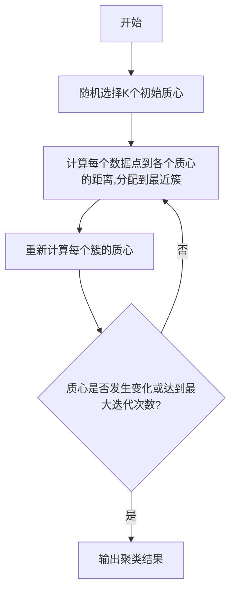
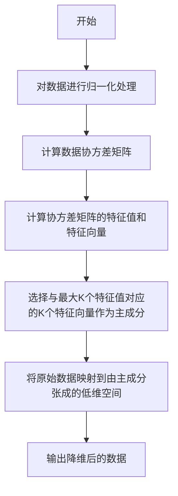

# 无监督学习 (Unsupervised Learning)

## 1. 背景介绍

在机器学习领域中,有两大类学习方式:监督学习(Supervised Learning)和无监督学习(Unsupervised Learning)。监督学习是指利用已标注的训练数据,学习能够将输入映射到正确输出的函数。而无监督学习则是从未标注的数据中寻找内在的结构和模式。

无监督学习的主要目标是发现数据内在的分布规律和结构,而不需要任何人工标注的训练样本。它可以用于许多实际应用场景,如聚类分析、异常检测、维数约减和生成模型等。随着大数据时代的到来,海量未标注数据的出现使得无监督学习方法变得越来越重要。

### 1.1 无监督学习的重要性

无监督学习在数据挖掘、模式识别、计算机视觉和自然语言处理等领域发挥着重要作用。以下是无监督学习的一些关键优势:

- 标注数据的成本高昂,无监督学习可避免这一问题
- 能够发现人类难以察觉的数据模式和规律
- 可用于数据可视化和高维数据理解
- 为监督学习任务提供有用的先验知识

### 1.2 无监督学习的挑战

尽管无监督学习具有诸多优势,但它也面临一些挑战:

- 缺乏明确的目标函数,难以评估模型的性能
- 对噪声和异常值敏感
- 对高维数据的可扩展性较差
- 结果的解释性较差

## 2. 核心概念与联系

无监督学习包含多种不同的技术和算法,其核心概念主要包括:

### 2.1 聚类(Clustering)

聚类是将相似的数据样本划分到同一个簇中的过程。常用的聚类算法有:

- K-Means聚类
-层次聚类(Hierarchical Clustering)
- DBSCAN聚类
- 高斯混合模型(Gaussian Mixture Model, GMM)

### 2.2 降维(Dimensionality Reduction)

降维旨在将高维数据映射到低维空间,同时保留数据的主要特征。常见的降维技术有:

- 主成分分析(Principal Component Analysis, PCA)
- 核化主成分分析(Kernel PCA)
- 线性判别分析(Linear Discriminant Analysis, LDA)
- t-SNE(t-Distributed Stochastic Neighbor Embedding)

### 2.3 关联规则挖掘(Association Rule Mining)

关联规则挖掘旨在发现数据集中的频繁项集和相关性规则。著名的Apriori算法和FP-Growth算法就属于这一范畴。

### 2.4 异常检测(Anomaly Detection)

异常检测的目标是识别与大多数数据明显不同的异常样本。常用技术包括:

- 基于统计的异常检测
- 基于聚类的异常检测
- 基于密度的异常检测

### 2.5 神经网络模型

一些神经网络模型也可用于无监督学习,如自编码器(Autoencoder)、受限玻尔兹曼机(Restricted Boltzmann Machine, RBM)和生成对抗网络(Generative Adversarial Network, GAN)等。

上述概念相互关联,组合使用可以解决更加复杂的无监督学习问题。

## 3. 核心算法原理具体操作步骤

接下来,我们将深入探讨无监督学习中两种核心算法的原理和具体操作步骤。

### 3.1 K-Means聚类算法

K-Means是一种简单而经典的聚类算法,其思想是将数据划分为K个簇,使得簇内样本相似度较高,簇间相似度较低。算法步骤如下:

1) 随机选择K个初始质心
2) 计算每个数据点到各个质心的距离,将其分配到最近的簇
3) 重新计算每个簇的质心
4) 重复步骤2和3,直到质心不再发生变化或达到最大迭代次数

算法的关键点在于合理选择初始质心和距离度量方式。常用的距离度量包括欧几里得距离、曼哈顿距离和余弦相似度等。

K-Means算法优点是简单高效,但也存在一些缺陷:

- 需要预先指定簇的数量K
- 对噪声和异常值敏感
- 无法发现非凸形状的簇



### 3.2 主成分分析(PCA)

主成分分析是一种常用的无监督降维技术,其目标是找到能够最大程度保留原始数据信息的低维表示。算法步骤如下:

1) 对数据进行归一化处理
2) 计算数据协方差矩阵
3) 计算协方差矩阵的特征值和特征向量
4) 选择与最大K个特征值对应的K个特征向量作为主成分
5) 将原始数据映射到由主成分张成的低维空间

PCA的数学原理是最大化投影后数据的方差,从而使得低维表示尽可能保留原始数据的信息。

PCA的优点是算法简单、易于实现,但也存在一些缺陷:

- 只能发现线性关系,对非线性数据不适用
- 对异常值敏感
- 主成分缺乏可解释性



## 4. 数学模型和公式详细讲解举例说明

无监督学习中的许多算法都基于一些数学模型和公式,下面我们将详细讲解其中的一些核心内容。

### 4.1 K-Means目标函数

K-Means算法的目标是最小化所有数据点到其所属簇质心的距离平方和,即:

$$J = \sum_{i=1}^{K}\sum_{x \in C_i}\left \| x - \mu_i \right \|^2$$

其中,K是簇的数量,$C_i$是第i个簇,$\mu_i$是第i个簇的质心。

该目标函数也被称为"惯性"或"簇内平方和"。通过迭代优化,我们可以找到使目标函数最小的聚类结果。

### 4.2 PCA协方差矩阵

在PCA中,我们需要计算数据的协方差矩阵:

$$\Sigma = \frac{1}{m}\sum_{i=1}^{m}(x^{(i)}-\mu)(x^{(i)}-\mu)^T$$

其中,$x^{(i)}$是第i个数据样本,$\mu$是所有数据的均值向量,m是数据的总数。

协方差矩阵$\Sigma$是一个对称半正定矩阵,其特征值表示数据在对应特征向量方向上的方差。我们选择具有最大K个特征值的特征向量作为主成分。

### 4.3 PCA主成分投影

将原始数据$x$投影到由主成分$u_1,u_2,...,u_K$张成的低维空间,我们得到:

$$z_k = u_k^T(x-\mu)$$

其中,$z_k$是x在第k个主成分上的投影。最终,我们可以用$z = (z_1,z_2,...,z_K)^T$来表示x的低维表示。

以下是一个简单的二维数据PCA降维到一维的示例:

```python
import numpy as np

# 原始二维数据
X = np.array([[2, 1], 
              [1, 3],
              [3, 5], 
              [5, 6],
              [6, 8], 
              [8, 7]])

# 计算均值
mu = np.mean(X, axis=0)

# 中心化数据
X = X - mu  

# 计算协方差矩阵
Sigma = np.cov(X.T)  

# 计算特征值和特征向量
eigenvalues, eigenvectors = np.linalg.eig(Sigma)

# 选择最大特征值对应的特征向量作为主成分
pc = eigenvectors[:, np.argmax(eigenvalues)]  

# 投影到主成分
X_pca = np.dot(X, pc.T)

print("原始数据:\n", X)
print("主成分:\n", pc)
print("投影后的一维数据:\n", X_pca)
```

输出:
```
原始数据:
 [[ 0.5 -1.5]
 [-0.5  0.5]
 [ 1.5  2.5]
 [ 3.5  3.5]
 [ 4.5  5.5]
 [ 6.5  4.5]]
主成分:
 [-0.55470199  0.83205298]
投影后的一维数据:
 [-2.82842712  0.          5.65685425 10.60756063 16.26763964 19.39121837]
```

可以看到,PCA将原始的二维数据投影到了一条直线上,同时保留了大部分数据的信息。

## 5. 项目实践:代码实例和详细解释说明

为了更好地理解无监督学习算法,我们将通过一个实际项目案例来进行实践。这个项目旨在对一个包含客户购买信息的数据集进行聚类分析,从而发现潜在的客户群体。

### 5.1 数据集介绍

我们将使用一个名为"Online Retail"的公开数据集,其中包含了一家英国在线商店从2010年12月1日到2011年12月9日期间的所有交易记录。该数据集包含以下字段:

- InvoiceNo: 发票号码(唯一标识每个交易)
- StockCode: 产品代码
- Description: 产品描述
- Quantity: 购买数量
- InvoiceDate: 发票日期
- UnitPrice: 产品单价
- CustomerID: 客户ID
- Country: 客户所在国家

我们将根据客户ID对数据进行聚类,以发现具有相似购买模式的客户群体。

### 5.2 数据预处理

在开始聚类之前,我们需要进行一些数据预处理步骤:

1. 过滤掉包含缺失值的记录
2. 创建一个"购买矩阵",其中每一行对应一个客户,每一列对应一种产品,值为该客户购买该产品的总数量
3. 对购买矩阵进行标准化处理,使其符合正态分布

```python
import pandas as pd
from sklearn.preprocessing import StandardScaler

# 加载数据集
data = pd.read_csv('Online_Retail.csv', encoding='utf-8')

# 过滤掉缺失值
data = data[~data['CustomerID'].isin([0, 'NULL'])]

# 创建购买矩阵
purchase_matrix = data.groupby(['CustomerID', 'StockCode'])['Quantity'].sum().unstack().fillna(0)

# 标准化
scaler = StandardScaler()
purchase_matrix_scaled = scaler.fit_transform(purchase_matrix)
```

### 5.3 K-Means聚类

接下来,我们将使用K-Means算法对客户进行聚类。我们将尝试不同的聚类数量K,并使用"轮廓系数"(Silhouette Coefficient)来评估聚类质量。

```python
from sklearn.cluster import KMeans
from sklearn.metrics import silhouette_score

# 尝试不同的聚类数量
scores = []
for k in range(2, 11):
    kmeans = KMeans(n_clusters=k, random_state=42)
    labels = kmeans.fit_predict(purchase_matrix_scaled)
    score = silhouette_score(purchase_matrix_scaled, labels)
    scores.append(score)

# 找到最佳聚类数量
best_k = scores.index(max(scores)) + 2
print(f"最佳聚类数量为: {best_k}")

# 使用最佳聚类数量进行聚类
kmeans = KMeans(n_clusters=best_k, random_state=42)
labels = kmeans.fit_predict(purchase_matrix_scaled)
```

根据轮廓系数,我们发现最佳的聚类数量为5。接下来,我们将分析每个聚类的特征。

### 5.4 聚类分析

我们可以通过查看每个聚类中最常购买的产品来了解该聚类的特征:

```python
# 获取每个