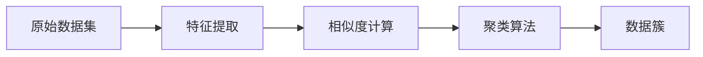
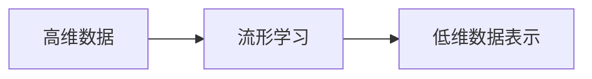
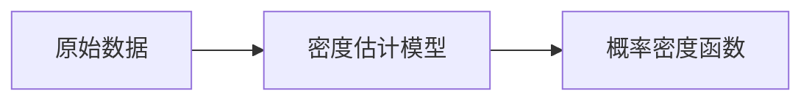
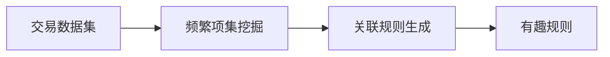
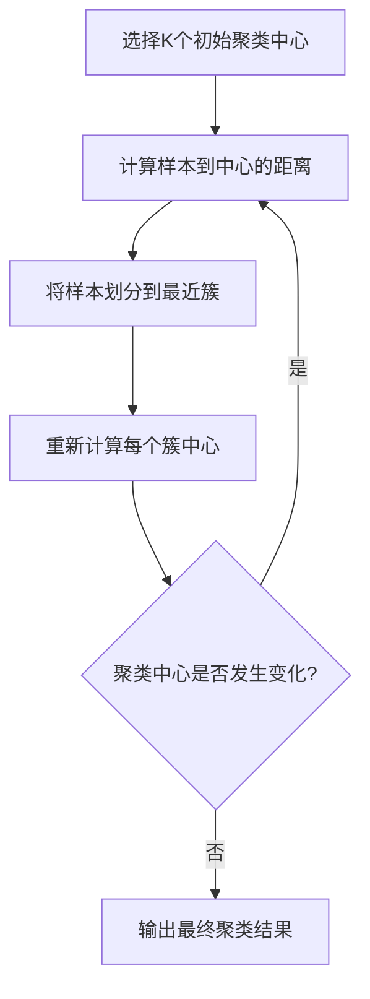
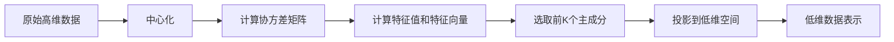
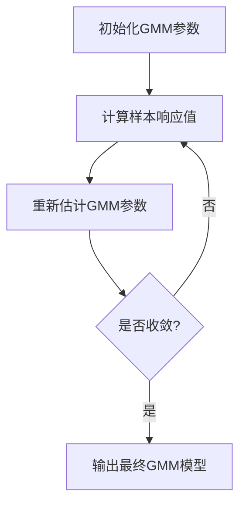
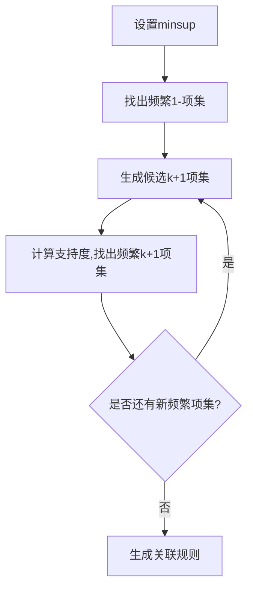

以下是题为《无监督学习 原理与代码实例讲解》的技术博客文章正文内容：

# 无监督学习 原理与代码实例讲解

## 1.背景介绍

### 1.1 什么是无监督学习？

无监督学习是机器学习中一种重要的范式,与有监督学习和强化学习并列为三大主要学习范式。无监督学习的目标是从未标记的原始数据中发现内在的数据模式或数据内在结构,而不需要任何人工标注的训练样本。

无监督学习广泛应用于数据挖掘、计算机视觉、自然语言处理等领域,常见的任务包括聚类分析、异常检测、数据可视化、特征学习等。

### 1.2 无监督学习的重要性

在现实世界中,获取大量高质量的标注数据是非常困难和昂贵的,而无监督学习则能够直接从原始数据中学习有用的模式,从而避免了标注数据的成本。此外,无监督学习能够发现人类难以察觉的数据内在结构,揭示数据背后隐藏的知识。

随着大数据时代的到来,海量的非结构化数据急需通过无监督学习的方法进行分析和处理。可以预见,未来无监督学习将在人工智能领域发挥越来越重要的作用。

## 2.核心概念与联系

### 2.1 聚类分析

聚类分析是无监督学习中最典型和最重要的任务之一。聚类的目标是将数据集中相似的对象划分到同一个簇(cluster)中,使得簇内的对象相似度尽可能高,而簇间的对象相似度尽可能低。常见的聚类算法包括K-Means、层次聚类、DBSCAN等。



### 2.2 降维与流形学习

高维数据通常存在"维数灾难"问题,导致数据变得稀疏、计算复杂度剧增。降维是将高维数据映射到低维空间的过程,目的是在降低数据维度的同时尽可能保留原始数据的内在结构和特征。常见的降维算法有PCA、LLE、Isomap等。

流形学习则是基于一个假设:虽然原始数据分布在高维空间,但实际上可能只位于该高维空间的一个低维流形(manifold)上。通过学习这个低维流形的结构,就可以实现降维的目的。



### 2.3 密度估计

密度估计是学习数据的概率密度函数(PDF)或概率质量函数(PMF)的过程。常见的密度估计方法有核密度估计、高斯混合模型、K-近邻密度估计等。密度估计在异常检测、数据生成等任务中有重要应用。



### 2.4 关联规则挖掘

关联规则挖掘旨在从大量数据中发现有趣、频繁且未知的相关性规则。典型的应用场景是购物篮分析,即发现顾客同时购买的商品组合规律。Apriori算法和FP-Growth算法是两种经典的关联规则挖掘算法。



## 3.核心算法原理具体操作步骤

### 3.1 K-Means聚类算法

K-Means是一种简单而有效的聚类算法,其核心思想是通过迭代最小化样本到聚类中心的距离平方和,从而得到最优的聚类结果。算法步骤如下:

1. 随机选择K个初始聚类中心
2. 计算每个样本到各个聚类中心的距离,将样本划分到距离最近的聚类中
3. 重新计算每个聚类的中心点
4. 重复步骤2和3,直到聚类中心不再发生变化或达到最大迭代次数



### 3.2 主成分分析(PCA)

PCA是一种常用的线性无监督降维算法,其思想是将高维数据映射到一个低维的子空间,使得映射后的数据尽可能保留原始数据的方差信息。算法步骤如下:

1. 对原始数据进行中心化,使其均值为0
2. 计算数据的协方差矩阵
3. 计算协方差矩阵的特征值和特征向量
4. 选择最大的K个特征值对应的特征向量作为投影矩阵
5. 将原始数据乘以投影矩阵,得到降维后的低维数据



### 3.3 高斯混合模型(GMM)

GMM是一种常用的密度估计和聚类算法,其核心思想是将数据集的概率密度函数建模为有限个高斯分布的加权和。算法步骤如下:

1. 初始化GMM参数(混合权重、均值向量、协方差矩阵)
2. 对每个样本,计算其在每个高斯分布下的响应值
3. 根据响应值,重新估计GMM参数
4. 重复步骤2和3,直到收敛或达到最大迭代次数
5. 输出最终的GMM参数和每个样本的隶属概率



### 3.4 Apriori算法

Apriori算法是一种经典的关联规则挖掘算法,其核心思想是反复扫描数据集,生成频繁项集,并从中产生关联规则。算法步骤如下:

1. 设置最小支持度阈值minsup
2. 统计所有项集的支持度,找出所有频繁1-项集
3. 利用频繁k-项集生成候选(k+1)-项集
4. 计算候选(k+1)-项集的支持度,找出频繁(k+1)-项集
5. 重复步骤3和4,直到无法再生成新的频繁项集
6. 根据频繁项集生成关联规则



## 4.数学模型和公式详细讲解举例说明

### 4.1 K-Means目标函数

K-Means算法的目标是最小化所有样本到其所属聚类中心的距离平方和,即:

$$J = \sum_{i=1}^{n}\sum_{j=1}^{k}\mathbb{I}(r_i=j)||x_i-\mu_j||^2$$

其中:
- $n$是样本数量
- $k$是聚类数量 
- $r_i$是样本$x_i$的聚类标签
- $\mu_j$是第$j$个聚类的均值向量
- $\mathbb{I}(\cdot)$是指示函数

通过迭代优化上述目标函数,可以得到最优的聚类结果。

### 4.2 PCA主成分

在PCA算法中,我们需要求解协方差矩阵$\Sigma$的特征值和特征向量:

$$\Sigma v_i = \lambda_i v_i$$

其中$\lambda_i$是第$i$个特征值,$v_i$是对应的特征向量。

选取最大的$k$个特征值对应的特征向量$v_1,v_2,...,v_k$作为投影矩阵$W$:

$$W = [v_1,v_2,...,v_k]$$

将原始数据$X$投影到$W$构成的低维空间,得到降维后的数据$Y$:

$$Y = XW$$

### 4.3 GMM概率密度函数

GMM将数据集$X$的概率密度函数建模为$K$个高斯分布的加权和:

$$p(x|\pi,\mu,\Sigma) = \sum_{k=1}^{K}\pi_k\mathcal{N}(x|\mu_k,\Sigma_k)$$

其中:
- $\pi_k$是第$k$个高斯分量的混合权重,满足$\sum_{k=1}^{K}\pi_k=1$
- $\mathcal{N}(x|\mu_k,\Sigma_k)$是第$k$个高斯分量的概率密度函数

对数据集$X$,我们可以通过期望最大化(EM)算法来估计GMM的参数$\pi,\mu,\Sigma$。

### 4.4 关联规则评价指标

关联规则的两个重要评价指标是支持度和置信度:

- 支持度(Support)定义为包含规则前件和后件的交易占所有交易的比例:
$$\text{Support}(X\Rightarrow Y) = \frac{\text{count}(X\cup Y)}{N}$$

- 置信度(Confidence)定义为包含规则前件的交易中,同时包含后件的比例:
$$\text{Confidence}(X\Rightarrow Y) = \frac{\text{count}(X\cup Y)}{\text{count}(X)}$$

其中$N$是所有交易的总数。通常,我们只考虑支持度和置信度较高的规则作为有趣规则。

## 5.项目实践：代码实例和详细解释说明

### 5.1 K-Means聚类

```python
import numpy as np

# 生成样本数据
X = np.array([[1, 2], [1.5, 1.8], [5, 8], [8, 8], [1, 0.6], [9, 11]])

from sklearn.cluster import KMeans

# 初始化KMeans
kmeans = KMeans(n_clusters=2, random_state=0).fit(X)

# 获取聚类标签
labels = kmeans.labels_

# 获取聚类中心
centroids = kmeans.cluster_centers_

print("Cluster labels:")
print(labels)

print("Centroids:")
print(centroids)
```

上述代码使用Scikit-learn库实现了K-Means聚类算法。首先生成了一个简单的二维数据集`X`。然后初始化`KMeans`对象,指定聚类数量为2。通过`fit`方法对数据集进行聚类,可以获得每个样本的聚类标签`labels`以及两个聚类中心`centroids`。

### 5.2 PCA降维

```python
import numpy as np
from sklearn.decomposition import PCA

# 生成样本数据
X = np.array([[-1, -1], [-2, -1], [-3, -2], [1, 1], [2, 1], [3, 2]])

# 初始化PCA
pca = PCA(n_components=1)

# 拟合数据集并进行降维
X_pca = pca.fit_transform(X)

print("Original data:")
print(X)

print("Transformed data:")
print(X_pca)
```

上述代码使用Scikit-learn库实现了PCA降维。首先生成了一个简单的二维数据集`X`。然后初始化`PCA`对象,指定降维后的维度为1。通过`fit_transform`方法对数据集进行降维,可以获得降维后的一维数据`X_pca`。

### 5.3 GMM密度估计

```python
import numpy as np
from sklearn.mixture import GaussianMixture

# 生成样本数据
X = np.concatenate((np.random.normal(0, 1, size=(500, 2)),
                    np.random.normal(5, 1, size=(500, 2))))

# 初始化GMM
gmm = GaussianMixture(n_components=2, random_state=0).fit(X)

# 获