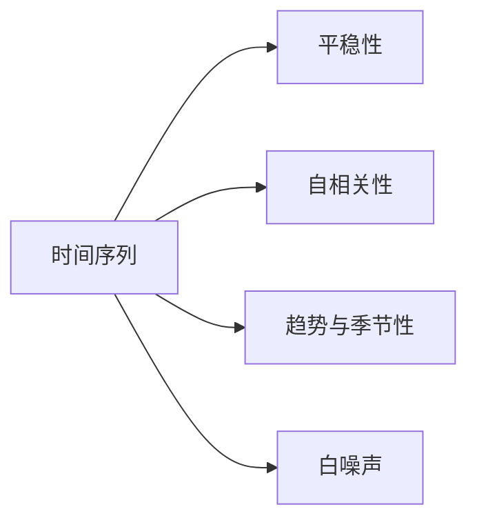

# 时间序列分析(Time Series Analysis) - 原理与代码实例讲解

## 1. 背景介绍
### 1.1 什么是时间序列
时间序列(Time Series)是一组按照时间顺序排列的数据点序列,反映了某一事物、现象等随时间变化的状态。在诸多领域,时间序列分析都占据着重要的地位,如金融市场、气象预测、销售数据等。对时间序列数据进行分析和建模,可以帮助我们发现数据背后隐藏的规律,进而对未来进行预测。

### 1.2 时间序列分析的意义
- 发现历史数据中的规律和趋势
- 理解影响因素之间的动态关系  
- 对未来进行预测,辅助决策

### 1.3 时间序列分析在不同领域的应用
- 金融领域:股票价格预测、风险管理等
- 气象领域:天气预报、气候变化研究等
- 工业领域:设备健康监测、产品需求预测等
- 零售领域:销售额预测、库存管理等

## 2. 核心概念与联系
### 2.1 平稳性(Stationarity)
平稳性是时间序列分析的重要概念。如果一个时间序列的统计特性(如均值和方差)不随时间变化,我们就称之为平稳时间序列。许多经典的时间序列模型都要求时间序列满足平稳性假设。

### 2.2 自相关性(Autocorrelation)
自相关性刻画了时间序列在不同时间点上的相关程度。直观地说,自相关性反映了一个时间序列过去的值对其现在和未来值的影响。自相关性分析在时间序列建模中有着重要作用。

### 2.3 趋势(Trend)与季节性(Seasonality) 
许多时间序列体现出长期的上升或下降趋势,我们称之为趋势成分。一些时间序列还具有周期性的重复模式,即季节性成分。提取时间序列的趋势和季节性成分,可以更好地理解序列的行为。

### 2.4 白噪声(White Noise)
白噪声是一种理想的时间序列,它的各项之间完全独立,服从均值为0的正态分布。白噪声常被用作时间序列模型的误差项。

### 2.5 核心概念之间的联系


## 3. 核心算法原理具体操作步骤
### 3.1 平稳性检验
- ADF检验(Augmented Dickey-Fuller Test):检验时间序列是否存在单位根,以判断序列是否平稳
- KPSS检验(Kwiatkowski-Phillips-Schmidt-Shin Test):检验时间序列是否趋于平稳
  
### 3.2 平稳化处理
- 差分法:对时间序列逐步做差,直到得到平稳序列
- 对数变换:对时间序列取对数,可以削弱数据的异方差性
- 分解法:将时间序列分解为趋势成分、季节性成分和随机成分,分别处理

### 3.3 自相关性分析
- 自相关函数(ACF):度量时间序列与其自身滞后值之间的相关性
- 偏自相关函数(PACF):在控制了中间滞后值的情况下,度量滞后k期的自相关性

### 3.4 经典时间序列模型
- AR(Autoregressive)模型:自回归模型,时间序列的当前值与其过去值的线性组合
- MA(Moving Average)模型:滑动平均模型,时间序列的当前值与过去白噪声的线性组合
- ARMA(Autoregressive Moving Average)模型:自回归滑动平均模型,AR和MA模型的结合
- ARIMA(Autoregressive Integrated Moving Average)模型:差分整合移动平均自回归模型,可以看作ARMA模型的拓展,适用于非平稳序列

## 4. 数学模型和公式详细讲解举例说明
### 4.1 AR(p)模型
AR(p)模型假设时间序列的当前值可以用其前p期的值的线性组合加上白噪声表示:

$$
X_t = c + \sum_{i=1}^p \varphi_i X_{t-i} + \varepsilon_t
$$

其中,$\varphi_1, \ldots, \varphi_p$为模型参数,$\varepsilon_t$为白噪声序列。

例如,AR(1)模型可以表示为:

$$
X_t = c + \varphi_1 X_{t-1} + \varepsilon_t
$$

### 4.2 MA(q)模型 
MA(q)模型假设时间序列的当前值是过去q期的白噪声的线性组合:

$$
X_t = \mu + \sum_{i=1}^q \theta_i \varepsilon_{t-i} + \varepsilon_t
$$

其中,$\mu$为时间序列的均值,$\theta_1, \ldots, \theta_q$为模型参数。

例如,MA(1)模型可以表示为:

$$
X_t = \mu + \theta_1 \varepsilon_{t-1} + \varepsilon_t
$$

### 4.3 ARMA(p,q)模型
ARMA(p,q)模型结合了AR(p)和MA(q)模型,其数学表达式为:

$$
X_t = c + \sum_{i=1}^p \varphi_i X_{t-i} + \sum_{i=1}^q \theta_i \varepsilon_{t-i} + \varepsilon_t
$$

### 4.4 ARIMA(p,d,q)模型
ARIMA(p,d,q)模型可以看作ARMA模型的拓展,其中d为差分阶数。对于非平稳时间序列,我们可以先对其做d阶差分,然后用ARMA(p,q)模型拟合差分后的序列。

设$Y_t$为$X_t$的d阶差分序列,则ARIMA(p,d,q)模型可以表示为:

$$
Y_t = c + \sum_{i=1}^p \varphi_i Y_{t-i} + \sum_{i=1}^q \theta_i \varepsilon_{t-i} + \varepsilon_t
$$

其中,$Y_t = (1-B)^d X_t$,B为滞后算子,满足$BX_t=X_{t-1}$。

## 5. 项目实践:代码实例和详细解释说明
下面我们以Python为例,演示如何使用时间序列分析的相关库和函数。

### 5.1 导入所需的库
```python
import numpy as np
import pandas as pd
import matplotlib.pyplot as plt
from statsmodels.tsa.arima.model import ARIMA
from statsmodels.graphics.tsaplots import plot_acf, plot_pacf
```

### 5.2 生成模拟数据
```python
np.random.seed(123)
ar_params = np.array([0.8, -0.4])
ma_params = np.array([0.3, 0.2])
data = np.zeros(100)
errors = np.random.normal(0, 1, 100)
for t in range(2, 100):
    data[t] = ar_params[0] * data[t-1] + ar_params[1] * data[t-2] + errors[t] + ma_params[0] * errors[t-1] + ma_params[1] * errors[t-2]
```

这里我们生成了一个ARMA(2,2)模型的模拟数据。

### 5.3 绘制时间序列图
```python
plt.figure(figsize=(10, 4))
plt.plot(data)
plt.title('Time Series')
plt.xlabel('Time')
plt.ylabel('Value')
plt.show()
```

### 5.4 绘制自相关图和偏自相关图
```python
fig, ax = plt.subplots(2, 1, figsize=(10, 8))
plot_acf(data, lags=20, ax=ax[0])
plot_pacf(data, lags=20, ax=ax[1])
plt.show()
```

自相关图(ACF)和偏自相关图(PACF)可以帮助我们确定ARMA模型的阶数。

### 5.5 拟合ARMA模型
```python
model = ARIMA(data, order=(2, 0, 2))
result = model.fit()
print(result.summary())
```

这里我们拟合了一个ARMA(2,2)模型,可以从模型的概要信息中看到估计的参数值。

### 5.6 模型诊断
```python
residuals = result.resid
fig, ax = plt.subplots(2, 1, figsize=(10, 8))
ax[0].plot(residuals)
ax[0].set_title('Residuals')
plot_acf(residuals, lags=20, ax=ax[1])
ax[1].set_title('ACF of Residuals')
plt.show()
```

通过检查残差的自相关图,我们可以诊断模型是否已经很好地捕捉了数据的动态特征。

## 6. 实际应用场景
时间序列分析在许多实际场景中都有广泛应用,下面列举几个典型的例子:

- 金融市场预测:利用历史股票价格、交易量等数据建立时间序列模型,预测未来的股票走势,为交易决策提供依据。
- 销售额预测:分析历史销售数据,考虑趋势、季节性等因素,预测未来一段时间的销售额,优化库存管理和资源配置。
- 传感器数据分析:对工业设备上的传感器数据进行实时监控和分析,及早发现设备的异常情况,实现预测性维护。
- 气象预报:利用历史气象数据如温度、湿度、气压等,构建时间序列模型,对未来的天气情况进行预测。

## 7. 工具和资源推荐
- Python库:
  - statsmodels:提供了多种时间序列分析和建模的工具
  - Prophet:Facebook开源的时间序列预测库,使用简单,适合非专业人士
  - PyFlux:时间序列建模和预测的Python库,支持多种模型
- R语言库:  
  - forecast:R语言中使用最广泛的时间序列预测库
  - tseries:提供了多种时间序列分析和建模的函数
- 在线课程:
  - Coursera:"Practical Time Series Analysis"
  - Udemy:"Time Series Analysis and Forecasting using Python"
- 书籍推荐:  
  - 《时间序列分析:预测与控制》(Time Series Analysis: Forecasting and Control)
  - 《应用时间序列分析》(Applied Time Series Analysis)

## 8. 总结:未来发展趋势与挑战
随着数据采集和存储技术的发展,时间序列数据变得越来越丰富和复杂。传统的时间序列分析方法面临着新的挑战和机遇。

- 高维时间序列:随着物联网等技术的普及,收集到的时间序列数据往往具有高维特性,传统方法难以应对。因此,如何处理高维时间序列数据将是未来的一个重要课题。

- 非线性和非平稳:许多实际的时间序列数据表现出强烈的非线性和非平稳特征,传统的线性模型如ARIMA可能难以很好地拟合这些数据。因此,发展能够刻画非线性和非平稳特征的模型和方法将是未来的重点。

- 机器学习和深度学习:近年来,机器学习尤其是深度学习技术在时间序列分析领域得到了广泛关注。如何将这些新技术与传统的时间序列分析方法结合,提高预测和分析的精度,将是一个值得探索的方向。

- 实时和在线学习:在许多实际应用中,时间序列数据是实时产生的,需要能够进行实时处理和分析。发展实时和在线学习的时间序列分析算法,将是未来的一个重要挑战。

总之,时间序列分析仍然是一个充满活力和挑战的研究领域。随着数据的不断丰富和计算技术的进步,这一领域必将迎来更加广阔的发展前景。

## 9. 附录:常见问题与解答
### Q1:平稳性的重要性是什么?
A1:许多经典的时间序列模型都基于平稳性假设。如果时间序列是非平稳的,直接应用这些模型可能得到伪回归(spurious regression)的结果。因此,在建模之前,我们需要先检验时间序列的平稳性,必要时对其进行平稳化处理。

### Q2:如何判断ARMA模型的阶数?  
A2:我们可以通过分析时间序列的自相关图(ACF)和偏自相关图(PACF)来确定ARMA模型的阶数。对于AR(p)模型,PACF在滞后p之后会切断;对于MA(q)模型,ACF在滞后q之后会切断。对于ARMA(p,q)模