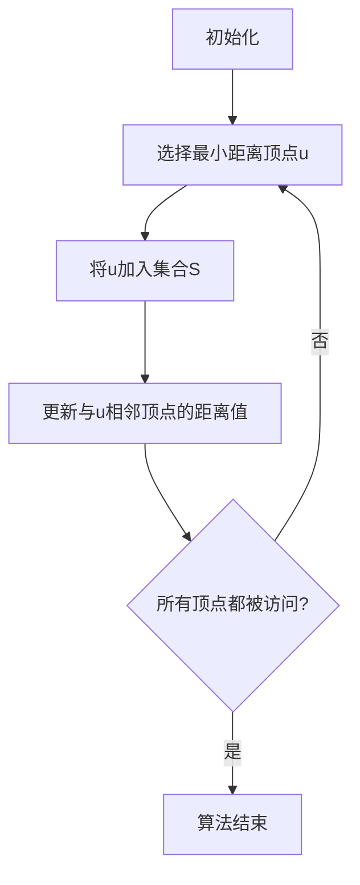
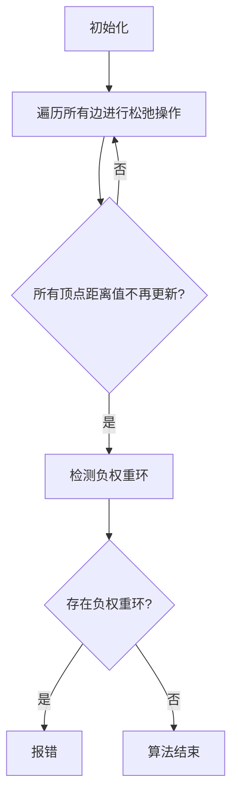

# 最短路径 原理与代码实例讲解

## 1.背景介绍

在现实生活中,我们经常会遇到需要找到两点之间最短路径的问题。比如,导航软件需要计算出从起点到目的地的最短路线;物流配送公司需要规划出最优的运输路线以节省成本;网络通信中也需要寻找数据传输的最佳路径等。因此,最短路径问题在运输、导航、网络等诸多领域都有广泛的应用。

## 2.核心概念与联系

### 2.1 图的表示

要解决最短路径问题,首先需要将实际问题抽象为图的形式。图是一种非线性数据结构,由一组顶点(节点)和连接顶点的边(弧)组成。

在最短路径问题中,顶点可以表示城市、交叉路口或网络节点,而边则代表连接这些位置的路径或链路,并且每条边都有一个相关的权重(cost)值,表示该路径的距离、时间或其他代价。

常见的图的表示方法有邻接矩阵和邻接表两种。

### 2.2 最短路径算法分类

根据具体情况的不同,最短路径算法可以分为以下几种类型:

1. **单源最短路径**: 从一个源顶点出发,找到到其他所有顶点的最短路径。
2. **单目标最短路径**: 从所有顶点出发,找到到一个目标顶点的最短路径。
3. **所有对最短路径**: 计算出任意两点之间的最短路径。
4. **单源单目标最短路径**: 只需找到从源顶点到目标顶点之间的最短路径。

此外,根据边的权重是否为负值,最短路径算法也可分为:

- 非负权重最短路径算法
- 允许负权重最短路径算法

### 2.3 常见最短路径算法

针对不同类型的最短路径问题,有多种经典算法可以解决,包括:

- **Dijkstra算法**: 解决单源非负权重最短路径问题。
- **Bellman-Ford算法**: 解决单源允许负权重最短路径问题。
- **Floyd-Warshall算法**: 解决所有对最短路径问题。
- **A*算法**: 常用于寻找单源单目标最短路径,具有更好的性能。

## 3.核心算法原理具体操作步骤

在这一部分,我们将重点介绍两种经典的最短路径算法:Dijkstra算法和Bellman-Ford算法的原理和实现步骤。

### 3.1 Dijkstra算法

Dijkstra算法是解决单源非负权重最短路径问题的经典算法,可以有效地计算出从源顶点到其他所有顶点的最短路径。该算法基于贪心策略,每次选择距离源顶点最近的未访问顶点,并使用该顶点来更新其他顶点的距离值。

算法步骤如下:

1. 初始化:
   - 将源顶点的距离设为0,其他所有顶点的距离设为无穷大。
   - 创建一个集合S,用于存储已找到最短路径的顶点。
2. 选择最小距离顶点:
   - 从未被访问的顶点中,选择距离源顶点最近的顶点u。
   - 将u加入集合S中。
3. 更新距离值:
   - 对于每个与u相邻的未访问顶点v,更新v的距离值为min(v.dist, u.dist + w(u, v)),其中w(u, v)为边(u, v)的权重。
4. 重复步骤2和3,直到所有顶点都被访问过。

该算法的时间复杂度为O((V+E)logV),其中V为顶点数,E为边数。



### 3.2 Bellman-Ford算法

Bellman-Ford算法是解决单源允许负权重最短路径问题的经典算法。与Dijkstra算法不同,它可以处理存在负权重边的情况,但无法处理存在负权重环的情况。

算法步骤如下:

1. 初始化:
   - 将源顶点的距离设为0,其他所有顶点的距离设为无穷大。
2. 松弛操作:
   - 对所有边(u, v)进行V-1次松弛操作,更新每个顶点的距离值为min(v.dist, u.dist + w(u, v)),其中w(u, v)为边(u, v)的权重。
3. 检测负权重环:
   - 再次遍历所有边,如果存在可以更新距离值的边,则说明图中存在负权重环。

该算法的时间复杂度为O(VE),其中V为顶点数,E为边数。



## 4.数学模型和公式详细讲解举例说明

在最短路径算法中,我们通常使用一些数学模型和公式来表示和计算最短路径。

### 4.1 图的邻接矩阵表示

对于一个有向图G=(V,E),其中V是顶点集合,E是边的集合,我们可以使用邻接矩阵来表示图的结构。

设有n个顶点,邻接矩阵A是一个n×n的矩阵,其中A[i][j]表示从顶点i到顶点j的边的权重。如果不存在从i到j的边,则A[i][j]=∞。

例如,对于下图:

```
    1 ----- 2
    | \     |
    |   \   |
    4 --- 3 ----- 5
```

其邻接矩阵表示为:

$$
A = \begin{bmatrix}
0 & 1 & \infty & 1 & \infty \\
\infty & 0 & 1 & \infty & 1 \\
\infty & \infty & 0 & 1 & 1 \\
\infty & \infty & 1 & 0 & \infty \\
\infty & \infty & \infty & \infty & 0
\end{bmatrix}
$$

### 4.2 最短路径长度计算

在最短路径算法中,我们需要计算从源顶点s到其他顶点的最短路径长度。设d[v]表示从s到顶点v的最短路径长度,则有以下公式:

$$
d[v] = \begin{cases}
0, & \text{if } v = s \\
\infty, & \text{if } v \neq s \text{ and no path from } s \text{ to } v \\
\min\limits_{p \in P(s,v)} \sum\limits_{(u,w) \in p} w(u,w), & \text{otherwise}
\end{cases}
$$

其中,P(s,v)表示从s到v的所有可能路径的集合,w(u,w)表示边(u,w)的权重。

在Dijkstra算法中,我们使用一个优先队列来维护未访问顶点的距离值,并不断更新这些距离值。在Bellman-Ford算法中,我们通过多次松弛操作来更新每个顶点的距离值。

### 4.3 最短路径重建

在找到最短路径长度之后,我们通常还需要重建出最短路径本身。这可以通过记录每个顶点的前驱顶点来实现。

设π[v]表示从s到v的最短路径上v的前一个顶点,则最短路径可以通过以下方式重建:

1. 初始化一个空列表path。
2. 从目标顶点v开始,将v加入path。
3. 设v = π[v],如果v不是源顶点s,则重复步骤3。
4. 将源顶点s加入path,path中的顶点序列即为最短路径。

## 5.项目实践:代码实例和详细解释说明

在这一部分,我们将提供Dijkstra算法和Bellman-Ford算法的Python实现代码,并对关键部分进行详细解释。

### 5.1 Dijkstra算法实现

```python
import heapq

def dijkstra(graph, source):
    # 初始化距离字典和前驱字典
    dist = {node: float('inf') for node in graph}
    dist[source] = 0
    prev = {node: None for node in graph}

    # 创建优先队列
    pq = [(0, source)]

    while pq:
        # 取出距离源点最近的顶点
        curr_dist, curr_node = heapq.heappop(pq)

        # 如果该顶点已经处理过,则跳过
        if curr_dist > dist[curr_node]:
            continue

        # 遍历该顶点的邻居
        for neighbor, weight in graph[curr_node].items():
            distance = curr_dist + weight

            # 如果通过当前顶点到达邻居更近,则更新距离和前驱
            if distance < dist[neighbor]:
                dist[neighbor] = distance
                prev[neighbor] = curr_node
                heapq.heappush(pq, (distance, neighbor))

    return dist, prev
```

在上面的代码中,我们使用了Python的heapq模块来实现优先队列。

1. 首先,我们初始化了距离字典dist和前驱字典prev,分别用于存储每个顶点到源点的最短距离和最短路径上的前一个顶点。
2. 然后,我们创建了一个优先队列pq,用于存储未访问的顶点及其距离。初始时,只有源点在队列中,距离为0。
3. 在循环中,我们每次从优先队列中取出距离源点最近的顶点curr_node。
4. 如果curr_node已经处理过,则跳过。否则,我们遍历curr_node的所有邻居。
5. 对于每个邻居neighbor,我们计算通过curr_node到达neighbor的距离distance。如果distance比neighbor当前的最短距离小,则更新neighbor的距离和前驱。
6. 最后,我们返回dist和prev字典,分别表示每个顶点到源点的最短距离和最短路径上的前一个顶点。

### 5.2 Bellman-Ford算法实现

```python
def bellman_ford(graph, source):
    # 初始化距离字典和前驱字典
    dist = {node: float('inf') for node in graph}
    dist[source] = 0
    prev = {node: None for node in graph}

    # 进行V-1次松弛操作
    for _ in range(len(graph) - 1):
        for node in graph:
            for neighbor, weight in graph[node].items():
                distance = dist[node] + weight
                if distance < dist[neighbor]:
                    dist[neighbor] = distance
                    prev[neighbor] = node

    # 检测负权重环
    for node in graph:
        for neighbor, weight in graph[node].items():
            if dist[node] + weight < dist[neighbor]:
                raise ValueError("Negative weight cycle detected")

    return dist, prev
```

在上面的代码中,我们实现了Bellman-Ford算法。

1. 首先,我们初始化了距离字典dist和前驱字典prev,分别用于存储每个顶点到源点的最短距离和最短路径上的前一个顶点。
2. 然后,我们进行了V-1次松弛操作,其中V是图中顶点的数量。在每次松弛操作中,我们遍历所有边,并更新每个顶点的距离值。
3. 在完成V-1次松弛操作后,我们再次遍历所有边,检测是否存在可以更新距离值的边。如果存在,则说明图中存在负权重环,我们抛出一个ValueError异常。
4. 最后,我们返回dist和prev字典,分别表示每个顶点到源点的最短距离和最短路径上的前一个顶点。

### 5.3 最短路径重建

为了重建最短路径,我们可以使用以下函数:

```python
def reconstruct_path(prev, source, target):
    path = []
    node = target
    while node is not None:
        path.append(node)
        node = prev[node]
    path.reverse()
    if path[0] == source:
        return path
    else:
        raise ValueError(f"No path from {source} to {target}")
```

这个函数接受前驱字典prev、源点source和目标顶点target作为输入。它从目标顶点开始,沿着前驱字典追溯到源点,将经过的顶点加入path列表中。最后,它将path列表反转,并返回从源点到目标顶点的最短路径。如果无法从源点到达目标顶点,则抛出一个ValueError异常