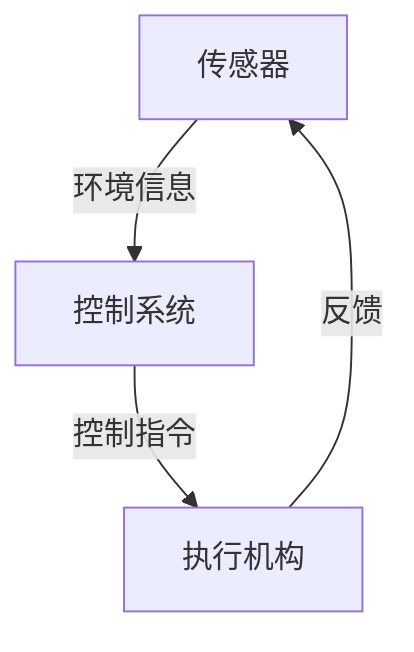

# 机器人技术:传感器与控制

## 1.背景介绍

机器人技术是一个跨学科的领域,涉及机械、电子、控制、计算机等多个专业领域。随着科技的不断进步,机器人技术得到了长足的发展,并在工业生产、服务业、医疗卫生、国防军事等众多领域得到了广泛应用。

机器人的核心技术之一就是传感器与控制系统。传感器是机器人获取环境信息的"眼睛"和"耳朵",而控制系统则是机器人的"大脑",负责根据传感器获取的信息做出相应的决策和动作控制。传感器与控制系统的性能直接决定了机器人的智能水平和应用能力。

## 2.核心概念与联系  

### 2.1 传感器

传感器是将被测量的物理量转换为满足系统可测量和传输要求的电信号或其他所需形式的信号输出的装置。根据检测对象的不同,传感器可分为位移传感器、速度传感器、加速度传感器、力传感器、压力传感器、温度传感器、流量传感器等多种类型。

常见的传感器有:

- 位移传感器:电位计、编码器、激光测距仪等
- 速度传感器:旋转编码器、光电编码器等 
- 加速度传感器:压电式、热电式、应变式等
- 力传感器:应变式、压电式、压力电阻式等
- 视觉传感器:CCD、CMOS等图像传感器

### 2.2 控制系统

控制系统是机器人的"大脑",负责根据传感器获取的信息进行决策,并发出控制指令,实现对机器人的运动控制。控制系统一般由控制器、驱动器和执行机构组成。

- 控制器:采集传感器信号,运行控制算法,发出控制指令
- 驱动器:将控制指令转换为执行机构可识别的形式 
- 执行机构:如伺服电机、液压缸等,执行运动控制

常见的控制方法有:

- 开环控制:不考虑系统反馈,根据已知输入确定输出
- 闭环控制:根据系统反馈调整控制量,使输出跟踪期望值
- 自适应控制:根据系统参数变化自动调整控制算法
- 智能控制:模拟人类决策,如模糊控制、神经网络控制等

### 2.3 传感器与控制系统的关系

传感器和控制系统相辅相成,缺一不可。传感器为控制系统提供环境信息,控制系统根据这些信息作出决策并控制机器人的运动。它们的性能直接影响机器人的智能水平和应用能力。



## 3.核心算法原理具体操作步骤

### 3.1 传感器信号处理

传感器获取的原始信号通常需要经过滤波、放大、编码等预处理,以提高信号质量和可用性。常用的信号处理方法有:

1. 模拟滤波:使用电路元件对模拟信号进行滤波,去除噪声干扰
2. 数字滤波:对数字化的传感器数据进行滤波,如均值滤波、中值滤波等
3. 增益放大:对传感器信号进行放大,提高信号强度
4. 模数转换:将模拟信号转换为数字信号,便于后续数字处理

### 3.2 控制算法

控制算法是控制系统的核心,根据传感器反馈信息计算出控制指令,实现对机器人的精确控制。常用的控制算法有:

1. PID控制:根据偏差、偏差积分和偏差微分调整控制量
2. 状态反馈控制:基于系统状态方程设计状态反馈控制律
3. 滑模变结构控制:通过切换控制律实现对非线性系统的鲁棒控制
4. 自适应控制:在线识别系统参数变化,自动调整控制参数
5. 智能控制:如模糊控制、神经网络控制等,模拟人类决策过程

### 3.3 运动规划与轨迹生成

运动规划是机器人控制中的关键环节,需要根据任务要求、环境约束等生成期望的运动轨迹。常用的运动规划方法有:

1. 插值法:在给定的路径点之间生成平滑的插值曲线
2. 时间尺度法:先规划路径,再对路径进行时间参数化
3. 虚拟模型法:建立虚拟模型,求解模型受力达到期望运动
4. 采样优化法:在采样点上优化评价函数,生成最优轨迹

生成的期望轨迹需要进一步转换为控制指令,常用方法有:

- 脉冲计数法:将轨迹离散为位置脉冲序列
- 周期采样法:按固定周期采样轨迹,生成控制指令序列

## 4.数学模型和公式详细讲解举例说明

### 4.1 传感器数学模型

许多传感器的工作原理可以用数学模型描述,如应变式传感器的应变-电阻关系:

$$
\frac{\Delta R}{R}=k\varepsilon
$$

其中,$\Delta R$是电阻变化量,$R$是原电阻值,$k$是敏感系数,$\varepsilon$是应变量。

对于图像传感器,可以建立相机模型描述成像过程:

$$
zc=\frac{f}{Z}(X-x_0),\quad yc=\frac{f}{Z}(Y-y_0)
$$

其中,$z_c,y_c$是像平面坐标,$(X,Y,Z)$是空间点坐标,$(x_0,y_0)$是主点坐标,$f$是焦距。

### 4.2 控制系统数学模型

控制系统常用的数学模型是状态空间模型,描述系统状态与输入输出的关系:

$$
\begin{cases}
\dot{\mathbf{x}}(t)=\mathbf{A}\mathbf{x}(t)+\mathbf{B}\mathbf{u}(t)\\
\mathbf{y}(t)=\mathbf{C}\mathbf{x}(t)+\mathbf{D}\mathbf{u}(t)
\end{cases}
$$

其中,$\mathbf{x}$是状态变量,$\mathbf{u}$是控制输入,$\mathbf{y}$是系统输出,$\mathbf{A}、\mathbf{B}、\mathbf{C}、\mathbf{D}$是系统矩阵。

对于线性系统,可以进一步推导出系统的传递函数:

$$
G(s)=\frac{Y(s)}{U(s)}=C(sI-A)^{-1}B+D
$$

### 4.3 控制算法公式

**PID控制算法**

$$
u(t)=K_p e(t)+K_i\int_0^t e(\tau)d\tau+K_d\frac{de(t)}{dt}
$$

其中,$u(t)$是控制量,$e(t)$是偏差,$K_p、K_i、K_d$分别是比例、积分、微分系数。

**状态反馈控制**

$$
\mathbf{u}(t)=-\mathbf{K}\mathbf{x}(t)
$$

其中,$\mathbf{K}$是反馈增益矩阵,需要通过极点配置等方法设计。

**滑模变结构控制**

$$
\begin{cases}
s(t)=\mathbf{c}^T\mathbf{e}(t)\\
u(t)=u_{eq}(t)-\rho\frac{s(t)}{\|s(t)\|}\operatorname{sgn}(s(t))
\end{cases}
$$

其中,$s(t)$是切换面,$\mathbf{e}(t)$是误差变量,$u_{eq}(t)$是等价控制,$\rho$是切换增益。

### 4.4 运动规划公式

**三次多项式插值**

$$
\begin{aligned}
&q(t)=a_0+a_1t+a_2t^2+a_3t^3\\
&\begin{cases}
q(0)=q_0,\quad \dot{q}(0)=\dot{q}_0\\
q(T)=q_T,\quad \dot{q}(T)=\dot{q}_T
\end{cases}
\end{aligned}
$$

可以求解出$a_0,a_1,a_2,a_3$的表达式,生成平滑的位置、速度、加速度曲线。

**五次多项式插值**

$$
\begin{aligned}
&q(t)=a_0+a_1t+a_2t^2+a_3t^3+a_4t^4+a_5t^5\\
&\begin{cases}
q(0)=q_0,\quad \dot{q}(0)=\dot{q}_0,\quad \ddot{q}(0)=\ddot{q}_0\\
q(T)=q_T,\quad \dot{q}(T)=\dot{q}_T,\quad \ddot{q}(T)=\ddot{q}_T
\end{cases}
\end{aligned}
$$

可以生成更平滑的轨迹曲线,但需要给定起止点的位置、速度和加速度边界条件。

## 5.项目实践:代码实例和详细解释说明  

以下是一个机器人控制系统的简单实现,使用Python语言和常用库NumPy、SciPy、Matplotlib等。

### 5.1 系统建模

```python
import numpy as np
from scipy import linalg

# 定义系统矩阵
A = np.array([[0, 1], [0, 0]])
B = np.array([[0], [1]])
C = np.eye(2)
D = np.zeros((2, 1))

# 计算系统传递函数
sys = linalg.TransferFunction(A, B, C, D)
```

上述代码定义了一个二阶系统的状态空间模型,并计算了相应的传递函数`sys`。

### 5.2 PID控制器

```python
import control

# 设计PID控制器
kp = 10 
ki = 2
kd = 0.5
pid_ctrl = control.TransferFunction([kd, kp, ki], [1, 0])

# 闭环反馈控制
closed_loop = control.feedback(sys * pid_ctrl, 1)

# 绘制系统响应曲线
t, y = closed_loop.step_response()
import matplotlib.pyplot as plt
plt.plot(t, y)
plt.show()
```

使用Python控制系统库`control`设计一个PID控制器,并与系统模型构成闭环控制系统。最后绘制系统的步响应曲线。

### 5.3 运动规划

```python
import numpy as np

def cubic_poly(q0, qT, dq0, dqT, T):
    """三次多项式插值生成轨迹"""
    a0 = q0
    a1 = dq0
    a2 = 3 / T**2 * (qT - q0) - 1 / T * (dqT + 2 * dq0)
    a3 = -2 / T**3 * (qT - q0) + 1 / T**2 * (dqT + dq0)
    
    t = np.linspace(0, T, 100)
    q = a0 + a1 * t + a2 * t**2 + a3 * t**3
    dq = a1 + 2 * a2 * t + 3 * a3 * t**2
    ddq = 2 * a2 + 6 * a3 * t
    
    return t, q, dq, ddq

# 生成轨迹
q0, qT = 0, 1  # 起止点位置
dq0, dqT = 0, 0  # 起止点速度
T = 1  # 运动时间
t, q, dq, ddq = cubic_poly(q0, qT, dq0, dqT, T)

# 绘制轨迹曲线
plt.figure()
plt.subplot(311)
plt.plot(t, q)
plt.ylabel('Position')

plt.subplot(312)  
plt.plot(t, dq)
plt.ylabel('Velocity')

plt.subplot(313)
plt.plot(t, ddq)
plt.xlabel('Time')
plt.ylabel('Acceleration')

plt.show()
```

该代码实现了三次多项式插值法生成平滑的位置、速度、加速度轨迹曲线,并绘制了结果图像。可以根据需要修改起止点条件和运动时间。

以上只是一个简单的示例,实际的机器人控制系统会更加复杂,需要综合运用多种算法和技术。但是,这些核心思想和方法是相通的,旨在实现对机器人精确、高效的控制。

## 6.实际应用场景

机器人传感器与控制技术在诸多领域有着广泛的应用,下面列举一些典型场景:

1. **工业机器