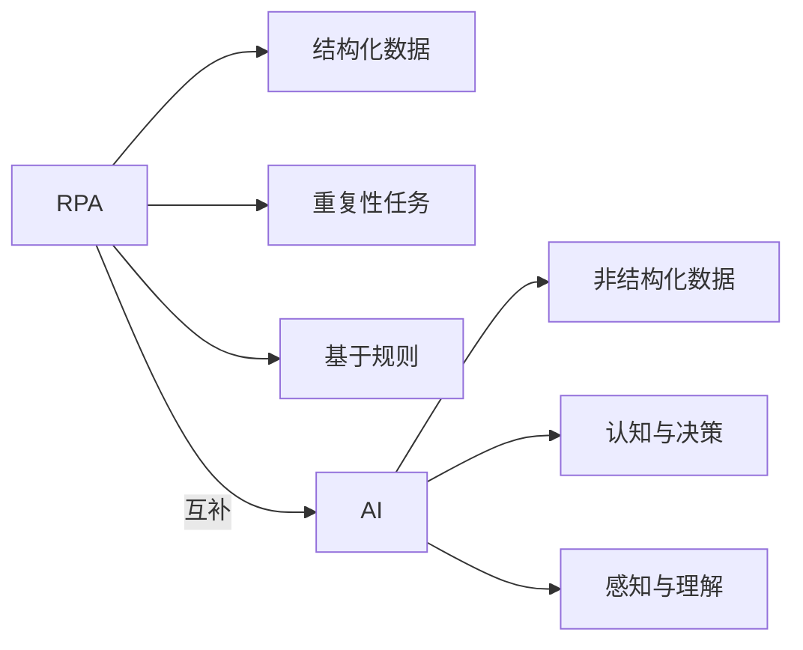
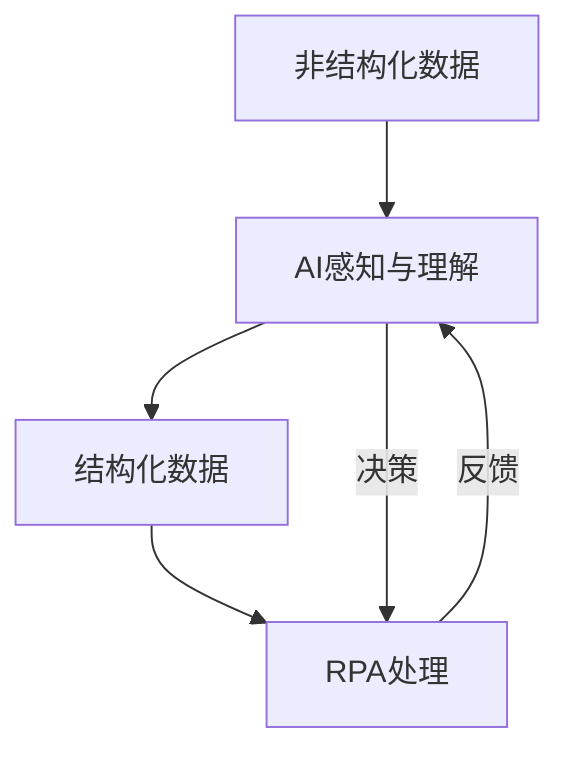
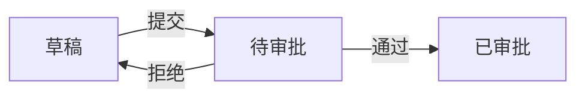
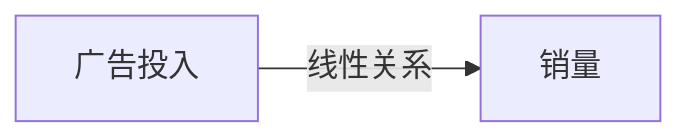

# 机器人进程自动化(RPA)与AI代理工作流的融合

## 1.背景介绍
### 1.1 RPA与AI的发展历程
#### 1.1.1 RPA的兴起
机器人过程自动化(Robotic Process Automation,RPA)技术起源于20世纪90年代后期,最初是为了替代重复性、规则驱动的人工任务。RPA通过模拟人类在计算机上执行特定任务的方式,实现业务流程的自动化。

#### 1.1.2 AI的崛起
人工智能(Artificial Intelligence,AI)的发展可以追溯到1950年代图灵提出"机器能思考吗"的问题。此后AI经历了从专家系统到机器学习再到深度学习的发展历程。近年来,以深度学习为代表的AI技术在计算机视觉、自然语言处理等领域取得了突破性进展。

### 1.2 RPA与AI融合的必要性
#### 1.2.1 RPA的局限性
传统RPA主要应对结构化数据,对于非结构化数据和需要认知判断的任务难以胜任。RPA缺乏智能化,难以应对复杂多变的业务场景。

#### 1.2.2 AI赋能RPA
AI可以弥补RPA的不足,RPA与AI结合可以实现更加智能化的业务自动化。AI可以增强RPA的感知、认知、决策能力,使其能够处理非结构化数据,应对更加复杂的业务场景。

## 2.核心概念与联系
### 2.1 RPA的定义与特点
RPA是一种软件,能够像人一样操作计算机界面,执行重复性任务。RPA的特点包括:
- 基于规则的自动化 
- 模拟人的操作
- 处理结构化数据
- 减少人工干预

### 2.2 AI的定义与分支
AI是研究、开发用于模拟、延伸和扩展人的智能的理论、方法、技术及应用系统的一门新的技术科学。AI主要包括:
- 机器学习:让机器从数据中学习
- 自然语言处理:让机器理解、生成自然语言 
- 计算机视觉:让机器理解图像、视频内容
- 知识图谱:构建知识的语义网络

### 2.3 RPA与AI的关系
RPA与AI可以互补,二者结合可以实现更加智能的自动化。具体而言:
- AI可以扩展RPA的应用范围,使其能够处理非结构化数据
- AI可以增强RPA的感知、认知、决策能力
- RPA可以为AI提供数据接口,使AI能够操控业务系统

下图展示了RPA与AI的关系:


## 3.核心算法原理具体操作步骤
### 3.1 RPA的实现原理
RPA主要通过以下步骤实现业务流程自动化:
1. 录制用户操作:记录用户在软件上的操作步骤
2. 生成自动化脚本:将录制的操作转换为RPA脚本
3. 回放脚本:RPA机器人执行脚本,自动完成任务
4. 监控与管理:监控RPA机器人的运行状态,管理任务调度

### 3.2 AI的实现原理
以机器学习为例,其主要步骤包括:
1. 数据准备:收集、清洗、标注数据
2. 特征工程:提取、选择特征
3. 模型训练:选择合适的机器学习算法,用数据训练模型
4. 模型评估:用测试集评估模型性能
5. 模型部署:将训练好的模型部署到生产环境

### 3.3 RPA与AI融合的实现
RPA与AI可以在数据、控制、决策等方面进行融合,主要方式包括:
1. 数据融合:AI对非结构化数据进行处理,转换为RPA可以处理的结构化数据
2. 控制融合:AI感知环境,RPA执行AI的决策结果
3. 决策融合:AI进行认知决策,指导RPA的流程执行

下图展示了RPA与AI融合的架构:



## 4.数学模型和公式详细讲解举例说明
### 4.1 RPA中的数学模型
RPA主要应用有限状态机(FSM)模型来建模业务流程。FSM可以表示为一个五元组:

$$M=(S,\Sigma,\delta,s_0,F)$$

其中:
- $S$ 是有限状态集合
- $\Sigma$ 是有限字母表
- $\delta$ 是转移函数 $\delta: S \times \Sigma \to S$
- $s_0$ 是初始状态,$s_0 \in S$
- $F$ 是终止状态集合,$F \subseteq S$

例如,一个简单的审批流程可以用FSM表示如下:


对应的FSM模型为:

$$M=(\{草稿,待审批,已审批\},\{提交,通过,拒绝\},\delta,草稿,\{已审批\})$$

其中转移函数 $\delta$ 为:
- $\delta(草稿,提交)=待审批$
- $\delta(待审批,通过)=已审批$
- $\delta(待审批,拒绝)=草稿$

### 4.2 AI中的数学模型
AI中广泛应用了统计学习的方法,包括线性模型、决策树、支持向量机、神经网络等。以线性回归为例,其模型可以表示为:

$$y=w^Tx+b$$

其中:
- $x$ 是输入特征向量
- $w$ 是权重参数向量
- $b$ 是偏置项
- $y$ 是预测值

通过最小化损失函数来求解模型参数:

$$\min_{w,b} \frac{1}{N}\sum^N_{i=1}(y_i-w^Tx_i-b)^2$$

其中 $\{(x_1,y_1),...,(x_N,y_N)\}$ 是训练数据集。

例如,利用线性回归可以建立销量与广告投入的关系模型:



假设有如下训练数据:

广告投入(万元) | 销量(万件)
---|---
10 | 100 
20 | 200
30 | 320
40 | 400

利用最小二乘法可以求得:

$$y=9.5x+12$$

即销量 $y$ 与广告投入 $x$ 之间存在线性关系。

## 5.项目实践：代码实例和详细解释说明
下面以Python为例,展示RPA与AI结合的代码实现。

### 5.1 RPA实现
RPA可以利用PyAutoGUI库模拟键盘鼠标操作,实现自动化。例如:

```python
import pyautogui

# 打开记事本
pyautogui.hotkey('win', 'r')  
pyautogui.typewrite('notepad')
pyautogui.press('enter')

# 输入文本
pyautogui.typewrite('Hello, world!')

# 保存文件
pyautogui.hotkey('ctrl', 's')
pyautogui.typewrite('hello.txt')
pyautogui.press('enter')
```

以上代码实现了打开记事本,输入文本,保存文件的自动化操作。

### 5.2 AI实现
AI可以利用TensorFlow等深度学习库实现。以手写数字识别为例:

```python
import tensorflow as tf

# 加载MNIST数据集
mnist = tf.keras.datasets.mnist
(train_images, train_labels), (test_images, test_labels) = mnist.load_data()

# 归一化像素值
train_images, test_images = train_images / 255.0, test_images / 255.0

# 构建模型
model = tf.keras.models.Sequential([
  tf.keras.layers.Flatten(input_shape=(28, 28)),
  tf.keras.layers.Dense(128, activation='relu'),
  tf.keras.layers.Dropout(0.2),
  tf.keras.layers.Dense(10)
])

# 编译模型
model.compile(optimizer='adam',
              loss=tf.keras.losses.SparseCategoricalCrossentropy(from_logits=True),
              metrics=['accuracy'])
              
# 训练模型
model.fit(train_images, train_labels, epochs=5)

# 评估模型
model.evaluate(test_images,  test_labels, verbose=2)
```

以上代码利用TensorFlow实现了手写数字识别,通过构建简单的神经网络,并在MNIST数据集上进行训练,可以达到98%以上的识别准确率。

### 5.3 RPA与AI结合
RPA与AI可以通过接口进行集成,实现端到端的自动化。例如:

```python
import pyautogui
from PIL import Image
import numpy as np
import tensorflow as tf

# 加载训练好的手写数字识别模型
model = tf.keras.models.load_model('mnist.h5')

# 截屏并裁剪出验证码图片
pyautogui.screenshot('screen.png')
im = Image.open('screen.png')
im = im.crop((100, 200, 200, 250))
im.save('captcha.png')

# 转换为模型输入格式
im = Image.open('captcha.png').convert('L')
im = np.array(im).reshape(1, 28, 28, 1) / 255.0

# 预测验证码
pred = model.predict(im).argmax()

# 自动输入验证码
pyautogui.typewrite(str(pred))
pyautogui.press('enter')
```

以上代码展示了如何利用手写数字识别模型自动识别网页验证码,并结合RPA自动输入,实现全自动的验证码识别和填写。这体现了RPA与AI结合的优势。

## 6.实际应用场景
RPA与AI的融合在企业智能自动化中有广泛应用,主要场景包括:

### 6.1 票据处理
传统票据处理流程需要人工录入发票信息,容易出错且效率低下。引入RPA与AI后,可以利用OCR等技术自动提取发票信息,再由RPA完成数据录入,大幅提升效率并减少错误。

### 6.2 客户服务
传统客服需要人工应答大量重复询问,AI可以通过知识库、语义理解等技术实现智能客服,RPA则可以帮助人工客服处理后台系统操作,人机协作可以更好地服务客户。

### 6.3 风控合规
金融机构需要对海量交易数据进行实时风控与合规检查。RPA可以自动对接各系统获取数据,AI则可以建立风险预测模型,两者结合可以实现实时、智能的风控。

### 6.4 供应链管理
供应链管理涉及到采购、物流、资金流等环节,需要处理大量单据。RPA可以自动处理结构化单据,AI则可以通过预测分析优化供应链决策,提升供应链效率。

## 7.工具和资源推荐
### 7.1 RPA工具
- UiPath:全球领先的RPA平台,拖拽式开发,丰富的社区资源
- Automation Anywhere:端到端的智能自动化平台,支持云部署
- Blue Prism:专注于企业级RPA,强调安全与稳定性

### 7.2 AI工具
- TensorFlow:谷歌开源的端到端机器学习平台
- PyTorch:Facebook开源的深度学习框架
- OpenCV:开源的计算机视觉库
- Scikit-learn:Python机器学习工具集

### 7.3 学习资源
- 吴恩达的机器学习课程:Coursera上的经典AI课程
- 深度学习专项课程:由吴恩达主讲的深度学习系列课程
- RPA开发者学习路径:UiPath提供的RPA学习路径
- 智能自动化社区:UiPath的社区论坛,有大量RPA学习资源

## 8.总结：未来发展趋势与挑战
RPA与AI融合是大势所趋,二者互补,可以实现更加智能、高效的业务自动化。未来RPA与AI融合将向着更加智能化、个性化、轻量化的方向发展:
- 更加智能化:AI将赋予RPA更强大的感知、认知、决策能力,使其能够应对更加复杂、多变的场景
- 更加个性化:RPA与AI将根据不同企业的业务特点,提供定制化的自动化解决方案