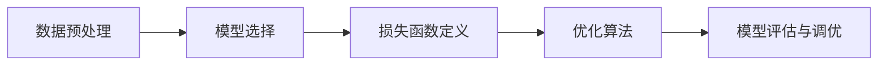

## 1. 背景介绍

在过去的几十年里，机器学习已经从一个边缘学科发展成为计算机科学的核心领域之一。它的发展推动了人工智能的进步，并在各行各业产生了深远的影响。从自动驾驶汽车到个性化推荐系统，从医疗诊断到金融市场分析，机器学习的应用几乎无处不在。本文旨在深入探讨机器学习的原理，并通过代码实例讲解其核心概念和操作步骤。

## 2. 核心概念与联系

机器学习是一种使计算机能够从数据中学习并做出决策或预测的技术。它主要分为三类：监督学习、无监督学习和强化学习。监督学习通过训练带有标签的数据集来预测结果，无监督学习处理没有标签的数据以发现数据的内在结构，而强化学习则通过奖励和惩罚机制来训练模型。

### 2.1 监督学习
### 2.2 无监督学习
### 2.3 强化学习

## 3. 核心算法原理具体操作步骤

机器学习算法的核心在于找到数据的模式并做出预测。以监督学习中的线性回归为例，其操作步骤包括：

### 3.1 数据预处理
### 3.2 模型选择
### 3.3 损失函数定义
### 3.4 优化算法
### 3.5 模型评估与调优



## 4. 数学模型和公式详细讲解举例说明

机器学习的数学基础涉及概率论、统计学、线性代数和优化理论。以线性回归为例，其数学模型可以表示为：

$$ y = \beta_0 + \beta_1x_1 + \beta_2x_2 + ... + \beta_nx_n + \epsilon $$

其中，$y$ 是目标变量，$x_i$ 是特征变量，$\beta_i$ 是模型参数，$\epsilon$ 是误差项。通过最小化损失函数，如均方误差（MSE），我们可以找到最佳的模型参数。

$$ MSE = \frac{1}{N} \sum_{i=1}^{N} (y_i - \hat{y}_i)^2 $$

## 5. 项目实践：代码实例和详细解释说明

在实践中，我们通常使用Python和相关库来实现机器学习模型。以下是一个简单的线性回归模型实现：

```python
import numpy as np
from sklearn.linear_model import LinearRegression

# 假设我们有以下数据
X = np.array([[1, 1], [1, 2], [2, 2], [2, 3]])
y = np.dot(X, np.array([1, 2])) + 3

# 创建并训练模型
model = LinearRegression().fit(X, y)

# 打印模型参数
print('系数:', model.coef_)
print('截距:', model.intercept_)
```

## 6. 实际应用场景

机器学习的应用场景广泛，包括但不限于：

### 6.1 金融风控
### 6.2 医疗诊断
### 6.3 推荐系统
### 6.4 自然语言处理

## 7. 工具和资源推荐

为了更好地学习和实践机器学习，以下是一些推荐的工具和资源：

### 7.1 Python和相关库（如NumPy, Pandas, Scikit-learn）
### 7.2 在线课程和教程
### 7.3 开源数据集和竞赛平台（如Kaggle）

## 8. 总结：未来发展趋势与挑战

机器学习正处于快速发展阶段，未来的趋势包括自动化机器学习（AutoML）、解释性机器学习和联邦学习等。同时，我们也面临着数据隐私、算法偏见和模型可解释性等挑战。

## 9. 附录：常见问题与解答

### 9.1 机器学习和人工智能的区别是什么？
### 9.2 如何选择合适的机器学习算法？
### 9.3 如何评估机器学习模型的性能？

作者：禅与计算机程序设计艺术 / Zen and the Art of Computer Programming