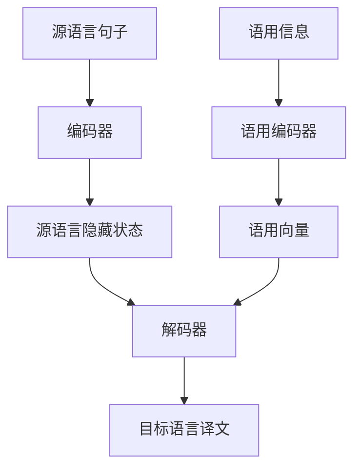

# 机器翻译的语用学研究与实践

## 1.背景介绍

机器翻译(Machine Translation, MT)是自然语言处理(Natural Language Processing, NLP)领域的一个重要分支,旨在使用计算机系统自动将一种自然语言(源语言)转换为另一种自然语言(目标语言)。随着人工智能和深度学习技术的不断发展,机器翻译的质量和性能也在不断提高,逐渐被应用于各个领域。

然而,机器翻译不仅需要准确地将源语言转换为目标语言的词语和语法结构,还需要考虑语境、语用等因素,才能生成自然、符合语用规范的译文。语用学(Pragmatics)是研究语言使用中的意义、语境和交际原则的一门学科,对于提高机器翻译质量至关重要。

本文将探讨机器翻译中语用学的研究与实践,包括语用学在机器翻译中的作用、常见的语用现象及其处理方法、语用信息的表示和融入翻译模型的技术,以及未来的发展趋势和挑战。

## 2.核心概念与联系

### 2.1 语用学概念

语用学是研究语言使用中的意义、语境和交际原则的学科。它关注语言在特定情境下的实际使用,以及语言使用者如何根据语境来理解和表达意义。语用学的核心概念包括:

- **语境(Context)**: 指语言使用的情景,包括发言人、听众、时间、地点、话题等因素。
- **语用含义(Pragmatic Meaning)**: 指在特定语境下,语言表达的实际意义,可能与字面意义不同。
- **语用规则(Pragmatic Rules)**: 指在特定语境下,语言使用需要遵循的原则和规范。
- **会话含义(Conversational Implicature)**: 指在对话中,说话人所暗示但未直接表达的意义。
- **语用能力(Pragmatic Competence)**: 指理解和使用语言的语用规则的能力。

### 2.2 语用学在机器翻译中的作用

在机器翻译中,语用学扮演着重要的角色:

1. **消除歧义**: 许多词语或句子在不同语境下有不同的含义,语用信息可以帮助消除这种歧义。
2. **生成自然译文**: 考虑语用因素可以生成更加自然、符合目标语言习惯的译文。
3. **保持语用含义**: 翻译过程中需要保留源语言的语用含义,而不仅仅是字面意义。
4. **处理语用现象**: 诸如会话含义、言外之意、修辞等语用现象,需要特殊的处理方法。

因此,将语用学知识融入机器翻译系统,可以显著提高翻译质量。

## 3.核心算法原理具体操作步骤

### 3.1 语用信息表示

为了将语用信息融入机器翻译系统,首先需要对语用信息进行表示和建模。常见的语用信息表示方法包括:

1. **特征标注(Feature Annotation)**: 在训练数据中标注语用相关的特征,如语境信息、言外之意等。
2. **语用知识库(Pragmatic Knowledge Base)**: 构建包含语用规则、语用现象等知识的知识库。
3. **语用向量(Pragmatic Vector)**: 使用向量表示语用信息,可以与神经网络模型相结合。

### 3.2 融入翻译模型

将语用信息融入机器翻译模型的主要方法有:

1. **多任务学习(Multi-Task Learning)**: 在翻译任务的同时,辅助学习语用相关的任务,如语境识别、言外之意检测等。
2. **注意力机制(Attention Mechanism)**: 在注意力机制中融入语用信息,使模型在生成译文时更多地关注语用相关的部分。
3. **语用知识增强(Pragmatic Knowledge Enhancement)**: 将语用知识库中的信息作为辅助知识,增强翻译模型的语用能力。

此外,一些特殊的语用现象也需要专门的处理算法,如:

- **消解代词(Pronoun Resolution)**: 根据语境正确地将代词与其指代对象关联。
- **识别修辞(Rhetorical Figure Detection)**: 识别并正确翻译修辞现象,如比喻、夸张等。
- **会话建模(Conversation Modeling)**: 对会话历史进行建模,以理解会话含义。

### 3.3 算法流程图

下面是一个基于注意力机制融入语用信息的机器翻译模型的算法流程图:



该流程图描述了以下步骤:

1. 将源语言句子输入编码器,获得源语言的隐藏状态表示。
2. 将语用信息(如语境、言外之意等)输入语用编码器,获得语用向量表示。
3. 在解码器中,将源语言隐藏状态和语用向量作为输入,生成目标语言的译文。

通过这种方式,语用信息可以与翻译模型相结合,从而生成更加自然、符合语用规范的译文。

## 4.数学模型和公式详细讲解举例说明

在机器翻译中,常用的数学模型包括基于统计的模型和基于神经网络的模型。下面将详细介绍一种基于注意力机制的神经机器翻译模型,并解释其中融入语用信息的数学原理。

### 4.1 序列到序列模型(Sequence-to-Sequence Model)

神经机器翻译通常采用序列到序列(Seq2Seq)模型,将源语言句子$X=(x_1, x_2, ..., x_n)$映射为目标语言句子$Y=(y_1, y_2, ..., y_m)$。该模型包括编码器(Encoder)和解码器(Decoder)两个部分。

编码器将源语言句子$X$编码为上下文向量$C$:

$$C = f(X) = f(x_1, x_2, ..., x_n)$$

解码器根据上下文向量$C$和已生成的部分译文$(y_1, y_2, ..., y_{i-1})$,预测下一个目标词$y_i$的概率:

$$P(y_i|y_1, y_2, ..., y_{i-1}, C) = g(y_1, y_2, ..., y_{i-1}, C)$$

### 4.2 注意力机制(Attention Mechanism)

注意力机制允许解码器在生成每个目标词时,不仅关注上下文向量$C$,还关注源语言句子$X$中的不同部分。具体来说,对于生成$y_i$,注意力机制计算源语言隐藏状态$(h_1, h_2, ..., h_n)$和当前解码器隐藏状态$s_i$之间的注意力权重$\alpha_{ij}$:

$$\alpha_{ij} = \frac{exp(e_{ij})}{\sum_{k=1}^{n}exp(e_{ik})}$$

其中$e_{ij}$是注意力能量函数,可以是$h_j$和$s_i$的函数。

然后,注意力向量$a_i$是源语言隐藏状态的加权和:

$$a_i = \sum_{j=1}^{n}\alpha_{ij}h_j$$

解码器使用注意力向量$a_i$和上下文向量$C$来预测$y_i$的概率:

$$P(y_i|y_1, y_2, ..., y_{i-1}, C, X) = g(y_1, y_2, ..., y_{i-1}, C, a_i)$$

### 4.3 融入语用信息

为了融入语用信息,我们可以将语用向量$p$与注意力向量$a_i$和上下文向量$C$一起作为解码器的输入:

$$P(y_i|y_1, y_2, ..., y_{i-1}, C, X, p) = g(y_1, y_2, ..., y_{i-1}, C, a_i, p)$$

其中,语用向量$p$可以是语用编码器对语用信息(如语境、言外之意等)的编码表示。

通过这种方式,语用信息可以影响解码器在生成每个目标词时的决策,从而生成更加自然、符合语用规范的译文。

### 4.4 损失函数和优化

模型的训练目标是最小化源语言句子$X$和语用信息$p$到目标语言句子$Y$的条件概率的负对数似然:

$$\mathcal{L}(X, Y, p) = -\sum_{i=1}^{m}logP(y_i|y_1, y_2, ..., y_{i-1}, C, X, p)$$

使用反向传播算法和优化器(如Adam优化器)来更新模型参数,最小化损失函数。

通过上述数学模型,语用信息可以很好地融入到神经机器翻译系统中,提高翻译质量。

## 5.项目实践:代码实例和详细解释说明

为了更好地理解如何将语用信息融入机器翻译模型,我们将使用Python和PyTorch框架实现一个简单的基于注意力机制的神经机器翻译系统,并融入语用信息。

### 5.1 数据准备

首先,我们需要准备训练数据和语用信息数据。训练数据可以是平行语料库,包含源语言句子和对应的目标语言译文。语用信息数据可以是手动标注的语境信息、言外之意等。

为了简化示例,我们将使用一个小型的英语到法语的平行语料库,并假设语用信息是一个简单的标量值,表示句子的语气(正式或非正式)。

```python
# 示例数据
src_sentences = ["I am a student.", "You are welcome.", "Thank you for your help."]
tgt_sentences = ["Je suis un étudiant.", "Bienvenue.", "Merci pour votre aide."]
pragmatic_info = [0, 1, 0]  # 0表示正式语气,1表示非正式语气
```

### 5.2 数据预处理

我们需要将句子转换为词汇索引序列,并构建词汇表。同时,将语用信息转换为向量表示。

```python
import torch

# 构建词汇表
src_vocab = build_vocab(src_sentences)
tgt_vocab = build_vocab(tgt_sentences)

# 将句子转换为词汇索引序列
src_indices = [[src_vocab.stoi[token] for token in sentence.split()] for sentence in src_sentences]
tgt_indices = [[tgt_vocab.stoi[token] for token in sentence.split()] for sentence in tgt_sentences]

# 将语用信息转换为向量
pragmatic_vectors = [torch.tensor([info]) for info in pragmatic_info]
```

### 5.3 模型定义

定义编码器、解码器和注意力机制。我们将使用双向LSTM作为编码器,单向LSTM作为解码器,并融入语用向量。

```python
import torch.nn as nn

class Encoder(nn.Module):
    def __init__(self, input_size, hidden_size):
        super(Encoder, self).__init__()
        self.hidden_size = hidden_size
        self.embedding = nn.Embedding(input_size, hidden_size)
        self.lstm = nn.LSTM(hidden_size, hidden_size // 2, bidirectional=True)

    def forward(self, inputs):
        embedded = self.embedding(inputs)
        outputs, (hidden, cell) = self.lstm(embedded)
        return hidden, cell

class Decoder(nn.Module):
    def __init__(self, output_size, hidden_size):
        super(Decoder, self).__init__()
        self.hidden_size = hidden_size
        self.embedding = nn.Embedding(output_size, hidden_size)
        self.lstm = nn.LSTMCell(hidden_size + hidden_size, hidden_size)
        self.out = nn.Linear(hidden_size, output_size)

    def forward(self, input, hidden, cell, encoder_outputs, pragmatic_vector):
        input = input.unsqueeze(0)
        embedded = self.embedding(input)
        projected = torch.cat((embedded[0], pragmatic_vector, encoder_outputs), dim=1)
        hidden, cell = self.lstm(projected, (hidden, cell))
        output = self.out(hidden[0])
        return output, hidden, cell

class Attention(nn.Module):
    def __init__(self, hidden_size):
        super(Attention, self).__init__()
        self.hidden_size = hidden_size
        self.attn = nn.Linear(hidden_size * 2, hidden_size)
        self.v = nn.Linear(hidden_size, 1, bias=False)

    def forward(self, hidden, encoder_outputs):
        batch_size = encoder_outputs.shape[1]
        src_len = encoder_outputs.shape[0]
        hidden = hidden.unsqueeze(1).repeat(1, src_len, 1)
        encoder_outputs = encoder_outputs.permute(1, 0, 2)
        energy = torch.tanh(self.at