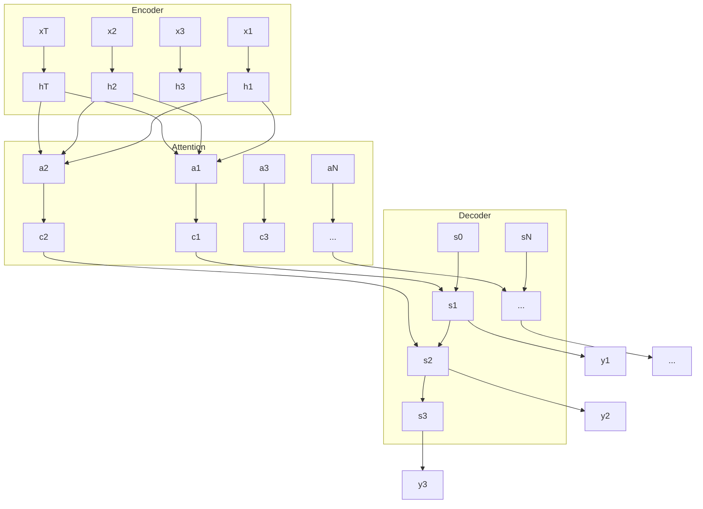

# 柳暗花明又一村：Seq2Seq编码器-解码器架构

## 1.背景介绍

在自然语言处理和机器学习领域,序列到序列(Sequence-to-Sequence,简称Seq2Seq)模型是一种广泛应用于机器翻译、对话系统、文本摘要等任务的深度学习架构。它旨在将一个序列映射到另一个序列,实现端到端的序列生成。Seq2Seq模型的提出,为许多自然语言处理任务提供了全新的解决思路。

Seq2Seq模型最早由Google的Sutskever等人在2014年的论文《Sequence to Sequence Learning with Neural Networks》中提出。该论文展示了如何使用多层LSTM(Long Short-Term Memory)网络构建一个通用的、端到端可训练的序列到序列模型,并在机器翻译任务上取得了突破性进展。此后,Seq2Seq模型迅速成为了自然语言处理领域的研究热点。

本文将深入探讨Seq2Seq模型的核心概念、原理和应用,帮助读者全面理解这一重要的深度学习架构。我们将从Seq2Seq的基本架构入手,分析其编码器-解码器结构的设计思想,并介绍其中的关键技术,如注意力机制、Beam Search等。此外,我们还将通过数学模型和代码实例,让读者深入理解Seq2Seq的实现细节。最后,我们将展望Seq2Seq模型的未来发展趋势和面临的挑战。

## 2.核心概念与联系

### 2.1 Seq2Seq模型概述

Seq2Seq模型的核心思想是将输入序列映射到一个固定维度的向量表示,然后再从该向量生成输出序列。它主要由两部分组成:编码器(Encoder)和解码器(Decoder)。编码器负责将输入序列编码为一个上下文向量,解码器则根据上下文向量生成输出序列。

### 2.2 编码器(Encoder)

编码器的作用是将输入序列 $(x_1, x_2, ..., x_T)$ 编码为一个固定维度的上下文向量 $c$。通常使用RNN(Recurrent Neural Network)如LSTM或GRU(Gated Recurrent Unit)作为编码器。编码器逐个处理输入序列的每个元素,并在每个时间步更新隐藏状态:

$$h_t = f(x_t, h_{t-1})$$

其中,$f$是非线性激活函数,如tanh或sigmoid。最终,编码器输出的上下文向量 $c$ 通常是最后一个时间步的隐藏状态,或者是所有时间步隐藏状态的某种组合。

### 2.3 解码器(Decoder) 

解码器的作用是根据编码器生成的上下文向量 $c$ 和之前生成的输出,预测下一个输出 $y_t$。解码器同样使用RNN作为基本结构。在每个时间步,解码器接收上一时刻的输出 $y_{t-1}$ 和上下文向量 $c$,更新隐藏状态并生成当前时刻的输出 $y_t$:

$$s_t = f(y_{t-1}, s_{t-1}, c)$$
$$y_t = g(s_t, y_{t-1}, c)$$

其中,$f$和$g$分别是RNN单元和输出层的激活函数。解码器逐步生成输出序列,直到遇到特殊的结束符号<EOS>。

### 2.4 注意力机制(Attention Mechanism)

传统的Seq2Seq模型中,编码器将输入序列压缩为一个固定维度的上下文向量,这可能导致信息损失。注意力机制的引入,使得解码器在生成每个输出时,都能够"聚焦"在输入序列的不同部分。它通过计算解码器隐藏状态与编码器各时间步隐藏状态的相似度,生成一个注意力分布,然后将注意力分布与编码器隐藏状态加权求和,得到一个动态的上下文向量。

### 2.5 Seq2Seq模型变体

Seq2Seq模型有许多变体和扩展,如:
- 双向编码器(Bidirectional Encoder):同时使用前向和后向两个RNN编码器,捕捉输入序列的双向信息。
- 多层编码器/解码器(Multi-layer Encoder/Decoder):通过堆叠多层RNN,增强模型的表达能力。  
- 基于注意力的Seq2Seq模型(Attention-based Seq2Seq):在解码器中引入注意力机制,动态地聚焦输入序列的不同部分。
- 指针网络(Pointer Network):允许解码器直接从输入序列中复制元素,适用于词表很大或存在未登录词的任务。

下图展示了一个基于注意力机制的Seq2Seq模型的总体架构:

## 3.核心算法原理具体操作步骤

Seq2Seq模型的训练和推断过程可以分为以下几个步骤:

### 3.1 编码器前向计算

1. 将输入序列 $(x_1, x_2, ..., x_T)$ 逐个送入编码器的RNN单元。
2. 在每个时间步 $t$,计算隐藏状态 $h_t = f(x_t, h_{t-1})$。
3. 将编码器的最终隐藏状态 $h_T$ 作为上下文向量 $c$。

### 3.2 解码器前向计算

1. 将特殊的起始符号