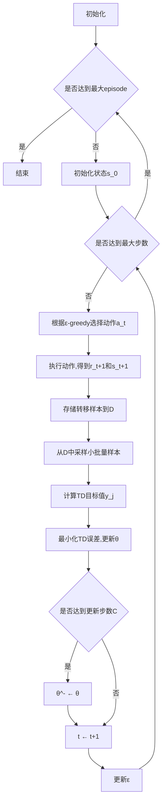

# 深度 Q-learning：在网格计算中的应用

## 1. 背景介绍
### 1.1 强化学习概述
强化学习(Reinforcement Learning, RL)是机器学习的一个重要分支,它研究如何让智能体(Agent)通过与环境的交互来学习最优策略,从而获得最大的累积奖励。与监督学习和非监督学习不同,强化学习不需要预先准备好训练数据,而是通过探索和利用(Exploration and Exploitation)的方式来学习。

### 1.2 Q-learning 算法
Q-learning 是强化学习中一种经典的无模型、离线策略学习算法。它通过学习动作-状态值函数 Q(s,a) 来寻找最优策略。Q 值表示在状态 s 下采取动作 a 可以获得的长期累积奖励的期望。Q-learning 的更新规则为:

$$Q(s_t,a_t) \leftarrow Q(s_t,a_t) + \alpha [r_{t+1} + \gamma \max_a Q(s_{t+1},a) - Q(s_t,a_t)]$$

其中,$s_t$ 和 $a_t$ 分别表示 t 时刻的状态和动作,$r_{t+1}$ 是执行动作 $a_t$ 后获得的即时奖励,$\alpha \in (0,1]$ 是学习率,$\gamma \in [0,1]$ 是折扣因子。

### 1.3 深度 Q-learning
传统的 Q-learning 使用 Q 表存储每个状态-动作对的 Q 值,当状态和动作空间很大时,Q 表难以存储和更新。深度 Q-learning (DQN) 使用深度神经网络来逼近 Q 函数,将状态作为网络输入,输出各个动作的 Q 值。网络参数 $\theta$ 通过最小化时序差分(TD)误差来更新:

$$L(\theta) = \mathbb{E}_{(s,a,r,s')\sim D} [(r + \gamma \max_{a'} Q(s',a';\theta^-) - Q(s,a;\theta))^2]$$

其中,$D$ 是经验回放缓冲区,$\theta^-$ 是目标网络参数,用于计算 TD 目标值,每隔一段时间从在线网络复制得到。

### 1.4 网格计算中的应用
网格计算(Grid Computing)是一种分布式计算形式,它将地理位置分散的异构资源(如计算机、存储设备等)通过网络连接起来,构成一个虚拟的超级计算机,协同完成大规模的计算任务。在网格环境中,如何高效地调度任务和资源是一个关键问题。近年来,深度强化学习在网格任务调度中得到了广泛应用,为传统的启发式算法提供了新的思路。

## 2. 核心概念与联系
### 2.1 马尔可夫决策过程
马尔可夫决策过程(Markov Decision Process, MDP)是强化学习的理论基础。一个 MDP 由状态空间 $\mathcal{S}$、动作空间 $\mathcal{A}$、状态转移概率 $\mathcal{P}$、奖励函数 $\mathcal{R}$ 和折扣因子 $\gamma$ 组成。在 MDP 中,智能体与环境交互,在每个离散的时间步 t,智能体观测到状态 $s_t \in \mathcal{S}$,选择动作 $a_t \in \mathcal{A}$,环境根据 $\mathcal{P}$ 转移到下一个状态 $s_{t+1}$,并反馈即时奖励 $r_{t+1} \in \mathcal{R}$。智能体的目标是最大化累积奖励 $\sum_{k=0}^{\infty} \gamma^k r_{t+k+1}$。

### 2.2 值函数与贝尔曼方程
在 MDP 中,策略 $\pi$ 定义为在给定状态下选择动作的概率分布,即 $\pi(a|s) = P(A_t=a|S_t=s)$。状态值函数 $V^{\pi}(s)$ 表示从状态 s 开始,遵循策略 $\pi$ 能获得的期望回报:

$$V^{\pi}(s) = \mathbb{E}_{\pi} [\sum_{k=0}^{\infty} \gamma^k R_{t+k+1} | S_t = s]$$

动作-状态值函数 $Q^{\pi}(s,a)$ 表示在状态 s 下采取动作 a,之后遵循策略 $\pi$ 的期望回报:

$$Q^{\pi}(s,a) = \mathbb{E}_{\pi} [\sum_{k=0}^{\infty} \gamma^k R_{t+k+1} | S_t = s, A_t=a]$$

值函数满足贝尔曼方程(Bellman Equation):

$$V^{\pi}(s) = \sum_a \pi(a|s) \sum_{s',r} p(s',r|s,a) [r + \gamma V^{\pi}(s')]$$

$$Q^{\pi}(s,a) = \sum_{s',r} p(s',r|s,a) [r + \gamma \sum_{a'} \pi(a'|s') Q^{\pi}(s',a')]$$

最优值函数 $V^*(s) = \max_{\pi} V^{\pi}(s)$ 和 $Q^*(s,a) = \max_{\pi} Q^{\pi}(s,a)$ 满足贝尔曼最优方程:

$$V^*(s) = \max_a \sum_{s',r} p(s',r|s,a) [r + \gamma V^*(s')]$$

$$Q^*(s,a) = \sum_{s',r} p(s',r|s,a) [r + \gamma \max_{a'} Q^*(s',a')]$$

Q-learning 算法就是通过不断逼近 $Q^*$ 来寻找最优策略的。

### 2.3 深度神经网络
深度神经网络(Deep Neural Network, DNN)是具有多个隐藏层的人工神经网络。相比传统的机器学习方法,DNN 能够自动学习数据的层次化特征表示,在图像识别、自然语言处理等领域取得了巨大成功。常见的 DNN 结构包括多层感知机(MLP)、卷积神经网络(CNN)、循环神经网络(RNN)等。

在深度 Q-learning 中,使用 DNN 来逼近 Q 函数,即 $Q(s,a;\theta) \approx Q^*(s,a)$。网络输入为状态 s,输出为各个动作的 Q 值。参数 $\theta$ 通过随机梯度下降等优化算法来最小化 TD 误差。

### 2.4 经验回放
经验回放(Experience Replay)是 DQN 的一个重要组成部分。在训练过程中,智能体与环境交互得到的转移样本 $(s_t,a_t,r_{t+1},s_{t+1})$ 被存储到回放缓冲区 D 中。在每个训练步骤,从 D 中随机采样一个小批量样本来更新网络参数,而不是使用最新的样本。这种做法有以下优点:
1. 打破了样本之间的相关性,减少了训练的波动性。
2. 提高了样本利用效率,加速了学习过程。
3. 通过重复利用过去的经验,增强了算法的稳定性。

### 2.5 探索与利用
探索与利用(Exploration and Exploitation)是强化学习中的核心问题。探索是指智能体尝试新的动作,获取对环境的新知识;利用是指利用已有的知识来最大化累积奖励。两者存在矛盾,需要权衡。常用的探索策略有 $\epsilon$-greedy 和 Boltzmann 探索等。前者以 $\epsilon$ 的概率随机选择动作,以 $1-\epsilon$ 的概率选择 Q 值最大的动作;后者根据 Q 值的指数函数计算动作的选择概率。探索率 $\epsilon$ 一般随着训练的进行而衰减。

## 3. 核心算法原理具体操作步骤
深度 Q-learning 算法的核心步骤如下:

1. 初始化在线 Q 网络 $Q(s,a;\theta)$ 和目标 Q 网络 $Q(s,a;\theta^-)$,经验回放缓冲区 D。
2. 对于每个 episode:
    1. 初始化初始状态 $s_0$。
    2. 对于每个时间步 t:
        1. 根据 $\epsilon$-greedy 策略,以 $\epsilon$ 的概率随机选择动作 $a_t$,否则选择 $a_t=\arg\max_a Q(s_t,a;\theta)$。
        2. 执行动作 $a_t$,观测奖励 $r_{t+1}$ 和下一个状态 $s_{t+1}$。
        3. 将转移样本 $(s_t,a_t,r_{t+1},s_{t+1})$ 存储到 D 中。
        4. 从 D 中随机采样一个小批量转移样本 $(s_j,a_j,r_j,s_{j+1})$。
        5. 计算 TD 目标值 $y_j$:
            - 若 $s_{j+1}$ 为终止状态,则 $y_j = r_j$。
            - 否则,$y_j = r_j + \gamma \max_{a'} Q(s_{j+1},a';\theta^-)$。
        6. 通过最小化损失函数 $L(\theta) = \frac{1}{N} \sum_j (y_j - Q(s_j,a_j;\theta))^2$ 来更新在线网络参数 $\theta$。
        7. 每隔 C 步,将在线网络参数复制给目标网络,即 $\theta^- \leftarrow \theta$。
    3. 更新探索率 $\epsilon$。

算法流程图如下:

## 4. 数学模型和公式详细讲解举例说明
Q-learning 算法的核心是价值函数 Q(s,a) 的更新。根据贝尔曼最优方程,最优 Q 函数满足:

$$Q^*(s,a) = \mathbb{E}_{s' \sim P(\cdot|s,a)} [r + \gamma \max_{a'} Q^*(s',a')]$$

Q-learning 通过时序差分(TD)误差来逼近 $Q^*$:

$$\delta_t = r_{t+1} + \gamma \max_a Q(s_{t+1},a) - Q(s_t,a_t)$$

其中,$\delta_t$ 表示 t 时刻的 TD 误差,即估计值与真实值之间的差异。Q 函数的更新规则为:

$$Q(s_t,a_t) \leftarrow Q(s_t,a_t) + \alpha \delta_t$$

$\alpha \in (0,1]$ 是学习率,控制每次更新的步长。

下面通过一个简单的例子来说明 Q-learning 的更新过程。考虑一个 3×3 的网格世界,智能体从起点 S 出发,目标是到达终点 G。每个格子表示一个状态,智能体在每个状态下有 4 个可选动作:上、下、左、右。执行动作后,智能体会转移到相应方向的相邻状态,并获得奖励。其中,到达 G 的奖励为 10,其余为 0。

假设智能体当前位于中心状态,执行"右"动作,转移到右侧状态,获得奖励 0。设置折扣因子 $\gamma=0.9$,学习率 $\alpha=0.1$,则 Q 值的更新过程为:

$$\delta = 0 + 0.9 \times \max_a Q(s_{\text{右}},a) - Q(s_{\text{中}},\text{右})$$
$$Q(s_{\text{中}},\text{右}) \leftarrow Q(s_{\text{中}},\text{右}) + 0.1 \times \delta$$

假设 $Q(s_{\text{右}},\text{右})=1$,则有:

$$\delta = 0 + 0.9 \times 1 - 0 = 0.9$$
$$Q(s_{\text{中}},\text{右}) \leftarrow 0 + 0.1 \times 0.9 = 0.09$$

重复以上过程,不