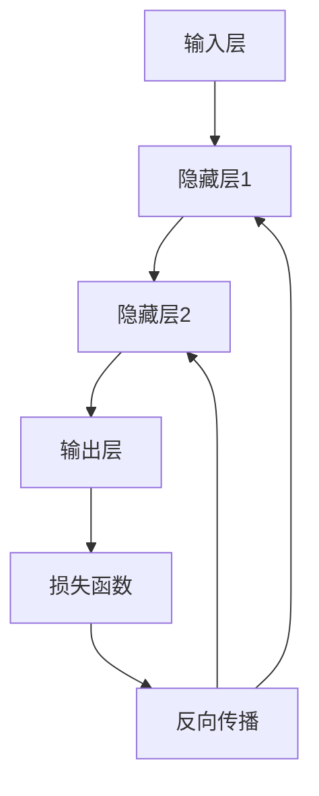

# 深度学习(Deep Learning) - 原理与代码实例讲解

## 1.背景介绍

深度学习（Deep Learning）是人工智能（AI）和机器学习（ML）领域中的一个重要分支。它通过模拟人脑的神经网络结构，能够处理和分析大量复杂的数据，从而在图像识别、自然语言处理、语音识别等多个领域取得了显著的成果。深度学习的兴起得益于计算能力的提升、大数据的普及以及算法的不断优化。

## 2.核心概念与联系

### 2.1 神经网络

神经网络是深度学习的基础结构。它由多个层级的神经元（节点）组成，每个节点通过权重连接。基本的神经网络包括输入层、隐藏层和输出层。

### 2.2 深度神经网络

深度神经网络（DNN）是指具有多个隐藏层的神经网络。通过增加隐藏层的数量，DNN能够捕捉到数据中的复杂模式和特征。

### 2.3 激活函数

激活函数用于引入非线性，使神经网络能够处理复杂的非线性问题。常见的激活函数包括ReLU、Sigmoid和Tanh。

### 2.4 损失函数

损失函数用于衡量模型预测值与真实值之间的差距。常见的损失函数有均方误差（MSE）和交叉熵损失（Cross-Entropy Loss）。

### 2.5 优化算法

优化算法用于调整神经网络的权重，以最小化损失函数。常见的优化算法有梯度下降（Gradient Descent）、Adam和RMSprop。

### 2.6 反向传播

反向传播（Backpropagation）是训练神经网络的核心算法。它通过计算损失函数的梯度，逐层更新网络的权重。



## 3.核心算法原理具体操作步骤

### 3.1 数据预处理

数据预处理是深度学习的第一步。它包括数据清洗、归一化、分割训练集和测试集等步骤。

### 3.2 模型构建

构建深度学习模型需要选择合适的网络结构、激活函数和损失函数。以下是一个简单的神经网络模型构建示例：

```python
import tensorflow as tf
from tensorflow.keras.models import Sequential
from tensorflow.keras.layers import Dense

model = Sequential([
    Dense(64, activation='relu', input_shape=(input_dim,)),
    Dense(64, activation='relu'),
    Dense(output_dim, activation='softmax')
])
```

### 3.3 模型训练

模型训练是通过优化算法调整网络权重的过程。以下是模型训练的示例代码：

```python
model.compile(optimizer='adam', loss='sparse_categorical_crossentropy', metrics=['accuracy'])
model.fit(train_data, train_labels, epochs=10, batch_size=32)
```

### 3.4 模型评估

模型评估用于衡量模型在测试集上的表现。以下是模型评估的示例代码：

```python
test_loss, test_acc = model.evaluate(test_data, test_labels)
print(f'Test accuracy: {test_acc}')
```

## 4.数学模型和公式详细讲解举例说明

### 4.1 神经网络的数学表示

一个简单的神经网络可以表示为：

$$
y = f(Wx + b)
$$

其中，$W$ 是权重矩阵，$x$ 是输入向量，$b$ 是偏置向量，$f$ 是激活函数。

### 4.2 损失函数

以均方误差（MSE）为例，损失函数可以表示为：

$$
L = \frac{1}{n} \sum_{i=1}^{n} (y_i - \hat{y}_i)^2
$$

其中，$y_i$ 是真实值，$\hat{y}_i$ 是预测值，$n$ 是样本数量。

### 4.3 反向传播

反向传播通过链式法则计算损失函数对每个权重的梯度。以单层神经网络为例，梯度计算公式为：

$$
\frac{\partial L}{\partial W} = \frac{\partial L}{\partial \hat{y}} \cdot \frac{\partial \hat{y}}{\partial z} \cdot \frac{\partial z}{\partial W}
$$

其中，$z = Wx + b$。

## 5.项目实践：代码实例和详细解释说明

### 5.1 数据集选择

我们选择MNIST数据集进行手写数字识别任务。MNIST数据集包含60000张训练图像和10000张测试图像，每张图像是28x28像素的灰度图。

### 5.2 数据预处理

```python
import tensorflow as tf

# 加载数据集
(train_images, train_labels), (test_images, test_labels) = tf.keras.datasets.mnist.load_data()

# 数据归一化
train_images = train_images / 255.0
test_images = test_images / 255.0
```

### 5.3 模型构建

```python
model = tf.keras.models.Sequential([
    tf.keras.layers.Flatten(input_shape=(28, 28)),
    tf.keras.layers.Dense(128, activation='relu'),
    tf.keras.layers.Dropout(0.2),
    tf.keras.layers.Dense(10, activation='softmax')
])
```

### 5.4 模型编译

```python
model.compile(optimizer='adam',
              loss='sparse_categorical_crossentropy',
              metrics=['accuracy'])
```

### 5.5 模型训练

```python
model.fit(train_images, train_labels, epochs=5)
```

### 5.6 模型评估

```python
test_loss, test_acc = model.evaluate(test_images, test_labels)
print(f'Test accuracy: {test_acc}')
```

## 6.实际应用场景

### 6.1 图像识别

深度学习在图像识别领域取得了显著的成果。通过卷积神经网络（CNN），可以实现高精度的图像分类、目标检测和图像分割。

### 6.2 自然语言处理

在自然语言处理（NLP）领域，深度学习模型如循环神经网络（RNN）和Transformer被广泛应用于机器翻译、文本生成和情感分析等任务。

### 6.3 语音识别

深度学习在语音识别领域也有广泛应用。通过长短期记忆网络（LSTM）和卷积神经网络（CNN），可以实现高精度的语音识别和语音合成。

### 6.4 自动驾驶

深度学习在自动驾驶领域的应用包括环境感知、路径规划和决策控制。通过多传感器融合和深度神经网络，可以实现自动驾驶系统的高效运行。

## 7.工具和资源推荐

### 7.1 深度学习框架

- TensorFlow：谷歌开发的开源深度学习框架，支持多种平台和设备。
- PyTorch：Facebook开发的开源深度学习框架，具有动态计算图和易于调试的特点。
- Keras：高级神经网络API，能够运行在TensorFlow、Theano和CNTK之上。

### 7.2 数据集

- MNIST：手写数字识别数据集，包含60000张训练图像和10000张测试图像。
- CIFAR-10：包含60000张32x32彩色图像的分类数据集，分为10类。
- ImageNet：包含超过1400万张图像的大规模视觉识别数据集。

### 7.3 在线资源

- Coursera：提供深度学习相关的在线课程，如Andrew Ng的深度学习专项课程。
- GitHub：开源代码库，包含大量深度学习项目和代码示例。
- arXiv：预印本论文库，包含最新的深度学习研究论文。

## 8.总结：未来发展趋势与挑战

### 8.1 未来发展趋势

深度学习在未来将继续发展，主要趋势包括：

- 自监督学习：通过利用未标注数据进行训练，减少对标注数据的依赖。
- 联邦学习：在保护数据隐私的前提下，进行分布式模型训练。
- 多模态学习：结合多种数据模态（如图像、文本、语音）进行综合分析。

### 8.2 挑战

尽管深度学习取得了显著的成果，但仍面临一些挑战：

- 数据依赖：深度学习模型需要大量标注数据进行训练，数据获取和标注成本高。
- 计算资源：深度学习模型训练需要大量计算资源，尤其是大规模模型。
- 可解释性：深度学习模型的黑箱特性使得其决策过程难以解释，影响了在某些领域的应用。

## 9.附录：常见问题与解答

### 9.1 什么是过拟合，如何防止过拟合？

过拟合是指模型在训练集上表现良好，但在测试集上表现较差。防止过拟合的方法包括：

- 使用更多的训练数据
- 数据增强
- 正则化（如L2正则化、Dropout）
- 交叉验证

### 9.2 如何选择合适的激活函数？

选择激活函数需要根据具体任务和网络结构进行调整。常见的选择包括：

- ReLU：适用于大多数隐藏层
- Sigmoid：适用于输出层的二分类问题
- Softmax：适用于输出层的多分类问题

### 9.3 如何调试深度学习模型？

调试深度学习模型的方法包括：

- 可视化损失函数和准确率曲线
- 检查数据预处理和输入输出维度
- 使用小批量数据进行快速迭代
- 逐层检查网络结构和参数

---

作者：禅与计算机程序设计艺术 / Zen and the Art of Computer Programming