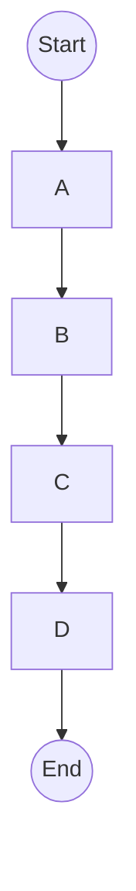

# 深度强化学习 (Deep Reinforcement Learning)

## 1. 背景介绍

### 1.1 强化学习概述

强化学习(Reinforcement Learning, RL)是机器学习的一个重要分支,它研究如何基于环境反馈来学习执行一系列行为,以最大化预期的长期回报。与监督学习和无监督学习不同,强化学习没有提供标记数据集,而是通过与环境的交互来学习。

在强化学习中,智能体(Agent)与环境(Environment)进行交互。智能体根据当前状态选择行为,环境会根据该行为转移到新的状态,并给出相应的奖励(Reward)反馈。智能体的目标是学习一个策略(Policy),使得在环境中执行该策略可以获得最大的累积奖励。

### 1.2 深度强化学习的兴起

传统的强化学习算法在处理高维观测数据和连续动作空间时存在局限性。随着深度学习技术的发展,研究人员开始将深度神经网络应用于强化学习,从而诞生了深度强化学习(Deep Reinforcement Learning, DRL)。

深度强化学习通过利用深度神经网络来近似值函数(Value Function)或策略(Policy),从而能够处理高维的状态和动作空间。这种结合深度学习和强化学习的方法显著提高了智能体在复杂环境中的学习能力,推动了强化学习在多个领域的应用,如机器人控制、自动驾驶、游戏等。

## 2. 核心概念与联系

### 2.1 马尔可夫决策过程(Markov Decision Process, MDP)

马尔可夫决策过程是强化学习的数学基础。MDP可以形式化描述为一个元组 $(S, A, P, R, \gamma)$,其中:

- $S$ 是有限的状态集合
- $A$ 是有限的动作集合
- $P(s'|s,a)$ 是状态转移概率,表示在状态 $s$ 执行动作 $a$ 后,转移到状态 $s'$ 的概率
- $R(s,a,s')$ 是奖励函数,表示在状态 $s$ 执行动作 $a$ 后,转移到状态 $s'$ 获得的即时奖励
- $\gamma \in [0,1)$ 是折扣因子,用于权衡即时奖励和长期奖励的重要性

在 MDP 中,智能体的目标是找到一个策略 $\pi: S \rightarrow A$,使得在该策略下的期望累积奖励最大化。

### 2.2 价值函数(Value Function)

价值函数是强化学习中的一个核心概念,用于评估一个状态或一个状态-动作对的长期价值。有两种主要的价值函数:

1. **状态价值函数(State Value Function)** $V^{\pi}(s)$:在策略 $\pi$ 下,从状态 $s$ 开始执行,期望获得的累积奖励。

2. **动作价值函数(Action Value Function)** $Q^{\pi}(s,a)$:在策略 $\pi$ 下,从状态 $s$ 开始执行动作 $a$,期望获得的累积奖励。

价值函数满足贝尔曼方程(Bellman Equation),可以通过动态规划或其他方法来求解。

### 2.3 策略(Policy)

策略 $\pi$ 是一个映射函数,它将状态 $s$ 映射到动作 $a$,即 $\pi: S \rightarrow A$。策略可以是确定性的(Deterministic),也可以是随机的(Stochastic)。

强化学习的目标是找到一个最优策略 $\pi^*$,使得在该策略下的期望累积奖励最大化。根据是否基于价值函数,强化学习算法可以分为两大类:

1. **基于价值函数的算法(Value-based)**: 首先学习价值函数,然后根据价值函数导出最优策略。例如 Q-Learning、Sarsa 等。

2. **基于策略的算法(Policy-based)**: 直接学习最优策略,而不需要先学习价值函数。例如策略梯度(Policy Gradient)算法。

深度强化学习通常结合深度神经网络来近似价值函数或策略,从而能够处理高维的状态和动作空间。

### 2.4 探索与利用权衡(Exploration-Exploitation Tradeoff)

在强化学习中,智能体需要权衡探索(Exploration)和利用(Exploitation)之间的关系。探索意味着尝试新的行为,以发现潜在的更好策略;而利用则是根据已学习的知识选择目前认为最优的行为。

过多的探索可能导致效率低下,而过多的利用则可能陷入次优解。合理地平衡探索与利用对于强化学习算法的性能至关重要。常用的探索策略包括 $\epsilon$-greedy、软更新(Softmax)等。

## 3. 核心算法原理具体操作步骤

### 3.1 Q-Learning

Q-Learning 是一种基于价值函数的强化学习算法,它直接学习动作价值函数 $Q(s,a)$,而不需要学习状态价值函数或模型。Q-Learning 算法的核心思想是通过不断更新 Q 值表,使其逼近最优动作价值函数 $Q^*(s,a)$。

Q-Learning 算法的具体步骤如下:

1. 初始化 Q 值表,对于所有的状态-动作对 $(s,a)$,设置初始值 $Q(s,a) = 0$。

2. 对于每个时间步:
   a. 根据当前状态 $s$ 和策略 $\pi$ 选择动作 $a$。
   b. 执行动作 $a$,观测到新的状态 $s'$ 和奖励 $r$。
   c. 更新 Q 值表中相应的 $Q(s,a)$ 值:

$$Q(s,a) \leftarrow Q(s,a) + \alpha \left[ r + \gamma \max_{a'} Q(s',a') - Q(s,a) \right]$$

其中 $\alpha$ 是学习率, $\gamma$ 是折扣因子。

3. 重复步骤 2,直到 Q 值表收敛。

在实际应用中,Q-Learning 算法通常结合深度神经网络来近似 Q 函数,从而能够处理高维的状态和动作空间,这就是深度 Q 网络(Deep Q-Network, DQN)。

### 3.2 策略梯度(Policy Gradient)

策略梯度是一种基于策略的强化学习算法,它直接学习策略 $\pi_\theta(a|s)$,即在状态 $s$ 下选择动作 $a$ 的概率,其中 $\theta$ 是策略的参数。

策略梯度算法的核心思想是通过梯度上升法,调整策略参数 $\theta$,使得期望的累积奖励 $J(\theta)$ 最大化:

$$\max_\theta J(\theta) = \mathbb{E}_{\pi_\theta} \left[ \sum_{t=0}^{\infty} \gamma^t r_t \right]$$

其中 $r_t$ 是时间步 $t$ 获得的奖励。

具体的策略梯度算法步骤如下:

1. 初始化策略参数 $\theta$。

2. 对于每个时间步:
   a. 根据当前策略 $\pi_\theta(a|s)$ 选择动作 $a$。
   b. 执行动作 $a$,观测到新的状态 $s'$ 和奖励 $r$。
   c. 计算策略梯度:

$$\nabla_\theta J(\theta) \approx \sum_{t=0}^{T} \nabla_\theta \log \pi_\theta(a_t|s_t) \sum_{t'=t}^{T} \gamma^{t'-t} r_{t'}$$

   d. 使用梯度上升法更新策略参数 $\theta$:

$$\theta \leftarrow \theta + \alpha \nabla_\theta J(\theta)$$

其中 $\alpha$ 是学习率。

3. 重复步骤 2,直到策略收敛。

在实际应用中,策略梯度算法通常结合深度神经网络来近似策略函数,从而能够处理高维的状态和动作空间,这就是深度策略梯度算法(Deep Policy Gradient)。

### 3.3 Actor-Critic 算法

Actor-Critic 算法是一种结合了价值函数和策略的强化学习算法。它包含两个组件:

- Actor: 负责学习策略函数 $\pi_\theta(a|s)$,即在状态 $s$ 下选择动作 $a$ 的概率分布。
- Critic: 负责学习价值函数 $V_w(s)$ 或 $Q_w(s,a)$,用于评估当前策略的好坏。

Actor 和 Critic 相互协作,Actor 根据 Critic 提供的价值函数信息来更新策略,而 Critic 则根据 Actor 执行的行为来更新价值函数。

具体的 Actor-Critic 算法步骤如下:

1. 初始化 Actor 的策略参数 $\theta$ 和 Critic 的价值函数参数 $w$。

2. 对于每个时间步:
   a. 根据当前策略 $\pi_\theta(a|s)$ 选择动作 $a$。
   b. 执行动作 $a$,观测到新的状态 $s'$ 和奖励 $r$。
   c. 更新 Critic 的价值函数参数 $w$,使得价值函数 $V_w(s)$ 或 $Q_w(s,a)$ 逼近真实的价值函数。
   d. 计算 Actor 的策略梯度:

$$\nabla_\theta J(\theta) \approx \sum_{t=0}^{T} \nabla_\theta \log \pi_\theta(a_t|s_t) A(s_t, a_t)$$

其中 $A(s_t, a_t)$ 是优势函数(Advantage Function),用于衡量当前动作相对于当前策略的优势。

   e. 使用梯度上升法更新 Actor 的策略参数 $\theta$:

$$\theta \leftarrow \theta + \alpha \nabla_\theta J(\theta)$$

其中 $\alpha$ 是学习率。

3. 重复步骤 2,直至收敛。

Actor-Critic 算法结合了价值函数和策略的优点,通常能够获得更好的性能和收敛速度。在实际应用中,Actor 和 Critic 通常都使用深度神经网络来近似相应的函数,从而能够处理高维的状态和动作空间。

## 4. 数学模型和公式详细讲解举例说明

在深度强化学习中,数学模型和公式扮演着重要的角色,为算法提供了理论基础和指导。本节将详细讲解一些核心的数学模型和公式,并给出具体的例子说明。

### 4.1 马尔可夫决策过程(Markov Decision Process, MDP)

马尔可夫决策过程是强化学习的数学基础,它可以形式化描述为一个元组 $(S, A, P, R, \gamma)$,其中:

- $S$ 是有限的状态集合
- $A$ 是有限的动作集合
- $P(s'|s,a)$ 是状态转移概率,表示在状态 $s$ 执行动作 $a$ 后,转移到状态 $s'$ 的概率
- $R(s,a,s')$ 是奖励函数,表示在状态 $s$ 执行动作 $a$ 后,转移到状态 $s'$ 获得的即时奖励
- $\gamma \in [0,1)$ 是折扣因子,用于权衡即时奖励和长期奖励的重要性

**示例**:

考虑一个简单的格子世界(Grid World)环境,如下图所示:

在这个环境中,智能体的目标是从起点 S 到达终点 E。每一步移动都会获得一个小的负奖励(例如 -1),到达终点时获得一个大的正奖励(例如 +100)。

我们可以将这个环境建模为一个 MDP:

- 状态集合 $S = \{S, A, B, C, D, E\}$
- 动作集合 $A = \{\text{上}, \text{下}, \text{左}, \text{右}\}$
- 状态转移概率 $P(s'|s,a)$ 取决于当前状态 $s$ 和动作 $a$,例如在状态 A 执行动作"右"会以概率 1 转移到状态 B
- 奖励函数 $R(s,a,s')$ 可以设置为每一步移动获得 -1 的奖励,到达终点 E 时获得 +100 的奖励
- 折扣因子 $\gamma$ 可以设置为一个合适的值,例如 