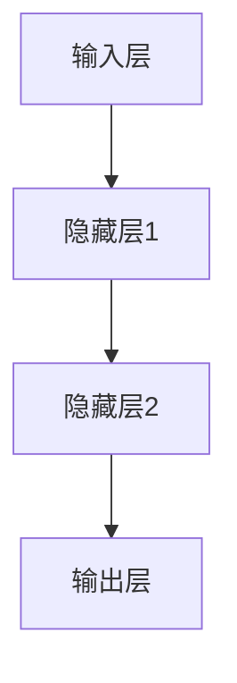
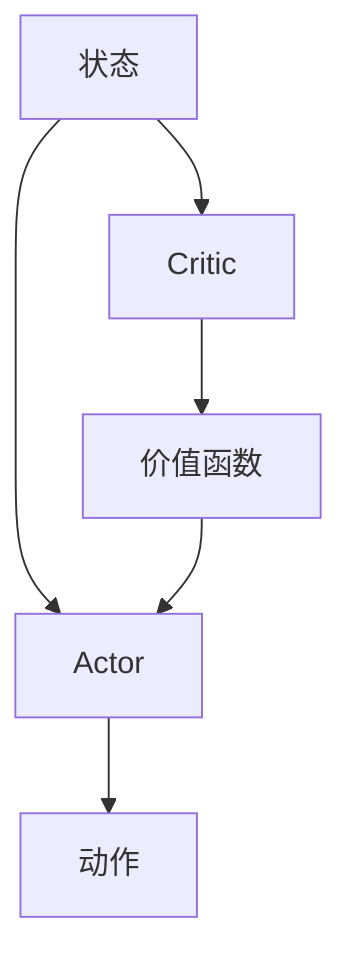

# 深度强化学习在游戏中的应用原理与代码实战案例讲解

## 1.背景介绍

### 1.1 游戏与人工智能的结合

游戏一直是人工智能发展的重要驱动力之一。从国际象棋到围棋,再到各种视频游戏,游戏提供了一个理想的环境,让人工智能算法在一个受控和简化的世界中进行训练和测试。随着深度学习和强化学习技术的不断发展,人工智能在游戏领域取得了令人瞩目的成就。

### 1.2 强化学习在游戏中的应用

强化学习是一种基于奖惩机制的机器学习方法,它通过与环境的交互来学习如何在给定情况下采取最优行动,以最大化预期的长期回报。这种学习方式与人类和动物学习的方式非常相似,使其在游戏领域具有天然的优势。

### 1.3 深度强化学习的兴起

尽管传统的强化学习算法在简单游戏中表现不错,但在复杂的游戏环境中,它们往往会受到状态空间爆炸和稀疏奖励的困扰。深度神经网络的引入为强化学习注入了新的活力,使其能够处理高维观测数据,并从原始输入中自动提取有用的特征。这种结合深度学习和强化学习的方法被称为深度强化学习(Deep Reinforcement Learning, DRL),它在近年来取得了突破性的进展,在多个游戏领域达到或超越人类水平。

## 2.核心概念与联系

### 2.1 马尔可夫决策过程

马尔可夫决策过程(Markov Decision Process, MDP)是强化学习的数学基础。它是一个离散时间随机控制过程,由以下五个要素组成:

- 状态集合 $\mathcal{S}$
- 动作集合 $\mathcal{A}$
- 转移概率 $\mathcal{P}_{ss'}^a = \Pr(s_{t+1}=s'|s_t=s, a_t=a)$
- 奖励函数 $\mathcal{R}_s^a = \mathbb{E}[r_{t+1}|s_t=s, a_t=a]$
- 折扣因子 $\gamma \in [0, 1)$

目标是找到一个策略 $\pi: \mathcal{S} \rightarrow \mathcal{A}$,使得在该策略下的期望累计折现回报最大化。

### 2.2 价值函数与贝尔曼方程

在强化学习中,我们通常使用价值函数来评估一个状态或状态-动作对的好坏。状态价值函数 $V^\pi(s)$ 表示在策略 $\pi$ 下从状态 $s$ 开始所能获得的期望累计折现回报,而状态-动作价值函数 $Q^\pi(s, a)$ 表示在策略 $\pi$ 下从状态 $s$ 执行动作 $a$ 开始所能获得的期望累计折现回报。它们满足以下贝尔曼方程:

$$
\begin{aligned}
V^\pi(s) &= \mathbb{E}_\pi[r_t + \gamma V^\pi(s_{t+1})|s_t=s] \\
Q^\pi(s, a) &= \mathbb{E}_\pi[r_t + \gamma \mathbb{E}_{s'\sim P(\cdot|s, a)}[V^\pi(s')]|s_t=s, a_t=a]
\end{aligned}
$$

求解这些方程即可找到最优策略对应的价值函数。

### 2.3 深度神经网络

深度神经网络是一种强大的函数逼近器,它由多层神经元组成,每一层对上一层的输出进行非线性变换。通过训练,神经网络可以学习将输入映射到期望的输出。在深度强化学习中,神经网络被用于近似价值函数或直接学习策略。



## 3.核心算法原理具体操作步骤

### 3.1 Q-Learning

Q-Learning是一种基于价值迭代的强化学习算法,它直接学习状态-动作价值函数 $Q(s, a)$,而不需要先学习策略。算法的核心思想是通过不断更新 $Q$ 值表,使其逼近最优 $Q^*$ 函数。更新规则如下:

$$Q(s_t, a_t) \leftarrow Q(s_t, a_t) + \alpha \left[ r_t + \gamma \max_{a'} Q(s_{t+1}, a') - Q(s_t, a_t) \right]$$

其中 $\alpha$ 是学习率, $\gamma$ 是折扣因子。

在深度 Q-Learning 中,我们使用神经网络来近似 $Q$ 函数,即 $Q(s, a; \theta) \approx Q^*(s, a)$,其中 $\theta$ 是网络参数。通过梯度下降优化网络参数,使得 $Q$ 值逼近真实的 $Q^*$ 值。

### 3.2 Deep Q-Network (DQN)

Deep Q-Network 是将 Q-Learning 与深度神经网络相结合的经典算法。它引入了以下几个关键技术:

1. **经验回放 (Experience Replay)**: 将过去的经验存储在回放缓冲区中,并从中随机采样数据进行训练,以提高数据利用率和算法稳定性。

2. **目标网络 (Target Network)**: 引入一个目标网络,用于计算 $Q$ 值目标,而另一个网络用于生成 $Q$ 值预测。目标网络的参数会定期从主网络复制过来,以提高训练稳定性。

3. **双重 Q-Learning**: 使用两个 $Q$ 网络来分别计算行为值和目标值,减少过估计的影响。

DQN 算法的伪代码如下:

```python
初始化主网络 Q 和目标网络 Q_target
初始化经验回放缓冲区 D
for episode in range(num_episodes):
    初始化环境状态 s
    while not done:
        选择动作 a = epsilon_greedy(Q, s)
        执行动作 a, 获得新状态 s'、奖励 r 和 done 标志
        存储转移 (s, a, r, s', done) 到 D
        从 D 中采样一批转移 (s_j, a_j, r_j, s'_j, done_j)
        计算目标值 y_j = r_j + gamma * max_a' Q_target(s'_j, a') * (1 - done_j)
        优化损失函数 (y_j - Q(s_j, a_j))^2
        每隔一定步数将主网络参数复制到目标网络
```

### 3.3 Policy Gradient

Policy Gradient 是另一种强化学习算法范式,它直接学习策略 $\pi_\theta(a|s)$,即在给定状态 $s$ 下选择动作 $a$ 的概率。我们定义策略的期望回报为:

$$J(\theta) = \mathbb{E}_{\tau \sim \pi_\theta}[R(\tau)]$$

其中 $\tau = (s_0, a_0, r_0, s_1, a_1, r_1, ...)$ 是一个轨迹序列。我们希望通过调整参数 $\theta$ 来最大化 $J(\theta)$。根据策略梯度定理,我们可以计算 $J(\theta)$ 关于 $\theta$ 的梯度:

$$\nabla_\theta J(\theta) = \mathbb{E}_{\tau \sim \pi_\theta}\left[\sum_{t=0}^\infty \nabla_\theta \log \pi_\theta(a_t|s_t)Q^{\pi_\theta}(s_t, a_t)\right]$$

然后使用梯度上升法更新策略参数 $\theta$。

### 3.4 Actor-Critic

Actor-Critic 算法将价值函数估计(Critic)和策略优化(Actor)结合在一起。Actor 根据当前状态输出动作概率,而 Critic 评估当前状态和动作的价值。两者通过梯度信息相互指导,实现策略的有效优化。

Actor 使用策略梯度方法更新参数,而 Critic 可以使用时序差分(TD)学习或者 Q-Learning 等方法来估计价值函数。常见的 Actor-Critic 算法包括 A2C、A3C 和 DDPG 等。



## 4.数学模型和公式详细讲解举例说明

### 4.1 马尔可夫决策过程

马尔可夫决策过程(MDP)是强化学习的数学基础,它描述了一个完全可观测的随机环境。在 MDP 中,系统在任何时间步 $t$ 处于某个状态 $s_t \in \mathcal{S}$,执行一个动作 $a_t \in \mathcal{A}(s_t)$,然后根据转移概率 $\mathcal{P}_{ss'}^a$ 转移到下一个状态 $s_{t+1}$,并获得一个奖励 $r_t = \mathcal{R}_s^a$。目标是找到一个策略 $\pi: \mathcal{S} \rightarrow \mathcal{A}$,使得在该策略下的期望累计折现回报最大化:

$$J(\pi) = \mathbb{E}_\pi\left[\sum_{t=0}^\infty \gamma^t r_t\right]$$

其中 $\gamma \in [0, 1)$ 是折扣因子,用于权衡当前和未来的回报。

为了解决 MDP,我们引入了价值函数的概念。状态价值函数 $V^\pi(s)$ 表示在策略 $\pi$ 下从状态 $s$ 开始所能获得的期望累计折现回报:

$$V^\pi(s) = \mathbb{E}_\pi\left[\sum_{k=0}^\infty \gamma^k r_{t+k}|s_t=s\right]$$

而状态-动作价值函数 $Q^\pi(s, a)$ 表示在策略 $\pi$ 下从状态 $s$ 执行动作 $a$ 开始所能获得的期望累计折现回报:

$$Q^\pi(s, a) = \mathbb{E}_\pi\left[\sum_{k=0}^\infty \gamma^k r_{t+k}|s_t=s, a_t=a\right]$$

它们满足以下贝尔曼方程:

$$
\begin{aligned}
V^\pi(s) &= \sum_{a}\pi(a|s)\sum_{s'}\mathcal{P}_{ss'}^a\left[R_s^a + \gamma V^\pi(s')\right] \\
Q^\pi(s, a) &= \sum_{s'}\mathcal{P}_{ss'}^a\left[R_s^a + \gamma \sum_{a'}\pi(a'|s')Q^\pi(s', a')\right]
\end{aligned}
$$

求解这些方程即可找到最优策略对应的价值函数。

### 4.2 Q-Learning 算法

Q-Learning 是一种基于价值迭代的强化学习算法,它直接学习状态-动作价值函数 $Q(s, a)$,而不需要先学习策略。算法的核心思想是通过不断更新 $Q$ 值表,使其逼近最优 $Q^*$ 函数。更新规则如下:

$$Q(s_t, a_t) \leftarrow Q(s_t, a_t) + \alpha \left[ r_t + \gamma \max_{a'} Q(s_{t+1}, a') - Q(s_t, a_t) \right]$$

其中 $\alpha$ 是学习率, $\gamma$ 是折扣因子。这个更新规则可以通过贝尔曼最优方程的形式来解释:

$$Q^*(s, a) = \mathbb{E}\left[r + \gamma \max_{a'} Q^*(s', a')|s, a\right]$$

在深度 Q-Learning 中,我们使用神经网络来近似 $Q$ 函数,即 $Q(s, a; \theta) \approx Q^*(s, a)$,其中 $\theta$ 是网络参数。通过梯度下降优化网络参数,使得 $Q$ 值逼近真实的 $Q^*$ 值。

例如,我们可以使用一个卷积神经网络来处理游戏画面,并输出每个动作的 $Q$ 值。然后,我们选择具有最大 $Q$ 值的动作作为下一步的动作。在训练过程中,我们将实际获得的奖励与网络预测的 $Q$ 值进行比较,并通过反向传播算法调整网络参数,使得预测值逐渐接近真实值。

### 4.3 Policy Gradient 算法

Policy Gradient 是另一种强化学习算法范式,它直接学习策略 $\pi_\theta(a|s)$,即在给定状态 $s$