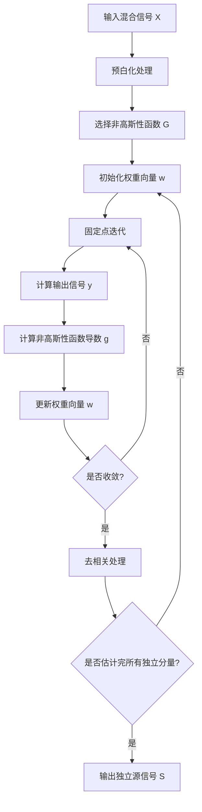

# 独立成分分析 原理与代码实例讲解

## 1.背景介绍

独立成分分析(Independent Component Analysis, ICA)是一种计算机视觉和信号处理领域中广泛使用的统计技术。它旨在从混合信号中恢复独立源信号,而无需事先了解混合过程的详细信息。ICA在许多领域都有应用,例如语音识别、图像处理、生物医学信号处理等。

### 1.1 问题背景

在现实世界中,我们经常会遇到从混合信号中提取独立源信号的问题。例如,在一个房间里有多个人同时说话,每个人的声音就是一个独立的源信号,而我们在房间里听到的就是这些源信号的混合。ICA的目标就是从这个混合信号中分离出每个人的独立声音信号。

### 1.2 基本思想

ICA的基本思想是利用源信号的统计独立性来对混合信号进行分离。具体来说,ICA假设源信号是统计独立的,并且至少有一个源信号的概率分布不是高斯分布。在这些假设下,ICA可以通过最大化输出信号的非高斯性来恢复独立源信号。

## 2.核心概念与联系

### 2.1 线性混合模型

ICA的基础是线性混合模型,它描述了如何从独立源信号生成混合信号。设有 n 个源信号 s1, s2, ..., sn,通过一个未知的混合矩阵 A 与它们线性组合,生成 m 个混合信号 x1, x2, ..., xm。数学表达式如下:

$$
\begin{bmatrix}
x_1 \\
x_2 \\
\vdots \\
x_m
\end{bmatrix}
=
\begin{bmatrix}
a_{11} & a_{12} & \cdots & a_{1n} \\
a_{21} & a_{22} & \cdots & a_{2n} \\
\vdots & \vdots & \ddots & \vdots \\
a_{m1} & a_{m2} & \cdots & a_{mn}
\end{bmatrix}
\begin{bmatrix}
s_1 \\
s_2 \\
\vdots \\
s_n
\end{bmatrix}
$$

ICA的目标是从已知的混合信号 X 估计出未知的混合矩阵 A 及其逆矩阵 W,从而恢复出源信号 S。

### 2.2 白化(Whitening)

在应用ICA算法之前,通常需要进行预处理,将混合信号进行白化(Whitening)处理。白化的目的是将混合信号线性去相关,使得新的混合信号具有单位方差且彼此不相关。白化可以简化后续的ICA计算,因为白化后的信号只需要找到一个正交旋转矩阵,就可以完成独立分量的分离。

### 2.3 非高斯性最大化

ICA算法的核心思想是最大化输出信号的非高斯性。高斯信号的独立分量之间是不相关的,但反之不成立。因此,如果我们能够找到一个非线性变换,使得输出信号的非高斯性最大化,那么这些输出信号就是我们想要的独立分量。

常用的非高斯性度量包括归一化的四阶累积量和负熵(Negentropy)等。通过优化这些度量,我们可以逐步找到能够最大化非高斯性的解混矩阵 W,进而恢复出独立源信号 S。

## 3.核心算法原理具体操作步骤 

### 3.1 FastICA 算法

FastICA 是一种高效的 ICA 算法,它基于固定点迭代的思想,通过最大化非高斯性来估计独立分量。FastICA 算法的主要步骤如下:

1. **预处理(预白化)**: 将混合信号 X 进行预白化处理,得到新的混合信号 Z,使其具有单位方差且彼此不相关。

2. **选择非高斯性函数**: 选择一个合适的非高斯性函数 G,用于度量输出信号的非高斯性程度。常用的函数有 kurtosis、negentropy 等。

3. **初始化权重向量**: 随机初始化一个权重向量 w,并使其单位化。

4. **固定点迭代**:
   a. 计算输出信号 y = Zw
   b. 计算非高斯性函数的导数 g = G'(y)
   c. 更新权重向量 w = E{Zg} - E{g'} * w,并对 w 进行单位化
   d. 如果未收敛,返回步骤 a

5. **去相关**: 将估计出的独立分量与剩余的混合信号进行去相关处理,得到新的混合信号。

6. **重复估计**: 重复步骤 3-5,直到估计出所有的独立分量。

FastICA 算法通过迭代优化,逐步找到能够最大化非高斯性的解混矩阵 W,进而恢复出独立源信号 S。

### 3.2 算法流程图



## 4.数学模型和公式详细讲解举例说明

### 4.1 线性混合模型

在 ICA 中,我们假设存在 n 个统计独立的源信号 $\mathbf{s} = [s_1, s_2, \dots, s_n]^T$,通过一个未知的混合矩阵 $\mathbf{A}$ 与它们线性组合,生成 m 个混合信号 $\mathbf{x} = [x_1, x_2, \dots, x_m]^T$,即:

$$\mathbf{x} = \mathbf{A}\mathbf{s}$$

其中 $\mathbf{A}$ 是一个 $m \times n$ 的常数矩阵。

ICA 的目标是从已知的混合信号 $\mathbf{x}$ 估计出未知的混合矩阵 $\mathbf{A}$ 及其逆矩阵 $\mathbf{W}$,从而恢复出源信号 $\mathbf{s}$,即:

$$\mathbf{s} = \mathbf{W}\mathbf{x}$$

### 4.2 白化(Whitening)

在应用 ICA 算法之前,通常需要进行预处理,将混合信号进行白化处理。白化的目的是将混合信号线性去相关,使得新的混合信号 $\mathbf{z}$ 具有单位方差且彼此不相关。

具体来说,白化是通过线性变换 $\mathbf{z} = \mathbf{V}\mathbf{x}$ 实现的,其中 $\mathbf{V}$ 是一个白化矩阵,满足:

$$\mathbf{E}\{\mathbf{z}\mathbf{z}^T\} = \mathbf{I}$$

其中 $\mathbf{I}$ 是单位矩阵。

白化可以简化后续的 ICA 计算,因为白化后的信号只需要找到一个正交旋转矩阵,就可以完成独立分量的分离。

### 4.3 非高斯性最大化

ICA 算法的核心思想是最大化输出信号的非高斯性。高斯信号的独立分量之间是不相关的,但反之不成立。因此,如果我们能够找到一个非线性变换 $\mathbf{y} = \mathbf{W}^T\mathbf{z}$,使得输出信号 $\mathbf{y}$ 的非高斯性最大化,那么这些输出信号就是我们想要的独立分量。

常用的非高斯性度量包括归一化的四阶累积量和负熵(Negentropy)等。

**四阶累积量**:

四阶累积量是一个常用的非高斯性度量,定义为:

$$\text{kurt}(y) = \mathbf{E}\{y^4\} - 3(\mathbf{E}\{y^2\})^2$$

对于高斯随机变量,其四阶累积量为 0。因此,我们可以通过最大化输出信号 $\mathbf{y}$ 的四阶累积量来估计独立分量。

**负熵(Negentropy)**:

负熵是另一种常用的非高斯性度量,它是用来度量随机变量与高斯变量之间的"距离"。负熵的定义为:

$$J(y) = H(y_{\text{gauss}}) - H(y)$$

其中 $H(y)$ 是随机变量 $y$ 的熵,而 $y_{\text{gauss}}$ 是与 $y$ 具有相同均值和方差的高斯随机变量。

由于高斯变量的熵是最大的,因此负熵 $J(y)$ 越大,表示随机变量 $y$ 与高斯变量的"距离"越远,即非高斯性越强。

通过优化这些非高斯性度量,我们可以逐步找到能够最大化非高斯性的解混矩阵 $\mathbf{W}$,进而恢复出独立源信号 $\mathbf{s}$。

### 4.4 实例说明

假设我们有两个独立的源信号 $s_1$ 和 $s_2$,通过一个未知的混合矩阵 $\mathbf{A}$ 与它们线性组合,生成两个混合信号 $x_1$ 和 $x_2$,即:

$$
\begin{bmatrix}
x_1 \\
x_2
\end{bmatrix}
=
\begin{bmatrix}
a_{11} & a_{12} \\
a_{21} & a_{22}
\end{bmatrix}
\begin{bmatrix}
s_1 \\
s_2
\end{bmatrix}
$$

我们的目标是从已知的混合信号 $x_1$ 和 $x_2$ 估计出未知的混合矩阵 $\mathbf{A}$ 及其逆矩阵 $\mathbf{W}$,从而恢复出源信号 $s_1$ 和 $s_2$。

首先,我们对混合信号进行白化处理,得到新的混合信号 $z_1$ 和 $z_2$,使它们具有单位方差且彼此不相关。

然后,我们选择一个合适的非高斯性函数,例如负熵,并通过固定点迭代的方式,逐步找到能够最大化负熵的解混矩阵 $\mathbf{W}$。

假设经过迭代,我们得到了解混矩阵 $\mathbf{W}$ 的估计值:

$$
\mathbf{W} =
\begin{bmatrix}
w_{11} & w_{12} \\
w_{21} & w_{22}
\end{bmatrix}
$$

那么,我们可以通过如下公式恢复出独立源信号 $s_1$ 和 $s_2$:

$$
\begin{bmatrix}
s_1 \\
s_2
\end{bmatrix}
=
\begin{bmatrix}
w_{11} & w_{12} \\
w_{21} & w_{22}
\end{bmatrix}
\begin{bmatrix}
x_1 \\
x_2
\end{bmatrix}
$$

这样,我们就成功地从混合信号中分离出了独立的源信号。

## 5.项目实践：代码实例和详细解释说明

在这一部分,我们将使用 Python 和 scikit-learn 库实现 FastICA 算法,并通过一个简单的示例来演示如何使用该算法进行独立成分分析。

### 5.1 导入所需库

```python
import numpy as np
from sklearn.decomposition import FastICA
```

### 5.2 生成示例数据

首先,我们生成两个独立的源信号 `s1` 和 `s2`,并通过一个随机的混合矩阵 `A` 与它们线性组合,生成两个混合信号 `X`。

```python
# 生成独立源信号
s1 = np.random.laplace(size=1000)  # 使用拉普拉斯分布
s2 = np.random.hyperbolic(size=1000)  # 使用双曲分布

# 生成混合矩阵
A = np.random.rand(2, 2)

# 生成混合信号
X = np.dot(A, [s1, s2])
```

### 5.3 应用 FastICA 算法

接下来,我们使