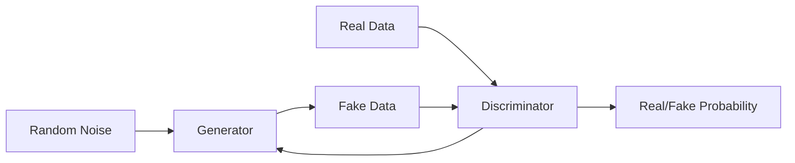

# 生成对抗网络 (GAN) 原理与代码实例讲解

## 1.背景介绍
### 1.1 GAN的诞生
生成对抗网络(Generative Adversarial Networks, GANs)是近年来人工智能领域最具革命性的想法之一,由Ian Goodfellow等人于2014年提出。GAN的出现为生成模型和无监督学习开辟了一片新天地。

### 1.2 GAN的定义与特点
GAN由生成器(Generator)和判别器(Discriminator)两部分组成,通过二者的对抗博弈来进行学习和生成。其目标是学习真实数据的分布,从而生成与真实数据极其相似的合成数据。GAN的特点包括:

- 生成能力强:可生成高质量、细节丰富的图像等数据
- 可扩展性好:适用于多种不同的数据和任务
- 学习方式新颖:无需标注数据,通过对抗学习来优化

### 1.3 GAN的应用价值
GAN为许多领域带来了突破性进展,主要应用包括:

- 图像生成与编辑:高清人脸合成、图像风格转换等  
- 视频预测和生成:未来帧预测、视频内容生成等
- 语音合成:语音转换、说话人伪装等
- 数据增强:扩充小样本数据集,提升模型性能

GAN的提出为AI的发展注入了新的活力,具有十分广阔的应用前景。

## 2.核心概念与联系
### 2.1 生成器 Generator
生成器的目标是生成尽可能以假乱真的数据,去欺骗判别器。其接收随机噪声z作为输入,将其映射到数据空间,输出生成的假样本。生成器通常采用上采样的卷积网络结构。

### 2.2 判别器 Discriminator  
判别器的目标是尽可能准确地判断输入数据的真假。其接收真实数据和生成器生成的假数据,输出对应的真假概率。判别器通常采用下采样的卷积网络结构。

### 2.3 对抗学习 Adversarial Learning
GAN的核心思想是博弈论中的二人零和博弈。生成器和判别器相互对抗,在竞争中不断进步,最终达到纳什均衡,生成的数据与真实数据分布一致。这一过程可抽象为minimax博弈:

$$\min_{G} \max_{D} V(D,G) = \mathbb{E}_{x \sim p_{data}(x)}[\log D(x)] + \mathbb{E}_{z \sim p_z(z)}[\log (1 - D(G(z)))]$$

其中G为生成器,D为判别器,$p_{data}$为真实数据分布,$p_z$为随机噪声的先验分布。

### 2.4 概念联系
下图展示了GAN的核心概念及其内在联系:



生成器和判别器在对抗学习中互相博弈,形成了GAN的基本架构。二者的优化目标相反,损失函数体现了minimax博弈的思想。

## 3.核心算法原理具体操作步骤
### 3.1 GAN的算法流程
GAN的训练本质上是在优化生成器和判别器的参数。其基本流程如下:

1. 随机初始化生成器G和判别器D的参数
2. 重复以下步骤直到算法收敛:
   a) 从先验分布$p_z$中采样一批噪声样本$\{z^{(1)}, ..., z^{(m)}\}$
   b) 从真实数据分布$p_{data}$中采样一批真实数据样本$\{x^{(1)}, ..., x^{(m)}\}$  
   c) 生成器G以噪声样本$z^{(i)}$为输入,生成对应的假样本$G(z^{(i)})$
   d) 判别器D以真实样本$x^{(i)}$和生成样本$G(z^{(i)})$为输入,输出对应的真假概率
   e) 计算判别器D的损失$L_D$,并通过反向传播更新D的参数,优化目标为最大化$L_D$
   f) 计算生成器G的损失$L_G$,并通过反向传播更新G的参数,优化目标为最小化$L_G$

### 3.2 判别器的优化
判别器的优化目标是最大化以下损失函数:

$$L_D = \frac{1}{m}\sum_{i=1}^{m}[\log D(x^{(i)}) + \log(1 - D(G(z^{(i)})))] $$

其中$x^{(i)}$为第i个真实样本,$z^{(i)}$为第i个噪声样本,m为小批量样本数。$L_D$由两部分组成,前者让D尽可能将真实样本判定为正类,后者让D尽可能将生成样本判定为负类。通过最大化$L_D$可以提升D的分类能力。

### 3.3 生成器的优化
生成器的优化目标是最小化以下损失函数:

$$L_G = \frac{1}{m}\sum_{i=1}^{m}\log(1 - D(G(z^{(i)})))$$

$L_G$表示生成器希望自己生成的假样本尽可能被判别器判定为正类。通过最小化$L_G$可以提升G的生成能力,使生成样本更加逼真。

### 3.4 训练技巧与改进
GAN的训练较为困难,容易出现训练不稳定、梯度消失等问题。一些常见的改进技巧包括:

- 采用带约束的优化目标,如WGAN使用Wasserstein距离
- 引入梯度惩罚项,如WGAN-GP
- 采用标签平滑,缓解判别器过强问题
- 在G和D中使用Batch Normalization改善梯度流动
- 进行参数平均,获得更稳定的生成器

研究者们在原始GAN的基础上提出了众多变体,在不同方面进行了改进和扩展。

## 4.数学模型和公式详细讲解举例说明
### 4.1 GAN的数学模型
GAN的本质是生成器与判别器的minimax博弈,其数学定义为:

$$\min_{G} \max_{D} V(D,G) = \mathbb{E}_{x \sim p_{data}(x)}[\log D(x)] + \mathbb{E}_{z \sim p_z(z)}[\log (1 - D(G(z)))]$$

其中,$p_{data}$为真实数据分布,$p_z$为噪声的先验分布,通常取高斯分布$N(0,I)$。这个minimax博弈的纳什均衡点为:

$$p_g = p_{data}$$

即生成器G学到了真实数据分布,可以生成与真实数据一致的样本。

### 4.2 损失函数的推导
基于二分类交叉熵的思想,判别器D的损失函数可表示为:

$$L_D = -\frac{1}{m}\sum_{i=1}^{m}[\log D(x^{(i)}) + \log(1 - D(G(z^{(i)})))]$$

最小化该损失函数等价于最大化判别器将真实样本预测为正类、将生成样本预测为负类的概率。

生成器G的损失函数可表示为:

$$L_G = \frac{1}{m}\sum_{i=1}^{m}\log(1 - D(G(z^{(i)})))$$

最小化该损失函数等价于最大化判别器将生成样本预测为正类的概率。

### 4.3 WGAN的改进
原始GAN采用JS散度作为优化目标,但其不满足三角不等式,导致训练不稳定。WGAN提出采用Wasserstein距离:

$$W(p_r, p_g) = \inf_{\gamma \in \Pi(p_r, p_g)} \mathbb{E}_{(x,y) \sim \gamma}[||x-y||]$$

其中,$\Pi(p_r, p_g)$为$p_r$和$p_g$之间所有可能的联合分布,$\gamma$为其中一个联合分布。Wasserstein距离满足三角不等式,且在$p_r$和$p_g$不重叠时仍然连续可导。

WGAN将原问题转化为:

$$\min_{G} \max_{D \in \mathcal{D}} \mathbb{E}_{x \sim p_r}[D(x)] - \mathbb{E}_{z \sim p_z}[D(G(z))]$$

其中$\mathcal{D}$为所有满足1-Lipschitz连续的函数集合。通过施加梯度惩罚,WGAN-GP进一步提升了训练稳定性。

## 5.项目实践：代码实例和详细解释说明
下面以TensorFlow框架为例,实现一个简单的GAN用于手写数字图像生成。

### 5.1 导入依赖包
```python
import tensorflow as tf
from tensorflow.keras import layers
import numpy as np
import matplotlib.pyplot as plt
```

### 5.2 加载和预处理数据
```python
(x_train, _), (_, _) = tf.keras.datasets.mnist.load_data()
x_train = x_train.reshape(x_train.shape[0], 28, 28, 1).astype('float32')
x_train = (x_train - 127.5) / 127.5  # 归一化到[-1, 1]区间
```

### 5.3 定义生成器
```python
def make_generator_model():
    model = tf.keras.Sequential()
    model.add(layers.Dense(7*7*256, use_bias=False, input_shape=(100,)))
    model.add(layers.BatchNormalization())
    model.add(layers.LeakyReLU())
    
    model.add(layers.Reshape((7, 7, 256)))
    model.add(layers.Conv2DTranspose(128, (5, 5), strides=(1, 1), padding='same', use_bias=False))
    model.add(layers.BatchNormalization())
    model.add(layers.LeakyReLU())
    
    model.add(layers.Conv2DTranspose(64, (5, 5), strides=(2, 2), padding='same', use_bias=False))
    model.add(layers.BatchNormalization())
    model.add(layers.LeakyReLU())
    
    model.add(layers.Conv2DTranspose(1, (5, 5), strides=(2, 2), padding='same', use_bias=False, activation='tanh'))
    
    return model
```

生成器接收长度为100的随机噪声,通过全连接层和转置卷积层将其映射为28x28的图像。

### 5.4 定义判别器
```python
def make_discriminator_model():
    model = tf.keras.Sequential()
    model.add(layers.Conv2D(64, (5, 5), strides=(2, 2), padding='same', input_shape=[28, 28, 1]))
    model.add(layers.LeakyReLU())
    model.add(layers.Dropout(0.3))
    
    model.add(layers.Conv2D(128, (5, 5), strides=(2, 2), padding='same'))
    model.add(layers.LeakyReLU())
    model.add(layers.Dropout(0.3))
    
    model.add(layers.Flatten())
    model.add(layers.Dense(1))
    
    return model
```

判别器接收28x28的输入图像,通过卷积层提取特征,最后通过全连接层输出真假概率。

### 5.5 定义损失函数和优化器
```python
cross_entropy = tf.keras.losses.BinaryCrossentropy(from_logits=True)

def discriminator_loss(real_output, fake_output):
    real_loss = cross_entropy(tf.ones_like(real_output), real_output)
    fake_loss = cross_entropy(tf.zeros_like(fake_output), fake_output)
    total_loss = real_loss + fake_loss
    return total_loss

def generator_loss(fake_output):
    return cross_entropy(tf.ones_like(fake_output), fake_output)

generator_optimizer = tf.keras.optimizers.Adam(1e-4)
discriminator_optimizer = tf.keras.optimizers.Adam(1e-4)
```

损失函数基于二分类交叉熵定义,优化器采用Adam,学习率为1e-4。

### 5.6 定义训练步骤
```python
@tf.function
def train_step(images):
    noise = tf.random.normal([BATCH_SIZE, noise_dim])

    with tf.GradientTape() as gen_tape, tf.GradientTape() as disc_tape:
        generated_images = generator(noise, training=True)

        real_output = discriminator(images, training=True)
        fake_output = discriminator(generated_images, training=True)

        gen_loss = generator_loss(fake_output)
        disc_loss = discriminator_loss(real_output, fake_output)

    gradients_of_generator = gen_tape.gradient(gen_loss, generator.trainable_variables)
    gradients_of_discriminator = disc_tape.gradient(disc_loss, discriminator.trainable_variables)

    generator_optimizer.apply_gradients(zip(gradients_of_generator, generator.trainable_variables))
    discriminator_optimizer.apply_