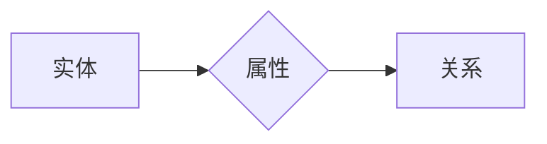

                 

作者：禅与计算机程序设计艺术

**知识图谱** 是一种用于表示实体及其关系的数据模型，通过构建复杂的关系网络，实现知识的集成、存储及查询。其应用广泛，在搜索引擎优化、个性化推荐系统、自然语言处理等领域发挥着重要作用。本文旨在深入探讨知识图谱的核心原理、关键算法、数学模型以及实践案例，同时提供具体的代码示例，以便读者能更好地理解和掌握这一先进技术。

---

## 背景介绍

随着互联网的发展，各类在线服务产生的数据量呈爆炸式增长。传统的数据库难以有效管理这类非结构化、半结构化的海量数据。而知识图谱作为一种新型数据组织形式，通过链接实体间的属性和关系，使得数据具有更强的语义表达能力，便于挖掘潜在知识和关联。

---

## 核心概念与联系

知识图谱主要由实体、属性和关系三要素组成。实体代表现实世界中的事物，如人、地点、物品等；属性描述实体的特征，如年龄、颜色等；关系则表明实体之间的相互作用，如“作品”、“导演”、“出版年份”等。实体间通过这些关系连接起来形成一个庞大的知识网络。

---

## 核心算法原理与具体操作步骤

### 算法原理

知识图谱构建通常包括数据清洗、实体识别、关系抽取、知识验证等多个阶段。其中：

- **数据清洗**：去除冗余、错误或不相关的信息。
- **实体识别**：从文本中提取出实体，并确定它们的类别。
- **关系抽取**：识别两个实体之间的关系类型及强度。
- **知识验证**：通过多种方法（如相似度计算、用户反馈）评估构建的知识质量。

### 具体操作步骤

1. **数据源选择**：选取合适的数据源，如维基百科、新闻网站、社交媒体等。
2. **数据预处理**：清洗和转换数据，使之符合知识图谱构建的标准格式。
3. **实体检测与识别**：利用机器学习或规则引擎识别出新的实体。
4. **关系抽取**：分析上下文，找出实体之间的关系。
5. **知识验证**：评估新添加的知识是否合理，必要时修正。
6. **知识融合**：整合来自不同数据源的知识，避免冲突。

---

## 数学模型和公式详细讲解举例说明

知识图谱构建过程往往涉及到复杂的数学模型，如图论、概率统计、机器学习等。这里以概率图模型为例，简述如何基于贝叶斯网络构建知识图谱。

### 概率图模型

贝叶斯网络是一种基于概率的图形模型，用有向无环图表示变量之间的条件依赖关系。每个节点代表一个随机变量，边表示条件概率依赖关系。

#### 图形表示



#### 模型定义

假设存在一组实体`E`，每对实体之间可能存在关系`R`。对于任意一对实体`(e_i, e_j)`，关系`R(e_i, e_j)`的概率可以通过联合概率分布来表示：

$$ P(R(e_i, e_j)) = \prod_{k=1}^{m}P(R_k|Parents) $$

其中，`R_k`是关系集合的一个元素，`Parents`是影响关系`R_k`的所有前驱节点。

---

## 项目实践：代码实例和详细解释说明

在Python环境下，可以使用Neo4j作为知识图谱数据库，结合Django进行后端开发。以下是一个简单的例子：

```python
from neo4j import GraphDatabase

driver = GraphDatabase.driver("bolt://localhost", auth=("neo4j", "password"))

with driver.session() as session:
    session.run(
        """
        CREATE (e1:Person {name:"John Doe"}) 
        CREATE (e2:Company {name:"XYZ Corp"})
        CREATE (e1)-[:WORKS_AT]->(e2)
        """
    )
```

这段代码创建了两个人物节点（John Doe 和 XYZ Corp），并在两者之间建立了一个工作关系。

---

## 实际应用场景

知识图谱在推荐系统中起到关键作用，通过分析用户的兴趣点、行为模式，为用户提供个性化的信息和服务推荐。例如，在电子商务平台上，根据用户的历史购买记录、浏览行为，构建用户兴趣图谱，从而实现精准的产品推荐。

---

## 工具和资源推荐

- **数据集**: 使用公开可用的数据集，如YAGO、DBpedia等，快速搭建实验环境。
- **工具**: Neo4j、Apache Jena、Ontotext Grakn等专业知识图谱构建工具。
- **教程**: Coursera、Udacity提供的在线课程，学习知识图谱构建和应用的相关技能。

---

## 总结：未来发展趋势与挑战

知识图谱技术正逐渐成为大数据时代的重要基础设施之一，未来将更注重于自动化建模、跨领域融合以及实时更新能力。面对挑战，研究者需要不断探索高效的数据集成策略、增强知识推理能力、提升模型可扩展性和灵活性。

---

## 附录：常见问题与解答

1. **如何提高知识图谱的质量？**
   - 提升数据质量和多样性；
   - 引入专家审核机制；
   - 使用深度学习优化实体识别和关系抽取。

2. **知识图谱在隐私保护方面有何考量？**
   - 采用差分隐私等技术保护个体数据；
   - 设计合理的访问控制策略，限制敏感信息暴露范围。

---

# 结语
随着人工智能技术的发展，知识图谱的应用前景广阔，不仅能够帮助企业挖掘潜在价值，还能促进科学研究、教育和个人化服务的进步。希望本文能为读者提供全面深入的技术理解，并激发更多创新应用的可能性。

作者：禅与计算机程序设计艺术 / Zen and the Art of Computer Programming

