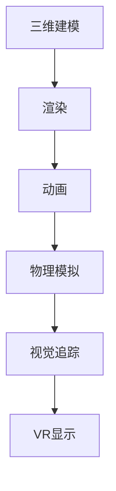
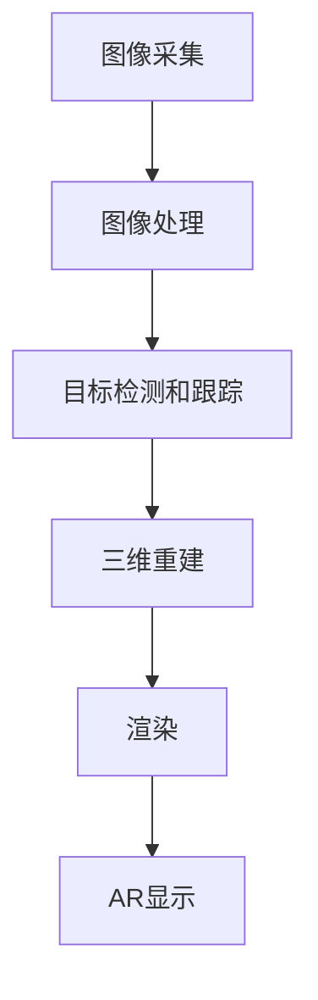
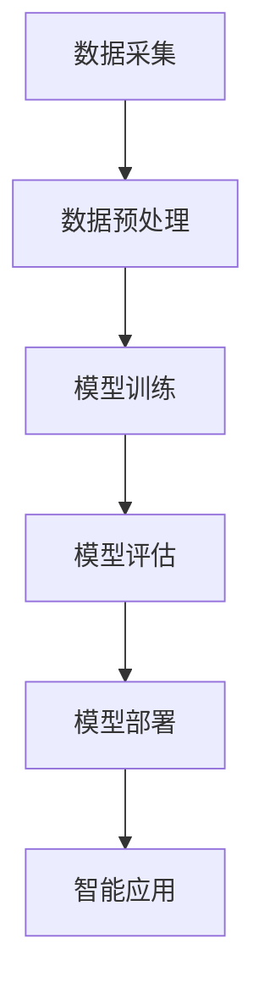
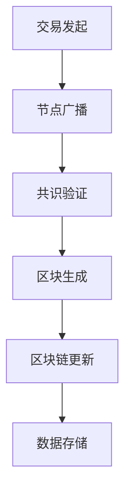

# 社会与文化：元宇宙的文化多元化与社会创新

## 1.背景介绍

### 1.1 元宇宙的兴起

元宇宙(Metaverse)作为一种新兴的虚拟现实技术,正在引领着人类社会进入一个全新的数字化时代。它将现实世界与虚拟世界融合,打造出一个沉浸式的平行宇宙,为人们提供前所未有的交互体验。随着元宇宙概念的不断发展和技术的日益成熟,它正在对我们的社会文化产生深远的影响。

### 1.2 文化多元化的重要性

文化多元化是人类社会发展的重要动力。不同的文化背景、价值观和生活方式,孕育了丰富多彩的思想和创意,推动了社会的进步和创新。然而,在现实世界中,由于地理位置、语言障碍等因素,不同文化之间的交流和融合往往受到一定限制。元宇宙的出现,为促进文化多元化提供了一个全新的平台。

### 1.3 元宇宙带来的社会创新

元宇宙不仅是一种技术革新,更是一种社会创新。它打破了现实世界的物理界限,为人们提供了一个无国界、无障碍的虚拟空间,促进了不同文化之间的交流与融合。同时,元宇宙也为社会创新提供了新的机遇,如远程教育、虚拟旅游、数字艺术等,这些创新将深刻影响我们的生活方式和社会结构。

## 2.核心概念与联系

### 2.1 元宇宙的核心概念

元宇宙是一个由多个虚拟现实空间组成的持久在线的虚拟宇宙,它具有以下核心特征:

1. **持久性(Persistence)**: 元宇宙是一个永久存在的虚拟世界,不会因为用户的离线而中断或重置。
2. **实时(Real-time)**: 元宇宙中的事件和交互是实时发生的,用户可以与其他用户及环境进行实时互动。
3. **无限制(Unlimited)**: 元宇宙理论上没有任何限制,可以容纳无数用户,提供无限的虚拟空间和内容。
4. **沉浸式(Immersive)**: 元宇宙提供高度沉浸式的虚拟现实体验,让用户感受如同身临其境。
5. **互操作性(Interoperability)**: 元宇宙中的各个虚拟空间可以相互连接,用户和数据可以自由流动。
6. **去中心化(Decentralized)**: 元宇宙没有单一的中央控制机构,而是由多个参与者共同构建和维护。

### 2.2 文化多元化与社会创新的联系

文化多元化和社会创新是相互促进、相辅相成的关系。丰富多彩的文化为社会创新提供了源源不断的灵感和动力,而社会创新又为不同文化的交流和融合创造了新的机遇和平台。在元宇宙中,这种关系将得到充分的体现和发展。

元宇宙打破了地理和语言的障碍,为不同文化背景的人们提供了一个无国界的虚拟空间,促进了文化的交流和融合。同时,元宇宙也为社会创新提供了新的载体和平台,如虚拟教育、数字艺术等,这些创新将进一步推动文化的多元化发展。

## 3.核心算法原理具体操作步骤

元宇宙的构建和运行涉及多种核心算法和技术,包括虚拟现实(VR)、增强现实(AR)、人工智能(AI)、区块链等。以下是一些核心算法原理和具体操作步骤:

### 3.1 虚拟现实(VR)算法

虚拟现实技术是元宇宙的基础,它通过计算机生成的模拟环境,为用户提供身临其境的体验。常用的VR算法包括:

1. **三维建模算法**: 用于构建虚拟环境中的物体和场景,如多边形网格建模、NURBS曲面建模等。
2. **渲染算法**: 将三维场景转换为二维图像,如光线追踪、光栅化等。
3. **动画算法**: 控制虚拟物体的运动和变形,如关键帧动画、骨骼动画等。
4. **物理模拟算法**: 模拟虚拟环境中的物理现象,如刚体动力学、软体动力学等。
5. **视觉追踪算法**: 跟踪用户的头部和手部运动,实现在虚拟环境中的视角和交互。

操作步骤:

### 3.2 增强现实(AR)算法

增强现实技术将虚拟信息叠加到现实环境中,是元宇宙与现实世界融合的关键。常用的AR算法包括:

1. **图像处理算法**: 对摄像头捕获的图像进行增强、滤波等处理。
2. **目标检测和跟踪算法**: 识别和跟踪现实环境中的特征点或目标物体。
3. **三维重建算法**: 根据图像信息重建现实环境的三维模型。
4. **渲染算法**: 将虚拟信息渲染到现实环境中。

操作步骤:

### 3.3 人工智能(AI)算法

人工智能技术为元宇宙提供智能化支持,如虚拟助手、智能交互等。常用的AI算法包括:

1. **机器学习算法**: 如深度学习、强化学习等,用于模式识别、预测和决策。
2. **自然语言处理算法**: 如语音识别、语义分析等,实现人机自然语言交互。
3. **计算机视觉算法**: 如目标检测、图像分割等,用于理解和解释视觉信息。
4. **规划和决策算法**: 如马尔可夫决策过程、蒙特卡罗树搜索等,用于智能体的行为规划和决策。

操作步骤:

### 3.4 区块链算法

区块链技术为元宇宙提供了去中心化的基础设施,确保数据的安全性和可信度。常用的区块链算法包括:

1. **共识算法**: 如工作量证明(PoW)、权益证明(PoS)等,用于达成网络节点对交易和数据的一致性。
2. **加密算法**: 如哈希函数、非对称加密等,用于保护数据的完整性和隐私性。
3. **智能合约算法**: 基于区块链的自动化程序,用于执行和验证各种协议和交易。
4. **分布式存储算法**: 如分布式哈希表(DHT)、点对点网络等,用于存储和共享元宇宙中的数据和资产。

操作步骤:

以上算法和技术相互配合,共同构建了元宇宙的基础架构和功能。随着技术的不断进步,这些算法也在不断优化和创新,以提供更加沉浸式、智能化和安全可靠的元宇宙体验。

## 4.数学模型和公式详细讲解举例说明

元宇宙的构建和运行涉及多种数学模型和公式,以下是一些重要的数学模型和公式,并给出详细的讲解和举例说明。

### 4.1 三维变换

在元宇宙中,三维变换是一种常见的操作,用于对虚拟物体进行位移、旋转和缩放等变换。常用的三维变换矩阵如下:

$$
\begin{aligned}
\text{平移矩阵} &= \begin{bmatrix}
1 & 0 & 0 & t_x \\
0 & 1 & 0 & t_y \\
0 & 0 & 1 & t_z \\
0 & 0 & 0 & 1
\end{bmatrix} \\
\text{旋转矩阵} &= \begin{bmatrix}
\cos\alpha & -\sin\alpha & 0 & 0 \\
\sin\alpha & \cos\alpha & 0 & 0 \\
0 & 0 & 1 & 0 \\
0 & 0 & 0 & 1
\end{bmatrix} \\
\text{缩放矩阵} &= \begin{bmatrix}
s_x & 0 & 0 & 0 \\
0 & s_y & 0 & 0 \\
0 & 0 & s_z & 0 \\
0 & 0 & 0 & 1
\end{bmatrix}
\end{aligned}
$$

其中，$t_x, t_y, t_z$ 表示平移距离，$\alpha$ 表示旋转角度，$s_x, s_y, s_z$ 表示缩放比例。通过矩阵乘法，可以实现多种变换的组合。

例如，对一个点 $(x, y, z)$ 进行平移 $(t_x, t_y, t_z)$、旋转 $\alpha$ 角度和缩放 $(s_x, s_y, s_z)$ 的变换，可以表示为:

$$
\begin{bmatrix}
x' \\ y' \\ z' \\ 1
\end{bmatrix} = \begin{bmatrix}
s_x & 0 & 0 & 0 \\
0 & s_y & 0 & 0 \\
0 & 0 & s_z & 0 \\
0 & 0 & 0 & 1
\end{bmatrix} \begin{bmatrix}
\cos\alpha & -\sin\alpha & 0 & 0 \\
\sin\alpha & \cos\alpha & 0 & 0 \\
0 & 0 & 1 & 0 \\
0 & 0 & 0 & 1
\end{bmatrix} \begin{bmatrix}
1 & 0 & 0 & t_x \\
0 & 1 & 0 & t_y \\
0 & 0 & 1 & t_z \\
0 & 0 & 0 & 1
\end{bmatrix} \begin{bmatrix}
x \\ y \\ z \\ 1
\end{bmatrix}
$$

### 4.2 光线追踪

光线追踪是一种常用的三维渲染算法,它通过模拟光线在虚拟场景中的传播和反射,计算每个像素的颜色值,从而生成高质量的图像。光线追踪的基本公式如下:

$$
L_r(p, \omega_r) = L_e(p, \omega_r) + \int_{\Omega} f_r(p, \omega_i, \omega_r) L_i(p, \omega_i) \cos\theta_i \, \mathrm{d}\omega_i
$$

其中:

- $L_r(p, \omega_r)$ 表示从点 $p$ 沿方向 $\omega_r$ 发出的辐射通量。
- $L_e(p, \omega_r)$ 表示点 $p$ 自身发出的辐射通量。
- $f_r(p, \omega_i, \omega_r)$ 表示点 $p$ 的双向反射分布函数(BRDF),描述了入射光线 $\omega_i$ 被反射为出射光线 $\omega_r$ 的比率。
- $L_i(p, \omega_i)$ 表示从方向 $\omega_i$ 入射到点 $p$ 的辐射通量。
- $\cos\theta_i$ 表示入射光线与法线的夹角余弦值,用于计算入射光线的投影面积。
- $\Omega$ 表示半球面积,对所有可能的入射方向进行积分。

通过递归地计算每个点的出射辐射通量,并对场景中的所有可见点进行采样,可以得到最终的渲染图像。

例如,对于一个理想的漫反射表面,其 BRDF 可以表示为:

$$
f_r(p, \omega_i, \omega_r) = \frac{\rho}{\pi}
$$