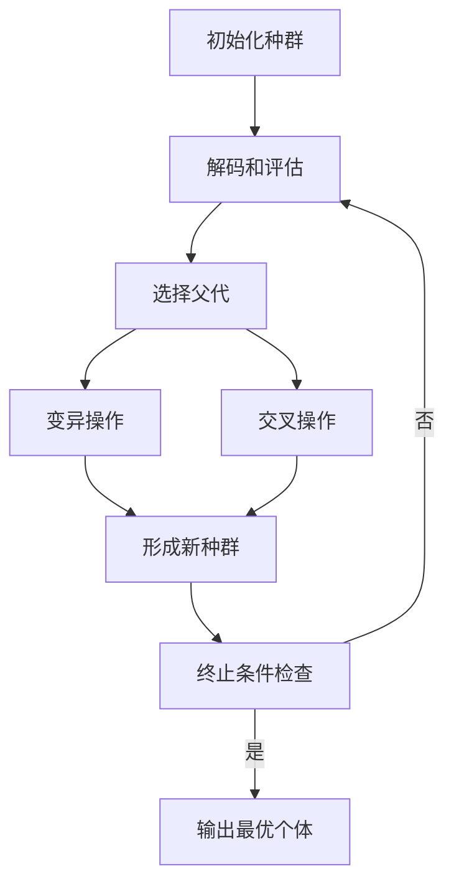

# 神经进化算法(Neuroevolution) - 原理与代码实例讲解

## 1.背景介绍

### 1.1 神经网络与进化算法

神经网络是一种受生物神经系统启发的计算模型,具有强大的模式识别和数据处理能力。然而,设计高效的神经网络结构和权重参数是一个巨大的挑战。传统的反向传播算法虽然可以优化权重参数,但对于网络结构的搜索仍然依赖人工设计和大量试错。

进化算法是一种基于自然选择和遗传机制的优化算法,可以通过模拟生物进化过程来搜索解空间。由于其强大的全局搜索能力,进化算法在解决复杂优化问题方面表现出色。

### 1.2 神经进化算法的兴起

神经进化算法(Neuroevolution)将神经网络和进化算法相结合,旨在使用进化算法的优化能力来自动发现高效的神经网络结构和权重参数。这种方法不仅可以减轻人工设计的负担,还能探索传统方法难以发现的创新型解决方案。

神经进化算法的核心思想是将神经网络的结构和权重参数编码为基因型,然后通过模拟自然选择和遗传操作(如变异和交叉)来进化出性能优异的神经网络个体。这种算法具有以下优点:

1. 自动发现高效的神经网络结构,无需人工设计。
2. 同时优化神经网络的结构和权重参数。
3. 具有强大的全局搜索能力,可以探索创新型解决方案。
4. 可以处理高维、非线性和多模态的优化问题。

神经进化算法在许多领域都取得了卓越的成绩,如机器人控制、游戏AI、模式识别和数据挖掘等。随着算力的提升和算法的不断改进,神经进化算法将在未来的人工智能发展中扮演越来越重要的角色。

## 2.核心概念与联系

### 2.1 神经网络编码

为了使用进化算法优化神经网络,首先需要将神经网络的结构和权重参数编码为基因型。常见的编码方式包括:

1. **直接编码**:将神经网络的每个连接权重直接编码为基因型的一部分。这种编码方式简单直观,但对于大型网络会导致基因型过长。

2. **间接编码**:使用一组规则或函数来生成神经网络的结构和权重,这些规则或函数被编码为基因型。这种编码方式可以产生更紧凑的基因型,但解码过程可能会很复杂。

3. **层次编码**:将神经网络分解为多个层次,每个层次使用不同的编码方式。例如,可以使用直接编码来表示每层的连接权重,同时使用间接编码来表示层数和每层的神经元数量。

无论采用何种编码方式,都需要确保基因型和表现型之间的映射是可解码和可逆的,以便进化算法可以有效地操作基因型。

### 2.2 适应度函数

适应度函数(Fitness Function)用于评估每个神经网络个体的性能,是进化算法的核心驱动力。一个良好的适应度函数应该能够准确反映问题的优化目标,并且计算效率高。

在神经进化算法中,适应度函数通常基于神经网络在特定任务上的表现来定义。例如,在分类问题中,可以使用分类准确率作为适应度函数;在控制问题中,可以使用累计奖励或稳定性指标作为适应度函数。

除了任务相关的指标,适应度函数还可以考虑其他因素,如神经网络的大小、计算复杂度或正则化项,以防止过拟合和控制模型复杂度。

### 2.3 选择、变异和交叉

选择、变异和交叉是进化算法中的三个基本操作,用于产生新的后代个体。

1. **选择**:根据适应度函数评分,从当前种群中选择性能较好的个体作为父代。常见的选择策略包括锦标赛选择、轮盘赌选择和精英选择等。

2. **变异**:通过对父代个体的基因型进行小幅度的随机改变,产生新的变异个体。变异操作可以引入新的遗传多样性,有助于探索解空间的新区域。

3. **交叉**:将两个或多个父代个体的基因型进行组合,产生新的交叉个体。交叉操作可以保留父代个体的优良基因,并创造新的基因组合。

通过反复进行选择、变异和交叉操作,进化算法可以逐步优化神经网络的性能,直至满足终止条件(如达到最大进化代数或目标适应度)。

## 3.核心算法原理具体操作步骤

神经进化算法的具体操作步骤如下:

1. **初始化种群**:随机生成一个初始种群,每个个体对应一个神经网络的基因型。

2. **解码和评估**:对每个个体的基因型进行解码,生成对应的神经网络表现型。然后,使用适应度函数评估每个神经网络的性能。

3. **选择父代**:根据适应度评分,从当前种群中选择一部分个体作为父代。

4. **变异操作**:对父代个体的基因型进行变异,产生新的变异个体。

5. **交叉操作**:将两个或多个父代个体的基因型进行交叉,产生新的交叉个体。

6. **形成新种群**:将变异个体、交叉个体和一部分精英个体(当前种群中适应度最高的个体)组合成新的种群。

7. **终止条件检查**:检查是否满足终止条件(如达到最大进化代数或目标适应度)。如果满足,则算法终止,输出当前种群中适应度最高的个体;否则,返回步骤2,对新种群进行解码和评估。



上述算法流程可以通过调整编码方式、适应度函数、选择策略和遗传操作器等参数来适应不同的问题场景。此外,还可以引入其他进化策略(如种群分裂、共演化等)来提高算法的性能和鲁棒性。

## 4.数学模型和公式详细讲解举例说明

### 4.1 神经网络数学模型

神经网络是一种由多层神经元相互连接组成的数学模型,可以近似任意连续函数。一个典型的前馈神经网络可以表示为:

$$
y = f_L(W_L \cdot f_{L-1}(W_{L-1} \cdot ... \cdot f_1(W_1 \cdot x + b_1) + b_{L-1}) + b_L)
$$

其中:

- $x$ 是输入向量
- $y$ 是输出向量
- $W_i$ 是第 $i$ 层的权重矩阵
- $b_i$ 是第 $i$ 层的偏置向量
- $f_i$ 是第 $i$ 层的激活函数,如 ReLU、Sigmoid 等

通过训练,我们可以学习到合适的权重矩阵 $W_i$ 和偏置向量 $b_i$,使得神经网络能够很好地拟合训练数据。

### 4.2 进化算法数学模型

进化算法是一种基于种群的优化算法,它模拟自然选择和遗传机制来进化出优秀的解。在每一代中,算法会根据个体的适应度进行选择、变异和交叉操作,产生新的后代个体。

假设我们有一个目标函数 $f(x)$ 需要最大化,其中 $x$ 是一个 $n$ 维向量。进化算法的目标是找到一个 $x^*$,使得 $f(x^*)$ 达到最大值。

我们可以将每个个体 $x_i$ 编码为一个基因型 $g_i$,并定义一个适应度函数 $\phi(g_i)$ 来评估个体的性能。适应度函数通常与目标函数 $f(x)$ 相关,但也可以包含其他约束或惩罚项。

在每一代中,进化算法会执行以下操作:

1. **选择**:根据适应度函数 $\phi(g_i)$,从当前种群中选择一部分个体作为父代。常见的选择策略包括锦标赛选择、轮盘赌选择和精英选择等。

2. **变异**:对父代个体的基因型 $g_i$ 进行小幅度的随机改变,产生新的变异个体 $g_i'$。变异操作可以引入新的遗传多样性,有助于探索解空间的新区域。

3. **交叉**:将两个或多个父代个体的基因型进行组合,产生新的交叉个体 $g_j'$。交叉操作可以保留父代个体的优良基因,并创造新的基因组合。

通过反复进行选择、变异和交叉操作,进化算法可以逐步优化种群中个体的适应度,直至满足终止条件(如达到最大进化代数或目标适应度)。

### 4.3 神经进化算法数学模型

神经进化算法将神经网络和进化算法相结合,旨在使用进化算法的优化能力来自动发现高效的神经网络结构和权重参数。

假设我们有一个神经网络任务,需要学习一个映射函数 $y = f(x; \theta)$,其中 $x$ 是输入,y是期望输出,$ \theta $ 是神经网络的参数(包括权重和偏置)。我们可以将神经网络的参数 $ \theta $ 编码为一个基因型 $g$,并定义一个适应度函数 $ \phi(g) $ 来评估神经网络在训练数据或验证数据上的性能。

适应度函数 $ \phi(g) $ 可以基于任务相关的指标来定义,例如:

- 对于分类任务,可以使用分类准确率作为适应度函数:$\phi(g) = \frac{1}{N}\sum_{i=1}^{N} \mathbb{I}(f(x_i; \theta(g)) = y_i)$
- 对于回归任务,可以使用均方误差作为适应度函数:$\phi(g) = -\frac{1}{N}\sum_{i=1}^{N} (f(x_i; \theta(g)) - y_i)^2$

其中 $\mathbb{I}(\cdot)$ 是示性函数, $(x_i, y_i)$ 是训练数据或验证数据的第 $i$ 个样本, $N$ 是样本总数。

通过进化算法的选择、变异和交叉操作,我们可以不断优化神经网络的参数 $ \theta $,使得适应度函数 $ \phi(g) $ 达到最大值。这相当于在搜索一个最优的神经网络结构和参数组合,使得神经网络在给定的任务上表现最佳。

需要注意的是,由于神经网络的高维性和非线性,神经进化算法的搜索空间通常比传统的进化算法更加复杂。因此,合理的编码方式、适应度函数设计和进化策略选择对于算法的性能至关重要。

## 5.项目实践:代码实例和详细解释说明

为了更好地理解神经进化算法的原理和实现,我们将通过一个具体的代码示例来演示如何使用Python和相关库(如PyTorch、DEAP等)实现一个简单的神经进化算法。

在这个示例中,我们将尝试使用神经进化算法来训练一个用于手写数字识别的神经网络。我们将使用MNIST数据集作为训练和测试数据。

### 5.1 导入所需库

```python
import random
import numpy as np
import torch
import torch.nn as nn
import torch.nn.functional as F
from deap import base, creator, tools, algorithms
from torchvision import datasets, transforms
```

### 5.2 定义神经网络结构

我们将使用一个简单的全连接神经网络作为示例。神经网络的结构将由进化算法自动发现。

```python
class Net(nn.Module):
    def __init__(self, input_size, hidden_sizes, output_size):
        super(Net, self).__init__()
        self.layers = nn.ModuleList([])
        self.layers.append(nn.