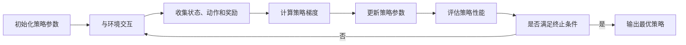

## 1. 背景介绍

随着全球能源结构的转型和电力系统的智能化升级，电力行业正面临着前所未有的挑战和机遇。在这一背景下，人工智能技术，尤其是强化学习，在电力系统的优化调度、需求响应、故障诊断和智能控制等方面展现出巨大的应用潜力。策略梯度方法作为强化学习中的一种重要算法，以其在连续动作空间中的优势，成为电力行业智能化转型的关键技术之一。

## 2. 核心概念与联系

### 2.1 强化学习与策略梯度
强化学习是一种机器学习范式，它使得智能体能够在与环境的交互中学习如何做出决策。策略梯度是强化学习中的一类算法，它直接对策略进行参数化，并通过梯度上升方法来优化策略，以实现长期收益的最大化。

### 2.2 电力系统的智能化需求
电力系统作为一个复杂的工程体系，其运行效率和可靠性直接关系到社会经济的稳定发展。智能化技术的引入能够提高电力系统的自适应能力和决策质量，降低运维成本，提升服务水平。

### 2.3 策略梯度与电力系统的结合
策略梯度方法在电力系统中的应用，主要体现在对电网运行的实时控制和优化，包括但不限于负荷预测、电力调度、故障处理等方面。

## 3. 核心算法原理具体操作步骤

### 3.1 策略梯度算法框架

### 3.2 操作步骤详解
1. 初始化策略参数：定义策略网络的结构和初始参数。
2. 与环境交互：智能体根据当前策略与环境进行交互，执行动作。
3. 收集状态、动作和奖励：记录每一步的状态、所采取的动作以及相应的奖励。
4. 计算策略梯度：根据收集到的数据计算策略的梯度。
5. 更新策略参数：利用梯度信息更新策略网络的参数。
6. 评估策略性能：测试更新后的策略在环境中的表现。
7. 是否满足终止条件：判断是否达到预设的性能标准或迭代次数限制。
8. 输出最优策略：如果满足终止条件，则输出当前策略作为最优策略。

## 4. 数学模型和公式详细讲解举例说明

### 4.1 策略梯度定理
策略梯度定理提供了一个计算策略梯度的数学基础。其核心公式为：
$$
\nabla_{\theta}J(\theta) = \mathbb{E}_{\tau \sim \pi_{\theta}} \left[ \sum_{t=0}^{T} \nabla_{\theta} \log \pi_{\theta}(a_t|s_t) R(\tau) \right]
$$
其中，$J(\theta)$ 是性能函数，$\theta$ 是策略参数，$\pi_{\theta}$ 是策略函数，$a_t$ 和 $s_t$ 分别表示在时间 $t$ 的动作和状态，$R(\tau)$ 是轨迹 $\tau$ 的总回报。

### 4.2 公式解释与举例
- $\nabla_{\theta}J(\theta)$：策略性能函数关于参数的梯度，指示了参数应该如何更新以提高性能。
- $\mathbb{E}_{\tau \sim \pi_{\theta}}$：期望是在策略 $\pi_{\theta}$ 下产生的轨迹分布上计算的。
- $\log \pi_{\theta}(a_t|s_t)$：动作概率的对数，用于计算梯度。
- $R(\tau)$：轨迹的总回报，是策略好坏的直接评价。

举例：假设在电力系统负荷预测的场景中，智能体需要决定是否启动某个备用电源。在这里，$s_t$ 可以是当前的电网状态，$a_t$ 是启动或不启动备用电源的动作，$R(\tau)$ 是基于动作带来的成本节约和供电可靠性的总回报。

## 5. 项目实践：代码实例和详细解释说明

由于篇幅限制，此处无法提供完整的代码实例。但可以概述代码实现的关键步骤：

1. 定义环境和智能体：使用OpenAI Gym或自定义环境来模拟电力系统，定义智能体的策略网络。
2. 数据收集：通过与环境交互收集状态、动作和奖励的数据。
3. 策略梯度计算：根据策略梯度定理计算梯度。
4. 策略更新：使用梯度上升法更新策略参数。
5. 性能评估：定期评估策略的性能，以监控学习进度。

## 6. 实际应用场景

策略梯度方法在电力行业的实际应用场景包括：

1. 电力调度：优化发电计划，平衡供需关系。
2. 需求响应：根据电网负荷动态调整用户用电行为。
3. 故障诊断：实时监测电网状态，快速定位和处理故障。
4. 资产管理：优化设备维护和更新计划，延长资产寿命。

## 7. 工具和资源推荐

- OpenAI Gym：提供多种环境模拟，适合强化学习算法的测试和开发。
- TensorFlow/PyTorch：强大的深度学习框架，用于构建和训练策略网络。
- Ray RLlib：一个用于强化学习的开源库，支持多种算法和分布式训练。

## 8. 总结：未来发展趋势与挑战

策略梯度方法在电力行业的应用前景广阔，但也面临着算法稳定性、安全性和可解释性等挑战。未来的发展趋势将是算法的进一步优化，以及与其他技术如数字孪生、物联网的融合，以实现更高效、更智能的电力系统。

## 9. 附录：常见问题与解答

- Q1: 策略梯度方法如何处理连续动作空间？
- A1: 策略梯度方法通过参数化策略并使用概率分布来处理连续动作空间。

- Q2: 在电力系统中应用策略梯度方法有哪些挑战？
- A2: 挑战包括模型的准确性、算法的稳定性和实时性要求。

- Q3: 如何评估策略梯度方法在电力行业的效果？
- A3: 可以通过模拟环境进行测试，并与现有的方法进行性能比较。

作者：禅与计算机程序设计艺术 / Zen and the Art of Computer Programming