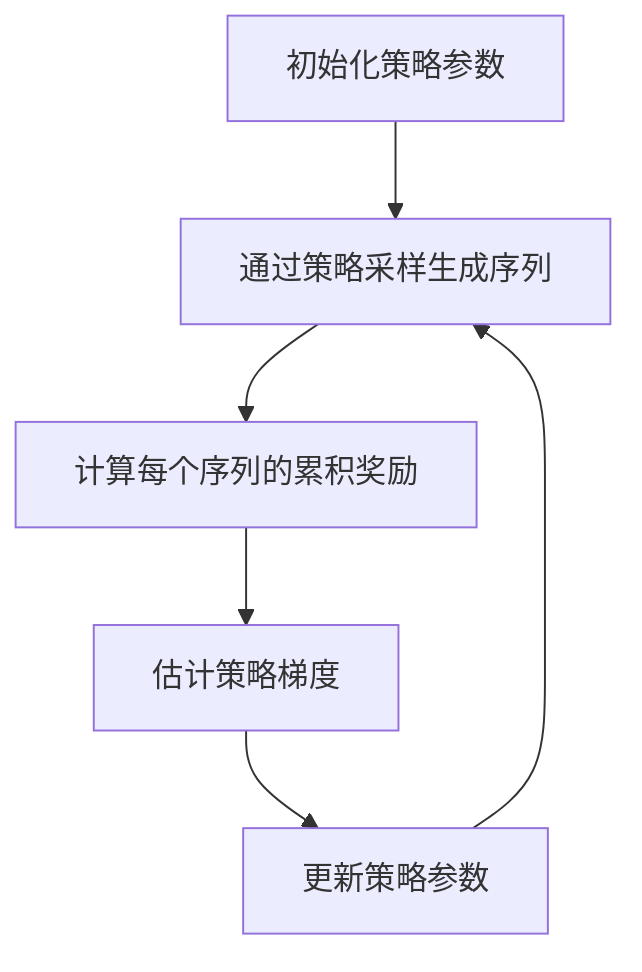

# 策略梯度在自然语言处理中的应用

## 1.背景介绍

在人工智能和机器学习领域，自然语言处理（NLP）一直是一个重要的研究方向。随着深度学习技术的不断发展，NLP的应用场景越来越广泛，从机器翻译、文本生成到情感分析和对话系统，NLP技术已经渗透到我们生活的方方面面。策略梯度（Policy Gradient）作为强化学习中的一种重要方法，近年来在NLP领域也得到了广泛的应用。本文将深入探讨策略梯度在NLP中的应用，介绍其核心概念、算法原理、数学模型、实际应用场景以及未来的发展趋势和挑战。

## 2.核心概念与联系

### 2.1 策略梯度简介

策略梯度是一种基于策略优化的强化学习方法。与基于值函数的方法不同，策略梯度直接优化策略函数，通过梯度上升或下降来更新策略参数。策略梯度方法的核心思想是通过采样和估计策略的梯度，来优化策略，使得在给定环境下的累积奖励最大化。

### 2.2 自然语言处理简介

自然语言处理是计算机科学与人工智能的一个分支，旨在实现计算机对人类语言的理解、生成和处理。NLP技术包括但不限于文本分类、情感分析、机器翻译、对话系统和文本生成等。

### 2.3 策略梯度与NLP的联系

在NLP任务中，许多问题可以被建模为序列决策问题，例如文本生成和对话系统。策略梯度方法可以通过优化策略来生成高质量的文本或对话，从而在这些任务中发挥重要作用。

## 3.核心算法原理具体操作步骤

### 3.1 策略梯度算法原理

策略梯度算法的核心思想是通过采样和估计策略的梯度，来优化策略参数。具体步骤如下：

1. 初始化策略参数 $\theta$。
2. 通过策略 $\pi_\theta$ 采样生成序列。
3. 计算每个序列的累积奖励。
4. 估计策略梯度 $\nabla_\theta J(\theta)$。
5. 更新策略参数 $\theta \leftarrow \theta + \alpha \nabla_\theta J(\theta)$。
6. 重复步骤2-5，直到收敛。

### 3.2 策略梯度算法的具体操作步骤

以下是策略梯度算法的具体操作步骤：



## 4.数学模型和公式详细讲解举例说明

### 4.1 策略梯度的数学模型

策略梯度方法的目标是最大化累积奖励 $J(\theta)$，其数学模型可以表示为：

$$
J(\theta) = \mathbb{E}_{\tau \sim \pi_\theta} [R(\tau)]
$$

其中，$\tau$ 表示一个序列，$R(\tau)$ 表示序列 $\tau$ 的累积奖励，$\pi_\theta$ 表示参数为 $\theta$ 的策略。

### 4.2 策略梯度的公式推导

策略梯度的公式推导如下：

$$
\nabla_\theta J(\theta) = \mathbb{E}_{\tau \sim \pi_\theta} [R(\tau) \nabla_\theta \log \pi_\theta(\tau)]
$$

其中，$\nabla_\theta \log \pi_\theta(\tau)$ 表示策略 $\pi_\theta$ 对参数 $\theta$ 的梯度。

### 4.3 举例说明

假设我们有一个简单的文本生成任务，目标是生成一个句子。我们可以定义策略 $\pi_\theta$ 为生成每个单词的概率分布，累积奖励 $R(\tau)$ 为生成句子的质量评分。通过策略梯度方法，我们可以优化策略参数 $\theta$，使得生成的句子质量评分最大化。

## 5.项目实践：代码实例和详细解释说明

### 5.1 环境准备

在开始项目实践之前，我们需要准备好开发环境。本文使用Python和TensorFlow来实现策略梯度算法。

### 5.2 策略梯度算法实现

以下是一个简单的策略梯度算法实现示例：

```python
import tensorflow as tf
import numpy as np

# 定义策略网络
class PolicyNetwork(tf.keras.Model):
    def __init__(self, state_size, action_size):
        super(PolicyNetwork, self).__init__()
        self.dense1 = tf.keras.layers.Dense(128, activation='relu')
        self.dense2 = tf.keras.layers.Dense(action_size, activation='softmax')

    def call(self, inputs):
        x = self.dense1(inputs)
        return self.dense2(x)

# 定义策略梯度算法
class PolicyGradient:
    def __init__(self, state_size, action_size, learning_rate=0.01):
        self.policy_network = PolicyNetwork(state_size, action_size)
        self.optimizer = tf.keras.optimizers.Adam(learning_rate)

    def get_action(self, state):
        state = np.expand_dims(state, axis=0)
        action_probs = self.policy_network(state)
        action = np.random.choice(len(action_probs[0]), p=action_probs[0].numpy())
        return action

    def train(self, states, actions, rewards):
        with tf.GradientTape() as tape:
            action_probs = self.policy_network(states)
            action_indices = tf.range(len(actions)) * tf.shape(action_probs)[1] + actions
            selected_action_probs = tf.gather(tf.reshape(action_probs, [-1]), action_indices)
            loss = -tf.reduce_mean(tf.math.log(selected_action_probs) * rewards)
        grads = tape.gradient(loss, self.policy_network.trainable_variables)
        self.optimizer.apply_gradients(zip(grads, self.policy_network.trainable_variables))

# 示例：训练策略梯度算法
state_size = 4
action_size = 2
pg = PolicyGradient(state_size, action_size)

# 假设我们有一些训练数据
states = np.array([[1, 2, 3, 4], [4, 3, 2, 1]])
actions = np.array([0, 1])
rewards = np.array([1, 1])

# 训练策略梯度算法
pg.train(states, actions, rewards)
```

### 5.3 代码解释

1. **策略网络**：定义了一个简单的两层神经网络，用于生成每个状态下的动作概率分布。
2. **策略梯度算法**：定义了策略梯度算法的核心逻辑，包括获取动作和训练策略网络。
3. **训练示例**：展示了如何使用策略梯度算法进行训练。

## 6.实际应用场景

### 6.1 文本生成

策略梯度方法在文本生成任务中得到了广泛应用。通过优化生成策略，可以生成高质量的文本。例如，OpenAI的GPT系列模型在文本生成任务中取得了显著的成果。

### 6.2 机器翻译

在机器翻译任务中，策略梯度方法可以用于优化翻译策略，提高翻译质量。通过对翻译结果进行评分和反馈，策略梯度方法可以逐步优化翻译模型。

### 6.3 对话系统

策略梯度方法在对话系统中也有重要应用。通过优化对话策略，可以生成更加自然和连贯的对话，提高用户体验。

## 7.工具和资源推荐

### 7.1 开发工具

- **TensorFlow**：一个开源的机器学习框架，适用于构建和训练深度学习模型。
- **PyTorch**：另一个流行的深度学习框架，具有灵活性和易用性。

### 7.2 学习资源

- **《深度强化学习》**：一本深入介绍强化学习和策略梯度方法的书籍。
- **Coursera上的强化学习课程**：提供了系统的强化学习理论和实践课程。

## 8.总结：未来发展趋势与挑战

策略梯度方法在NLP中的应用前景广阔，但也面临一些挑战。未来的发展趋势包括：

1. **模型复杂度增加**：随着NLP任务的复杂性增加，策略梯度方法需要处理更复杂的模型和数据。
2. **计算资源需求**：策略梯度方法的训练过程需要大量的计算资源，如何高效利用计算资源是一个重要问题。
3. **多任务学习**：在实际应用中，NLP任务往往是多任务的，如何在多任务环境下优化策略是一个重要研究方向。

## 9.附录：常见问题与解答

### 9.1 策略梯度方法的优缺点是什么？

**优点**：
- 直接优化策略，适用于复杂的策略空间。
- 可以处理连续和离散的动作空间。

**缺点**：
- 训练过程不稳定，容易陷入局部最优。
- 需要大量的采样和计算资源。

### 9.2 如何提高策略梯度方法的稳定性？

可以通过以下方法提高策略梯度方法的稳定性：
- 使用基线函数减少方差。
- 使用信任域策略优化（TRPO）等改进算法。
- 增加采样数量，提高梯度估计的准确性。

### 9.3 策略梯度方法在NLP中的应用有哪些成功案例？

一些成功案例包括：
- OpenAI的GPT系列模型在文本生成任务中的应用。
- Google的Transformer模型在机器翻译任务中的应用。
- Facebook的BlenderBot在对话系统中的应用。

---

作者：禅与计算机程序设计艺术 / Zen and the Art of Computer Programming