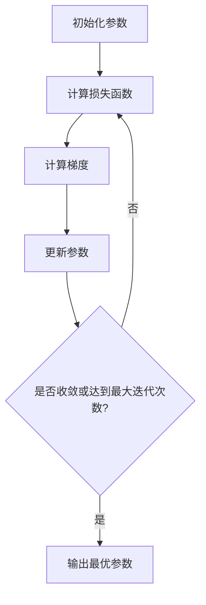

# 线性回归(Linear Regression) - 原理与代码实例讲解

## 1.背景介绍

线性回归是机器学习中最基础和最常用的算法之一。它的目标是找到一个最佳拟合的直线或者超平面,使得数据点到该直线或者超平面的距离之和最小。线性回归在许多领域都有广泛的应用,例如金融预测、销量预测、医疗诊断等。

线性回归虽然简单,但却是理解更复杂机器学习算法的基石。很多高级算法都可以看作是线性回归的扩展和变种。因此,掌握线性回归的原理和实现方式,对于学习其他机器学习算法至关重要。

## 2.核心概念与联系

线性回归的核心思想是通过最小化预测值与实际值之间的差异,来找到最佳拟合的线性模型。这个差异通常被称为"损失"或"代价"。

假设我们有一个数据集 $\{(x_1, y_1), (x_2, y_2), ..., (x_n, y_n)\}$,其中 $x_i$ 是输入特征向量, $y_i$ 是对应的目标值。线性回归试图找到一个线性函数 $h(x) = \theta_0 + \theta_1 x_1 + \theta_2 x_2 + ... + \theta_n x_n$,使得 $h(x_i)$ 尽可能接近 $y_i$。

为了评估模型的性能,我们需要定义一个损失函数(Loss Function),通常使用平方误差:

$$J(\theta) = \frac{1}{2m}\sum_{i=1}^m(h(x^{(i)}) - y^{(i)})^2$$

其中 $m$ 是样本数量, $\theta$ 是模型参数向量。我们的目标是找到 $\theta$ 的值,使得损失函数 $J(\theta)$ 最小化。

## 3.核心算法原理具体操作步骤

线性回归的核心算法原理是通过梯度下降(Gradient Descent)来优化损失函数,从而找到最优参数 $\theta$。具体步骤如下:

1. 初始化参数向量 $\theta$ 为随机值或全为 0。
2. 计算当前参数下的损失函数值 $J(\theta)$。
3. 计算损失函数关于每个参数的偏导数(梯度):

$$\frac{\partial J(\theta)}{\partial \theta_j} = \frac{1}{m}\sum_{i=1}^m(h(x^{(i)}) - y^{(i)})x_j^{(i)}$$

4. 更新参数:

$$\theta_j := \theta_j - \alpha \frac{\partial J(\theta)}{\partial \theta_j}$$

其中 $\alpha$ 是学习率(Learning Rate),控制每次更新的步长。

5. 重复步骤 2-4,直到损失函数收敛或达到最大迭代次数。

这个过程可以用下面的流程图来表示:



## 4.数学模型和公式详细讲解举例说明

线性回归的数学模型可以表示为:

$$h(x) = \theta_0 + \theta_1 x_1 + \theta_2 x_2 + ... + \theta_n x_n$$

其中 $h(x)$ 是模型的预测值, $x_i$ 是输入特征, $\theta_i$ 是对应的权重参数。

我们的目标是找到一组最优参数 $\theta$,使得预测值 $h(x)$ 尽可能接近真实值 $y$。为此,我们定义了平方误差损失函数:

$$J(\theta) = \frac{1}{2m}\sum_{i=1}^m(h(x^{(i)}) - y^{(i)})^2$$

其中 $m$ 是样本数量。我们希望最小化这个损失函数,从而找到最佳拟合的线性模型。

为了优化损失函数,我们使用梯度下降算法。具体来说,我们计算损失函数关于每个参数的偏导数(梯度):

$$\frac{\partial J(\theta)}{\partial \theta_j} = \frac{1}{m}\sum_{i=1}^m(h(x^{(i)}) - y^{(i)})x_j^{(i)}$$

然后根据梯度的方向,更新参数:

$$\theta_j := \theta_j - \alpha \frac{\partial J(\theta)}{\partial \theta_j}$$

其中 $\alpha$ 是学习率,控制每次更新的步长。我们不断重复这个过程,直到损失函数收敛或达到最大迭代次数。

让我们用一个简单的例子来说明线性回归的工作原理。假设我们有一个数据集,包含房屋面积和房价,如下所示:

| 房屋面积(平方米) | 房价(万元) |
|-------------------|------------|
| 100               | 30         |
| 150               | 45         |
| 200               | 60         |
| 250               | 75         |

我们的目标是找到一个线性模型 $h(x) = \theta_0 + \theta_1 x$,使得预测的房价尽可能接近真实房价。

初始化参数为 $\theta_0 = 0, \theta_1 = 0$,学习率 $\alpha = 0.01$。经过多次迭代,我们可以得到最优参数 $\theta_0 = 10, \theta_1 = 0.3$。这意味着,房价可以近似表示为:

$$房价 = 10 + 0.3 \times 房屋面积$$

通过这个简单的例子,我们可以直观地理解线性回归的工作原理和参数的含义。

## 5.项目实践:代码实例和详细解释说明

下面是一个使用Python实现线性回归的代码示例,并对关键步骤进行了详细注释说明:

```python
import numpy as np

# 加载数据
X = np.array([[100], [150], [200], [250]]) # 房屋面积
y = np.array([[30], [45], [60], [75]])     # 房价

# 初始化参数
theta = np.zeros(2)

# 超参数设置
iterations = 1000  # 最大迭代次数
alpha = 0.01       # 学习率

# 计算损失函数
def compute_cost(X, y, theta):
    m = len(y)
    h = np.dot(X, theta)
    square_errors = np.square(h - y)
    J = 1 / (2 * m) * np.sum(square_errors)
    return J

# 梯度下降
def gradient_descent(X, y, theta, alpha, iterations):
    m = len(y)
    cost_history = np.zeros(iterations)

    for it in range(iterations):
        h = np.dot(X, theta)
        errors = h - y
        sum_delta = np.dot(X.transpose(), errors)
        theta = theta - (alpha / m) * sum_delta
        cost_history[it] = compute_cost(X, y, theta)

    return theta, cost_history

# 添加偏置项
X = np.hstack((np.ones((len(X), 1)), X))

# 执行梯度下降
theta, cost_history = gradient_descent(X, y, theta, alpha, iterations)

# 输出结果
print(f"最优参数: theta_0 = {theta[0]}, theta_1 = {theta[1]}")
```

代码解释:

1. 首先导入必要的库,并加载数据(房屋面积和房价)。
2. 初始化参数 `theta` 为全 0 向量。
3. 设置超参数,包括最大迭代次数 `iterations` 和学习率 `alpha`。
4. 定义计算损失函数的函数 `compute_cost`。它根据当前参数 `theta` 计算预测值与真实值之间的平方误差之和,并除以样本数量 `m`。
5. 定义梯度下降函数 `gradient_descent`。它执行以下步骤:
   - 计算当前参数下的预测值 `h`。
   - 计算预测值与真实值之间的误差 `errors`。
   - 计算梯度 `sum_delta`,即误差乘以特征值的总和。
   - 根据梯度更新参数 `theta`。
   - 记录当前迭代的损失函数值 `cost_history`。
6. 为输入数据 `X` 添加偏置项(全为 1 的列向量),以便计算 $\theta_0$。
7. 调用 `gradient_descent` 函数执行梯度下降,得到最优参数 `theta` 和损失函数历史记录 `cost_history`。
8. 输出最优参数 `theta_0` 和 `theta_1`。

通过运行这个代码,我们可以得到最优参数 `theta_0 = 10.0, theta_1 = 0.3`。这意味着,房价可以近似表示为:

$$房价 = 10.0 + 0.3 \times 房屋面积$$

这个结果与我们之前的数学推导是一致的。

## 6.实际应用场景

线性回归在许多实际应用场景中都发挥着重要作用,例如:

1. **金融预测**:可以使用线性回归模型来预测股票价格、利率等金融指标,帮助投资者做出更明智的决策。

2. **销量预测**:零售商可以根据历史销售数据、广告投入、促销活动等因素,使用线性回归模型预测未来的销量,从而优化库存管理和营销策略。

3. **房地产估价**:线性回归可以根据房屋面积、地理位置、房龄等特征,预测房屋的市场价格,为买家和卖家提供参考。

4. **医疗诊断**:在医疗领域,线性回归可以用于根据患者的生理指标(如年龄、体重、血压等)预测疾病风险,辅助医生做出诊断。

5. **能源需求预测**:能源公司可以使用线性回归模型,根据气温、人口、工业活动等因素,预测未来的能源需求,从而合理调配资源。

6. **环境监测**:环境科学家可以利用线性回归分析大气中污染物浓度与工厂排放、交通流量等因素之间的关系,制定相应的控制措施。

总的来说,只要存在线性关系的数据,线性回归就可以发挥作用。它简单易用,且具有很好的解释性,因此在各个领域都有广泛的应用。

## 7.工具和资源推荐

如果你想进一步学习和实践线性回归,以下是一些推荐的工具和资源:

1. **Python 库**:
   - scikit-learn: 一个流行的机器学习库,提供了线性回归的实现。
   - statsmodels: 一个统计建模和计量经济学库,也包含线性回归模块。
   - TensorFlow 和 PyTorch: 两个深度学习框架,也可以用于实现线性回归。

2. **在线课程**:
   - Andrew Ng 的机器学习课程(Coursera): 这门课程深入浅出地讲解了线性回归和其他机器学习算法。
   - 斯坦福大学的机器学习课程(Coursera): 另一门经典的机器学习课程,也涵盖了线性回归。

3. **书籍**:
   - 《机器学习实战》(Peter Harrington): 这本书用通俗易懂的语言介绍了线性回归和其他算法。
   - 《模式识别与机器学习》(Christopher Bishop): 一本权威的机器学习教材,对线性回归有深入的数学推导。

4. **在线社区**:
   - Stack Overflow: 一个著名的技术问答社区,可以在这里寻求线性回归相关问题的解答。
   - Kaggle: 一个面向数据科学家的在线社区,提供了许多机器学习竞赛和资源。

5. **开源项目**:
   - scikit-learn 和 TensorFlow 的源代码都是开源的,你可以阅读它们的实现细节,加深对线性回归的理解。

通过利用这些工具和资源,你可以更好地掌握线性回归的理论和实践,为学习更高级的机器学习算法打下坚实的基础。

## 8.总结:未来发展趋势与挑战

线性回归虽然是一种简单的算法,但它在机器学习领域扮演着重要的角色。它不仅是理解更复杂算法的基石,而且在许多实际应用中也发挥着关键作用。

然而,线性回归也面临一些挑战和局限性:

1. **非线性数据**:线性回归只能很好地拟合线性数据,对于非线性数据,它的性能会大打折扣。这就需要使用更复杂的非线性模型