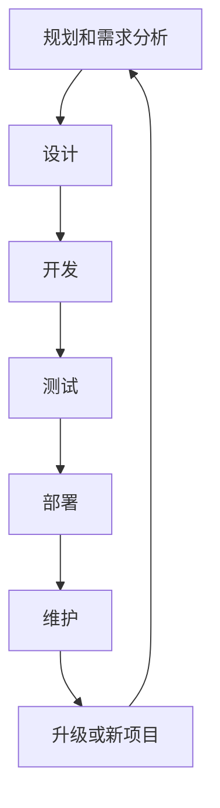
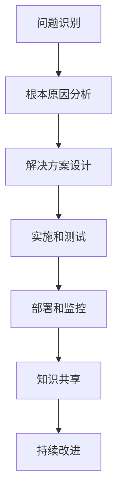

# 组织和指导项目的开发、测试、维护、升级、更新，解决开发中的技术问题

## 1.背景介绍

在当今快节奏的软件开发环境中，有效地组织和指导项目的各个阶段至关重要。从项目的规划和启动到开发、测试、部署和维护,每个阶段都需要精心设计和管理。同时,在开发过程中也会遇到各种技术挑战,需要及时有效地解决。本文将探讨如何高效地组织和指导项目的全生命周期,并分享解决开发中技术问题的策略和最佳实践。

## 2.核心概念与联系

### 2.1 项目生命周期

软件项目的生命周期通常包括以下阶段:

1. **规划和需求分析**: 确定项目目标、范围、时间线和资源需求。
2. **设计**: 设计系统架构、数据库模式和用户界面。
3. **开发**: 编写代码并实现功能。
4. **测试**: 执行单元测试、集成测试和系统测试,以确保质量。
5. **部署**: 将软件系统部署到生产环境。
6. **维护**: 修复缺陷、应对变更需求并持续优化系统。

这些阶段相互关联,需要有效的协调和管理。

### 2.2 项目管理

项目管理是一个涵盖了规划、组织、执行和控制项目活动的过程。它包括以下核心概念:

- **范围管理**: 确定和控制项目的工作范围。
- **时间管理**: 制定项目时间表并跟踪进度。
- **成本管理**: 估算和控制项目成本。
- **质量管理**: 确保项目交付物满足质量标准。
- **资源管理**: 有效分配和利用项目资源。
- **风险管理**: 识别、评估和缓解项目风险。
- **沟通管理**: 确保项目相关方之间的有效沟通。

有效的项目管理对于确保项目按时、按质、按预算交付至关重要。

### 2.3 技术问题解决

在软件开发过程中,开发人员经常会遇到各种技术挑战和问题。解决这些问题需要采用系统的方法,包括:

- **问题识别**: 准确识别和描述问题。
- **根本原因分析**: 找出问题的根本原因。
- **解决方案设计**: 设计和评估可能的解决方案。
- **实施和测试**: 实施解决方案并进行测试和验证。
- **知识共享**: 记录和分享解决问题的经验教训。

有效的技术问题解决有助于提高开发效率,确保系统质量,并促进团队的持续学习和成长。

## 3.核心算法原理具体操作步骤

### 3.1 项目生命周期管理

管理软件项目的生命周期涉及以下关键步骤:

1. **规划和需求分析**
   - 与利益相关方讨论并确定项目目标和范围。
   - 收集和分析用户需求,制定需求规格说明书。
   - 评估技术可行性并选择合适的技术栈。
   - 制定项目时间表、成本估算和资源分配计划。

2. **设计**
   - 设计系统架构,包括模块划分、接口定义和数据流程。
   - 设计数据库模式,确保数据完整性和性能。
   - 设计用户界面原型,确保良好的用户体验。
   - 进行设计评审,确保设计质量和可维护性。

3. **开发**
   - 根据设计实现代码,遵循编码标准和最佳实践。
   - 进行单元测试,确保代码质量。
   - 进行代码审查,提高代码质量和一致性。
   - 集成各个模块,解决集成问题。

4. **测试**
   - 制定测试计划,包括测试用例、测试环境和测试策略。
   - 执行功能测试、性能测试、安全测试等各种测试类型。
   - 记录和跟踪缺陷,确保缺陷得到及时修复。
   - 进行回归测试,确保新功能不影响现有功能。

5. **部署**
   - 准备生产环境,包括硬件、软件和网络配置。
   - 执行部署计划,将系统部署到生产环境。
   - 监控系统运行状况,确保稳定性和可用性。

6. **维护**
   - 响应用户反馈,修复缺陷和安全漏洞。
   - 根据变更需求进行系统升级和优化。
   - 持续监控系统性能,进行性能调优。
   - 执行数据备份和灾难恢复计划,确保数据安全。

在整个生命周期中,需要持续进行风险管理、质量管理、沟通管理和变更管理,以确保项目的顺利进行。



### 3.2 技术问题解决流程

解决开发过程中遇到的技术问题需要遵循以下步骤:

1. **问题识别**
   - 准确描述问题,包括问题症状、发生环境和影响范围。
   - 收集相关日志、错误消息和其他诊断信息。
   - 尝试重现问题,以便更好地理解和分析。

2. **根本原因分析**
   - 审查代码、配置和系统日志,寻找潜在的原因。
   - 使用调试工具和技术,如断点调试、日志记录和性能分析。
   - 分析问题的上下文和相关系统交互。
   - 确定问题的根本原因,而不是仅解决症状。

3. **解决方案设计**
   - 根据问题的根本原因,设计可能的解决方案。
   - 评估每个解决方案的优缺点,包括实现难度、风险和影响范围。
   - 选择最佳解决方案,并制定实施计划。

4. **实施和测试**
   - 实施选定的解决方案,包括代码修改、配置更改或系统升级。
   - 进行单元测试和集成测试,验证解决方案的正确性。
   - 在测试环境中进行全面测试,确保不会引入新的问题。

5. **部署和监控**
   - 将解决方案部署到生产环境,并密切监控系统运行状况。
   - 收集用户反馈,确保问题得到彻底解决。
   - 记录解决过程和经验教训,以供将来参考。

6. **知识共享**
   - 在团队内部分享解决问题的经验和教训。
   - 更新技术文档和知识库,以便其他开发人员可以学习和参考。
   - 考虑将解决方案整合到代码库或自动化流程中,以防止类似问题再次发生。



## 4.数学模型和公式详细讲解举例说明

在软件开发过程中,数学模型和公式在各个领域都有广泛应用,例如算法分析、性能优化、数据处理和机器学习等。以下是一些常见的数学模型和公式,以及它们在软件开发中的应用示例。

### 4.1 算法时间复杂度分析

时间复杂度是衡量算法效率的重要指标。它描述了算法执行时间与输入数据大小之间的关系。常见的时间复杂度表示法包括:

- $O(1)$ (常数时间复杂度): 算法的执行时间与输入数据大小无关。
- $O(n)$ (线性时间复杂度): 算法的执行时间与输入数据大小成正比。
- $O(n^2)$ (平方时间复杂度): 算法的执行时间与输入数据大小的平方成正比。
- $O(log n)$ (对数时间复杂度): 算法的执行时间与输入数据大小的对数成正比。

例如,在排序算法中,冒泡排序的时间复杂度为 $O(n^2)$,而快速排序的平均时间复杂度为 $O(n log n)$。选择合适的算法可以显著提高程序的性能。

### 4.2 数据结构和空间复杂度分析

空间复杂度描述了算法或数据结构所需的存储空间与输入数据大小之间的关系。常见的空间复杂度表示法包括:

- $O(1)$ (常数空间复杂度): 所需存储空间与输入数据大小无关。
- $O(n)$ (线性空间复杂度): 所需存储空间与输入数据大小成正比。

例如,在实现链表时,插入和删除操作的时间复杂度为 $O(1)$,但空间复杂度为 $O(n)$,因为需要存储每个节点的数据和指针。而在实现数组时,插入和删除操作的时间复杂度为 $O(n)$,但空间复杂度为 $O(1)$,因为数组的大小是固定的。选择合适的数据结构可以优化程序的空间利用率和性能。

### 4.3 概率模型和统计分析

在软件开发中,概率模型和统计分析被广泛应用于各种领域,如机器学习、数据挖掘、测试覆盖率分析和可靠性工程等。

例如,在机器学习中,贝叶斯定理被广泛应用于分类和预测任务。贝叶斯定理描述了在给定新证据的情况下,如何更新先验概率以获得后验概率:

$$P(A|B) = \frac{P(B|A)P(A)}{P(B)}$$

其中,$ P(A|B) $表示在已知事件 B 发生的情况下,事件 A 发生的条件概率;$ P(B|A) $表示在已知事件 A 发生的情况下,事件 B 发生的条件概率;$ P(A) $和 $ P(B) $分别表示事件 A 和事件 B 的先验概率。

在软件测试中,统计模型可用于估计测试覆盖率和缺陷密度。例如,可以使用超几何分布模型来估计剩余缺陷数量:

$$E(x) = \frac{ND}{N+D}$$

其中,$ E(x) $表示预期剩余缺陷数量,$ N $表示已发现缺陷数量,$ D $表示已执行的测试用例数量。

通过应用适当的数学模型和统计分析,开发人员可以更好地理解和优化软件系统的性能、质量和可靠性。

## 5.项目实践:代码实例和详细解释说明

在本节中,我们将通过一个简单的项目实例来演示如何组织和指导项目的开发、测试、维护、升级和更新,以及如何解决开发过程中的技术问题。

### 5.1 项目概述

假设我们要开发一个简单的在线商店应用程序,允许用户浏览和购买商品。该应用程序包括以下主要功能:

- 用户注册和登录
- 浏览和搜索商品
- 添加商品到购物车
- 结账和支付订单
- 查看订单历史记录

### 5.2 项目规划和需求分析

在项目规划阶段,我们需要确定项目目标、范围、时间线和资源需求。我们还需要收集和分析用户需求,制定需求规格说明书。

```python
# 需求规格说明书示例
class Requirement:
    def __init__(self, id, description, priority):
        self.id = id
        self.description = description
        self.priority = priority

requirements = [
    Requirement(1, "用户应该能够注册新账户", "高"),
    Requirement(2, "用户应该能够登录和注销", "高"),
    Requirement(3, "用户应该能够浏览和搜索商品", "高"),
    # ... 其他需求
]
```

### 5.3 设计

在设计阶段,我们需要设计系统架构、数据库模式和用户界面。以下是一个简单的系统架构设计示例:

```mermaid
graph TD
    A[客户端] -->|HTTP请求| B[Web服务器]
    B --> C[应用服务器]
    C --> D[数据库]
    C --> E[缓存服务器]
    C --> F[消息队列