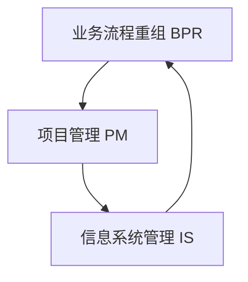
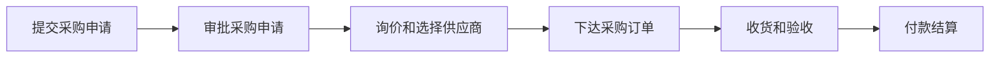

# 结合业务流程重组、项目管理实施集成信息系统管理

## 1. 背景介绍

在当今瞬息万变的商业环境中,企业面临着前所未有的挑战和机遇。为了在激烈的市场竞争中保持优势,企业需要不断优化业务流程,提高运营效率和质量。同时,信息技术的快速发展为企业的转型升级提供了强大的支撑。如何有效地将业务流程重组(BPR)、项目管理(PM)与信息系统(IS)整合,已成为企业实现可持续发展的关键。

本文将深入探讨业务流程重组、项目管理和信息系统管理的核心概念,阐述它们之间的内在联系,并提出一种结合BPR、PM和IS的综合管理方法。通过对核心算法原理、数学模型、代码实例等的详细讲解,帮助读者全面理解如何在实践中应用该方法。此外,本文还将分析该方法在实际应用场景中的价值,推荐相关工具和资源,展望未来发展趋势与挑战,并解答常见问题。

### 1.1 业务流程重组(BPR)概述

业务流程重组是指对企业的业务流程进行根本性的再思考和彻底性的重新设计,以实现在成本、质量、服务和速度等方面的显著改善。BPR的目标是打破传统的部门界限和层级结构,围绕核心业务流程重新组织企业资源,从而提高企业的整体效益。

### 1.2 项目管理(PM)概述 

项目管理是指在项目活动中运用专门的知识、技能、工具和方法,以满足项目的需求。它包括对项目的整个生命周期进行管理,涵盖项目启动、规划、执行、监控和收尾等各个阶段。项目管理的核心是通过对范围、进度、成本、质量等要素的控制,确保项目按时、按预算、高质量地完成。

### 1.3 信息系统(IS)管理概述

信息系统管理是指对组织的信息资源和信息技术进行有效的规划、组织、领导和控制,以支持组织的战略目标和业务运作。它涉及信息系统的全生命周期管理,包括需求分析、设计、开发、实施、运维和优化等环节。信息系统管理的目的是最大限度地发挥信息技术的价值,提高组织的运营效率和竞争力。

## 2. 核心概念与联系

### 2.1 BPR、PM和IS的关系

业务流程重组、项目管理和信息系统管理三者之间存在着紧密的联系和相互影响。BPR为企业的转型变革提供了方向和动力,PM为变革的实施提供了有效的管理手段,而IS则为变革提供了技术支撑和实现路径。

- BPR是驱动力,为企业的变革指明方向,提出新的业务流程和运作模式。
- PM是保障,为BPR的实施提供科学的管理方法,确保变革项目的成功交付。
- IS是支撑,为BPR提供必要的技术手段和平台,实现流程的自动化和优化。

三者相辅相成,缺一不可。只有将它们有机结合,形成合力,才能真正实现企业的数字化转型和持续发展。

### 2.2 业务流程与信息系统的融合

在数字化时代,业务流程与信息系统的融合已成为大势所趋。一方面,业务流程的优化需要借助信息技术的力量;另一方面,信息系统的建设也要以业务需求为导向。两者相互依存,相互促进。

业务流程是信息系统的基础和灵魂。信息系统的功能设计、数据结构、业务规则等,都要根植于业务流程。只有深刻理解业务流程,才能开发出真正满足企业需求、支撑业务运作的信息系统。

同时,信息系统也在重塑着业务流程。通过信息技术手段,可以实现业务流程的自动化、标准化和智能化,从而大幅提升效率和质量。信息系统还可以打破部门壁垒,实现端到端的流程贯通,促进组织的协同与敏捷。

因此,在集成管理中,必须统筹考虑业务流程和信息系统,将两者高度融合,形成良性互动。这需要业务部门和IT部门的紧密合作,需要管理者具备复合型的知识和能力。

## 3. 核心算法原理具体操作步骤

本节将介绍一种结合BPR、PM和IS的集成管理方法的核心算法原理,并给出具体的操作步骤。该算法借鉴了业务流程管理(BPM)、敏捷项目管理和企业架构(EA)等领域的最佳实践,旨在实现业务与IT的全面融合与协同。

### 3.1 算法原理

该算法的核心思想是将业务流程作为管理的基本单元,以项目为载体,以信息系统为支撑,实现端到端的流程优化和价值交付。具体包括以下原理:

1. 流程驱动原理:以业务流程为核心,从端到端的视角出发,对流程进行分析、设计、实施和优化。通过流程的梳理和再造,识别问题和改进机会,实现业务的敏捷和创新。

2. 项目管理原理:采用敏捷项目管理方法,快速迭代,增量交付。将大型项目分解为多个小的、可管理的迭代,每个迭代都交付可用的业务价值。同时,注重团队协作和沟通,鼓励变更和反馈,提高项目的灵活性和成功率。

3. 架构驱动原理:以企业架构为指导,统筹业务、数据、应用和技术等各层面。通过架构规划和治理,保证业务与IT的战略一致性,实现全局优化和资源共享。同时,遵循组件化、服务化、标准化的原则,提高系统的可复用性和互操作性。

4. 持续改进原理:建立持续改进的文化和机制,鼓励创新和学习。通过绩效评估和反馈,不断发现问题和改进机会,优化流程和系统。同时,注重知识管理和经验传承,促进组织的学习和成长。

### 3.2 操作步骤

基于上述原理,该算法的具体操作步骤如下:

1. 业务流程分析:
   - 识别和划分业务领域和核心业务流程
   - 绘制AS-IS流程图,分析现状流程的问题和瓶颈
   - 基于战略目标和业务需求,设计TO-BE流程,明确优化方向
2. 项目策划:
   - 根据流程优化方案,识别和定义项目(包括BPR项目、IT项目等) 
   - 评估项目的价值、风险和可行性,确定项目优先级
   - 制定项目章程,明确项目目标、范围、里程碑和交付物
3. 迭代执行:
   - 采用Scrum等敏捷方法,组建跨职能团队
   - 将项目分解为多个迭代,每个迭代确定Sprint目标和Backlog
   - 通过每日站会、评审会等,跟踪项目进展,管理变更和风险
   - 每个迭代结束时,交付可用的业务价值,并进行回顾和改进
4. 架构设计:
   - 基于流程和项目需求,设计业务架构、数据架构和应用架构
   - 识别和定义关键的业务组件、数据实体和应用服务
   - 明确各架构之间的关系和依赖,确保架构的一致性和可行性
   - 制定架构原则和标准,指导后续的系统开发和集成
5. 系统开发:
   - 基于架构设计,进行需求分析和系统设计
   - 采用敏捷开发方法,快速迭代,增量交付
   - 注重代码质量和可维护性,遵循编码规范和最佳实践
   - 通过自动化测试和持续集成,保证系统的稳定性和可靠性
6. 流程实施:
   - 基于优化后的流程,配置和实施流程管理平台(如BPMS)
   - 定义流程模型、业务规则和表单等,实现流程的自动化
   - 与相关系统进行集成,确保数据的一致性和实时性
   - 对业务用户进行培训和变更管理,确保流程的顺利运行
7. 持续改进:
   - 建立流程和系统的监控和绩效评估机制,收集数据和反馈
   - 定期进行流程审计和系统评估,发现问题和改进机会
   - 优化流程和系统,提高效率和质量,支撑业务创新
   - 总结经验教训,更新知识库,促进组织学习和持续改进

以上步骤并非严格的线性序列,而是相互交织、循环迭代的。在实践中,需要根据具体情况灵活调整和应用。

## 4. 数学模型和公式详细讲解举例说明

在集成管理中,可以运用各种数学模型和方法,如运筹学、统计学、图论等,来支撑流程优化、项目管理和系统开发。本节将重点介绍基于图论的业务流程建模方法,并给出详细的公式讲解和举例说明。

### 4.1 流程建模的数学基础

业务流程可以用有向图$G=(V, E)$来建模,其中:

- $V$表示流程节点的集合,每个节点代表一个流程步骤或活动
- $E$表示流程边的集合,每条边代表节点之间的顺序关系或依赖关系

例如,考虑一个简单的采购流程,包括以下步骤:

1. 提交采购申请
2. 审批采购申请
3. 询价和选择供应商
4. 下达采购订单
5. 收货和验收
6. 付款结算

该流程可以用下面的有向图表示:

### 4.2 流程分析的关键指标

基于图模型,可以定义一些关键指标来分析流程的特性和性能,如:

1. 流程长度:从开始节点到结束节点的最长路径长度,反映流程的复杂度和时间跨度。
   
   设$d(i, j)$为节点$i$到节点$j$的最短距离,则流程长度$L$为:

   $L = \max_{i, j \in V} d(i, j)$

2. 流程宽度:流程中并行分支的最大数量,反映流程的并发度和资源占用。
   
   设$B$为流程的所有并行分支的集合,则流程宽度$W$为:

   $W = \max_{b \in B} |b|$

3. 流程效率:实际处理时间与理论处理时间之比,反映流程的执行效率和时间利用率。
   
   设$T_a$为实际处理时间,$T_t$为理论处理时间,则流程效率$E$为:

   $E = \frac{T_t}{T_a} \times 100\%$

4. 流程柔性:应对变更和异常的能力,反映流程的适应性和灵活性。
   
   设$f(c)$为流程对变更$c$的适应度函数,则流程柔性$F$为:

   $F = \int_{c \in C} f(c) dc$

其中,$C$为所有可能的变更的集合。

### 4.3 流程优化的数学方法

在流程优化中,可以运用一些数学方法来寻找最优解,如:

1. 最短路径算法:在流程图中,寻找从起点到终点的最短路径,以优化流程的时间和成本。常用的算法有Dijkstra算法、Floyd算法等。

2. 关键路径算法:在流程图中,寻找决定整个流程完成时间的关键路径,以优化流程的瓶颈和资源配置。常用的算法有CPM(关键路径法)、PERT(计划评审技术)等。

3. 整数规划:将流程优化问题建模为整数规划模型,如最大流问题、最小割问题等,然后