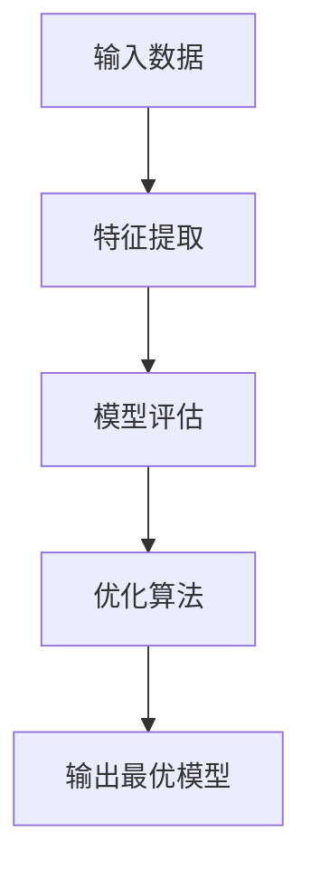

# 自动化模型选择在高性能计算中的应用

## 1.背景介绍

在当今的数据密集型时代,高性能计算(HPC)已成为各行业的关键技术,广泛应用于科学计算、人工智能、金融分析等领域。然而,为了充分利用昂贵的HPC资源,选择最佳的数学模型和算法对于获得高效、准确的计算结果至关重要。传统上,这一过程需要人工专家进行繁琐的试错,耗费大量时间和精力。因此,自动化模型选择(Automated Model Selection, AMS)应运而生,旨在通过智能算法自动选择最优模型,提高计算效率和质量。

## 2.核心概念与联系

### 2.1 自动化模型选择(AMS)

自动化模型选择是一种智能优化技术,通过自动化流程选择最佳的数学模型或算法,以解决特定的计算问题。AMS系统通常包括以下几个核心组件:

- **模型库(Model Repository)**: 存储可供选择的多种数学模型和算法。
- **特征提取器(Feature Extractor)**: 从输入数据中提取相关特征,用于模型评估和选择。
- **模型评估器(Model Evaluator)**: 根据特定的评估指标(如准确性、效率等)对模型进行评分。
- **优化算法(Optimization Algorithm)**: 基于模型评分,智能搜索最优模型。
- **元模型(Meta-Model)**: 一种机器学习模型,通过历史数据预测新问题的最优模型。

### 2.2 AMS与HPC的关系

在HPC环境中,AMS可以极大地提高计算效率和质量:

- **资源利用率**: 通过选择最优算法,避免浪费昂贵的计算资源。
- **准确性**: 选择适当的数学模型,确保计算结果的精确性。
- **自动化**: 减轻人工专家的工作负担,加快计算流程。

此外,HPC系统的高性能计算能力也为AMS提供了强大的支持,使其能够快速评估和比较大量模型。

## 3.核心算法原理具体操作步骤

自动化模型选择通常遵循以下步骤:



1. **特征提取**: 从输入数据中提取相关特征,这些特征将用于后续的模型评估。常用的特征提取方法包括统计特征(均值、方差等)、频域特征(傅里叶变换等)和结构特征(拓扑、图论特征等)。

2. **模型评估**: 对模型库中的每个模型进行评估,通常使用交叉验证等技术估计模型在新数据上的表现。评估指标可以是准确性(如均方根误差)、效率(如计算时间)或两者的加权组合。

3. **优化算法**: 基于模型评分,使用优化算法搜索最优模型。常用的优化算法包括:
   - 启发式搜索算法:如遗传算法、模拟退火等。
   - 序列模型构建:如Bayesian优化、高斯过程等。
   - 其他技术:如多臂老虎机、在线学习等。

4. **输出最优模型**: 将搜索到的最优模型输出,应用于实际计算问题。

## 4.数学模型和公式详细讲解举例说明

在自动化模型选择中,常用的数学模型和公式包括:

### 4.1 模型评估指标

#### 4.1.1 均方根误差(RMSE)

均方根误差是衡量模型预测精度的常用指标,定义为:

$$RMSE = \sqrt{\frac{1}{n}\sum_{i=1}^{n}(y_i - \hat{y_i})^2}$$

其中$y_i$是真实值,$\hat{y_i}$是模型预测值,n是样本数量。RMSE值越小,模型精度越高。

#### 4.1.2 计算时间

计算时间反映了模型的效率,对于HPC应用尤为重要。它可以直接测量,或通过大O符号表示算法的时间复杂度。

### 4.2 优化算法

#### 4.2.1 贝叶斯优化

贝叶斯优化是一种常用的序列模型构建算法,通过构建代理模型(如高斯过程)逐步优化目标函数。在每一步,它会根据已有的观测值,计算新的最优探索点:

$$x_{t+1} = \underset{x \in \mathcal{X}}{\operatorname{argmax}}\, \alpha(x; D_t)$$

其中$\alpha$是一个获取量(acquisition function),用于权衡探索(exploration)和利用(exploitation),$D_t$是已观测的数据集。

#### 4.2.2 多臂老虎机

多臂老虎机是一种在线学习算法,通过不断尝试不同的模型(臂),并根据反馈调整选择策略,逐步收敛到最优解。假设有K个模型,在时间t的期望回报为:

$$\mu_k(t) = \frac{1}{T_k(t)}\sum_{s=1}^{T_k(t)}r_k(s)$$

其中$T_k(t)$是选择模型k的次数,$r_k(s)$是第s次选择模型k时的回报。常用的策略包括$\epsilon$-贪婪、上置信界(UCB)等。

### 4.3 示例:线性回归模型选择

假设我们有一个线性回归问题,需要从多种回归算法(如普通最小二乘法、岭回归、LASSO等)中选择最优模型。我们可以使用均方根误差(RMSE)作为评估指标,并采用贝叶斯优化算法进行模型搜索。

具体步骤如下:

1. 构建模型库,包含多种线性回归算法。
2. 从训练数据中提取统计特征,如变量个数、数据规模等。
3. 定义目标函数:最小化交叉验证中的RMSE。
4. 使用贝叶斯优化算法,根据特征和历史评估结果,选择新的模型进行评估。
5. 重复第4步,直到满足收敛条件或达到预算。
6. 输出具有最小RMSE的模型作为最优解。

通过上述过程,我们可以自动选择出性能最佳的线性回归模型,而无需人工逐一尝试和比较。

## 5.项目实践:代码实例和详细解释说明

为了更好地理解自动化模型选择,我们以Python的SMAC库为例,展示如何在实际项目中应用AMS。SMAC(Sequential Model-based Algorithm Configuration)是一个通用的算法配置系统,支持贝叶斯优化和其他高级技术。

### 5.1 安装SMAC

首先,我们需要安装SMAC库及其依赖项:

```bash
pip install smac
```

### 5.2 定义问题空间

接下来,我们定义需要优化的问题空间,包括算法的参数范围和类型。以SVM分类器为例:

```python
import numpy as np
from smac.configspace import ConfigurationSpace
from ConfigSpace.hyperparameters import UniformFloatHyperparameter, CategoricalHyperparameter

cs = ConfigurationSpace()

# 定义SVM的kernel参数
kernel = CategoricalHyperparameter("kernel", ["rbf", "poly"], default_value="rbf")
cs.add_hyperparameter(kernel)

# 定义SVM的C参数
C = UniformFloatHyperparameter("C", 0.001, 1000.0, default_value=1.0, log=True)
cs.add_hyperparameter(C)

# 定义SVM的gamma参数
gamma = UniformFloatHyperparameter("gamma", 0.0001, 8, default_value=0.1, log=True)
cs.add_hyperparameter(gamma)
```

### 5.3 定义目标函数

目标函数是我们需要最小化的评估指标,例如交叉验证中的错误率:

```python
from smac.tae import StatusType

def svm_from_cfg(cfg, seed):
    # 从配置中构建SVM模型
    ...
    return svm

def svm_error(cfg, seed, X_train, Y_train, X_valid, Y_valid):
    svm = svm_from_cfg(cfg, seed)
    svm.fit(X_train, Y_train)
    error = 1 - svm.score(X_valid, Y_valid)
    return error

def objective_function(cfg, seed, X_train, Y_train, X_valid, Y_valid):
    error = svm_error(cfg, seed, X_train, Y_train, X_valid, Y_valid)
    status = StatusType.OK
    cost = error
    return status, cost, 0
```

### 5.4 运行SMAC优化

最后,我们运行SMAC算法进行优化:

```python
from smac.facade.smac_facade import SMAC

optimizer = SMAC(scenario=scenario, rng=np.random.RandomState(42))

optimizer.optimize()

incumbent = optimizer.solver.incumbent
print(f"Best configuration found: {incumbent}")
```

在优化过程中,SMAC会自动探索配置空间,评估每个配置的性能,并逐步收敛到最优解。通过这种方式,我们可以自动发现SVM分类器的最佳参数组合,而无需手动尝试所有可能的组合。

上述示例只是自动化模型选择在机器学习中的一个应用场景。在HPC领域,AMS可以应用于更广泛的问题,如优化数值求解器、选择最佳并行策略等,从而充分利用昂贵的计算资源,提高计算效率和质量。

## 6.实际应用场景

自动化模型选择已被广泛应用于多个领域,展现出巨大的实用价值:

1. **科学计算**:在计算物理、化学、生物等领域,AMS可以自动选择最佳的数值求解器、离散化方法等,加速科学模拟和计算。

2. **人工智能**:在机器学习任务中,AMS可以自动搜索最优的算法和超参数,提高模型的准确性和泛化能力。

3. **优化问题**:对于复杂的组合优化、规划等问题,AMS可以智能选择高效的求解器和启发式算法。

4. **金融分析**:在金融建模和风险管理中,AMS可以自动选择合适的统计模型和量化策略。

5. **软件工程**:AMS可以应用于自动化软件配置、算法选择等,提高软件性能和质量。

总的来说,自动化模型选择为各种计算密集型应用提供了一种智能优化解决方案,有助于充分发挥HPC系统的计算能力。

## 7.工具和资源推荐

为了方便实践自动化模型选择,这里推荐一些流行的开源工具和资源:

1. **SMAC**: 一个通用的算法配置系统,支持贝叶斯优化和其他高级技术。
2. **Auto-Sklearn**: 基于SMAC的自动机器学习工具包,可自动选择和组合多种机器学习算法。
3. **Hyperopt**: 一个用于超参数优化的Python库,支持多种优化算法。
4. **DEAP**: 一个进化计算框架,可用于基于进化算法的模型选择。
5. **MLR-Bench**: 一个用于评估自动机器学习系统的基准测试套件。
6. **AutoML.org**: 一个关于自动机器学习的在线社区和资源库。

此外,一些商业云平台(如AWS、Azure等)也提供了自动模型选择的托管服务,值得探索和使用。

## 8.总结:未来发展趋势与挑战

自动化模型选择是一个蓬勃发展的研究领域,未来仍有诸多趋势和挑战值得关注:

1. **更智能的优化算法**:开发更高效、更鲁棒的优化算法,能够更快速地搜索到最优解。
2. **多目标优化**:在现实应用中,我们通常需要权衡多个目标(如准确性、效率、内存占用等),需要设计相应的多目标优化策略。
3. **在线学习和自适应**:开发能够在线学习和自适应的AMS系统,以应对动态变化的环境和数据。
4. **可解释性**:提高AMS系统的可解释性,使其决策过程更加透明和可信。
5. **领域知识融合**:将领域专家知识融入AMS系统,提高模型选择的效率和质量。
6. **分布式和并行化**:利用分布式和并行计算技术,加速AMS在大规模数据和复杂问题上的应用。
7. **隐私和安全**:在处理敏感数据时,确保AMS系统的隐私和安全性。

总的来说,自动化模型选