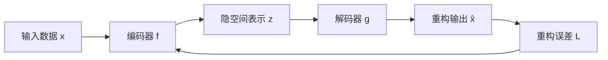

# 自编码器原理与代码实战案例讲解

## 1. 背景介绍

### 1.1 自编码器的起源与发展
自编码器(Autoencoder)是一种无监督学习的神经网络模型,最早由Hinton等人在1986年提出。自编码器的核心思想是通过网络将输入数据编码成一个低维表示,然后再从这个低维表示中重构出原始输入。通过这种方式,自编码器可以学习到数据的高阶特征和内在结构,实现数据压缩和降噪等功能。

近年来,随着深度学习的兴起,自编码器得到了广泛的应用和发展。各种改进型的自编码器相继被提出,如稀疏自编码器(Sparse Autoencoder)、去噪自编码器(Denoising Autoencoder)、变分自编码器(Variational Autoencoder)等。自编码器已成为机器学习和数据挖掘领域的重要工具,在数据降维、特征学习、异常检测等任务中发挥着重要作用。

### 1.2 自编码器的应用场景
自编码器具有广泛的应用前景,主要应用场景包括:

1. 数据降维与可视化:通过自编码器将高维数据映射到低维空间,实现数据压缩和可视化,便于对数据进行分析和理解。

2. 特征学习:自编码器可以自动学习数据的高阶特征表示,可用于后续的分类、聚类等任务。

3. 图像去噪与修复:利用自编码器从含噪声或部分缺失的图像中学习到干净完整的图像表示。 

4. 异常检测:通过训练自编码器重构正常数据,当输入异常数据时重构误差会较大,据此可以实现异常检测。

5. 生成模型:变分自编码器等生成式模型可以从隐空间采样生成新的数据样本。

### 1.3 本文的主要内容

本文将全面介绍自编码器的原理、核心概念和经典模型,并通过代码实战案例演示如何使用Python的Keras库构建和训练自编码器模型。同时,本文还将讨论自编码器的一些改进方法和未来的研究方向。通过本文的学习,读者可以深入理解自编码器的内在机制,掌握其在实际问题中的应用。

## 2. 核心概念与联系

### 2.1 编码器与解码器

自编码器的核心组成部分是编码器(Encoder)和解码器(Decoder):

- 编码器:将输入数据 $x$ 映射到隐空间表示 $z$,通常是一个降维的过程。
- 解码器:将隐空间表示 $z$ 重构为原始输入 $\hat{x}$,尽可能与 $x$ 接近。

编码器和解码器通常都是由多层神经网络组成,它们共同构成了一个自编码器模型。

### 2.2 重构误差

自编码器的训练目标是最小化重构误差,即输入数据 $x$ 与重构输出 $\hat{x}$ 之间的差异。常用的重构误差度量有均方误差(MSE)和交叉熵误差(Cross-entropy)。

假设自编码器的编码器为 $f$,解码器为 $g$,则重构输出为:

$$\hat{x} = g(f(x))$$

均方误差的定义为:

$$L_{MSE} = \frac{1}{n}\sum^n_{i=1}(x^{(i)}-\hat{x}^{(i)})^2$$

其中 $n$ 为样本数量,上标 $(i)$ 表示第 $i$ 个样本。

### 2.3 欠完备与过完备

根据自编码器隐空间维度 $d_z$ 与输入数据维度 $d_x$ 的大小关系,可分为欠完备(Undercomplete)和过完备(Overcomplete)两种情况:

- 欠完备:$d_z < d_x$,隐空间维度小于输入维度,起到降维压缩的作用。
- 过完备:$d_z \geq d_x$,隐空间维度大于等于输入维度,需要引入额外约束以学习有用特征。

欠完备自编码器能学习到数据的低维结构,但表示能力有限。过完备自编码器有更强的表示能力,但需要约束避免学习到平凡解。

### 2.4 自编码器与其他模型的联系

自编码器与其他一些机器学习模型有着密切联系:

- PCA:当自编码器是线性模型且使用均方误差时,其与主成分分析(PCA)等价。
- 稀疏编码:稀疏自编码器通过在隐空间引入稀疏性约束,与稀疏编码模型相关。
- 聚类:当隐空间维度远小于输入维度时,自编码器可作为聚类的前处理步骤。
- 生成模型:变分自编码器通过隐变量建模,可用于生成新样本。

下图展示了自编码器的整体架构和数据流向:



## 3. 核心算法原理具体操作步骤

自编码器的训练过程可分为以下几个步骤:

### 3.1 模型构建

1. 确定编码器和解码器的网络结构,如层数、每层神经元数、激活函数等。
2. 将编码器和解码器连接成一个完整的自编码器模型。
3. 指定重构误差的损失函数,如均方误差或交叉熵误差。
4. 选择优化算法,如Adam、RMSprop等。

### 3.2 数据准备

1. 对输入数据进行预处理,如归一化、标准化等。
2. 将数据划分为训练集和验证集。
3. 如果是图像数据,可将像素值缩放到[0,1]区间。

### 3.3 模型训练

1. 将训练数据输入自编码器,前向传播计算重构输出。
2. 计算重构误差损失函数值。
3. 通过反向传播算法计算梯度,更新模型参数。
4. 重复步骤1-3,直到模型收敛或达到预设的训练轮数。

### 3.4 模型评估

1. 在验证集上评估模型的重构性能,如重构误差、可视化重构结果等。
2. 进一步分析隐空间表示,如可视化隐变量分布、聚类等。
3. 根据评估结果调整模型结构或超参数,进行下一轮训练。

### 3.5 模型应用

1. 使用训练好的编码器提取数据的低维特征表示。
2. 将特征表示用于下游任务,如分类、聚类、异常检测等。
3. 使用解码器生成或重构新的数据样本。

## 4. 数学模型和公式详细讲解举例说明

### 4.1 基本数学模型

假设输入数据为 $\mathbf{x} \in \mathbb{R}^{d_x}$,隐空间表示为 $\mathbf{z} \in \mathbb{R}^{d_z}$,重构输出为 $\hat{\mathbf{x}} \in \mathbb{R}^{d_x}$。

编码器 $f$ 和解码器 $g$ 可表示为:

$$
\begin{aligned}
\mathbf{z} &= f(\mathbf{x}) = s_f(\mathbf{W}_f\mathbf{x} + \mathbf{b}_f)\\
\hat{\mathbf{x}} &= g(\mathbf{z}) = s_g(\mathbf{W}_g\mathbf{z} + \mathbf{b}_g)
\end{aligned}
$$

其中 $\mathbf{W}_f, \mathbf{W}_g$ 分别是编码器和解码器的权重矩阵,$\mathbf{b}_f, \mathbf{b}_g$ 为偏置项,$s_f, s_g$ 为激活函数,如sigmoid、tanh、ReLU等。

以均方误差为例,重构误差损失函数为:

$$J(\mathbf{x},\hat{\mathbf{x}}) = \frac{1}{2}\lVert \mathbf{x} - \hat{\mathbf{x}} \rVert^2_2$$

### 4.2 稀疏自编码器

稀疏自编码器在隐空间引入稀疏性约束,使得隐变量 $\mathbf{z}$ 中大部分元素接近于0,只有少数元素被激活。

常用的稀疏约束有L1正则化和KL散度约束。以KL散度为例,稀疏损失为:

$$J_{sparse} = \sum^{d_z}_{j=1} \text{KL}(\rho \parallel \hat{\rho}_j)$$

其中 $\rho$ 是稀疏参数,表示隐变量的平均激活度目标值,$\hat{\rho}_j$ 是第 $j$ 个隐变量的平均激活度:

$$\hat{\rho}_j = \frac{1}{m}\sum^m_{i=1}f(\mathbf{x}^{(i)})_j$$

$m$ 为样本数量,KL散度的定义为:

$$\text{KL}(\rho \parallel \hat{\rho}_j) = \rho \log \frac{\rho}{\hat{\rho}_j} + (1-\rho) \log \frac{1-\rho}{1-\hat{\rho}_j}$$

### 4.3 去噪自编码器

去噪自编码器的目标是从含噪声的输入中重构出干净的数据。训练时,先对输入数据 $\mathbf{x}$ 添加噪声得到损坏的数据 $\tilde{\mathbf{x}}$,再以 $\tilde{\mathbf{x}}$ 作为自编码器的输入,以原始干净数据 $\mathbf{x}$ 作为重构目标。

常见的噪声类型有高斯噪声、盐椒噪声、随机遮挡等。以高斯噪声为例:

$$\tilde{\mathbf{x}} = \mathbf{x} + \epsilon, \quad \epsilon \sim \mathcal{N}(0, \sigma^2\mathbf{I})$$

其中 $\epsilon$ 为高斯噪声,$\sigma$ 为噪声标准差。

去噪自编码器的重构误差损失函数为:

$$J(\mathbf{x},\hat{\mathbf{x}}) = \frac{1}{2}\lVert \mathbf{x} - g(f(\tilde{\mathbf{x}})) \rVert^2_2$$

通过训练去噪自编码器,模型可以学习到数据的鲁棒特征表示,提高抗噪声能力。

## 5. 项目实践:代码实例和详细解释说明

下面通过一个简单的示例来演示如何使用Python的Keras库构建和训练自编码器模型。

### 5.1 导入所需的库

```python
import numpy as np
from keras.layers import Input, Dense
from keras.models import Model
from keras.datasets import mnist
import matplotlib.pyplot as plt
```

### 5.2 加载和预处理MNIST数据集

```python
(x_train, _), (x_test, _) = mnist.load_data()

x_train = x_train.astype('float32') / 255.
x_test = x_test.astype('float32') / 255.
x_train = x_train.reshape((len(x_train), np.prod(x_train.shape[1:])))
x_test = x_test.reshape((len(x_test), np.prod(x_test.shape[1:])))
```

这里使用MNIST手写数字数据集,将图像像素值缩放到[0,1]区间,并将2D图像展平为1D向量。

### 5.3 构建自编码器模型

```python
encoding_dim = 32

input_img = Input(shape=(784,))
encoded = Dense(encoding_dim, activation='relu')(input_img)
decoded = Dense(784, activation='sigmoid')(encoded)

autoencoder = Model(input_img, decoded)
```

这里构建了一个简单的自编码器模型,输入维度为784(28x28),隐空间维度为32,编码器和解码器都是单层全连接网络。

### 5.4 编译和训练模型

```python
autoencoder.compile(optimizer='adam', loss='binary_crossentropy')

autoencoder.fit(x_train, x_train,
                epochs=50,
                batch_size=256,
                shuffle=True,
                validation_data=(x_test, x_test))
```

使用Adam优化器和二元交叉熵损失函数编译模型,训练50个epoch,batch大小为256,验证集为测试集。

### 5.5 可视化重构结果

```python
decoded_imgs = autoencoder.predict(x_test)

n = 10
plt.figure(figsize=(20, 4))
for i in range(n):
    ax = plt.subplot(2, n, i + 1