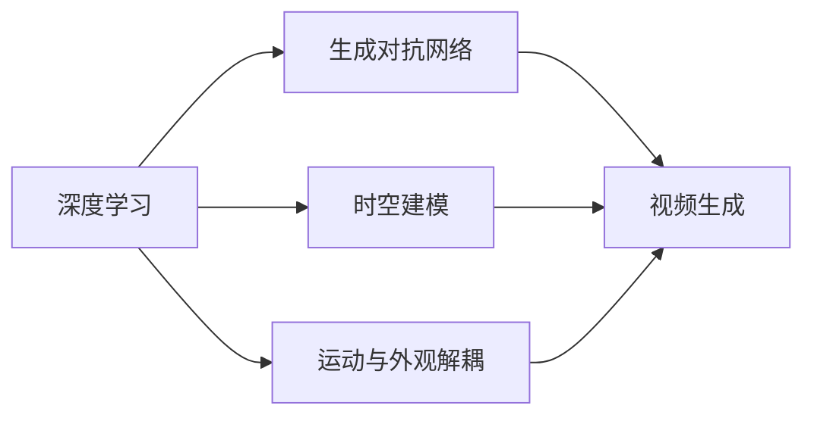

# 视频生成(Video Generation) - 原理与代码实例讲解

## 1. 背景介绍

### 1.1 视频生成的定义与意义
视频生成(Video Generation)是指利用人工智能技术,特别是深度学习和生成对抗网络(GAN),自动生成逼真的视频内容的技术。它不仅在计算机视觉和多媒体领域有重要的研究价值,在实际应用中也有广阔的前景,如虚拟主播、影视特效、游戏、元宇宙等。

### 1.2 视频生成的研究历史与现状
视频生成的研究始于21世纪初,经历了从序列预测模型到GAN的发展历程。近年来,随着深度学习的蓬勃发展,尤其是GAN在图像生成领域取得突破性进展,视频生成也进入了快速发展阶段。目前的研究重点是提高生成视频的真实性、连贯性和可控性。

### 1.3 视频生成面临的主要挑战  
视频生成比图像生成更具挑战性,主要难点包括:
1. 时间维度信息建模:视频中存在丰富的时序信息,如何建模帧与帧之间的关联至关重要。
2. 高维数据处理:视频数据通常是高维的(宽×高×时间),给模型训练和推理带来很大压力。 
3. 运动与外观一致性:生成的视频需要在运动和外观上保持前后一致,避免画面突变。
4. 多模态条件约束:视频生成通常需要同时考虑文本、音频等多模态信息作为条件约束。

## 2. 核心概念与联系

### 2.1 深度学习
深度学习是视频生成的理论基础。它通过构建多层神经网络,利用大规模数据进行端到端的表示学习,极大地提升了视觉任务的性能。视频生成中用到的主要网络结构包括卷积神经网络(CNN)、循环神经网络(RNN)、长短时记忆网络(LSTM)等。

### 2.2 生成对抗网络(GAN)
生成对抗网络由生成器和判别器组成,通过两者的博弈学习来提升生成数据的质量。生成器负责生成假样本去欺骗判别器,判别器则不断提升鉴别能力去识别真假样本。GAN被广泛应用于图像、视频的生成任务中,代表性工作如DCGAN、Pix2Pix、CycleGAN等。

### 2.3 时空建模
时空建模是视频分析与生成的关键。传统方法主要基于光流、时空卷积等,但难以建模长时依赖。近年来,Transformer等注意力机制被引入,通过自注意力建模任意帧之间的全局依赖,在视频生成中取得了很好的效果。

### 2.4 运动与外观解耦
为了更好地控制生成视频的语义,需要将运动与外观信息解耦。运动指物体在时间维度上的位置变化,外观指物体的纹理、形状等空间特征。通过将两者分别建模,再组合生成视频,可以实现更灵活的控制。常见方法有将视频编码为运动场和内容图的分离表示等。

### 2.5 概念之间的联系
下图展示了上述核心概念之间的逻辑联系:



## 3. 核心算法原理具体操作步骤

### 3.1 基于GAN的视频生成

#### 3.1.1 算法原理
基于GAN的视频生成通常采用条件GAN的架构,即在生成器和判别器中引入条件信息c。生成器G以随机噪声z和条件c为输入,生成视频假样本G(z|c),判别器D同时接受真实视频x和条件c,判断是否为真样本D(x|c)。训练目标是优化如下的minimax博弈:
$$
\min_G \max_D V(D,G) = \mathbb{E}_{x \sim p_{data}(x)}[\log D(x|c)] + \mathbb{E}_{z \sim p_z(z)}[\log (1-D(G(z|c)))] 
$$

#### 3.1.2 具体步骤
1. 数据准备:收集视频数据集,进行预处理如裁剪、归一化等,并准备条件信息(如文本描述)。
2. 网络设计:设计生成器G和判别器D的网络结构,根据任务需求可选择2D/3DCNN、LSTM等组件。
3. 定义损失函数:一般包括对抗损失(如WGAN-GP)、重构损失(L1/L2)、感知损失等,权衡生成质量和训练稳定性。
4. 训练模型:交替训练生成器和判别器,生成器尽量欺骗判别器,判别器尽量提升鉴别能力。
5. 测试评估:用训练好的生成器生成视频样本,通过主观评估和客观指标(如IS、FID)来评测生成质量。

### 3.2 基于Transformer的视频生成

#### 3.2.1 算法原理
基于Transformer的视频生成利用了自注意力机制在时空维度上建模长距离依赖的优势。通过将视频帧序列输入Transformer编码器,学习到全局的时空表示,再通过解码器逐帧生成视频。典型的工作如VQVAE-Transformer,分两阶段训练:先用VQVAE对视频进行编码,得到离散的时空tokens,再用Transformer建模tokens的分布并生成。

#### 3.2.2 具体步骤
1. 数据准备:同3.1.2。
2. VQVAE训练:设计编码器将视频压缩为离散tokens,用重构损失训练VQVAE。  
3. Transformer训练:将离散tokens输入Transformer编码器,学习时空依赖,用自回归方式训练解码器逐帧生成。
4. 测试评估:用训练好的VQVAE和Transformer生成视频,评估生成质量。

## 4. 数学模型和公式详细讲解举例说明

### 4.1 GAN的数学模型
GAN的核心思想是构建生成器G和判别器D两个网络,并设计minimax博弈来优化。数学上可表示为:

$$
\min_G \max_D V(D,G) = \mathbb{E}_{x \sim p_{data}(x)}[\log D(x)] + \mathbb{E}_{z \sim p_z(z)}[\log (1-D(G(z)))]
$$

其中,$x$为真实数据的分布$p_{data}$,$z$为随机噪声的分布$p_z$,通常为高斯分布或均匀分布。$D(x)$表示判别器输出的真实数据的概率,$G(z)$表示生成器由噪声生成的假样本。

直观理解:判别器D要最大化真实数据的对数概率$\log D(x)$和假样本的负对数概率$\log (1-D(G(z)))$,而生成器G要最小化假样本的负对数概率。两者经过多轮博弈,最终达到纳什均衡,生成分布与真实分布一致。

举例说明:
- 当生成器G刚开始训练时,生成的假样本质量较差,判别器D很容易将其识别为假,此时$D(G(z))$接近0,$\log (1-D(G(z)))$接近0,生成器损失较大。
- 随着训练的进行,生成器G不断提升生成样本的真实性,使得$D(G(z))$变大,$\log (1-D(G(z)))$变小,从而降低生成器损失。 
- 同时,判别器D也在不断提升鉴别能力,使得$D(x)$变大而$D(G(z))$变小,最大化自身的目标函数。
- 最终,生成器G可以生成与真实数据几乎一致的样本,判别器D对真假样本的预测概率都接近0.5,达到均衡。

### 4.2 VQVAE的数学模型 
VQVAE引入了离散潜变量来构建视频的压缩表示。数学上,训练VQVAE的目标是最小化重构误差:

$$
L = \|x-D(e)\|^2 + \|sg[E(x)]-e\|^2 + \beta\|sg[e]-E(x)\|^2
$$

其中,$x$为输入视频帧,$E$为编码器,$D$为解码器,$e$为codebook中的离散向量。第一项为重构损失,使得解码后的视频帧$D(e)$尽量接近原始帧$x$。第二项为codebook损失,使得编码后的向量$E(x)$尽量接近codebook中的向量$e$,sg表示stop-gradient。第三项为commitment损失,作为正则项约束编码向量$E(x)$。

举例说明:
- 输入一段视频,编码器E将其映射到潜空间,得到连续向量表示$E(x)$。
- 在潜空间中,与$E(x)$最接近的离散向量$e$被选中,作为视频的离散表示。这一步称为vector quantization。
- 解码器D将离散向量$e$重构为视频帧$D(e)$,使其尽量接近原始视频帧$x$。
- 训练过程通过最小化三项损失来优化,使得编码器E学习到视频的高效压缩表示,同时保证重构质量。
- 训练完成后,可用编码器E将视频压缩为离散tokens,再用Transformer等模型对tokens建模,实现视频生成。

## 5. 项目实践：代码实例和详细解释说明

下面以PyTorch为例,展示基于GAN的视频生成的核心代码。完整项目请参考:[https://github.com/Zhen-Ai/VideoGAN-Pytorch](https://github.com/Zhen-Ai/VideoGAN-Pytorch)

### 5.1 生成器G的代码

```python
class Generator(nn.Module):
    def __init__(self):
        super(Generator, self).__init__()
        self.main = nn.Sequential(
            ConvTranspose3d(100,512,4,1,0,bias=False),
            nn.BatchNorm3d(512),
            nn.ReLU(True),
            
            ConvTranspose3d(512,256,4,2,1,bias=False), 
            nn.BatchNorm3d(256),
            nn.ReLU(True),
            
            ConvTranspose3d(256,128,4,2,1,bias=False),
            nn.BatchNorm3d(128),
            nn.ReLU(True),
            
            ConvTranspose3d(128,64,4,2,1,bias=False),
            nn.BatchNorm3d(64),
            nn.ReLU(True),
            
            nn.ConvTranspose3d(64,3,4,2,1,bias=False),
            nn.Tanh()
        )

    def forward(self, input):
        return self.main(input)
```

代码解释:
- 生成器G采用了3D反卷积(ConvTranspose3d)的结构,将随机噪声逐步上采样为视频。
- 输入为长度为100的噪声向量,先reshape为尺寸为(1,1,1)的feature map。
- 然后经过4个ConvTranspose3d层,每层后接BatchNorm3d和ReLU激活,将feature map放大为(64,64,32)。
- 最后一层ConvTranspose3d将通道数变为3,并用Tanh激活,得到生成的视频。

### 5.2 判别器D的代码

```python
class Discriminator(nn.Module):
    def __init__(self):
        super(Discriminator, self).__init__()
        self.main = nn.Sequential(
            nn.Conv3d(3,64,4,2,1,bias=False),
            nn.LeakyReLU(0.2,inplace=True),
            
            nn.Conv3d(64,128,4,2,1,bias=False),
            nn.BatchNorm3d(128),
            nn.LeakyReLU(0.2,inplace=True),
            
            nn.Conv3d(128,256,4,2,1,bias=False),
            nn.BatchNorm3d(256),
            nn.LeakyReLU(0.2,inplace=True),
            
            nn.Conv3d(256,512,4,2,1,bias=False),
            nn.BatchNorm3d(512),
            nn.LeakyReLU(0.2,inplace=True),
            
            nn.Conv3d(512,1,4,1,0,bias=False),
            nn.Sigmoid()
        )

    def forward(self, input):
        return self.main(input).view(-1)
```

代码解释:
- 判别器D采用了3D卷积(Conv3d)的结构,将输入视频下采样为概率值。
- 输入为尺寸为(64,64,32)的视频,先经过一个无BN的Conv3