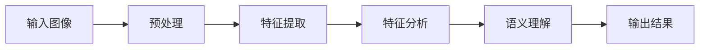

# 计算机视觉原理与代码实战案例讲解

## 1. 背景介绍
### 1.1 计算机视觉的定义与发展历程
计算机视觉(Computer Vision)是一门研究如何使计算机能够"看懂"数字图像或视频的科学。它旨在利用计算机算法从图像或视频中提取、分析和理解有用的信息,使计算机能够像人类那样感知和理解视觉世界。计算机视觉起源于20世纪60年代,经历了从理论研究到实际应用的发展过程。近年来,随着深度学习等人工智能技术的进步,计算机视觉取得了长足发展,在工业、医疗、安防、自动驾驶等领域得到了广泛应用。

### 1.2 计算机视觉的主要研究内容
计算机视觉主要研究图像处理、特征提取、目标检测与识别、图像分割、三维重建等内容。其核心是通过算法从图像或视频中提取有用的视觉特征,并对这些特征进行分析和理解,从而实现对图像内容的感知和认知。计算机视觉涉及计算机科学、数学、物理学等多个学科领域的交叉融合。

### 1.3 计算机视觉的应用场景
计算机视觉技术在工业自动化、智慧城市、智能安防、无人驾驶、医学影像分析、虚拟现实/增强现实等领域有着广泛的应用前景。例如,工业视觉检测应用于工业生产的缺陷检测和质量控制;人脸识别应用于安防监控和身份认证;医学影像分析辅助医生进行疾病诊断;自动驾驶汽车利用视觉感知避障和道路理解。计算机视觉正在深刻影响和改变人类生活。

## 2. 核心概念与联系
### 2.1 数字图像的表示
计算机视觉处理的基本对象是数字图像。数字图像可以看作是一个二维矩阵,矩阵的每个元素称为像素(pixel)。对于灰度图像,像素值表示灰度强度,通常用0~255整数表示。对于彩色图像,常见的是RGB色彩空间,每个像素由红、绿、蓝三个分量值组成。图像分辨率反映了图像的大小,即图像包含的像素数量。

### 2.2 图像处理
图像处理是对图像进行一系列操作以改善图像质量或提取所需信息的过程。常见的图像处理操作包括图像滤波、图像增强、图像复原、图像分割、形态学处理等。例如,高斯滤波常用于图像去噪,直方图均衡化用于图像对比度增强,阈值分割可将图像分割为前景和背景。图像处理是计算机视觉的基础。

### 2.3 特征提取
特征提取是从图像中提取能够表征图像内容的特征向量的过程。常用的图像特征包括颜色特征、纹理特征、形状特征、关键点特征等。例如,SIFT(尺度不变特征变换)和SURF(加速稳健特征)是常用的局部不变特征描述子,能够在图像旋转、尺度、光照变化情况下匹配图像关键点。特征提取是图像分析和理解的关键。

### 2.4 目标检测与识别 
目标检测是在图像中定位感兴趣目标(如人脸、行人、车辆)的过程,常用的方法有Haar特征+AdaBoost分类器、HOG(方向梯度直方图)特征+SVM分类器、基于深度学习的RCNN系列算法等。目标识别在检测的基础上对目标进行分类,如识别人脸身份、场景类别等。深度学习如CNN(卷积神经网络)在目标检测与识别任务上取得了显著成果。

### 2.5 图像分割
图像分割将图像划分为若干个语义区域,使得每个区域内部像素特性一致而区域间差异明显。常用的图像分割算法有阈值分割、区域生长、分水岭算法、图割等。语义分割是对图像的每个像素进行类别标注,得到像素级别的分割结果。图像分割在医学影像分析、无人驾驶场景理解等任务中有重要应用。

### 2.6 三维重建
三维重建利用多视角二维图像恢复场景的三维结构信息,涉及图像配准、立体匹配、三维点云生成等技术。常用的有结构光、双目立体视觉、SFM(运动恢复结构)等方法。三维重建在虚拟现实、逆向工程等领域有广泛应用。SLAM(同时定位与地图构建)融合视觉里程计和回环检测实现增量式三维重建。

### 2.7 深度学习
深度学习是机器学习的一个分支,通过构建多层神经网络从大量数据中学习层次化的特征表示。CNN和RNN(循环神经网络)是两类典型的深度学习模型,分别擅长处理网格结构数据和序列数据。深度学习凭借其强大的特征学习能力,在计算机视觉的目标检测、图像分割、行为识别等任务上取得了突破性进展,推动了计算机视觉的跨越式发展。

### 2.8 计算机视觉处理流程
计算机视觉处理的一般流程可总结如下:

首先对输入的图像进行预处理,如图像去噪、图像增强等,以提高图像质量。然后提取图像的特征表示,如颜色、纹理、形状等特征。接着对提取的特征进行分析,如特征匹配、特征分类等。再进行语义层面的图像理解,如目标检测、图像分割、行为识别等。最后输出处理结果,如目标位置、图像标注、三维模型等。

## 3. 核心算法原理具体操作步骤
本节以图像分类任务为例,介绍经典的卷积神经网络(CNN)的原理和实现步骤。

### 3.1 卷积神经网络(CNN)原理
CNN是一种层次化的深度学习模型,主要由卷积层(Convolutional Layer)、池化层(Pooling Layer)、全连接层(Fully Connected Layer)组成。

- 卷积层:通过卷积操作提取局部特征。卷积核在输入特征图上滑动,对局部区域进行加权求和,得到输出特征图。卷积具有局部连接和权重共享的特点。
- 池化层:通过降采样操作实现特征压缩和旋转平移不变性。常用的有最大池化和平均池化,可减小特征图尺寸。  
- 全连接层:将卷积和池化后的特征展平为一维向量,通过若干个全连接层对特征进行变换,并在最后一层使用Softmax激活函数输出分类概率。

CNN通过交替使用卷积层和池化层逐层提取图像的层次化特征,并在全连接层完成特征的高层语义映射。CNN的层次化结构使其能够从图像中学习到鲁棒且有判别力的特征表示。

### 3.2 CNN训练步骤

CNN模型的训练主要分为以下步骤:

(1) 数据准备:构建图像数据集,并划分为训练集和测试集。对图像进行预处理,如尺寸归一化、像素值归一化等。

(2) 网络构建:根据任务需求设计CNN网络结构,如卷积层数、卷积核大小、池化方式、全连接层结构等。初始化模型参数。

(3) 前向传播:将一批训练图像输入CNN网络,经过逐层的卷积、池化、激活、全连接等操作,得到网络的预测输出。

(4) 损失计算:使用交叉熵损失函数度量预测输出与真实标签之间的差异,得到当前模型的损失值。

(5) 反向传播:根据损失函数对网络参数求梯度,并使用优化算法(如随机梯度下降)更新网络参数,使损失值最小化。

(6) 迭代优化:重复步骤(3)-(5),对训练集中的所有样本进行多轮迭代训练,直到模型收敛或达到预设的迭代次数。

(7) 模型评估:使用训练好的CNN模型对测试集图像进行预测,计算准确率等性能指标,评估模型的泛化能力。

(8) 模型应用:将训练好的CNN模型部署到实际应用环境中,对新的图像样本进行预测和分类。

### 3.3 经典CNN网络结构

下面介绍几种经典的CNN网络结构:

- LeNet:由Yann LeCun等人提出,是早期的CNN网络之一。包括2个卷积层、2个池化层和3个全连接层,用于手写数字识别。

- AlexNet:由Alex Krizhevsky等人提出,在2012年ImageNet图像分类竞赛中取得突破性成果。包括5个卷积层和3个全连接层,使用ReLU激活函数和Dropout正则化,奠定了深层CNN的基础。

- VGGNet:由牛津大学视觉几何组(Visual Geometry Group)提出,探索了CNN网络深度对性能的影响。使用小尺寸卷积核(3x3)和池化核(2x2),网络深度达到16-19层。

- GoogLeNet:由Google团队提出,引入Inception模块实现多尺度特征提取。Inception模块包含多个并行的卷积和池化操作,可增加网络的宽度和表达能力。

- ResNet:由何恺明等人提出,引入残差学习解决了深层网络的退化问题。在残差块中使用恒等映射(identity mapping)将输入直接连接到输出,使网络可以达到数百层而不失去可训练性。

- DenseNet:由黄高等人提出,进一步加强了CNN的特征复用和传递。在Dense块中,每一层的输出都与后面所有层的输入拼接,实现了特征的密集连接。

## 4. 数学模型和公式详细讲解举例说明

本节以卷积操作和反向传播算法为例,详细讲解CNN中涉及的数学模型和公式。

### 4.1 卷积操作

卷积操作是CNN的核心组件之一,用于提取局部特征。设输入特征图为$X$,卷积核为$W$,卷积操作可表示为:

$$Y[i,j] = \sum_{m}\sum_{n} X[i+m, j+n] \cdot W[m,n]$$

其中,$Y$为输出特征图,$i,j$为输出特征图上的位置索引,$m,n$为卷积核的尺寸。卷积操作可看作是卷积核在输入特征图上滑动,对局部区域进行加权求和。

例如,假设输入特征图$X$和卷积核$W$分别为:

$$
X = \begin{bmatrix}
1 & 2 & 3 \\
4 & 5 & 6 \\
7 & 8 & 9
\end{bmatrix}, \quad
W = \begin{bmatrix}
1 & 0 \\
0 & 1
\end{bmatrix}
$$

对$X$和$W$进行卷积操作,得到输出特征图$Y$为:

$$
Y = \begin{bmatrix}
1\times1 + 2\times0 + 4\times0 + 5\times1 & 2\times1 + 3\times0 + 5\times0 + 6\times1 \\
4\times1 + 5\times0 + 7\times0 + 8\times1 & 5\times1 + 6\times0 + 8\times0 + 9\times1
\end{bmatrix} = \begin{bmatrix}
6 & 8 \\
12 & 14
\end{bmatrix}
$$

可见,卷积操作可提取输入特征图的局部特征,生成新的特征表示。

### 4.2 反向传播算法

反向传播(Backpropagation)是训练神经网络的关键算法,用于计算损失函数对网络参数的梯度,并更新参数以最小化损失函数。设$L$为损失函数,$W$为网络参数,反向传播的目标是计算梯度$\frac{\partial L}{\partial W}$。

假设神经网络由$n$个层组成,第$i$层的输入为$x_i$,输出为$y_i$,参数为$W_i$。反向传播算法可分为以下步骤