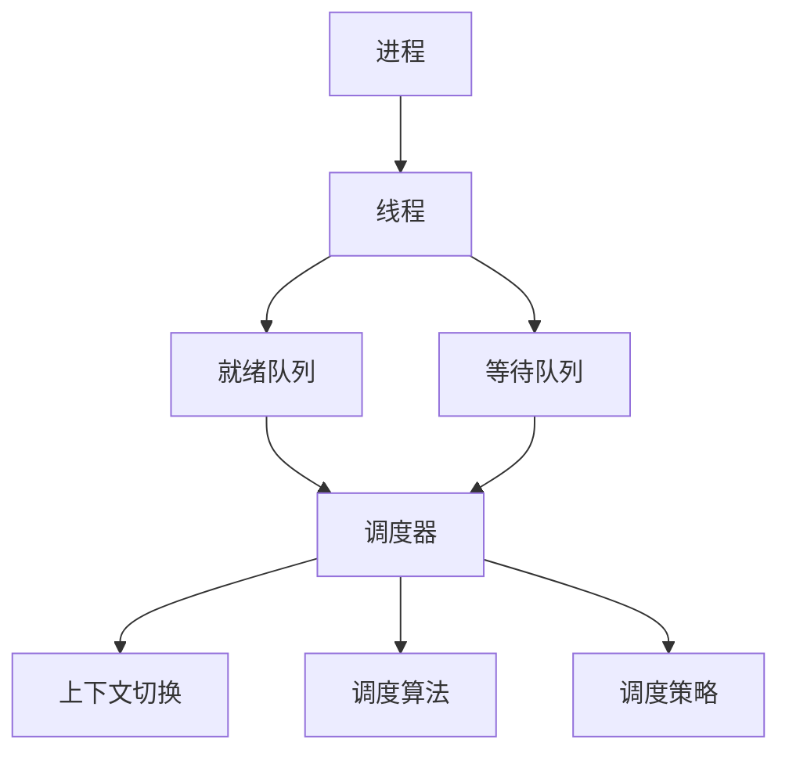

# 调度器 原理与代码实例讲解

## 1. 背景介绍

在现代操作系统和分布式系统中,调度器(Scheduler)扮演着至关重要的角色。它负责决定如何将有限的计算资源(如CPU时间、内存等)分配给不同的任务或进程,以实现系统的高效运行。一个优秀的调度器可以最大化系统的吞吐量、最小化任务的响应时间,并确保公平性。本文将深入探讨调度器的原理,并通过代码实例来阐明其工作机制。

### 1.1 调度器的定义与目标

调度器是操作系统或分布式系统的核心组件之一,其主要职责是根据特定的调度算法和策略,动态地决定任务或进程的执行顺序和资源分配。调度器的目标包括:

- 公平性:确保每个任务或进程都能获得合理的资源,避免饥饿现象。
- 高效性:最大化系统的吞吐量,减少资源的浪费。  
- 响应性:尽可能减少任务的等待时间,提高用户体验。
- 可预测性:使系统的行为在一定程度上可预测,方便管理和调试。

### 1.2 调度器的分类

根据应用场景和需求的不同,调度器可以分为以下几类:

- 进程调度器:负责决定就绪队列中的进程在CPU上的执行顺序。
- I/O调度器:负责安排I/O请求的处理顺序,减少磁盘寻道时间。
- 作业调度器:负责决定批处理系统中作业的执行顺序。
- 实时调度器:针对实时系统,保证任务在规定的截止时间内完成。

## 2. 核心概念与联系

为了深入理解调度器的工作原理,我们需要了解一些核心概念及其相互联系。

### 2.1 进程与线程

进程是操作系统资源分配的基本单位,而线程是CPU调度的基本单位。一个进程可以包含多个线程,它们共享进程的资源,但拥有独立的执行流。调度器需要对进程和线程进行管理和调度。

### 2.2 就绪队列与等待队列

就绪队列存储了所有处于就绪状态的进程或线程,它们正在等待被调度器分配CPU时间。等待队列存储了因等待某个事件(如I/O完成)而被阻塞的进程或线程。调度器负责在就绪队列和等待队列之间移动进程或线程。

### 2.3 上下文切换

上下文切换是指将CPU从一个进程或线程切换到另一个进程或线程的过程。这涉及保存当前进程或线程的状态,并恢复目标进程或线程的状态。上下文切换是调度器工作的重要部分,但也会引入一定的开销。

### 2.4 调度算法与策略

调度算法决定了调度器选择下一个要执行的任务的方式,常见的调度算法包括:

- 先来先服务(FCFS):按照任务到达的顺序依次执行。
- 最短作业优先(SJF):优先执行估计运行时间最短的任务。
- 优先级调度:根据任务的优先级决定执行顺序。
- 轮转调度(RR):每个任务执行一个固定的时间片,然后切换到下一个任务。

调度策略则决定了如何在不同的任务或资源之间进行权衡,常见的调度策略包括:

- 抢占式:允许高优先级的任务打断低优先级任务的执行。
- 非抢占式:一旦任务开始执行,就允许它运行直到完成或主动放弃CPU。

下图展示了调度器的核心概念及其关系:



## 3. 核心算法原理具体操作步骤

本节将详细介绍几种常见调度算法的原理和具体操作步骤。

### 3.1 先来先服务(FCFS)

FCFS是最简单的调度算法,它按照任务到达的顺序依次执行。

1. 将新到达的任务添加到就绪队列的末尾。
2. 当CPU空闲时,从就绪队列的头部取出任务并执行。
3. 重复步骤1和2,直到所有任务执行完毕。

FCFS算法的优点是简单易实现,但可能导致短任务等待长任务完成,引起"护航效应"。

### 3.2 最短作业优先(SJF)

SJF算法优先执行估计运行时间最短的任务。

1. 将新到达的任务按照估计运行时间排序,插入到就绪队列中的适当位置。
2. 当CPU空闲时,从就绪队列的头部取出估计运行时间最短的任务并执行。
3. 重复步骤1和2,直到所有任务执行完毕。

SJF算法可以最小化平均等待时间,但需要预知每个任务的运行时间,且可能导致长任务饥饿。

### 3.3 优先级调度

优先级调度根据任务的优先级决定执行顺序。

1. 为每个任务分配一个优先级。
2. 将新到达的任务按照优先级排序,插入到就绪队列中的适当位置。
3. 当CPU空闲时,从就绪队列的头部取出优先级最高的任务并执行。
4. 重复步骤2和3,直到所有任务执行完毕。

优先级调度可以确保重要任务得到优先处理,但需要合理设置优先级,避免低优先级任务饥饿。

### 3.4 轮转调度(RR)

RR算法为每个任务分配一个固定的时间片,轮流执行各个任务。

1. 将新到达的任务添加到就绪队列的末尾。
2. 当CPU空闲时,从就绪队列的头部取出任务并执行,直到时间片用完或任务完成。
3. 如果任务未完成,将其添加到就绪队列的末尾。
4. 重复步骤2和3,直到所有任务执行完毕。

RR算法可以确保所有任务得到公平的CPU时间,但上下文切换频繁可能导致开销增加。

## 4. 数学模型和公式详细讲解举例说明

为了评估调度算法的性能,我们需要建立数学模型并使用相关公式进行分析。本节将详细讲解几个常用的性能指标及其计算方法。

### 4.1 周转时间与平均周转时间

周转时间(Turnaround Time)是指任务从提交到完成的总时间,包括等待时间和执行时间。平均周转时间(Average Turnaround Time)是所有任务周转时间的平均值,反映了调度算法的整体性能。

假设有n个任务,第i个任务的提交时间为$s_i$,完成时间为$f_i$,则其周转时间$T_i$为:

$$T_i = f_i - s_i$$

平均周转时间$\bar{T}$为:

$$\bar{T} = \frac{\sum_{i=1}^{n} T_i}{n}$$

举例说明:假设有3个任务,提交时间分别为0,2,4,完成时间分别为5,8,12,则周转时间分别为5,6,8,平均周转时间为(5+6+8)/3=6.33。

### 4.2 等待时间与平均等待时间

等待时间(Waiting Time)是指任务在就绪队列中等待的时间。平均等待时间(Average Waiting Time)是所有任务等待时间的平均值,反映了调度算法的响应性。

假设第i个任务的执行时间为$e_i$,则其等待时间$W_i$为:

$$W_i = T_i - e_i$$

平均等待时间$\bar{W}$为:

$$\bar{W} = \frac{\sum_{i=1}^{n} W_i}{n}$$

举例说明:假设上述3个任务的执行时间分别为2,3,4,则等待时间分别为3,3,4,平均等待时间为(3+3+4)/3=3.33。

### 4.3 响应比

响应比(Response Ratio)是一种综合考虑任务等待时间和执行时间的指标,用于评估调度算法的公平性。响应比$R_i$的计算公式为:

$$R_i = \frac{W_i + e_i}{e_i}$$

响应比越高,表示任务相对于其执行时间等待的时间越长,调度算法的公平性越差。

举例说明:假设有2个任务,等待时间分别为10和5,执行时间分别为5和10,则响应比分别为(10+5)/5=3和(5+10)/10=1.5。可以看出,尽管第一个任务的等待时间更长,但其响应比更高,调度算法对其不太公平。

## 5. 项目实践:代码实例和详细解释说明

为了更直观地理解调度算法的实现,本节将提供几个代码实例并进行详细解释。我们将使用Python语言实现FCFS、SJF和RR算法。

### 5.1 FCFS算法实现

```python
def fcfs(processes):
    n = len(processes)
    waiting_time = [0] * n
    turnaround_time = [0] * n
    
    # 计算等待时间
    for i in range(1, n):
        waiting_time[i] = processes[i-1][1] + waiting_time[i-1]
    
    # 计算周转时间
    for i in range(n):
        turnaround_time[i] = processes[i][1] + waiting_time[i]
    
    # 计算平均等待时间和平均周转时间
    avg_waiting_time = sum(waiting_time) / n
    avg_turnaround_time = sum(turnaround_time) / n
    
    return avg_waiting_time, avg_turnaround_time

# 测试代码
processes = [(0, 5), (1, 3), (2, 2), (4, 4)]
avg_waiting_time, avg_turnaround_time = fcfs(processes)
print(f"Average Waiting Time: {avg_waiting_time:.2f}")
print(f"Average Turnaround Time: {avg_turnaround_time:.2f}")
```

在这个实现中,`processes`是一个列表,每个元素是一个元组`(arrival_time, burst_time)`,表示任务的到达时间和执行时间。我们首先初始化等待时间和周转时间列表,然后按照FCFS的原则计算每个任务的等待时间和周转时间,最后计算平均值并返回。

### 5.2 SJF算法实现

```python
def sjf(processes):
    n = len(processes)
    waiting_time = [0] * n
    turnaround_time = [0] * n
    
    # 按执行时间排序
    processes.sort(key=lambda x: x[1])
    
    # 计算等待时间
    for i in range(1, n):
        waiting_time[i] = processes[i-1][1] + waiting_time[i-1]
    
    # 计算周转时间
    for i in range(n):
        turnaround_time[i] = processes[i][1] + waiting_time[i]
    
    # 计算平均等待时间和平均周转时间
    avg_waiting_time = sum(waiting_time) / n
    avg_turnaround_time = sum(turnaround_time) / n
    
    return avg_waiting_time, avg_turnaround_time

# 测试代码
processes = [(0, 5), (1, 3), (2, 2), (4, 4)]
avg_waiting_time, avg_turnaround_time = sjf(processes)
print(f"Average Waiting Time: {avg_waiting_time:.2f}")
print(f"Average Turnaround Time: {avg_turnaround_time:.2f}")
```

SJF算法的实现与FCFS类似,区别在于我们首先按照执行时间对任务进行排序,然后再计算等待时间和周转时间。

### 5.3 RR算法实现

```python
def rr(processes, quantum):
    n = len(processes)
    waiting_time = [0] * n
    turnaround_time = [0] * n
    remaining_time = [p[1] for p in processes]
    
    current_time = 0
    while True:
        done = True
        for i in range(n):
            if remaining_time[i] > 0:
                done = False
                if remaining_time[i] > quantum:
                    current_time += quantum
                    remaining_time[i] -= quantum
                else:
                    current_time += remaining_time[i]
                    waiting_time[i] = current_time - processes[i][1]
                    remaining_time[i] = 0
        if done:
            break
    
    # 计算周转时间
    for i in range(n):
        turnaround_time[i