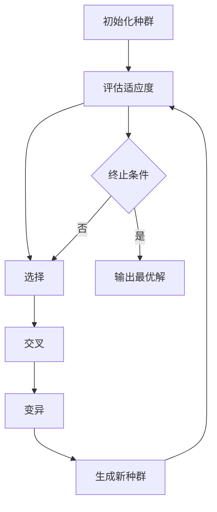

# 遗传算法(Genetic Algorithms) - 原理与代码实例讲解

## 1.背景介绍

遗传算法（Genetic Algorithms，简称GA）是一种基于自然选择和遗传机制的优化算法。它最早由John Holland在20世纪60年代提出，并在他的学生David E. Goldberg的推广下得到了广泛应用。遗传算法通过模拟生物进化过程中的选择、交叉和变异等操作，来寻找问题的最优解。由于其强大的全局搜索能力和适应性，遗传算法在许多复杂优化问题中表现出色。

## 2.核心概念与联系

### 2.1 基因与染色体

在遗传算法中，解被表示为染色体，染色体由基因组成。基因是解的基本单位，通常用二进制、实数或其他编码方式表示。

### 2.2 种群

种群是由多个染色体组成的集合。遗传算法通过在种群中进行选择、交叉和变异等操作来产生新的种群，从而逐步逼近最优解。

### 2.3 适应度函数

适应度函数用于评估染色体的优劣。适应度值越高，表示染色体越接近问题的最优解。

### 2.4 选择

选择操作根据适应度值选择染色体进入下一代。常见的选择方法有轮盘赌选择、锦标赛选择和排名选择等。

### 2.5 交叉

交叉操作通过交换两个染色体的部分基因来产生新的染色体。常见的交叉方法有单点交叉、多点交叉和均匀交叉等。

### 2.6 变异

变异操作通过随机改变染色体的部分基因来增加种群的多样性。变异率通常较低，以避免破坏优良基因。

## 3.核心算法原理具体操作步骤

遗传算法的基本流程如下：



### 3.1 初始化种群

随机生成一定数量的染色体，构成初始种群。

### 3.2 评估适应度

使用适应度函数评估每个染色体的适应度值。

### 3.3 选择

根据适应度值选择染色体进入下一代。

### 3.4 交叉

对选择出的染色体进行交叉操作，产生新的染色体。

### 3.5 变异

对新产生的染色体进行变异操作，增加种群的多样性。

### 3.6 生成新种群

将交叉和变异后的染色体组成新的种群。

### 3.7 终止条件

判断是否满足终止条件，如达到最大迭代次数或适应度值达到预定阈值。如果满足，输出最优解；否则，返回选择步骤继续迭代。

## 4.数学模型和公式详细讲解举例说明

### 4.1 适应度函数

适应度函数 $f(x)$ 用于评估染色体 $x$ 的优劣。具体形式取决于问题的定义。例如，对于一个求解最大值问题，适应度函数可以定义为目标函数本身。

### 4.2 选择概率

轮盘赌选择的选择概率 $P_i$ 计算公式为：

$$
P_i = \frac{f(x_i)}{\sum_{j=1}^{N} f(x_j)}
$$

其中，$f(x_i)$ 是染色体 $x_i$ 的适应度值，$N$ 是种群大小。

### 4.3 交叉操作

单点交叉的操作步骤如下：

1. 随机选择一个交叉点 $k$。
2. 交换两个染色体在交叉点 $k$ 之后的基因。

例如，假设两个染色体 $A$ 和 $B$ 分别为：

$$
A = [a_1, a_2, a_3, a_4, a_5]
$$

$$
B = [b_1, b_2, b_3, b_4, b_5]
$$

选择交叉点 $k=3$，交叉后的染色体为：

$$
A' = [a_1, a_2, a_3, b_4, b_5]
$$

$$
B' = [b_1, b_2, b_3, a_4, a_5]
$$

### 4.4 变异操作

变异操作通过随机改变染色体的部分基因来增加种群的多样性。例如，对于二进制编码的染色体，可以随机选择一个基因位并将其取反。

## 5.项目实践：代码实例和详细解释说明

以下是一个使用Python实现的简单遗传算法示例，解决一个求解最大值问题。

### 5.1 问题定义

求解函数 $f(x) = x^2$ 的最大值，定义域为 $[0, 31]$。

### 5.2 代码实现

```python
import random

# 参数设置
POP_SIZE = 20  # 种群大小
GENE_LENGTH = 5  # 基因长度
MAX_GENERATIONS = 100  # 最大迭代次数
MUTATION_RATE = 0.01  # 变异率

# 适应度函数
def fitness(x):
    return x ** 2

# 初始化种群
def init_population():
    return [random.randint(0, 2**GENE_LENGTH - 1) for _ in range(POP_SIZE)]

# 选择操作
def selection(population):
    total_fitness = sum(fitness(ind) for ind in population)
    probabilities = [fitness(ind) / total_fitness for ind in population]
    selected = random.choices(population, probabilities, k=POP_SIZE)
    return selected

# 交叉操作
def crossover(parent1, parent2):
    point = random.randint(1, GENE_LENGTH - 1)
    child1 = (parent1 & (2**point - 1)) | (parent2 & (2**GENE_LENGTH - 1 - (2**point - 1)))
    child2 = (parent2 & (2**point - 1)) | (parent1 & (2**GENE_LENGTH - 1 - (2**point - 1)))
    return child1, child2

# 变异操作
def mutate(individual):
    if random.random() < MUTATION_RATE:
        point = random.randint(0, GENE_LENGTH - 1)
        individual ^= 1 << point
    return individual

# 主函数
def genetic_algorithm():
    population = init_population()
    for generation in range(MAX_GENERATIONS):
        population = selection(population)
        next_population = []
        for i in range(0, POP_SIZE, 2):
            parent1, parent2 = population[i], population[i+1]
            child1, child2 = crossover(parent1, parent2)
            next_population.extend([mutate(child1), mutate(child2)])
        population = next_population
        best_individual = max(population, key=fitness)
        print(f"Generation {generation}: Best fitness = {fitness(best_individual)}")
    return best_individual

# 运行遗传算法
best_solution = genetic_algorithm()
print(f"Best solution: {best_solution}, Fitness: {fitness(best_solution)}")
```

### 5.3 代码解释

1. **参数设置**：定义种群大小、基因长度、最大迭代次数和变异率。
2. **适应度函数**：定义目标函数 $f(x) = x^2$。
3. **初始化种群**：随机生成初始种群。
4. **选择操作**：使用轮盘赌选择方法选择染色体进入下一代。
5. **交叉操作**：使用单点交叉方法生成新的染色体。
6. **变异操作**：随机改变染色体的部分基因。
7. **主函数**：执行遗传算法的主要流程，包括初始化种群、选择、交叉、变异和生成新种群。

## 6.实际应用场景

遗传算法在许多实际问题中得到了广泛应用，以下是一些典型的应用场景：

### 6.1 优化问题

遗传算法在解决复杂优化问题方面表现出色，如函数优化、组合优化和多目标优化等。

### 6.2 机器学习

遗传算法可以用于机器学习中的特征选择、参数优化和模型选择等任务。例如，在神经网络训练中，遗传算法可以用于优化网络结构和权重。

### 6.3 进化机器人

遗传算法在进化机器人领域有重要应用，通过模拟生物进化过程来设计和优化机器人控制策略。

### 6.4 生物信息学

在生物信息学中，遗传算法可以用于基因序列比对、蛋白质结构预测和药物设计等任务。

### 6.5 工业工程

遗传算法在工业工程中的应用包括生产调度、物流优化和资源分配等问题。

## 7.工具和资源推荐

### 7.1 工具

1. **DEAP**：一个Python库，提供了遗传算法和其他进化计算算法的实现。
2. **GA Toolbox**：MATLAB中的遗传算法工具箱，提供了丰富的遗传算法函数和示例。
3. **GeneticSharp**：一个C#库，提供了遗传算法的实现，适用于.NET平台。

### 7.2 资源

1. **《Genetic Algorithms in Search, Optimization, and Machine Learning》**：David E. Goldberg的经典著作，详细介绍了遗传算法的理论和应用。
2. **《Introduction to Genetic Algorithms》**：S. N. Sivanandam和S. N. Deepa的著作，提供了遗传算法的基础知识和应用实例。
3. **Coursera上的遗传算法课程**：提供了遗传算法的在线学习资源，包括视频讲解和编程练习。

## 8.总结：未来发展趋势与挑战

### 8.1 未来发展趋势

1. **多目标优化**：随着实际问题的复杂性增加，多目标优化成为遗传算法的重要研究方向。
2. **混合算法**：将遗传算法与其他优化算法结合，如粒子群优化、模拟退火等，以提高算法性能。
3. **大数据与并行计算**：在大数据和并行计算环境下，遗传算法的应用前景广阔，可以处理更大规模和更复杂的问题。

### 8.2 挑战

1. **参数选择**：遗传算法的性能对参数选择敏感，如种群大小、交叉率和变异率等。如何自动调整参数是一个重要挑战。
2. **收敛速度**：遗传算法的收敛速度较慢，尤其在高维空间中。如何提高收敛速度是一个亟待解决的问题。
3. **局部最优**：遗传算法容易陷入局部最优解，如何增强全局搜索能力是一个重要研究方向。

## 9.附录：常见问题与解答

### 9.1 遗传算法适用于哪些类型的问题？

遗传算法适用于各种优化问题，特别是那些具有复杂搜索空间和多峰函数的非线性问题。

### 9.2 如何选择适应度函数？

适应度函数的选择取决于具体问题。通常，适应度函数应能准确反映解的优劣，并且计算简单高效。

### 9.3 如何设置遗传算法的参数？

遗传算法的参数设置需要根据具体问题进行调整。可以通过实验和经验来选择合适的参数，如种群大小、交叉率和变异率等。

### 9.4 遗传算法的收敛速度如何？

遗传算法的收敛速度较慢，尤其在高维空间中。可以通过增加种群多样性、使用混合算法等方法来提高收敛速度。

### 9.5 遗传算法如何避免陷入局部最优？

可以通过增加种群多样性、使用变异操作、引入局部搜索等方法来增强全局搜索能力，避免陷入局部最优。

---

作者：禅与计算机程序设计艺术 / Zen and the Art of Computer Programming