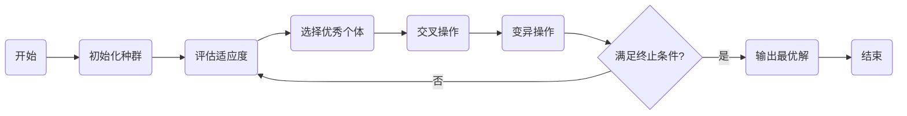

# 遗传算法在城市规划与发展中的应用

## 1. 背景介绍

随着城市化进程的加快，城市规划与发展面临着前所未有的挑战。如何在有限的空间内合理布局城市功能区、优化交通网络、提高环境质量，成为了城市规划师们亟待解决的问题。在这一背景下，遗传算法（Genetic Algorithm, GA）作为一种模拟自然选择和遗传机制的搜索算法，因其全局搜索能力和优化效率，在城市规划领域得到了广泛的应用。

## 2. 核心概念与联系

遗传算法是一种启发式搜索算法，它通过模拟生物进化中的遗传和自然选择机制来解决优化问题。在城市规划中，遗传算法可以帮助我们找到最优或近似最优的规划方案。

### 2.1 遗传算法基本概念

- **种群（Population）**：一组可能的解决方案。
- **个体（Individual）**：种群中的一个解决方案。
- **基因（Gene）**：个体的属性，如城市中的一个区域。
- **染色体（Chromosome）**：一组基因的集合，代表一个完整的解决方案。
- **适应度（Fitness）**：评价个体好坏的标准，通常与目标函数相关。

### 2.2 遗传算法与城市规划的联系

在城市规划中，遗传算法可以用来优化空间布局、交通网络设计、环境影响评估等多个方面。通过定义城市规划问题的适应度函数，遗传算法能够自动搜索出最优或近似最优的规划方案。

## 3. 核心算法原理具体操作步骤

遗传算法的基本操作步骤包括：

1. **初始化**：随机生成一个初始种群。
2. **评估**：计算每个个体的适应度。
3. **选择**：根据适应度选择优秀个体进行繁殖。
4. **交叉**：通过交叉操作产生新个体。
5. **变异**：对新个体进行变异操作以增加多样性。
6. **迭代**：重复评估、选择、交叉和变异操作直到满足终止条件。



## 4. 数学模型和公式详细讲解举例说明

在城市规划的遗传算法中，适应度函数是核心的数学模型，它决定了个体的生存和繁殖概率。适应度函数通常与城市规划的目标函数相关，例如最小化交通拥堵、最大化绿地面积等。

$$
\text{适应度}(x) = \frac{1}{1 + f(x)}
$$

其中，$f(x)$ 是目标函数，$x$ 是染色体代表的解决方案。目标函数的选择取决于具体的规划目标。

## 5. 项目实践：代码实例和详细解释说明

在城市规划项目中，我们可以使用Python编写遗传算法。以下是一个简化的代码示例：

```python
import random

# 定义适应度函数
def fitness(chromosome):
    # 这里是一个示例函数，实际应用中需要根据具体问题定义
    return 1 / (1 + sum(chromosome))

# 初始化种群
population = [[random.randint(0, 1) for _ in range(10)] for _ in range(100)]

# 遗传算法主循环
for generation in range(1000):
    # 评估适应度
    fitness_scores = [fitness(individual) for individual in population]
    # 选择操作...
    # 交叉操作...
    # 变异操作...
    # 检查终止条件...
```

在这个代码示例中，我们定义了一个适应度函数，初始化了一个种群，并设置了遗传算法的主循环框架。

## 6. 实际应用场景

遗传算法在城市规划中的应用场景包括：

- **空间布局优化**：优化住宅、商业、工业区域的分布。
- **交通网络设计**：设计高效的道路网络和公共交通系统。
- **环境影响评估**：评估规划方案对环境的影响。

## 7. 工具和资源推荐

- **编程语言**：Python、Java
- **遗传算法库**：DEAP、Jenetics
- **城市规划软件**：ArcGIS、CityEngine

## 8. 总结：未来发展趋势与挑战

遗传算法在城市规划中的应用仍然处于发展阶段。未来的发展趋势可能包括算法效率的提升、与其他优化算法的结合、以及对复杂城市系统建模的深入研究。面临的挑战包括算法的可解释性、多目标优化问题的处理以及实际应用中的数据获取和处理问题。

## 9. 附录：常见问题与解答

- **Q1：遗传算法是否总能找到最优解？**
- **A1：** 遗传算法是一种启发式算法，它能够找到最优或近似最优解，但不能保证总是找到全局最优解。

- **Q2：遗传算法的计算效率如何？**
- **A2：** 遗传算法的效率取决于问题的复杂度和算法的实现。对于复杂的城市规划问题，需要通过算法参数调优和并行计算等手段来提高效率。

- **Q3：如何选择合适的适应度函数？**
- **A3：** 适应度函数的选择应基于城市规划的具体目标。通常需要与领域专家合作，确保适应度函数能够准确反映问题的关键因素。

作者：禅与计算机程序设计艺术 / Zen and the Art of Computer Programming