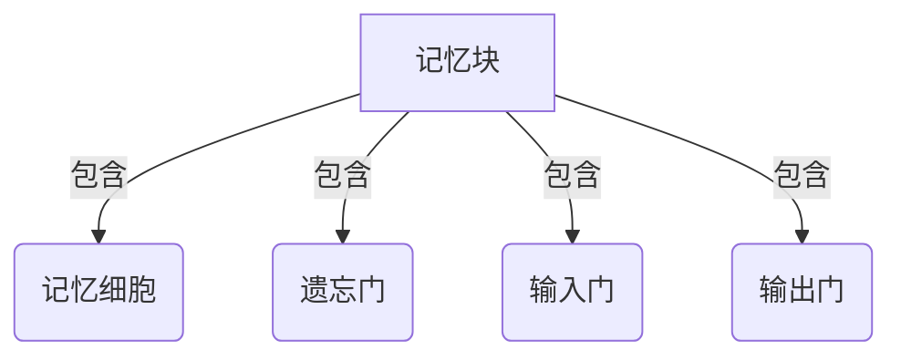

# 长短时记忆网络LSTM原理与代码实例讲解

## 1. 背景介绍

### 1.1 序列数据处理的挑战

在自然语言处理、语音识别、时间序列预测等领域,我们经常会遇到序列数据。与传统的数据不同,序列数据具有时间或空间上的先后顺序关系。例如,一句话是由单词按照一定顺序组成的,一段音频是由声音信号按时间序列排列的。处理这种序列数据需要考虑上下文的影响,传统的机器学习模型如前馈神经网络难以很好地解决这个问题。

### 1.2 递归神经网络的局限性

为了更好地处理序列数据,研究人员提出了循环神经网络(Recurrent Neural Networks, RNNs)。RNN通过内部的循环连接来保留之前的状态,使得网络能够对序列数据进行建模。然而,传统的RNN在实践中存在梯度消失或梯度爆炸的问题,难以捕捉长期的依赖关系,限制了其在处理长序列数据时的性能。

### 1.3 LSTM的提出

为了解决RNN的长期依赖问题,1997年,Hochreiter和Schmidhuber提出了长短期记忆网络(Long Short-Term Memory, LSTM)。LSTM通过精心设计的门控机制和记忆细胞,使网络能够更好地捕获长期依赖关系,从而在处理长序列数据时表现出色。自从提出以来,LSTM在语音识别、机器翻译、图像描述等诸多领域取得了巨大成功,成为序列数据处理的主流模型之一。

## 2. 核心概念与联系

### 2.1 LSTM的核心组成部分

LSTM网络由一系列相互连接的记忆块(Memory Blocks)组成,每个记忆块包含一个记忆细胞(Memory Cell)和三个控制门(Gates):遗忘门(Forget Gate)、输入门(Input Gate)和输出门(Output Gate)。

这些门控机制通过控制信息的流动,使LSTM能够决定何时读取、存储和输出信息,从而有效地捕捉长期依赖关系。

### 2.2 记忆细胞的作用

记忆细胞是LSTM的核心部分,它类似于一条传输带,负责传递和存储信息。在序列处理过程中,记忆细胞会根据门控机制的控制,决定保留、修改或清除其中的信息。这种设计使得LSTM能够有选择性地记住长期的依赖关系,从而克服了传统RNN的梯度消失问题。

### 2.3 门控机制的作用

LSTM中的三个门控机制分别负责不同的功能:

1. **遗忘门(Forget Gate)**: 决定从上一时刻的记忆细胞中丢弃哪些信息。
2. **输入门(Input Gate)**: 决定从当前输入和上一时刻的隐藏状态中获取哪些信息,并更新记忆细胞。
3. **输出门(Output Gate)**: 决定从记忆细胞中输出哪些信息作为当前时刻的隐藏状态。

这些门控机制通过权重和激活函数的组合,实现了对信息流的精细控制,使LSTM能够灵活地处理长期依赖关系。

## 3. 核心算法原理具体操作步骤

LSTM的核心算法原理可以分为以下几个步骤:

### 3.1 步骤1: 计算遗忘门

首先,LSTM需要决定从上一时刻的记忆细胞中丢弃哪些信息。这是通过遗忘门来实现的。遗忘门采用sigmoid激活函数,输出一个0到1之间的值,表示对应位置的信息应该被保留(接近1)还是丢弃(接近0)。

$$
f_t = \sigma(W_f \cdot [h_{t-1}, x_t] + b_f)
$$

其中,$f_t$表示时刻t的遗忘门激活值向量,$W_f$和$b_f$分别是遗忘门的权重矩阵和偏置向量,$h_{t-1}$是上一时刻的隐藏状态向量,$x_t$是当前时刻的输入向量。

### 3.2 步骤2: 计算输入门和更新记忆细胞

接下来,LSTM需要决定从当前输入和上一时刻的隐藏状态中获取哪些信息,并更新记忆细胞。这是通过输入门和一个候选记忆细胞向量$\tilde{C}_t$来实现的。

首先计算输入门的激活值:

$$
i_t = \sigma(W_i \cdot [h_{t-1}, x_t] + b_i)
$$

其中,$i_t$表示时刻t的输入门激活值向量,$W_i$和$b_i$分别是输入门的权重矩阵和偏置向量。

然后计算候选记忆细胞向量$\tilde{C}_t$:

$$
\tilde{C}_t = \tanh(W_C \cdot [h_{t-1}, x_t] + b_C)
$$

其中,$W_C$和$b_C$分别是候选记忆细胞向量的权重矩阵和偏置向量。

最后,根据遗忘门$f_t$和输入门$i_t$,更新记忆细胞$C_t$:

$$
C_t = f_t \odot C_{t-1} + i_t \odot \tilde{C}_t
$$

其中,$\odot$表示元素wise乘积操作。这一步实现了对记忆细胞的选择性更新:遗忘门决定了从上一时刻保留哪些信息,输入门决定了从当前输入和上一隐藏状态中获取哪些新信息。

### 3.3 步骤3: 计算输出门和隐藏状态

最后一步是决定从记忆细胞中输出哪些信息作为当前时刻的隐藏状态。这是通过输出门来实现的。

首先计算输出门的激活值:

$$
o_t = \sigma(W_o \cdot [h_{t-1}, x_t] + b_o)
$$

其中,$o_t$表示时刻t的输出门激活值向量,$W_o$和$b_o$分别是输出门的权重矩阵和偏置向量。

然后,根据输出门$o_t$和记忆细胞$C_t$,计算当前时刻的隐藏状态$h_t$:

$$
h_t = o_t \odot \tanh(C_t)
$$

这一步实现了从记忆细胞中选择性输出信息,输出门决定了哪些信息应该被输出到隐藏状态中。

通过上述三个步骤,LSTM就完成了一个时间步的计算。在处理序列数据时,LSTM会沿着时间维度重复执行这些步骤,不断更新记忆细胞和隐藏状态,从而捕捉长期依赖关系。

## 4. 数学模型和公式详细讲解举例说明

为了更好地理解LSTM的数学模型,我们来看一个具体的例子。假设我们有一个包含3个时间步的序列,每个时间步的输入向量维度为2,隐藏状态向量和记忆细胞向量的维度为3。我们将逐步计算每个时间步的LSTM输出。

### 4.1 初始化

首先,我们需要初始化记忆细胞$C_0$和隐藏状态$h_0$,通常将它们初始化为全0向量。

$$
C_0 = \begin{bmatrix} 0 \\ 0 \\ 0 \end{bmatrix}, \quad h_0 = \begin{bmatrix} 0 \\ 0 \\ 0 \end{bmatrix}
$$

### 4.2 时间步1

在时间步1,假设输入向量为$x_1 = \begin{bmatrix} 0.5 \\ 0.1 \end{bmatrix}$,我们计算各个门控和记忆细胞的值。

遗忘门:

$$
f_1 = \sigma(W_f \cdot [h_0, x_1] + b_f) = \begin{bmatrix} 0.2 \\ 0.4 \\ 0.6 \end{bmatrix}
$$

输入门:

$$
i_1 = \sigma(W_i \cdot [h_0, x_1] + b_i) = \begin{bmatrix} 0.3 \\ 0.1 \\ 0.7 \end{bmatrix}
$$

候选记忆细胞:

$$
\tilde{C}_1 = \tanh(W_C \cdot [h_0, x_1] + b_C) = \begin{bmatrix} 0.4 \\ -0.2 \\ 0.6 \end{bmatrix}
$$

更新记忆细胞:

$$
C_1 = f_1 \odot C_0 + i_1 \odot \tilde{C}_1 = \begin{bmatrix} 0.12 \\ -0.02 \\ 0.42 \end{bmatrix}
$$

输出门:

$$
o_1 = \sigma(W_o \cdot [h_0, x_1] + b_o) = \begin{bmatrix} 0.5 \\ 0.2 \\ 0.3 \end{bmatrix}
$$

隐藏状态:

$$
h_1 = o_1 \odot \tanh(C_1) = \begin{bmatrix} 0.06 \\ -0.01 \\ 0.12 \end{bmatrix}
$$

### 4.3 时间步2

在时间步2,假设输入向量为$x_2 = \begin{bmatrix} 0.2 \\ 0.8 \end{bmatrix}$,我们重复上述步骤计算各个门控和记忆细胞的值。

遗忘门:

$$
f_2 = \sigma(W_f \cdot [h_1, x_2] + b_f) = \begin{bmatrix} 0.1 \\ 0.6 \\ 0.4 \end{bmatrix}
$$

输入门:

$$
i_2 = \sigma(W_i \cdot [h_1, x_2] + b_i) = \begin{bmatrix} 0.2 \\ 0.5 \\ 0.3 \end{bmatrix}
$$

候选记忆细胞:

$$
\tilde{C}_2 = \tanh(W_C \cdot [h_1, x_2] + b_C) = \begin{bmatrix} 0.2 \\ 0.5 \\ -0.4 \end{bmatrix}
$$

更新记忆细胞:

$$
C_2 = f_2 \odot C_1 + i_2 \odot \tilde{C}_2 = \begin{bmatrix} 0.03 \\ 0.25 \\ -0.08 \end{bmatrix}
$$

输出门:

$$
o_2 = \sigma(W_o \cdot [h_1, x_2] + b_o) = \begin{bmatrix} 0.4 \\ 0.1 \\ 0.6 \end{bmatrix}
$$

隐藏状态:

$$
h_2 = o_2 \odot \tanh(C_2) = \begin{bmatrix} 0.01 \\ 0.03 \\ -0.05 \end{bmatrix}
$$

### 4.4 时间步3

在时间步3,假设输入向量为$x_3 = \begin{bmatrix} 0.7 \\ 0.3 \end{bmatrix}$,我们重复上述步骤计算各个门控和记忆细胞的值。

遗忘门:

$$
f_3 = \sigma(W_f \cdot [h_2, x_3] + b_f) = \begin{bmatrix} 0.3 \\ 0.2 \\ 0.5 \end{bmatrix}
$$

输入门:

$$
i_3 = \sigma(W_i \cdot [h_2, x_3] + b_i) = \begin{bmatrix} 0.4 \\ 0.6 \\ 0.1 \end{bmatrix}
$$

候选记忆细胞:

$$
\tilde{C}_3 = \tanh(W_C \cdot [h_2, x_3] + b_C) = \begin{bmatrix} 0.6 \\ -0.4 \\ 0.2 \end{bmatrix}
$$

更新记忆细胞:

$$
C_3 = f_3 \odot C_2 + i_3 \odot \tilde{C}_3 = \begin{bmatrix} 0.24 \\ -0.08 \\ 0.02 \end{bmatrix}
$$

输出门:

$$
o_3 = \sigma(W_o \cdot [h_2, x_3] + b_o) = \begin{bmatrix} 0.1 \\ 0.7 \\ 0.4 \end{bmatrix}
$$

隐藏状态:

$$
h_3 = o_