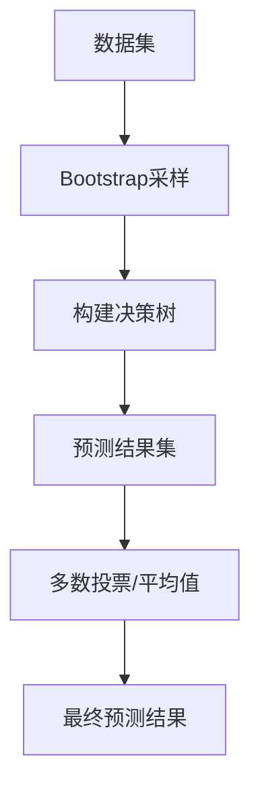

# 随机森林(Random Forests) - 原理与代码实例讲解

## 1.背景介绍

随机森林(Random Forests)是一种强大的机器学习算法,被广泛应用于分类、回归等各种任务中。它是由多棵决策树构成的集成学习器,通过将多个决策树的预测结果进行组合,从而提高了整体的预测准确性和鲁棒性。

随机森林算法最早由Leo Breiman于2001年提出,它在传统决策树算法的基础上引入了两个关键创新点:

1. **随机性引入**:在构建每个决策树时,从特征集合中随机选择一部分特征,而不是使用所有特征。这种随机性有助于减少决策树之间的相关性,从而提高整体模型的泛化能力。

2. **Bootstrap采样**:在构建每个决策树时,从原始数据集中通过有放回抽样的方式随机选取部分样本,而不是直接使用整个数据集。这种采样方式可以确保每棵决策树的训练数据有所不同,从而增加了决策树之间的差异性。

通过上述两种随机性的引入,随机森林算法能够有效避免单棵决策树容易过拟合的问题,同时提高了模型的准确性和鲁棚性。

## 2.核心概念与联系

### 2.1 集成学习(Ensemble Learning)

随机森林属于集成学习(Ensemble Learning)的范畴,集成学习是将多个弱学习器(如决策树)组合成一个强学习器的方法。它的核心思想是通过构建并组合多个学习器来降低过拟合风险,提高预测性能。

集成学习方法可以分为两大类:

1. **Bagging(Bootstrap Aggregating)**:通过对原始数据进行有放回抽样形成新的训练集,并在新的训练集上训练不同的学习器,最终将这些学习器的预测结果进行组合。随机森林就属于Bagging的一种。

2. **Boosting**:通过在原始数据集上训练一系列学习器,每一轮训练时根据前一轮的错误调整样本权重,使得后续的学习器更加关注那些难以正确分类的样本。代表性算法有AdaBoost、Gradient Boosting等。

### 2.2 决策树(Decision Tree)

随机森林的基础学习器是决策树,决策树是一种常用的监督学习算法,可以用于分类和回归任务。它通过递归地将特征空间划分为多个区域,每个区域对应一个预测值,从而构建出一棵树状的决策模型。

决策树的主要优点包括:

- 可解释性强,模型结构清晰易懂
- 能够自动处理数值型和类别型特征
- 可以很好地处理非线性问题
- 训练速度快,对缺失值的容错能力强

然而,单棵决策树容易过拟合,且对数据的微小变化较为敏感。随机森林通过集成多棵决策树,能够有效克服单棵决策树的缺陷,提高整体模型的性能。

### 2.3 随机森林算法流程

随机森林算法的核心流程如下:



具体步骤如下:

1. 从原始数据集中通过Bootstrap采样的方式随机抽取N个训练子集
2. 对每个训练子集,通过随机选择部分特征构建一棵决策树
3. 对于每个测试样本,将其输入到每棵决策树中,得到每棵树的预测结果
4. 对于分类任务,通过多数投票的方式确定最终的类别预测结果;对于回归任务,则取所有决策树预测值的平均值作为最终预测结果

通过上述步骤,随机森林算法能够有效减少过拟合风险,提高模型的泛化能力。

## 3.核心算法原理具体操作步骤

### 3.1 Bootstrap采样

Bootstrap采样是随机森林算法中的一个关键步骤,它通过从原始数据集中有放回地随机抽取N个样本,形成一个新的训练子集。这种采样方式可以确保每棵决策树的训练数据有所不同,从而增加了决策树之间的差异性。

Bootstrap采样的具体操作步骤如下:

1. 初始化一个空的训练子集
2. 从原始数据集中随机抽取一个样本,将其添加到训练子集中
3. 重复步骤2,直到训练子集的大小达到预设值N(通常为原始数据集大小的63.2%)
4. 由于是有放回采样,因此训练子集中可能存在重复的样本,同时也会有一部分样本被遗漏

通过Bootstrap采样,我们可以得到多个不同的训练子集,每个训练子集都用于构建一棵决策树。这种方式可以增加决策树之间的差异性,从而提高整体模型的泛化能力。

### 3.2 构建决策树

在随机森林算法中,每棵决策树的构建过程都包含了一个特征随机选择的步骤,这是与传统决策树算法的主要区别之一。

具体步骤如下:

1. 从所有特征中随机选择一个特征子集,子集的大小通常为$\sqrt{m}$($m$为总特征数)对于分类问题,或$m/3$对于回归问题
2. 在选定的特征子集中,根据某种指标(如信息增益、基尼系数等)选择最优特征,作为当前节点的分裂特征
3. 根据分裂特征的取值,将当前节点的样本划分到子节点
4. 对于每个子节点,重复步骤1-3,递归地构建决策树,直到满足停止条件(如最大深度、最小样本数等)

通过在每个节点随机选择特征子集,可以降低决策树之间的相关性,从而提高整体模型的泛化能力。同时,这种随机性也能够有效减少过拟合的风险。

### 3.3 预测与结果组合

在随机森林算法中,对于每个测试样本,我们需要将其输入到每棵决策树中,得到每棵树的预测结果。然后,通过组合这些预测结果,得到最终的预测结果。

对于分类任务,我们采用多数投票的方式确定最终的类别预测结果。具体步骤如下:

1. 将测试样本输入到每棵决策树中,得到每棵树对该样本的类别预测结果
2. 统计每个类别被预测的次数
3. 选择被预测次数最多的类别作为最终的预测结果

对于回归任务,我们取所有决策树预测值的平均值作为最终预测结果。具体步骤如下:

1. 将测试样本输入到每棵决策树中,得到每棵树对该样本的回归值预测结果
2. 计算所有预测结果的平均值
3. 将平均值作为最终的预测结果

通过组合多棵决策树的预测结果,随机森林算法能够有效减少单棵决策树的偏差和方差,从而提高整体模型的性能。

## 4.数学模型和公式详细讲解举例说明

### 4.1 信息增益与信息熵

在构建决策树时,我们需要选择一个最优特征作为分裂节点。常用的指标之一是信息增益(Information Gain),它基于信息熵(Entropy)的概念。

**信息熵**用于度量数据集的无序程度,其定义如下:

$$
H(X) = -\sum_{i=1}^{n}p(x_i)\log_2 p(x_i)
$$

其中,$X$是一个离散随机变量,取值为$\{x_1, x_2, \ldots, x_n\}$,而$p(x_i)$表示$x_i$的概率。

对于二分类问题,信息熵可以简化为:

$$
H(X) = -p_+\log_2 p_+ - p_-\log_2 p_-
$$

其中,$p_+$和$p_-$分别表示正例和反例的概率。

**信息增益**则用于度量特征对数据集的"纯度"的增益,定义如下:

$$
IG(X, a) = H(X) - H(X|a)
$$

其中,$a$是一个特征,$H(X|a)$表示在给定特征$a$的条件下,$X$的条件熵,计算方式为:

$$
H(X|a) = \sum_{v\in V(a)}\frac{|X_v|}{|X|}H(X_v)
$$

其中,$V(a)$表示特征$a$的所有可能取值,$X_v$表示在特征$a$取值为$v$时的子数据集,$|X_v|$和$|X|$分别表示$X_v$和$X$的样本数量。

在构建决策树时,我们会选择信息增益最大的特征作为分裂节点,这样可以最大程度地减少数据的无序程度,提高模型的准确性。

### 4.2 基尼系数

基尼系数(Gini Impurity)也是一种常用的特征选择指标,它用于度量数据集的"纯度"。对于二分类问题,基尼系数定义如下:

$$
\text{Gini}(X) = 1 - \sum_{i=1}^{n}p(x_i)^2 = p_+(1-p_+) + p_-(1-p_-)
$$

其中,$p_+$和$p_-$分别表示正例和反例的概率。

基尼系数的取值范围为$[0, 0.5]$,当数据集中只有一个类别时,基尼系数为0,表示数据集是"纯的";当两个类别的概率相等时,基尼系数取最大值0.5,表示数据集是最不"纯"的。

在构建决策树时,我们会选择能够最大程度降低基尼系数的特征作为分裂节点,从而提高模型的准确性。

### 4.3 袋外估计(Out-of-Bag Estimation)

在随机森林算法中,我们可以利用袋外估计(Out-of-Bag Estimation)来评估模型的性能,而无需单独的测试集。

具体来说,对于每棵决策树,由于是通过Bootstrap采样构建的,因此总有约36.8%的样本没有被用作训练数据。我们可以将这些未被使用的样本称为"袋外样本"(Out-of-Bag Samples)。

对于每个袋外样本,我们可以将其输入到所有不包含它的决策树中,得到这些树对该样本的预测结果。然后,我们可以将这些预测结果进行组合,得到该样本的最终预测结果。

通过比较所有袋外样本的真实标签和预测标签,我们可以计算出模型在这些样本上的准确率或其他评估指标,从而估计模型的泛化能力。

袋外估计的优点是无需单独准备测试集,可以充分利用原始数据集中的所有样本。同时,它也能够为我们提供一种评估模型性能的方式,而不需要进行交叉验证等耗时操作。

## 5.项目实践:代码实例和详细解释说明

以下是使用Python中的scikit-learn库实现随机森林算法的代码示例,我们将基于著名的鸢尾花数据集(Iris Dataset)进行分类任务。

### 5.1 导入所需库

```python
from sklearn.datasets import load_iris
from sklearn.model_selection import train_test_split
from sklearn.ensemble import RandomForestClassifier
from sklearn.metrics import accuracy_score
```

### 5.2 加载数据集

```python
# 加载鸢尾花数据集
iris = load_iris()
X, y = iris.data, iris.target
```

### 5.3 划分训练集和测试集

```python
# 将数据集划分为训练集和测试集
X_train, X_test, y_train, y_test = train_test_split(X, y, test_size=0.2, random_state=42)
```

### 5.4 创建随机森林分类器

```python
# 创建随机森林分类器
rf = RandomForestClassifier(n_estimators=100, max_depth=5, random_state=42)
```

在上面的代码中,我们创建了一个随机森林分类器实例,其中:

- `n_estimators=100`表示要构建100棵决策树
- `max_depth=5`表示每棵决策树的最大深度为5
- `random_state=42`是为了确保实验可重复性

### 5.5 训练模型

```python
# 训练模型
rf.fit(X_train, y_train)
```

### 5.