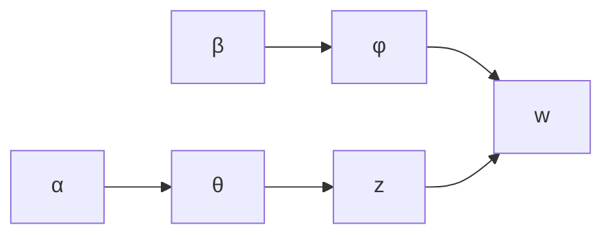

# 隐含狄利克雷分布(LDA)原理与代码实战案例讲解

## 1. 背景介绍

### 1.1 文本挖掘与主题模型

在大数据时代,海量的文本数据被不断产生和积累。如何从这些海量文本中高效地提取有价值的信息和知识,成为了一个极具挑战的课题。文本挖掘(Text Mining)作为数据挖掘(Data Mining)在文本数据上的应用和拓展,为解决这一问题提供了有力的工具和方法。

主题模型(Topic Model)是文本挖掘领域中一种无监督学习的统计模型,旨在从大规模的文本集合中自动发现隐藏的"主题"(Topic)结构。它假设一个文档是由若干个潜在的主题构成,而每个主题又是由一组相关的词语混合而成。通过对文本集合进行概率建模和参数估计,主题模型可以揭示文档集合中隐含的主题分布和每个主题的词语分布。

### 1.2 LDA模型的重要性

隐含狄利克雷分布(Latent Dirichlet Allocation, LDA)是主题模型中最著名和最成功的一种,被广泛应用于文本挖掘、信息检索、自然语言处理等领域。LDA模型具有以下重要意义:

1. **自动发现主题**:LDA可以自动从文本集合中发现隐含的主题,而无需人工干预或标注,大大降低了主题发现的成本和工作量。

2. **主题表示**:LDA将每个文档表示为一个主题分布,每个主题又由一组词语及其概率组成。这种低维密集的表示方式,有利于后续的文本分类、聚类和检索等任务。

3. **多主题文档建模**:与其他主题模型不同,LDA承认一个文档可能包含多个主题,更符合现实情况。

4. **生成式建模**:LDA是一种生成式模型,它定义了一个生成文档集合的概率过程。这种建模方式使得LDA具有良好的解释性和扩展性。

5. **贝叶斯框架**:LDA建立在贝叶斯框架之上,能够很好地处理数据的稀疏性和维数灾难问题。

综上所述,LDA模型在文本挖掘领域具有重要的理论价值和广阔的应用前景,是当前主题模型研究的核心和热点。

## 2. 核心概念与联系

### 2.1 核心概念

为了理解LDA模型,我们首先需要掌握以下几个核心概念:

1. **语料库(Corpus)**: 指一个包含多个文档的大型文本集合。

2. **文档(Document)**: 语料库中的一个单独文本单元,通常由一系列词语(Word)构成。

3. **词袋(Bag of Words)**: 一种将文档表示为其所包含的词语的多重集(允许重复)的建模方式。

4. **主题(Topic)**: 一组与某个特定主题相关的词语的概率分布。

5. **文档-主题分布(Document-Topic Distribution)**: 描述一个文档包含每个主题的概率分布。

6. **主题-词语分布(Topic-Word Distribution)**: 描述一个主题包含每个词语的概率分布。

7. **狄利克雷分布(Dirichlet Distribution)**: 一种常用于描述多项分布的概率分布。

8. **平滑参数(Smoothing Parameter)**: 用于控制狄利克雷分布的形状和稀疏程度的参数。

### 2.2 核心概念之间的联系

LDA模型将上述核心概念紧密联系在一起,构建了一个生成文档集合的概率过程。具体来说:

1. 对于每个语料库,LDA假设存在 $K$ 个潜在主题。

2. 每个主题由一个主题-词语分布 $\phi_k$ 表示,它是一个多项分布,描述了该主题包含每个词语的概率。

3. 每个文档 $d$ 由一个文档-主题分布 $\theta_d$ 表示,它也是一个多项分布,描述了该文档包含每个主题的概率。

4. 生成文档 $d$ 的过程是:首先从文档-主题分布 $\theta_d$ 中抽取一个主题 $z$,然后从该主题的主题-词语分布 $\phi_z$ 中抽取一个词语 $w$,重复该过程直到生成完整文档。

5. 文档-主题分布 $\theta_d$ 和主题-词语分布 $\phi_k$ 都服从狄利克雷分布,由平滑参数 $\alpha$ 和 $\beta$ 控制。

通过这种生成式建模方式,LDA将文档、主题、词语以及它们之间的关系有机地结合在一起,形成了一个概率图模型。利用贝叶斯推理和参数估计技术,我们可以从观测到的文档集合中反向推导出隐含的主题结构。

## 3. 核心算法原理具体操作步骤 

### 3.1 LDA生成过程

LDA模型定义了一个生成文档集合的概率过程,具体步骤如下:

1. 对于语料库中的每个主题 $k$,从平滑参数 $\beta$ 的狄利克雷分布中抽取一个主题-词语分布 $\phi_k$:

$$\phi_k \sim \text{Dirichlet}(\beta)$$

2. 对于每个文档 $d$:
    - 从平滑参数 $\alpha$ 的狄利克雷分布中抽取一个文档-主题分布 $\theta_d$:
    
    $$\theta_d \sim \text{Dirichlet}(\alpha)$$
    
    - 对于文档 $d$ 中的每个词语位置 $n$:
        - 从文档-主题分布 $\theta_d$ 中抽取一个主题 $z_{dn}$
        - 从该主题的主题-词语分布 $\phi_{z_{dn}}$ 中抽取一个词语 $w_{dn}$

这个生成过程可以用一个简单的plate notation表示:



其中:
- $\alpha$ 和 $\beta$ 是平滑参数
- $\theta$ 是文档-主题分布
- $\phi$ 是主题-词语分布
- $z$ 是主题指示变量
- $w$ 是观测到的词语

通过这个生成过程,LDA将文档、主题和词语之间的关系建模为一个联合概率分布:

$$p(w,z,\theta,\phi|\alpha,\beta) = p(\theta|\alpha)\prod_{k=1}^Kp(\phi_k|\beta)\prod_{n=1}^Np(z_{dn}|\theta_d)p(w_{dn}|\phi_{z_{dn}})$$

其中, $N$ 是文档 $d$ 中的词语数量, $K$ 是主题数量。

### 3.2 参数估计

在观测到文档集合 $\mathcal{D}$ 之后,我们需要估计模型参数 $\theta$ 和 $\phi$,以便推断出隐含的主题结构。由于模型的复杂性,通常采用近似推断算法进行参数估计,常用的方法有:

1. **变分贝叶斯(Variational Bayes)**: 通过最小化变分下界(ELBO)来近似计算后验分布。

2. **吉布斯采样(Gibbs Sampling)**: 利用马尔可夫链蒙特卡罗(MCMC)方法,逐步收敛于目标分布。

3. **期望最大化(Expectation-Maximization, EM)**: 迭代地最大化观测数据的期望对数似然函数。

以吉布斯采样为例,其基本思想是:对于每个词语位置 $n$,根据上下文信息,重新抽取其主题指示变量 $z_{dn}$,从而更新 $\theta$ 和 $\phi$ 的估计值。具体步骤如下:

1. 初始化 $\theta$ 和 $\phi$ 的估计值。

2. 对于每个词语位置 $n$:
    - 从当前的 $\theta$ 和 $\phi$ 估计值中,计算 $z_{dn}=k$ 的条件概率:
    
    $$p(z_{dn}=k|z_{\neg dn},w,\alpha,\beta) \propto \frac{n_{d,\neg n}^{(k)}+\alpha_k}{n_d+\sum_k\alpha_k}\cdot\frac{n_{k,\neg n}^{(w_{dn})}+\beta_{w_{dn}}}{n_k+\sum_v\beta_v}$$
    
    其中, $n_{d,\neg n}^{(k)}$ 是文档 $d$ 中除去位置 $n$ 之外被分配给主题 $k$ 的词语数; $n_{k,\neg n}^{(w_{dn})}$ 是除去位置 $n$ 之外被分配给主题 $k$ 的词语 $w_{dn}$ 的数量。
    
    - 根据上述条件概率,重新抽取 $z_{dn}$ 的值。
    
3. 根据抽样结果,更新 $\theta$ 和 $\phi$ 的估计值:

$$\hat{\theta}_{d,k} = \frac{n_{d}^{(k)}+\alpha_k}{n_d+\sum_k\alpha_k}$$

$$\hat{\phi}_{k,v} = \frac{n_{k}^{(v)}+\beta_v}{n_k+\sum_v\beta_v}$$

4. 重复步骤2和3,直到收敛或达到最大迭代次数。

通过上述迭代过程,我们可以获得 $\theta$ 和 $\phi$ 的近似估计值,从而推断出文档集合中的主题结构。

## 4. 数学模型和公式详细讲解举例说明

### 4.1 狄利克雷分布

狄利克雷分布(Dirichlet Distribution)是一种常用于描述多项分布的概率分布。在LDA模型中,它被用于生成文档-主题分布 $\theta$ 和主题-词语分布 $\phi$。

对于一个 $K$ 维的狄利克雷分布,其概率密度函数为:

$$\text{Dirichlet}(\theta|\alpha) = \frac{\Gamma(\sum_{k=1}^K\alpha_k)}{\prod_{k=1}^K\Gamma(\alpha_k)}\prod_{k=1}^K\theta_k^{\alpha_k-1}$$

其中:
- $\theta = (\theta_1, \theta_2, \ldots, \theta_K)$ 是一个 $K$ 维的多项分布参数向量,满足 $\sum_{k=1}^K\theta_k=1$
- $\alpha = (\alpha_1, \alpha_2, \ldots, \alpha_K)$ 是 $K$ 个正实数,称为平滑参数或者先验参数
- $\Gamma(\cdot)$ 是伽马函数

平滑参数 $\alpha$ 控制了狄利克雷分布的形状和稀疏程度。当所有 $\alpha_k=1$ 时,狄利克雷分布就是一个均匀分布;当某些 $\alpha_k$ 较大时,对应的 $\theta_k$ 也会较大,分布更加集中。

在LDA模型中:
- 文档-主题分布 $\theta_d \sim \text{Dirichlet}(\alpha)$,即每个文档的主题分布都服从一个平滑参数为 $\alpha$ 的狄利克雷分布。
- 主题-词语分布 $\phi_k \sim \text{Dirichlet}(\beta)$,即每个主题的词语分布都服从一个平滑参数为 $\beta$ 的狄利克雷分布。

通过对 $\alpha$ 和 $\beta$ 的不同设置,我们可以控制模型的稀疏程度和主题的分布形状。

### 4.2 例子说明

为了更好地理解狄利克雷分布,我们来看一个具体的例子。假设我们有一个语料库,包含 3 个主题(K=3),每个主题的词语分布 $\phi_k$ 服从一个平滑参数 $\beta=(0.1, 0.2, 0.7)$ 的狄利克雷分布。

我们可以从这个狄利克雷分布中随机抽取 3 个主题-词语分布,结果如下:

```python
import numpy as np
from scipy.stats import dirichlet

beta = np.array([0.1, 0.2, 0.7])
phi = dirichlet.rvs(beta, size=3)
print(phi)
```

```
[[0.02858824 0.10650169 0.86491007]
 [0.04942748 0.28097871 0.66959381]
 [0.00443173 0.03670596 