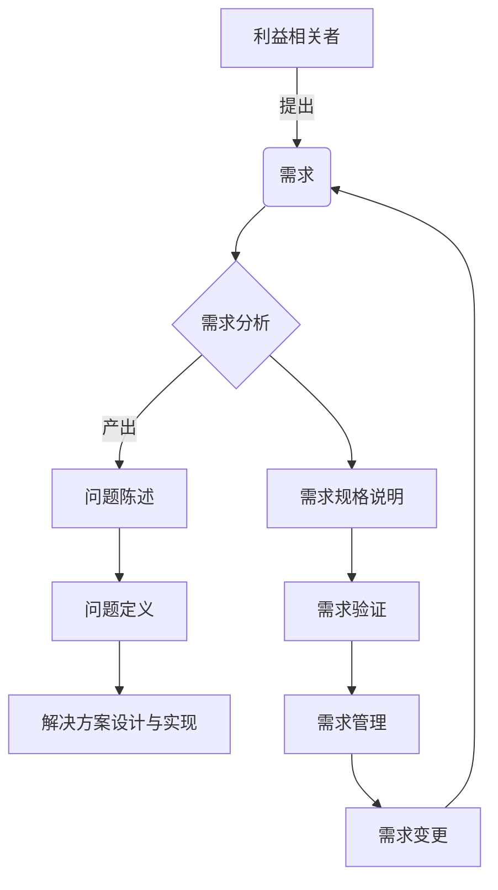

# 需求分析与问题定义原理与代码实战案例讲解

## 1.背景介绍

在软件开发过程中,需求分析和问题定义是最关键的初始阶段。它们为整个项目奠定了基础,确保开发团队清楚地理解需要解决的问题以及系统应该具备的功能。需求分析旨在收集和分析利益相关者的需求,而问题定义则将这些需求转化为可操作的问题陈述。良好的需求分析和问题定义有助于降低项目风险,提高软件质量,并确保最终交付的产品满足客户期望。

### 1.1 需求分析的重要性

需求分析是软件开发生命周期中不可或缺的一个环节。它涉及与利益相关者(如客户、用户和其他相关方)进行沟通,以收集和理解他们对系统的期望和需求。通过需求分析,开发团队可以全面了解系统应该具备的功能、性能、可用性、安全性等方面的要求。

准确的需求分析可以带来以下好处:

- 减少项目范围蔓延和需求变更的风险
- 提高软件质量和客户满意度
- 降低开发成本和时间
- 促进利益相关者之间的共识和理解
- 为后续的设计、开发和测试阶段奠定坚实的基础

### 1.2 问题定义的作用

问题定义是将收集到的需求转化为清晰、可操作的问题陈述的过程。它有助于开发团队深入理解需要解决的核心问题,并为设计和实现合适的解决方案提供指导。

有效的问题定义可以带来以下优势:

- 明确项目的目标和范围
- 促进团队成员对问题的共同理解
- 为评估和比较不同解决方案提供依据
- 确保解决方案符合业务需求和技术约束
- 降低项目风险,提高成功的可能性

## 2.核心概念与联系

需求分析和问题定义是密切相关的概念,它们共同构成了软件开发过程的基础。以下是一些核心概念及其相互关系:

### 2.1 利益相关者 (Stakeholders)

利益相关者是指对系统或项目有利益关系的个人或组织。他们可能包括客户、用户、开发团队、管理层等。需求分析的目标之一就是识别和理解所有利益相关者的需求。

### 2.2 需求 (Requirements)

需求是对系统应该具备的功能、性能、约束条件等方面的描述。需求可以分为以下几种类型:

- 功能需求 (Functional Requirements)
- 非功能需求 (Non-functional Requirements)
- 业务需求 (Business Requirements)
- 用户需求 (User Requirements)
- 系统需求 (System Requirements)

需求分析的主要任务是收集和分析这些需求,以确保它们完整、一致和可实现。

### 2.3 问题陈述 (Problem Statement)

问题陈述是对需要解决的核心问题的清晰描述。它通常包括以下几个方面:

- 问题背景和动机
- 问题范围和边界
- 约束条件和假设
- 期望的解决方案特征

问题定义的目标是将收集到的需求转化为一个明确、可操作的问题陈述,为后续的解决方案设计和实现提供指导。

### 2.4 需求工程 (Requirements Engineering)

需求工程是一个系统化的过程,旨在管理和控制需求的生命周期。它包括以下主要活动:

- 需求获取 (Requirements Elicitation)
- 需求分析 (Requirements Analysis)
- 需求规格说明 (Requirements Specification)
- 需求验证 (Requirements Validation)
- 需求管理 (Requirements Management)

需求分析和问题定义是需求工程过程中的关键环节,它们为后续的需求规格说明、设计和实现奠定了基础。

### 2.5 核心概念关系图

以下是需求分析和问题定义的核心概念及其关系的 Mermaid 流程图:



## 3.核心算法原理具体操作步骤

需求分析和问题定义并不是一个单一的算法,而是一个系统化的过程,涉及多个步骤和活动。以下是这个过程的核心步骤:

### 3.1 识别利益相关者

第一步是识别所有与系统或项目相关的利益相关者。这可能包括客户、用户、开发团队、管理层、监管机构等。了解每个利益相关者的角色、权责和期望对于收集全面的需求至关重要。

### 3.2 需求获取

需求获取是收集利益相关者需求的过程。常用的技术包括:

- 访谈 (Interviews)
- 问卷调查 (Surveys)
- 观察 (Observations)
- 研讨会 (Workshops)
- 原型展示 (Prototyping)
- 文档分析 (Document Analysis)

选择合适的技术取决于项目的性质、利益相关者的可用性以及需求的复杂程度。

### 3.3 需求分析

需求分析是对收集到的需求进行审查、整理和优先级排序的过程。它包括以下活动:

- 需求分类和组织
- 需求冲突检测和解决
- 需求优先级确定
- 需求可行性评估
- 需求跟踪和管理

需求分析的目标是确保需求完整、一致、可实现,并与项目目标和约束条件相符。

### 3.4 问题定义

问题定义是将分析后的需求转化为清晰、可操作的问题陈述的过程。它通常包括以下步骤:

1. 确定问题背景和动机
2. 界定问题范围和边界
3. 识别约束条件和假设
4. 描述期望的解决方案特征

问题定义应该清楚地阐明需要解决的核心问题,为后续的解决方案设计和实现提供指导。

### 3.5 需求规格说明

需求规格说明是将分析后的需求以标准化的格式记录下来的过程。它通常包括以下内容:

- 功能需求描述
- 非功能需求描述
- 用例场景
- 界面模拟图
- 数据模型
- 术语表

需求规格说明文档是与利益相关者达成共识的依据,也是后续设计和开发的输入。

### 3.6 需求验证和管理

需求验证是确保需求规格说明符合利益相关者的期望和需求的过程。常用的技术包括:

- 需求评审 (Requirements Reviews)
- 原型评估 (Prototyping Evaluations)
- 用户测试 (User Testing)

需求管理是跟踪和控制需求变更的过程,以确保需求的一致性和可追溯性。它包括版本控制、变更控制和基线管理等活动。

## 4.数学模型和公式详细讲解举例说明

虽然需求分析和问题定义主要是一个定性的过程,但在某些情况下,数学模型和公式可以为需求分析提供支持。以下是一些常见的数学模型和公式:

### 4.1 优先级模型

当需求数量众多时,需要对它们进行优先级排序。一种常用的优先级模型是analyticHierarchy Process (AHP)。它使用一种层次分析方法,通过构建判断矩阵和计算特征向量来确定每个需求的优先级权重。

设有 $n$ 个需求 $R_1, R_2, \dots, R_n$,我们构建一个 $n \times n$ 的判断矩阵 $A$,其中 $a_{ij}$ 表示需求 $R_i$ 相对于需求 $R_j$ 的重要程度。通常取值为 $1, 3, 5, 7, 9$ 及其倒数,其中 $9$ 表示绝对重要,而 $1$ 表示同等重要。

$$
A = \begin{bmatrix}
    1 & a_{12} & \cdots & a_{1n} \\
    a_{21} & 1 & \cdots & a_{2n} \\
    \vdots & \vdots & \ddots & \vdots \\
    a_{n1} & a_{n2} & \cdots & 1
\end{bmatrix}
$$

然后,我们计算矩阵 $A$ 的特征向量 $w = (w_1, w_2, \dots, w_n)^T$,其中 $w_i$ 表示需求 $R_i$ 的优先级权重。特征向量满足方程:

$$
Aw = \lambda_{\max}w
$$

其中 $\lambda_{\max}$ 是矩阵 $A$ 的最大特征值。

通过计算特征向量 $w$,我们可以获得每个需求的优先级权重,从而指导需求的实现顺序和资源分配。

### 4.2 用例点模型

用例点模型是一种估算软件规模和开发工作量的方法。它基于用例的复杂程度来预测软件的规模。

设有 $n$ 个用例 $U_1, U_2, \dots, U_n$,每个用例的复杂程度分别为 $c_1, c_2, \dots, c_n$。用例点 (Use Case Point, UCP) 的计算公式如下:

$$
\text{UCP} = \text{UFC} + \sum_{i=1}^{n} c_i
$$

其中 $\text{UFC}$ 是无环境复杂度因子的用例点数,通常取值为 $10$ 或 $15$。

然后,我们可以使用历史项目数据建立 $\text{UCP}$ 与软件规模 (如源代码行数或功能点数) 之间的回归模型,从而预测新项目的规模和工作量。

### 4.3 其他模型

除了上述模型外,还有一些其他的数学模型可以应用于需求分析,例如:

- 马尔可夫决策过程 (Markov Decision Processes, MDP) 用于需求优化和决策
- 形式化规范语言 (如 Z 记法) 用于需求的精确描述
- 统计模型 (如回归分析) 用于需求与项目属性之间的关系分析

这些模型的使用取决于具体的项目需求和约束条件。在实际应用中,需要权衡模型的复杂性和实用性。

## 5.项目实践:代码实例和详细解释说明

虽然需求分析和问题定义主要是一个定性的过程,但我们可以使用编程语言和工具来支持和自动化某些任务。以下是一些代码实例和解释:

### 5.1 需求管理工具

需求管理工具可以帮助我们跟踪和控制需求的变更。以下是一个使用 Python 和 SQLite 实现的简单需求管理系统的示例:

```python
import sqlite3

# 连接到 SQLite 数据库
conn = sqlite3.connect('requirements.db')
c = conn.cursor()

# 创建需求表
c.execute('''CREATE TABLE IF NOT EXISTS requirements
             (id INTEGER PRIMARY KEY, title TEXT, description TEXT, priority INTEGER, status TEXT)''')

# 添加新需求
def add_requirement(title, description, priority, status):
    c.execute("INSERT INTO requirements (title, description, priority, status) VALUES (?, ?, ?, ?)",
              (title, description, priority, status))
    conn.commit()

# 更新需求状态
def update_requirement_status(id, new_status):
    c.execute("UPDATE requirements SET status = ? WHERE id = ?", (new_status, id))
    conn.commit()

# 查询需求
def get_requirements(status=None):
    query = "SELECT * FROM requirements"
    if status:
        query += " WHERE status = ?"
        c.execute(query, (status,))
    else:
        c.execute(query)
    return c.fetchall()

# 示例用法
add_requirement("登录功能", "用户能够使用用户名和密码登录系统", 1, "待办")
add_requirement("导出报告", "系统能够导出 PDF 格式的报告", 2, "待办")

update_requirement_status(1, "进行中")

requirements = get_requirements(status="待办")
print("待办需求:")
for req in requirements:
    print(f"ID: {req[0]}, 标题: {req[1]}, 优先级: {req[3]}")
```

在这个示例中,我们使用 SQLite 数据库存储需求信息,包括标题、描述、优先级和状态。我们定义了添加需求、更新需求状态和查询需求的函数,方便对需求