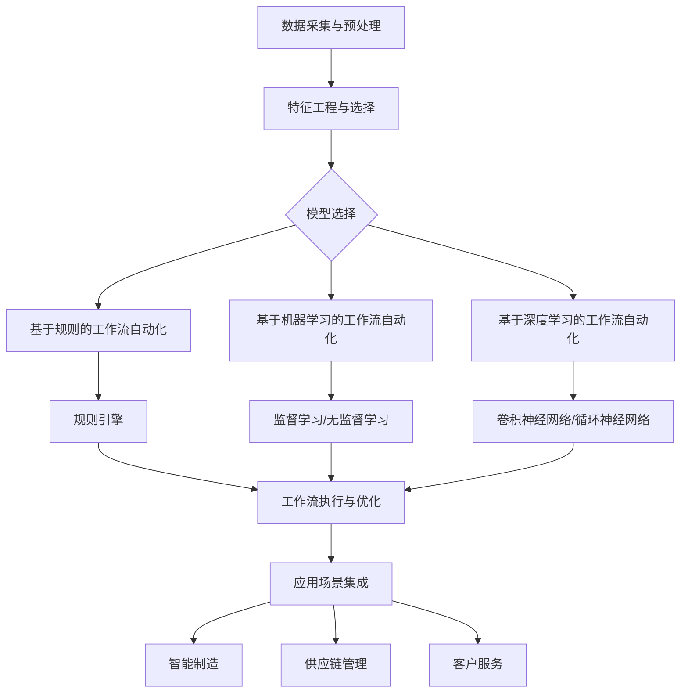

# 面向行业4.0的AI代理工作流自动化解决方案

## 1. 背景介绍
### 1.1 行业4.0的概念与特点
#### 1.1.1 行业4.0的定义
#### 1.1.2 行业4.0的核心技术
#### 1.1.3 行业4.0的主要特点
### 1.2 AI技术在行业4.0中的应用现状
#### 1.2.1 AI在智能制造中的应用
#### 1.2.2 AI在供应链管理中的应用  
#### 1.2.3 AI在预测性维护中的应用
### 1.3 工作流自动化的重要性
#### 1.3.1 提高效率与生产力
#### 1.3.2 降低成本与错误率
#### 1.3.3 增强企业竞争力

## 2. 核心概念与联系
### 2.1 AI代理的定义与特点
#### 2.1.1 AI代理的概念
#### 2.1.2 AI代理的主要功能
#### 2.1.3 AI代理的优势
### 2.2 工作流自动化的概念与流程
#### 2.2.1 工作流自动化的定义
#### 2.2.2 工作流自动化的基本流程
#### 2.2.3 工作流自动化的关键要素
### 2.3 AI代理与工作流自动化的结合
#### 2.3.1 AI代理在工作流自动化中的作用
#### 2.3.2 AI代理与工作流自动化的集成方式
#### 2.3.3 AI代理驱动的工作流自动化的优势

## 3. 核心算法原理具体操作步骤
### 3.1 基于规则的工作流自动化
#### 3.1.1 规则引擎的原理
#### 3.1.2 规则的定义与管理
#### 3.1.3 基于规则的工作流执行过程
### 3.2 基于机器学习的工作流自动化  
#### 3.2.1 机器学习算法概述
#### 3.2.2 监督学习在工作流自动化中的应用
#### 3.2.3 无监督学习在工作流自动化中的应用
### 3.3 基于深度学习的工作流自动化
#### 3.3.1 深度学习模型概述 
#### 3.3.2 卷积神经网络在工作流自动化中的应用
#### 3.3.3 循环神经网络在工作流自动化中的应用

## 4. 数学模型和公式详细讲解举例说明
### 4.1 马尔可夫决策过程
#### 4.1.1 马尔可夫决策过程的定义
#### 4.1.2 状态转移概率与奖励函数
#### 4.1.3 最优策略的求解方法
### 4.2 强化学习模型 
#### 4.2.1 Q-learning算法
#### 4.2.2 SARSA算法
#### 4.2.3 Deep Q Network算法
### 4.3 序列到序列模型
#### 4.3.1 编码器-解码器框架
#### 4.3.2 注意力机制
#### 4.3.3 Transformer模型

## 5. 项目实践：代码实例和详细解释说明
### 5.1 基于规则的工作流自动化实例
#### 5.1.1 规则引擎的实现
#### 5.1.2 工作流定义与执行
#### 5.1.3 规则管理与优化
### 5.2 基于机器学习的工作流自动化实例
#### 5.2.1 数据预处理与特征工程
#### 5.2.2 模型训练与评估
#### 5.2.3 模型部署与应用
### 5.3 基于深度学习的工作流自动化实例
#### 5.3.1 数据准备与增强
#### 5.3.2 模型设计与训练
#### 5.3.3 模型优化与推理

## 6. 实际应用场景
### 6.1 智能制造领域
#### 6.1.1 生产计划与调度优化
#### 6.1.2 设备预测性维护
#### 6.1.3 质量检测与异常检测
### 6.2 供应链管理领域
#### 6.2.1 需求预测与库存优化
#### 6.2.2 物流路径规划与调度
#### 6.2.3 供应商评估与风险管理
### 6.3 客户服务领域
#### 6.3.1 智能客服与问答系统
#### 6.3.2 个性化推荐与营销
#### 6.3.3 客户行为分析与预测

## 7. 工具和资源推荐
### 7.1 开源工作流自动化平台
#### 7.1.1 Apache Airflow
#### 7.1.2 Kubeflow
#### 7.1.3 Prefect
### 7.2 AI开发框架与库
#### 7.2.1 TensorFlow
#### 7.2.2 PyTorch
#### 7.2.3 Scikit-learn
### 7.3 数据处理与可视化工具
#### 7.3.1 Pandas
#### 7.3.2 Matplotlib
#### 7.3.3 Seaborn

## 8. 总结：未来发展趋势与挑战
### 8.1 AI代理工作流自动化的发展趋势
#### 8.1.1 智能化与自适应能力的提升
#### 8.1.2 跨领域与跨平台的集成
#### 8.1.3 人机协作与增强
### 8.2 面临的挑战与对策
#### 8.2.1 数据质量与安全
#### 8.2.2 模型解释性与可信度
#### 8.2.3 伦理与法律问题
### 8.3 未来研究方向与展望
#### 8.3.1 联邦学习与隐私保护
#### 8.3.2 元学习与迁移学习
#### 8.3.3 人工智能与区块链的融合

## 9. 附录：常见问题与解答
### 9.1 如何选择合适的工作流自动化平台？
### 9.2 如何处理不同格式和质量的数据？
### 9.3 如何评估AI代理工作流自动化的效果？
### 9.4 如何确保AI代理的决策符合伦理与法律要求？
### 9.5 如何平衡自动化与人工干预？

行业4.0时代,制造业正面临着前所未有的数字化转型挑战。AI技术的快速发展为企业带来了新的机遇,通过将AI与工作流自动化相结合,可以显著提升生产效率、优化资源配置、降低运营成本。本文旨在探讨面向行业4.0的AI代理工作流自动化解决方案,分析其核心概念、关键技术、实践案例以及未来发展趋势。

AI代理是一种智能化的软件系统,能够根据环境状态自主地执行任务并做出决策。它通过机器学习算法不断优化自身的策略,从而实现自适应和自我完善。将AI代理引入工作流自动化,可以使得工作流更加灵活、高效。传统的工作流自动化主要依赖于预先定义好的规则,而AI驱动的工作流自动化则能够根据实时数据动态调整执行路径,适应复杂多变的生产环境。

基于规则的工作流自动化采用规则引擎来推理和执行任务,适用于相对固定和结构化的流程。而基于机器学习的工作流自动化则利用监督学习、无监督学习等算法从历史数据中学习和优化工作流模型。深度学习技术如卷积神经网络、循环神经网络等在工作流自动化中也有广泛应用,特别是在涉及图像、语音、文本等非结构化数据处理时。

在实际应用中,马尔可夫决策过程、强化学习、序列到序列模型等数学模型和算法被广泛用于工作流自动化的优化决策。通过合理定义状态空间、动作空间和奖励函数,可以求解出最优的工作流执行策略。项目实践中,开源工作流平台如Apache Airflow、Kubeflow等以及主流AI开发框架如TensorFlow、PyTorch等为快速搭建AI代理工作流自动化系统提供了便利。

AI代理工作流自动化在智能制造、供应链管理、客户服务等领域有广阔的应用前景。通过对生产计划、设备维护、物流配送、客户互动等环节的自动化和优化,可以显著提升企业的运营效率和市场竞争力。同时,AI代理工作流自动化的发展也面临着数据质量、模型可解释性、伦理安全等方面的挑战,需要在技术创新的同时兼顾合规与监管。

未来,AI代理工作流自动化将向着更加智能化、自适应的方向发展,并与其他前沿技术如联邦学习、元学习、区块链等深度融合,为行业4.0的数字化转型赋能。企业应积极拥抱变革,建立敏捷高效的工作流自动化机制,驱动业务创新和价值增长。

作者：禅与计算机程序设计艺术 / Zen and the Art of Computer Programming