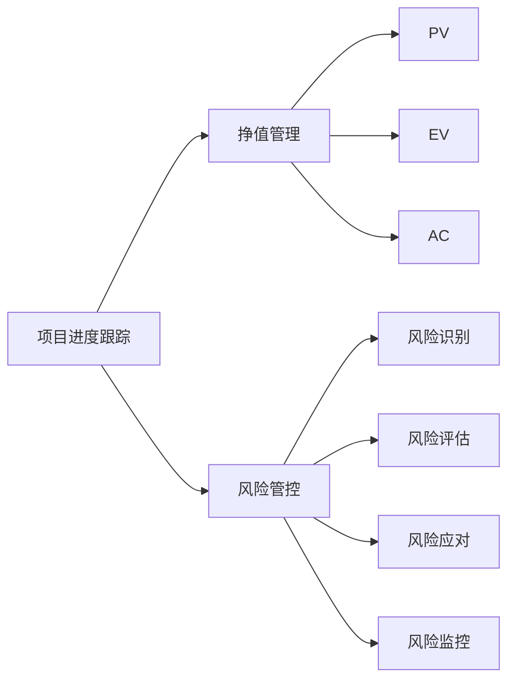

# 项目进度跟踪与风险管控原理与代码实战案例讲解

## 1.背景介绍
在现代软件开发和IT项目管理中,有效地跟踪项目进度和管控风险至关重要。项目经理需要实时掌握项目状态,识别潜在风险,并采取适当的措施来确保项目按时、按预算、高质量地完成。本文将深入探讨项目进度跟踪与风险管控的原理,并通过代码实战案例来阐述如何利用技术手段来实现高效的项目管理。

### 1.1 项目进度跟踪的重要性
项目进度跟踪是项目管理的核心任务之一。它能够帮助项目经理:

- 了解项目的实际进展情况
- 发现进度偏差,及时采取纠正措施  
- 预测项目完成日期,合理调配资源
- 与项目干系人沟通项目状态,建立信任

### 1.2 风险管控的必要性
风险是项目不可避免的一部分。有效的风险管控能够:

- 提前识别潜在风险,制定应对策略
- 最小化风险对项目目标的负面影响
- 把握机会,将风险转化为有利因素
- 提高项目成功率,降低成本

### 1.3 技术在项目管理中的应用
随着信息技术的发展,越来越多的项目管理工具和技术被应用到实践中,例如:

- 项目管理软件:帮助规划、执行、监控项目
- 协作平台:方便团队沟通、共享信息
- 大数据分析:挖掘项目数据,辅助决策
- 人工智能:智能化项目管理,提高效率

## 2.核心概念与联系
要深入理解项目进度跟踪与风险管控,需要掌握一些核心概念:

### 2.1 项目进度
项目进度反映了项目完成的百分比,通常通过比较实际完成的工作量与计划工作量来衡量。常见的进度指标有:

- 进度偏差(SV):实际完成值(EV)与计划值(PV)的差异
- 进度绩效指数(SPI):EV与PV的比值

### 2.2 挣值管理
挣值管理(EVM)是一种度量项目绩效的方法,综合考虑了范围、进度和成本。主要概念包括:

- 计划值(PV):计划在某一时间点完成的工作预算
- 实际完成值(EV):已完成工作的预算
- 实际成本(AC):实际完成工作的成本

通过分析PV、EV和AC的差异,可以评估项目的进度和成本绩效。

### 2.3 风险管理
风险管理是识别、评估和控制风险的过程。主要步骤有:

1. 风险识别:找出潜在风险因素
2. 风险评估:分析风险发生的可能性和影响
3. 风险应对:制定风险规避、转移、减轻或接受的策略
4. 风险监控:持续监测风险,必要时调整应对措施

### 2.4 概念之间的联系
项目进度跟踪和风险管控是相辅相成的。准确的进度数据有助于及时发现风险,而有效的风险管控能够保障项目进度。两者结合,可以全面提升项目管理水平。

下图展示了这些核心概念之间的关系:



## 3.核心算法原理具体操作步骤
项目进度跟踪和风险管控涉及一些核心算法,下面详细介绍其原理和操作步骤。

### 3.1 进度偏差(SV)和进度绩效指数(SPI)的计算
SV和SPI是评估项目进度的关键指标,计算公式如下:

$SV = EV - PV$

$SPI = EV / PV$

具体步骤:
1. 确定评估的时间点(如每周、每月)
2. 收集已完成工作的数据,计算EV
3. 查询项目计划,得出PV
4. 代入公式,计算SV和SPI
5. 分析SV和SPI,判断项目进度状态

SV为正,表示进度超前;SV为负,表示进度滞后。SPI大于1,表示进度绩效良好;SPI小于1,表示进度绩效不佳。

### 3.2 风险评估矩阵的构建
风险评估矩阵是直观展示风险等级的工具。构建步骤:

1. 列出已识别的风险因素
2. 定义风险发生可能性和影响的等级(如高、中、低)
3. 绘制矩阵,横轴为影响,纵轴为可能性
4. 将风险因素放入对应的矩阵区域
5. 根据风险在矩阵中的位置,确定风险等级

风险评估矩阵示例:

|  可能性\影响 | 低  | 中  | 高  |
|  ----  | ----  | ----  | ----  |
| 高  | 中风险 | 高风险 | 极高风险 |
| 中  | 低风险 | 中风险 | 高风险 |
| 低  | 极低风险 | 低风险 | 中风险 |

### 3.3 风险应对策略的选择
根据风险评估结果,选择合适的应对策略:

1. 风险规避:改变项目计划,避免风险
2. 风险转移:将风险转移给第三方,如购买保险
3. 风险减轻:采取措施,降低风险发生可能性或影响
4. 风险接受:接受风险,制定应急预案

选择应对策略的一般原则是:高等级风险优先处理,采取积极的规避或转移策略;中低等级风险可以减轻或接受,但要制定应急方案。

## 4.数学模型和公式详细讲解举例说明
本节以挣值管理中的成本偏差(CV)和成本绩效指数(CPI)为例,详细讲解其数学模型和公式。

### 4.1 成本偏差(CV)
CV衡量项目实际成本与计划成本的差异,公式为:

$CV = EV - AC$

其中,EV为实际完成值,AC为实际成本。

举例:某项目第5周的EV为50万元,AC为60万元,则:

$CV = 50 - 60 = -10(万元)$

CV为负,表示实际成本超支10万元。

### 4.2 成本绩效指数(CPI) 
CPI衡量项目成本效率,公式为:

$CPI = EV / AC$

举例:延续上例,第5周的CPI为:

$CPI = 50 / 60 = 0.83$

CPI小于1,表示每完成1元的工作,实际花费1.2元(1/0.83=1.2),成本绩效不佳。

### 4.3 CV和CPI的联系与应用
CV和CPI反映了项目的成本状态,它们之间存在如下关系:

- 当CV为正,CPI大于1时,项目成本低于预期
- 当CV为负,CPI小于1时,项目成本高于预期
- 当CV为0,CPI等于1时,项目成本与预期相符

项目经理可以据此采取相应措施:

- 当成本绩效不佳时,分析原因,优化资源配置  
- 当成本绩效良好时,总结经验,复制成功实践
- 定期计算CV和CPI,绘制趋势图,预测成本结果

## 5.项目实践：代码实例和详细解释说明
下面通过Python代码实例,演示如何实现项目进度跟踪和风险评估。

### 5.1 项目进度跟踪
使用Python的`pandas`库,读取项目数据,计算SV和SPI:

```python
import pandas as pd

# 读取项目数据
data = pd.read_excel('project_data.xlsx')

# 计算EV和PV
data['EV'] = data['完成百分比'] * data['预算']
data['PV'] = data['计划百分比'] * data['预算']

# 计算SV和SPI
data['SV'] = data['EV'] - data['PV'] 
data['SPI'] = data['EV'] / data['PV']

# 输出结果
print(data[['日期', 'SV', 'SPI']])
```

代码说明:
1. 导入`pandas`库,读取Excel格式的项目数据
2. 根据完成百分比和预算,计算EV和PV
3. 运用公式,计算SV和SPI
4. 输出评估日期、SV和SPI

### 5.2 风险评估
使用Python的`numpy`库,实现风险评估矩阵:

```python
import numpy as np

# 定义风险等级
risk_levels = ['极低', '低', '中', '高', '极高'] 

# 定义风险矩阵
risk_matrix = np.array([[1, 2, 3], 
                        [2, 3, 4],
                        [3, 4, 5]])

# 读取风险数据                        
risks = pd.read_excel('risk_data.xlsx')

# 获取风险可能性和影响
prob = risks['可能性'].values
impact = risks['影响'].values

# 查询风险矩阵,得到风险等级
risk_index = risk_matrix[prob-1, impact-1] 
risks['风险等级'] = [risk_levels[i-1] for i in risk_index]

# 输出结果
print(risks)
```

代码说明:
1. 导入`numpy`库,定义风险等级和风险矩阵
2. 读取Excel格式的风险数据
3. 获取每个风险的可能性和影响值
4. 根据可能性和影响查询风险矩阵,得到风险等级索引
5. 将索引转换为对应的风险等级文字
6. 输出包含风险等级的风险清单

## 6.实际应用场景
项目进度跟踪和风险管控在各行业的项目管理中都有广泛应用,下面列举几个典型场景。

### 6.1 软件开发项目
在软件开发过程中,项目经理需要:

- 跟踪开发进度,确保按期完成
- 识别技术风险,如需求变更、技术难点等
- 评估进度风险,调整任务分配和资源投入
- 控制成本风险,优化人员配置和外包策略

### 6.2 工程建设项目
对于工程建设项目,项目经理要:

- 监控施工进度,协调各方资源
- 评估工期风险,如材料供应、天气影响等  
- 控制质量风险,加强过程检查和验收
- 管理安全风险,落实安全措施和应急预案

### 6.3 新产品开发项目
在新产品开发中,项目经理需要关注:

- 跟踪研发进度,把控关键节点
- 评估技术风险,调整研发方案
- 控制预算风险,平衡功能需求与成本
- 应对市场风险,适时调整产品定位

## 7.工具和资源推荐
项目经理可以利用各种工具和资源,来提升项目进度跟踪和风险管控的效率,例如:

### 7.1 项目管理软件
- Microsoft Project:功能强大的项目管理工具
- Jira:敏捷项目管理与问题跟踪平台
- Trello:简单易用的在线项目协作工具

### 7.2 风险管理模板
- 风险登记册:记录识别出的风险及其应对措施
- 风险评估矩阵模板:快速生成风险评估矩阵
- 风险应对计划模板:规范风险应对计划的制定

### 7.3 在线课程
- PMBOK指南:权威的项目管理知识体系
- 风险管理实务:系统讲解风险管理流程和工具
- Python数据分析:学习用Python处理项目数据

## 8.总结：未来发展趋势与挑战
项目进度跟踪与风险管控是项目管理的永恒主题,未来的发展趋势包括:

- 大数据分析:利用海量项目数据,优化进度预测和风险评估模型
- 人工智能应用:开发智能项目管理助手,提供实时进度预警和风险提示
- 区块链技术:利用区块链的不可篡改性,提高项目数据的可信度

同时,项目管理也面临一些挑战:

- 复杂性增加:项目规模越来越大,涉及领域越来越广,管理难度加大