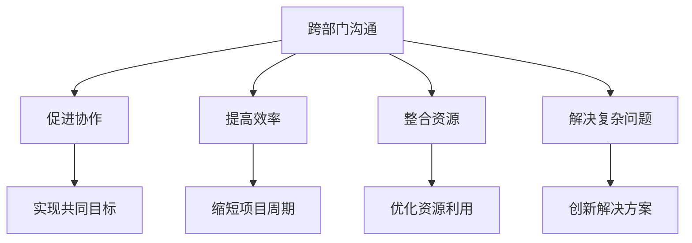
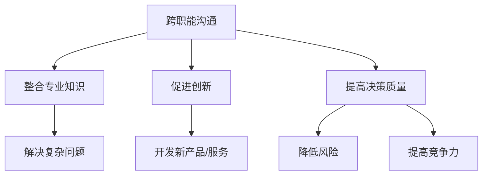
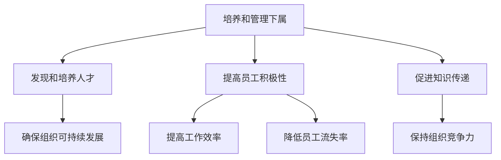
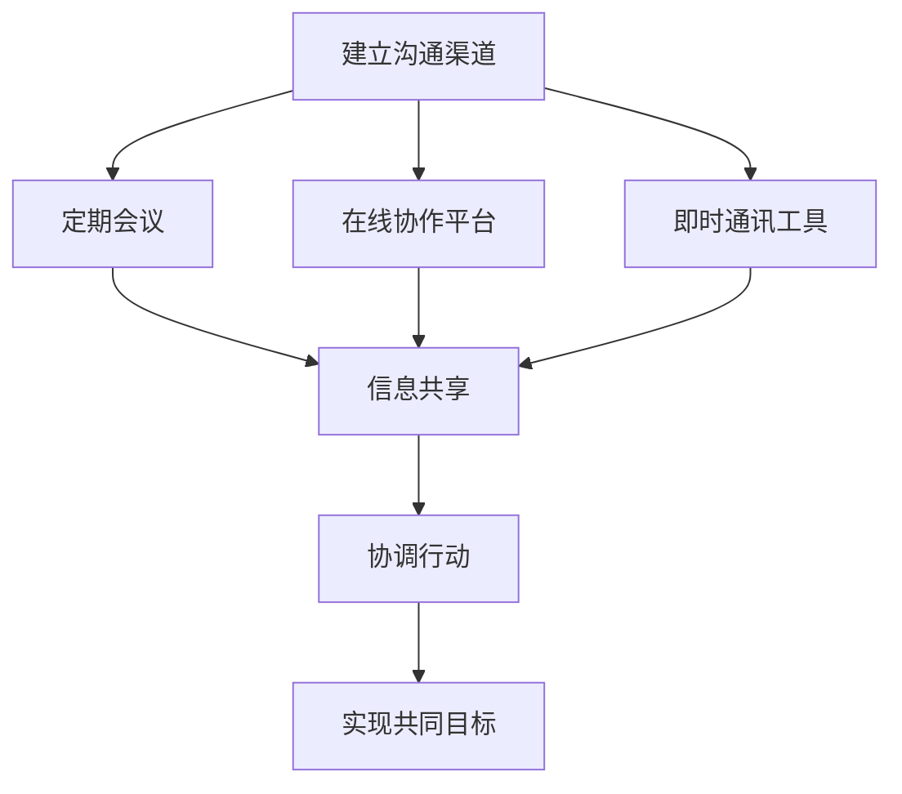
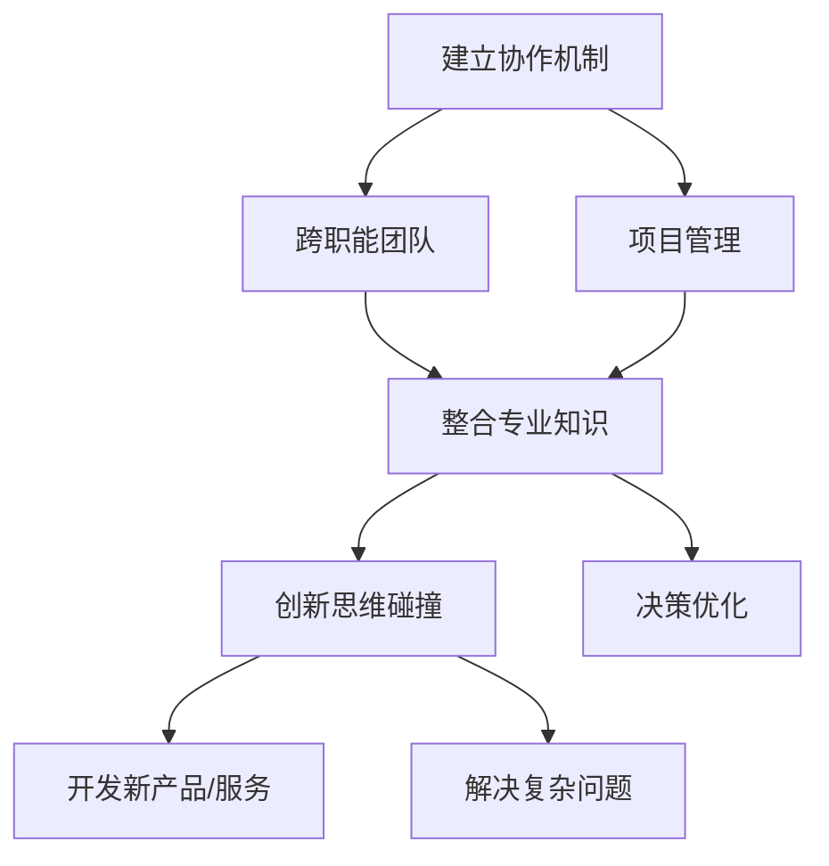
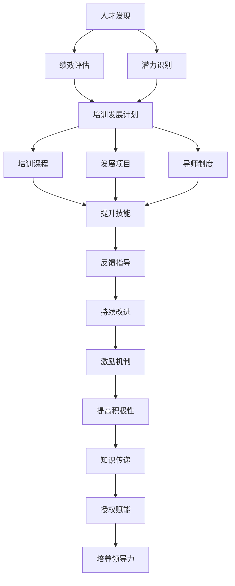

# 领导力培养：跨部门、跨职能沟通，并能够有效培养和管理下属

## 1.背景介绍

在当今快节奏的商业环境中，领导力是组织成功的关键因素之一。有效的领导不仅需要专业知识和管理技能,更需要跨部门、跨职能的沟通能力,以及培养和管理下属的能力。领导者需要整合来自不同部门和职能的资源,协调各方利益,推动组织朝着共同目标前进。同时,领导者还需要发现并培养下属的潜力,为组织的可持续发展做好人才储备。

### 1.1 跨部门沟通的重要性

在现代组织中,各部门往往存在着职能分工和目标差异,因此跨部门沟通对于促进协作、提高效率、整合资源和解决复杂问题至关重要。有效的跨部门沟通可以帮助不同部门共享信息、协调行动,从而实现组织的共同目标。同时,它还可以缩短项目周期、优化资源利用,并促进创新解决方案的产生。

### 1.2 跨职能沟通的重要性

在组织中,不同的职能部门拥有不同的专业知识和技能。跨职能沟通可以整合这些专业知识,促进创新,提高决策质量。通过跨职能沟通,组织可以更好地解决复杂问题,开发新产品或服务,降低风险,从而提高组织的竞争力。

### 1.3 培养和管理下属的重要性

人才是组织最宝贵的资源之一。领导者需要发现和培养下属的潜力,为组织的可持续发展做好人才储备。同时,有效的培养和管理下属可以提高员工的积极性和工作效率,降低员工流失率。此外,良好的培养机制还可以促进知识在组织内部的传递,保持组织的竞争力。

综上所述,跨部门、跨职能沟通,以及培养和管理下属,是现代领导者必备的核心能力。本文将深入探讨这些领域的核心概念、原理和实践方法,为读者提供实用的指导和见解。

## 2.核心概念与联系

### 2.1 跨部门沟通

跨部门沟通是指不同部门之间的信息交流和协作。它包括以下几个核心概念:

1. **信息共享**: 跨部门沟通的基础是信息共享。各部门需要及时、准确地共享相关信息,以确保所有相关方都掌握必要的信息。

2. **协调与协作**: 跨部门沟通旨在协调不同部门的行动,促进协作,实现共同目标。各部门需要相互理解和尊重,共同努力解决问题。

3. **利益平衡**: 不同部门可能存在利益冲突,需要通过沟通和协商来平衡各方利益,达成共识。

4. **沟通渠道**: 建立有效的沟通渠道是跨部门沟通的前提。这可以包括定期会议、在线协作平台、即时通讯工具等。

5. **沟通技巧**: 有效的沟通需要掌握一定的技巧,如倾听、阐述、谈判等,以确保信息准确传递和理解。

### 2.2 跨职能沟通

跨职能沟通是指不同职能部门之间的信息交流和协作。它包括以下几个核心概念:

1. **专业知识整合**: 跨职能沟通的目标之一是整合不同职能部门的专业知识,解决复杂问题。

2. **创新驱动**: 通过跨职能沟通,可以促进不同领域的思维碰撞,激发创新思维,开发新产品或服务。

3. **决策优化**: 跨职能沟通可以提供多角度的视角,优化决策过程,降低风险。

4. **协作机制**: 建立有效的协作机制是跨职能沟通的基础,如跨职能团队、项目管理等。

5. **沟通技能**: 跨职能沟通需要掌握一定的沟通技能,如专业术语的使用、视角转换等。

### 2.3 培养和管理下属

培养和管理下属是领导者的重要职责,它包括以下几个核心概念:

1. **人才发现**: 发现和识别具有潜力的下属,为组织储备人才。

2. **培训发展**: 为下属提供培训和发展机会,帮助他们提升技能和能力。

3. **激励机制**: 建立有效的激励机制,提高下属的工作积极性和敬业度。

4. **反馈指导**: 及时给予下属反馈和指导,帮助他们改进和成长。

5. **知识传递**: 促进知识在组织内部的传递,确保组织的持续竞争力。

6. **授权赋能**: 适当授权和赋能下属,培养他们的领导力和决策能力。

这三个核心概念密切相关,相互影响。有效的跨部门和跨职能沟通可以为培养和管理下属提供支持,而优秀的下属又可以促进组织内部的沟通和协作。领导者需要掌握这些概念,并将它们有机结合,以发挥最大的领导力。

## 3.核心算法原理具体操作步骤

### 3.1 跨部门沟通算法

1. **建立沟通渠道**:
   - 定期会议: 安排定期的跨部门会议,讨论共同关心的问题和项目进展。
   - 在线协作平台: 建立在线协作平台,如项目管理软件、文档共享平台等,方便信息共享和协作。
   - 即时通讯工具: 使用即时通讯工具,如企业微信、Slack等,实现及时沟通。

2. **信息共享**:
   - 及时准确地共享相关信息,包括项目进展、决策、变更等。
   - 确保所有相关方都掌握必要的信息。

3. **协调行动**:
   - 根据共享的信息,协调不同部门的行动。
   - 明确各部门的职责和任务,避免重复或遗漏。

4. **实现共同目标**:
   - 通过协调行动,整合各部门的资源和努力。
   - 共同推进项目或任务,实现组织的目标。

### 3.2 跨职能沟通算法

1. **建立协作机制**:
   - 跨职能团队: 组建包含不同职能部门成员的跨职能团队,共同工作。
   - 项目管理: 建立项目管理机制,明确各职能部门的职责和任务。

2. **整合专业知识**:
   - 在跨职能团队或项目中,整合不同职能部门的专业知识。
   - 确保各方专业知识得到充分利用和融合。

3. **创新思维碰撞**:
   - 不同职能背景的成员进行思维碰撞,激发创新思维。
   - 基于整合的专业知识,开发新产品或服务。
   - 提出创新的解决方案,应对复杂问题。

4. **决策优化**:
   - 从多角度考虑问题,充分利用各职能部门的专业视角。
   - 优化决策过程,降低风险,提高决策质量。

### 3.3 培养和管理下属算法

1. **人才发现**:
   - 绩效评估: 通过绩效评估,发现表现优秀的下属。
   - 潜力识别: 识别具有领导潜力或专业潜力的下属。

2. **培训发展计划**:
   - 根据下属的需求和潜力,制定个性化的培训发展计划。
   - 包括培训课程、发展项目、导师制度等。

3. **培训和发展**:
   - 培训课程: 安排相关的培训课程,提升下属的技能和知识。
   - 发展项目: 为下属安排挑战性的发展项目,锻炼能力。
   - 导师制度: 为下属配备导师,提供指导和反馈。

4. **反馈指导**:
   - 及时给予下属反馈和指导,帮助他们改进和成长。
   - 建立持续改进的机制。

5. **激励机制**:
   - 建立有效的激励机制,如奖励、晋升等。
   - 提高下属的工作积极性和敬业度。

6. **知识传递**:
   - 促进知识在组织内部的传递,确保组织的持续竞争力。
   - 下属成为知识传递的重要环节。

7. **授权赋能**:
   - 适当授权和赋能下属,让他们参与决策。
   - 培养下属的领导力和决策能力。

通过这些步骤,领导者可以系统地发现、培养和管理下属,为组织储备人才,确保可持续发展。

## 4.数学模型和公式详细讲解举例说明

在领导力培养的过程中,数学模型和公式可以为我们提供量化和优化的工具。以下是一些常见的数学模型和公式,以及它们在领导力培养中的应用。

### 4.1 马尔可夫决策过程 (Markov Decision Process, MDP)

马尔可夫决策过程是一种用于决策优化的数学框架。它可以帮助领导者在不确定的环境中做出最优决策。

在培养和管理下属的过程中,我们可以将下属的发展过程建模为一个马尔可夫决策过程。状态 $s$ 表示下属的当前能力水平,行动 $a$ 表示领导者采取的培养措施,如培训、项目安排等。转移概率 $P(s'|s,a)$ 表示在采取行动 $a$ 后,下属从状态 $s$ 转移到状态 $s'$ 的概率。奖励函数 $R(s,a)$ 表示在状态 $s$ 采取行动 $a$ 所获得的奖励,可以反映下属的绩效或潜力。

我们的目标是找到一个最优策略 $\pi^*(s)$,使得在整个培养过程中获得的累积奖励最大化:

$$
\max_\pi \mathbb{E}\left[\sum_{t=0}^\infty \gamma^t R(s_t, \pi