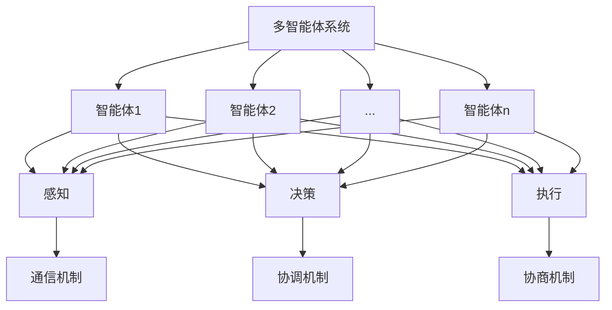

# AI Agent: AI的下一个风口 多智能体系统的未来

## 1. 背景介绍
### 1.1 人工智能的发展历程
#### 1.1.1 人工智能的起源与定义
#### 1.1.2 人工智能的三次浪潮
#### 1.1.3 当前人工智能的现状与局限
### 1.2 多智能体系统的兴起
#### 1.2.1 多智能体系统的概念
#### 1.2.2 多智能体系统的优势
#### 1.2.3 多智能体系统的应用前景

## 2. 核心概念与联系
### 2.1 智能体(Agent)
#### 2.1.1 智能体的定义
#### 2.1.2 智能体的特征
#### 2.1.3 智能体的分类
### 2.2 多智能体系统(Multi-Agent System, MAS)  
#### 2.2.1 多智能体系统的定义
#### 2.2.2 多智能体系统的特点
#### 2.2.3 多智能体系统与单智能体系统的区别
### 2.3 智能体间的交互与协作
#### 2.3.1 通信机制
#### 2.3.2 协调机制
#### 2.3.3 协商机制

## 3. 核心算法原理具体操作步骤
### 3.1 分布式约束优化(DCOP)
#### 3.1.1 DCOP问题定义
#### 3.1.2 DCOP算法原理
#### 3.1.3 DCOP算法步骤
### 3.2 博弈论
#### 3.2.1 博弈论基本概念
#### 3.2.2 纳什均衡
#### 3.2.3 博弈论在多智能体系统中的应用
### 3.3 强化学习
#### 3.3.1 强化学习基本原理  
#### 3.3.2 Q-learning算法
#### 3.3.3 多智能体强化学习(MARL)

## 4. 数学模型和公式详细讲解举例说明
### 4.1 马尔可夫决策过程(MDP)
#### 4.1.1 MDP的定义
#### 4.1.2 MDP的数学模型
#### 4.1.3 MDP在多智能体系统中的应用
### 4.2 部分可观测马尔可夫决策过程(POMDP)
#### 4.2.1 POMDP的定义
#### 4.2.2 POMDP的数学模型 
#### 4.2.3 POMDP在多智能体系统中的应用
### 4.3 博弈论中的数学模型
#### 4.3.1 正式博弈的数学模型
#### 4.3.2 重复博弈的数学模型
#### 4.3.3 贝叶斯博弈的数学模型

## 5. 项目实践：代码实例和详细解释说明
### 5.1 基于DCOP的多机器人协同任务分配
#### 5.1.1 问题描述
#### 5.1.2 Max-sum算法实现
#### 5.1.3 实验结果与分析
### 5.2 基于博弈论的自动驾驶车辆决策
#### 5.2.1 问题描述
#### 5.2.2 交通博弈模型构建
#### 5.2.3 纳什均衡求解与仿真
### 5.3 基于强化学习的多智能体系统控制
#### 5.3.1 问题描述
#### 5.3.2 MADDPG算法实现
#### 5.3.3 实验结果与分析

## 6. 实际应用场景
### 6.1 智慧交通
#### 6.1.1 交通流量预测与调控
#### 6.1.2 自动驾驶车辆协同
#### 6.1.3 车路协同优化
### 6.2 智能电网
#### 6.2.1 分布式能源管理
#### 6.2.2 需求侧响应
#### 6.2.3 电力市场博弈
### 6.3 智能制造
#### 6.3.1 生产调度优化
#### 6.3.2 供应链协同
#### 6.3.3 产品质量管控

## 7. 工具和资源推荐
### 7.1 开源框架
#### 7.1.1 JADE
#### 7.1.2 NetLogo
#### 7.1.3 Mesa
### 7.2 仿真平台
#### 7.2.1 Repast
#### 7.2.2 MASON
#### 7.2.3 AnyLogic
### 7.3 学习资源
#### 7.3.1 在线课程
#### 7.3.2 经典书籍
#### 7.3.3 研究论文

## 8. 总结：未来发展趋势与挑战
### 8.1 多智能体系统的研究热点
#### 8.1.1 大规模多智能体系统
#### 8.1.2 异构多智能体系统
#### 8.1.3 人机混合多智能体系统
### 8.2 多智能体系统面临的挑战
#### 8.2.1 可解释性与可信性
#### 8.2.2 鲁棒性与适应性
#### 8.2.3 安全性与隐私保护
### 8.3 多智能体系统的未来展望
#### 8.3.1 与区块链技术的融合
#### 8.3.2 与边缘计算的结合
#### 8.3.3 在更广泛领域的应用

## 9. 附录：常见问题与解答
### 9.1 多智能体系统与分布式人工智能的区别
### 9.2 多智能体系统的设计原则
### 9.3 如何选择合适的多智能体系统架构
### 9.4 多智能体系统的性能评估指标
### 9.5 多智能体系统的调试与部署注意事项

人工智能(Artificial Intelligence, AI)经过几十年的发展，已经取得了令人瞩目的成就。从早期的专家系统、基于知识的系统，到机器学习、深度学习的兴起，人工智能技术不断突破,应用领域持续拓展。然而，当前的人工智能系统主要以单一智能体为主，面临着难以应对复杂环境、缺乏灵活性等局限。在这样的背景下，多智能体系统(Multi-Agent System, MAS)作为人工智能的一个新兴分支，正受到学术界和工业界的广泛关注。

多智能体系统由多个智能体(Agent)组成，通过智能体间的交互与协作，能够完成单个智能体难以完成的复杂任务。与传统的集中式人工智能系统相比，多智能体系统具有分布式决策、并行处理、容错性强等优势，在智慧交通、智能电网、智能制造等领域展现出广阔的应用前景。

本文将深入探讨多智能体系统的核心概念、关键技术、实践案例以及未来发展趋势，为读者全面了解这一充满前景的人工智能新方向提供参考。

智能体是构建多智能体系统的基本单元。一个智能体可以视为一个自主的、可感知环境并作出决策的实体。智能体具有以下主要特征：

1. 自主性：智能体能够独立地感知环境，并根据自身的目标和决策机制采取行动，无需外界的直接控制。

2. 社会性：智能体能够与环境中的其他智能体进行交互，通过通信、协调、协商等方式实现互利共赢。

3. 反应性：智能体能够及时响应环境的变化，根据感知到的信息调整自身行为。

4. 主动性：智能体不仅能够被动地响应环境，还能够主动地执行任务，追求自身目标的实现。

根据智能体的具体特性和应用场景，可以将智能体分为以下几类：

1. 反应型智能体：根据当前感知到的环境信息直接作出反应，不具备复杂的推理和规划能力。

2. 目标型智能体：具有明确的目标，能够根据目标进行推理、规划和决策。

3. 实用型智能体：在目标型智能体的基础上，还考虑了效用最大化，能够权衡不同行动的收益和成本。

4. 学习型智能体：具备学习能力，能够根据过去的经验不断优化自身的决策机制。

多智能体系统由多个智能体组成，通过智能体间的交互与协作，实现整体的智能行为。与单智能体系统相比，多智能体系统具有以下特点：

1. 分布式：多智能体系统中的智能体分布在不同的节点上，能够并行地感知环境、处理信息和执行任务。

2. 自组织：通过智能体间的交互，多智能体系统能够自发地形成有序的结构和行为模式，无需中央控制。

3. 涌现：多智能体系统展现出的整体行为和性能，往往超越了单个智能体的能力，体现了"整体大于部分之和"的涌现特性。

4. 鲁棒性：得益于分布式的特点，多智能体系统具有较强的容错性和适应性，能够应对局部智能体的失效或环境的变化。

为了实现智能体间的有效交互与协作，多智能体系统需要解决以下关键问题：

1. 通信机制：智能体之间需要传递信息、共享知识，常见的通信机制包括直接通信、广播、黑板系统等。

2. 协调机制：为避免智能体之间的冲突，需要设计协调机制来调节智能体的行为，常见的协调机制包括集中式协调、分布式协调等。

3. 协商机制：当智能体之间存在利益冲突时，需要通过协商达成一致，常见的协商机制包括拍卖、投票、博弈论等。

在多智能体系统的研究中，一些核心算法发挥着关键作用，下面详细介绍几种典型算法的原理和操作步骤。

分布式约束优化(Distributed Constraint Optimization, DCOP)是一种求解多智能体系统中约束优化问题的算法范式。DCOP问题可以形式化地定义为一个四元组$\langle A, X, D, F \rangle$：

- $A=\{a_1,a_2,\dots,a_n\}$ 是一组智能体的集合。
- $X=\{x_1,x_2,\dots,x_m\}$ 是一组决策变量的集合，每个变量 $x_i$ 由一个智能体控制。
- $D=\{D_1,D_2,\dots,D_m\}$ 是每个变量对应的取值域。
- $F=\{f_1,f_2,\dots,f_k\}$ 是一组约束函数，每个函数 $f_i:D_{i_1}\times D_{i_2}\times \dots \times D_{i_j}\to \mathbb{R}$ 表示一组变量的取值组合到实数集的映射。

DCOP的目标是找到一组变量取值 $X^*$，使得所有约束函数的总和最小：

$$
X^* = \arg\min_{X} \sum_{f_i \in F} f_i(x_{i_1},x_{i_2},\dots,x_{i_j})
$$

求解DCOP问题的典型算法包括同步分支定界算法(Synchronous Branch and Bound, SBB)和异步分布式优化算法(Asynchronous Distributed Optimization, ADOPT)等。以ADOPT算法为例，其基本步骤如下：

1. 初始化：每个智能体 $a_i$ 随机选择自己控制的变量 $x_i$ 的取值，并将取值发送给相关的约束函数。

2. 值传播：每个智能体 $a_i$ 接收来自其他智能体的取值信息，计算自己的约束函数，并将计算结果发送给相关的智能体。

3. 边界传播：每个智能体 $a_i$ 根据接收到的约束函数值，计算自己的下界(lower bound)和上界(upper bound)，并将边界信息发送给相关的智能体。

4. 回溯：当某个智能体的下界大于上界时，说明当前的取值不可能是最优解，需要回溯并尝试其他取值。

5. 终止：当所有智能体的取值不再变化，且下界等