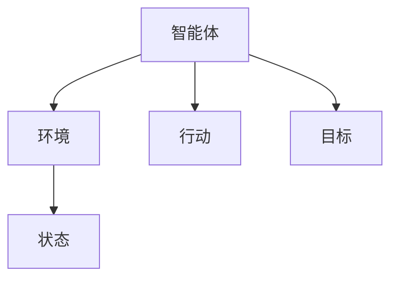

## 1. 背景介绍

人工智能（AI）是当今科技领域最热门的话题之一。AI技术的发展已经取得了巨大的进展，但是AI的下一个风口——AI Agent，仍然面临着许多挑战和难点。AI Agent是指一种能够自主学习、自主决策、自主行动的智能体，它可以在不同的环境中进行自主决策和行动，以实现特定的目标。

AI Agent的研究和应用将会对未来的社会和经济发展产生深远的影响。本文将介绍AI Agent的核心概念、算法原理、数学模型和公式、项目实践、实际应用场景、工具和资源推荐、未来发展趋势与挑战以及常见问题与解答。

## 2. 核心概念与联系

AI Agent是一种能够自主学习、自主决策、自主行动的智能体。它可以在不同的环境中进行自主决策和行动，以实现特定的目标。AI Agent的核心概念包括：

- 智能体：AI Agent是一种智能体，它可以感知环境、进行决策和行动。
- 环境：AI Agent存在于一个环境中，它可以感知环境的状态和变化。
- 状态：环境的状态是指环境中各个元素的状态，包括AI Agent自身的状态和其他元素的状态。
- 行动：AI Agent可以根据环境的状态进行行动，以实现特定的目标。
- 目标：AI Agent的目标是指它要实现的特定任务或目标。

AI Agent的核心概念可以用下图表示：

## 3. 核心算法原理具体操作步骤

AI Agent的核心算法原理包括强化学习、深度学习、进化算法等。其中，强化学习是AI Agent最常用的算法之一，它可以让AI Agent在不断的试错中学习和优化自己的行为。

强化学习的具体操作步骤包括：

1. 定义状态空间和行动空间：AI Agent需要定义状态空间和行动空间，以便在环境中进行决策和行动。
2. 定义奖励函数：AI Agent需要定义奖励函数，以便在环境中获得奖励和惩罚。
3. 定义策略函数：AI Agent需要定义策略函数，以便在环境中进行决策和行动。
4. 进行试错学习：AI Agent需要在环境中进行试错学习，以便不断优化自己的行为。
5. 进行模型优化：AI Agent需要不断优化自己的模型，以便更好地适应环境。

## 4. 数学模型和公式详细讲解举例说明

AI Agent的数学模型和公式包括状态空间、行动空间、奖励函数、策略函数等。其中，状态空间和行动空间可以用向量表示，奖励函数和策略函数可以用函数表示。

以强化学习为例，其数学模型和公式如下：

- 状态空间：$S=\{s_1,s_2,...,s_n\}$
- 行动空间：$A=\{a_1,a_2,...,a_m\}$
- 奖励函数：$R(s,a)=r$
- 策略函数：$\pi(a|s)$

其中，$s$表示状态，$a$表示行动，$r$表示奖励，$\pi(a|s)$表示在状态$s$下选择行动$a$的概率。

## 5. 项目实践：代码实例和详细解释说明

AI Agent的项目实践包括环境搭建、数据处理、模型训练等。以强化学习为例，其项目实践步骤如下：

1. 环境搭建：搭建强化学习环境，包括安装Python、TensorFlow等工具。
2. 数据处理：准备训练数据，包括状态、行动、奖励等数据。
3. 模型训练：使用强化学习算法训练模型，不断优化模型的性能。
4. 模型测试：测试模型的性能，评估模型的效果。
5. 模型部署：将模型部署到实际应用场景中，实现AI Agent的自主决策和行动。

## 6. 实际应用场景

AI Agent的实际应用场景包括自动驾驶、智能机器人、智能家居、智能金融等。以自动驾驶为例，AI Agent可以感知周围的环境、交通状况等信息，进行自主决策和行动，以实现安全、高效的驾驶。

## 7. 工具和资源推荐

AI Agent的工具和资源包括Python、TensorFlow、PyTorch等工具，以及各种开源的AI Agent项目和论文。其中，TensorFlow和PyTorch是目前最流行的深度学习框架，可以用于实现AI Agent的模型训练和部署。

## 8. 总结：未来发展趋势与挑战

AI Agent是AI技术的下一个风口，它将会对未来的社会和经济发展产生深远的影响。未来，AI Agent将会越来越普及，应用场景也将会越来越广泛。但是，AI Agent的发展仍然面临着许多挑战和难点，包括数据安全、隐私保护、伦理道德等问题。

## 9. 附录：常见问题与解答

Q：AI Agent的核心算法是什么？

A：AI Agent的核心算法包括强化学习、深度学习、进化算法等。

Q：AI Agent的实际应用场景有哪些？

A：AI Agent的实际应用场景包括自动驾驶、智能机器人、智能家居、智能金融等。

Q：AI Agent的未来发展趋势和挑战是什么？

A：AI Agent的未来发展趋势是普及和广泛应用，但是仍然面临着许多挑战和难点，包括数据安全、隐私保护、伦理道德等问题。

作者：禅与计算机程序设计艺术 / Zen and the Art of Computer Programming