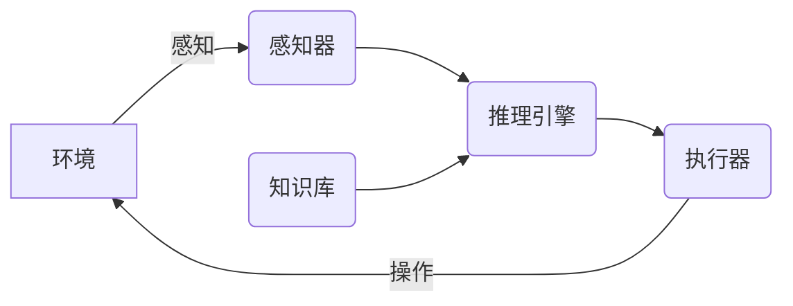

# AI Agent: AI的下一个风口 数据隐私保护与数据安全问题

## 1. 背景介绍

### 1.1 人工智能的崛起

人工智能(Artificial Intelligence, AI)已经成为当今科技领域最炙手可热的话题之一。从语音助手到自动驾驶汽车,从医疗诊断到金融分析,AI正在渗透到我们生活的方方面面。随着算力的不断提升、数据的快速积累以及算法的持续创新,AI技术正在飞速发展,给我们带来了前所未有的机遇和挑战。

### 1.2 数据的重要性

AI系统的性能和效果在很大程度上依赖于训练数据的质量和数量。高质量的数据集对于训练出高精度的AI模型至关重要。然而,随着AI应用的不断扩展,数据隐私和数据安全问题也日益凸显。如何在保护个人隐私的同时,为AI系统提供足够的高质量数据,成为了一个亟待解决的难题。

### 1.3 AI Agent的崛起

在这种背景下,AI Agent(智能代理)应运而生。AI Agent是一种新型的AI系统,它可以在保护数据隐私和安全的前提下,高效地收集、处理和利用数据,为AI模型提供优质的训练资源。AI Agent的出现为解决数据隐私保护与数据安全问题提供了一种全新的思路和方案。

## 2. 核心概念与联系

### 2.1 AI Agent的定义

AI Agent是一种自主的软件实体,它能够感知环境、处理信息、做出决策并采取行动,以完成特定的任务。AI Agent通常由以下几个核心组件组成:

- 感知器(Sensor):用于从环境中获取信息和数据。
- 执行器(Actuator):用于对环境进行操作和改变。
- 知识库(Knowledge Base):存储Agent所掌握的知识和规则。
- 推理引擎(Inference Engine):根据知识库中的规则对获取的信息进行推理和决策。

### 2.2 AI Agent在数据隐私保护中的作用

AI Agent可以作为一种中介,在用户和AI系统之间建立一道"防火墙",有效地隔离和保护用户的隐私数据。具体来说,AI Agent可以通过以下几种方式来保护数据隐私:

1. **本地数据处理**: AI Agent可以在用户的本地设备上对数据进行预处理和加密,只将处理后的数据传输给AI系统,从而避免了原始隐私数据的泄露。

2. **差分隐私**: AI Agent可以在传输数据之前,对数据进行差分隐私噪声处理,使得即使数据被泄露,也无法还原出个人的真实信息。

3. **联邦学习**: AI Agent可以采用联邦学习的方式,在不共享原始数据的情况下,协同训练出一个通用的AI模型,从而保护了每个参与方的数据隐私。

4. **可解释性**: AI Agent的决策过程具有可解释性,用户可以了解Agent是如何处理和利用自己的数据的,从而增加了对数据隐私保护的信任度。

### 2.3 AI Agent在数据安全中的作用

除了保护数据隐私外,AI Agent还可以为AI系统提供更好的数据安全保障。AI Agent可以通过以下几种方式来增强数据安全性:

1. **访问控制**: AI Agent可以对数据进行细粒度的访问控制,只允许经过授权的AI系统或组件访问特定的数据,从而降低了数据被非法访问和滥用的风险。

2. **加密传输**: AI Agent可以对传输的数据进行端到端的加密,确保数据在传输过程中的安全性。

3. **入侵检测**: AI Agent可以集成入侵检测和防御机制,及时发现和阻止对数据的非法访问和攻击行为。

4. **容错性**: AI Agent可以采用分布式和冗余的架构,提高系统的容错性和可用性,即使部分Agent出现故障,也不会影响整个系统的运行和数据的安全性。

通过上述机制,AI Agent不仅可以保护用户的隐私数据,还能为AI系统提供更加安全可靠的数据源,从而促进AI技术的健康发展。

## 3. 核心算法原理具体操作步骤

AI Agent在保护数据隐私和安全方面采用了多种先进的算法和技术,下面我们将详细介绍其中几种核心算法的原理和具体操作步骤。

### 3.1 差分隐私

差分隐私(Differential Privacy)是一种提供了数学上严格隐私保证的隐私保护技术。它通过在原始数据中引入一定量的噪声,使得即使数据被泄露,也无法还原出任何个人的真实信息。

差分隐私算法的具体操作步骤如下:

1. 确定隐私预算 $\epsilon$ (epsilon)和敏感度 $\Delta f$。隐私预算 $\epsilon$ 表示隐私损失的程度,值越小隐私保护程度越高;敏感度 $\Delta f$ 表示函数输出值的最大变化量。

2. 选择噪声机制,常用的有拉普拉斯机制和高斯机制。拉普拉斯机制适用于数值型查询,高斯机制适用于计数型查询。

3. 对原始数据 $x$ 进行扰动,生成新的扰动数据 $x'$:

   - 拉普拉斯机制: $x' = x + \text{Lap}(\Delta f / \epsilon)$
   - 高斯机制: $x' = x + \mathcal{N}(0, \Delta f^2 \sigma^2 / \epsilon^2)$

   其中 $\text{Lap}(\lambda)$ 表示拉普拉斯分布,尺度参数为 $\lambda$;$\mathcal{N}(\mu, \sigma^2)$ 表示均值为 $\mu$,方差为 $\sigma^2$ 的高斯分布。

4. 将扰动后的数据 $x'$ 发布或用于后续的计算和分析。

通过差分隐私算法,AI Agent可以在不泄露任何个人隐私信息的情况下,为AI系统提供有效的训练数据。

### 3.2 联邦学习

联邦学习(Federated Learning)是一种分布式机器学习范式,它允许多个参与方在不共享原始数据的情况下,协同训练出一个通用的AI模型。这种方式可以有效地保护每个参与方的数据隐私。

联邦学习算法的具体操作步骤如下:

1. 中央服务器初始化一个全局模型 $\theta_0$,并将其分发给所有参与方。

2. 每个参与方 $k$ 使用自己的本地数据 $D_k$ 对全局模型进行训练,得到本地更新的模型权重 $\theta_k$。

3. 参与方将本地更新的模型权重 $\theta_k$ 上传到中央服务器。

4. 中央服务器对所有参与方上传的模型权重进行聚合,得到新的全局模型 $\theta_{t+1}$:

   $$\theta_{t+1} = \sum_{k=1}^{K} \frac{n_k}{n} \theta_k$$

   其中 $n_k$ 表示第 $k$ 个参与方的数据量, $n = \sum_{k=1}^{K} n_k$ 表示所有参与方的总数据量。

5. 重复步骤2-4,直至模型收敛或达到预设的迭代次数。

通过联邦学习算法,AI Agent可以在不共享任何原始数据的情况下,协同训练出一个精确的AI模型,从而实现了数据隐私的有效保护。

### 3.3 同态加密

同态加密(Homomorphic Encryption)是一种允许在加密数据上直接进行计算的加密技术。它使得AI Agent可以在不解密数据的情况下,对加密后的数据进行处理和计算,从而大大提高了数据安全性。

同态加密算法的具体操作步骤如下:

1. 选择一种同态加密算法,如Paillier加密或BGV加密等。

2. 生成公钥 $pk$ 和私钥 $sk$,并将公钥 $pk$ 分发给所有需要进行计算的参与方。

3. 每个参与方使用公钥 $pk$ 对自己的数据 $x$ 进行同态加密,得到加密数据 $E(x)$:

   $$E(x) = \text{Enc}_{pk}(x)$$

4. 参与方将加密数据 $E(x)$ 发送给AI Agent进行计算。AI Agent可以在加密数据上直接进行运算,如加法和乘法等:

   $$E(x+y) = E(x) \oplus E(y)$$
   $$E(x \cdot y) = E(x) \otimes E(y)$$

   其中 $\oplus$ 和 $\otimes$ 分别表示同态加密下的加法和乘法运算。

5. AI Agent将计算结果 $E(z)$ 返回给参与方。

6. 参与方使用私钥 $sk$ 对计算结果 $E(z)$ 进行解密,得到明文结果 $z$:

   $$z = \text{Dec}_{sk}(E(z))$$

通过同态加密技术,AI Agent可以在不接触任何原始数据的情况下,对加密数据进行安全的计算和处理,从而有效地保护了数据的隐私和安全性。

## 4. 数学模型和公式详细讲解举例说明

在上一节中,我们介绍了差分隐私、联邦学习和同态加密等核心算法的原理和操作步骤。这些算法都涉及到一些数学模型和公式,下面我们将对其中的几个关键公式进行详细的讲解和举例说明。

### 4.1 差分隐私的隐私损失公式

在差分隐私算法中,隐私损失是一个非常重要的概念,它用来衡量隐私保护的程度。隐私损失的数学表达式如下:

$$L(\mathcal{A}) = \max_{D_1, D_2} \max_{S \subseteq \text{Range}(\mathcal{A})} \ln \frac{\Pr[\mathcal{A}(D_1) \in S]}{\Pr[\mathcal{A}(D_2) \in S]}$$

其中:

- $\mathcal{A}$ 表示隐私机制或算法
- $D_1$ 和 $D_2$ 是相差一条记录的两个数据集
- $S$ 是算法 $\mathcal{A}$ 的输出范围的一个子集
- $\Pr[\mathcal{A}(D) \in S]$ 表示算法 $\mathcal{A}$ 在数据集 $D$ 上的输出落入子集 $S$ 的概率

隐私损失 $L(\mathcal{A})$ 越小,表示隐私保护程度越高。当 $L(\mathcal{A}) \leq \epsilon$ 时,我们称算法 $\mathcal{A}$ 满足 $\epsilon$-差分隐私。

**举例说明**:

假设我们有一个查询函数 $f$,它计算一个数据集中所有记录的和。现在我们使用拉普拉斯机制对 $f$ 进行扰动,以实现差分隐私保护。

首先,我们需要计算 $f$ 的敏感度 $\Delta f$。由于添加或删除一条记录最多会改变 $f$ 的输出值 $1$,因此 $\Delta f = 1$。

接下来,我们选择隐私预算 $\epsilon = 0.5$,并使用拉普拉斯机制对 $f$ 进行扰动:

$$f'(D) = f(D) + \text{Lap}(1/0.5) = f(D) + Y$$

其中 $Y \sim \text{Lap}(2)$ 是一个拉普拉斯噪声,尺度参数为 $2$。

现在,我们来计算隐私损失 $L(f')$:

$$\begin{aligned}
L(f') &= \max_{D_1, D_2} \max_{S \subseteq \mathbb{R}} \ln \frac{\Pr[f'(D_1) \in S]}{\Pr[f'(D_2) \in S]} \\
      &= \max_{D_1, D_2} \max_{S \subseteq \mathbb{R}} \ln \frac{e^{-|f(D_1) - s|/2}}{e^{-|f(D_2) - s|/2}} \\
      &= \max_{D_1, D_2} \max_{s \in \mathbb{R}} |f(D