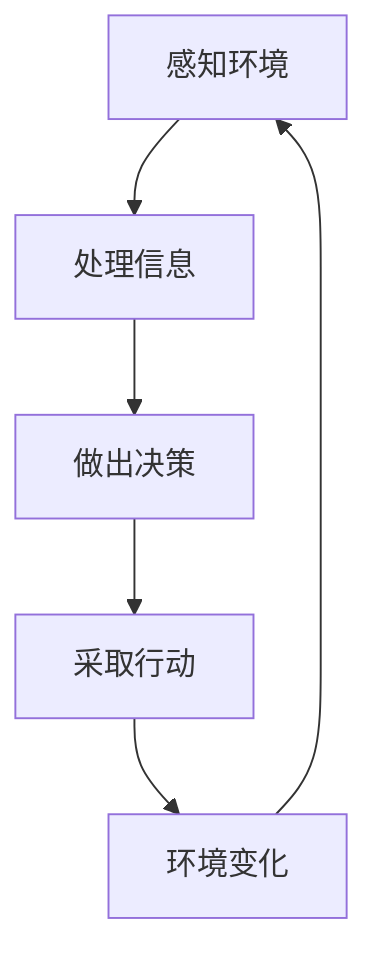

# AI Agent: AI的下一个风口 智能体与未来的关系

## 1. 背景介绍

### 1.1 人工智能的发展历程

人工智能(Artificial Intelligence, AI)是一门探索如何使机器模拟人类智能行为的科学与技术。自20世纪50年代诞生以来,AI经历了起起伏伏的发展历程。早期的AI系统主要集中在游戏、逻辑推理和专家系统等领域。随着算力和数据的不断增长,机器学习和深度学习技术逐渐兴起,推动了AI在图像识别、自然语言处理、决策系统等领域的广泛应用。

### 1.2 智能体(Agent)的兴起

传统的AI系统大多是针对特定任务的狭窄AI,而智能体则是一种更加通用和自主的AI形式。智能体是指能够感知环境、处理信息、做出决策并采取行动的智能系统。它们可以根据环境的变化做出合理反应,并通过学习和交互不断优化自身。

随着计算能力和算法的进步,智能体技术正在成为AI发展的新风口。相比于传统AI,智能体具有更强的自主性、适应性和交互能力,有望在复杂环境下发挥更大作用。

## 2. 核心概念与联系

### 2.1 智能体的定义

智能体(Agent)是一种能够感知环境、处理信息、做出决策并采取行动的智能系统。它们通过传感器获取环境信息,并基于这些信息做出合理的行为决策,最终通过执行器实现对环境的作用。

智能体可以分为以下几种类型:

- 简单反射智能体(Simple Reflex Agent)
- 基于模型的智能体(Model-based Agent)
- 基于目标的智能体(Goal-based Agent)
- 基于效用的智能体(Utility-based Agent)

### 2.2 智能体与环境的交互

智能体与环境之间存在着动态的交互过程,可以用下面的循环来描述:



1. 感知环境: 智能体通过传感器获取环境状态信息。
2. 处理信息: 智能体根据感知到的信息,结合内部知识库和算法进行信息处理。
3. 做出决策: 基于处理后的信息,智能体做出行为决策。
4. 采取行动: 智能体通过执行器实施决策行为,对环境产生影响。
5. 环境变化: 环境根据智能体的行为做出反应,进入新的状态。

这种持续的交互循环使得智能体能够不断学习和优化自身,适应复杂的动态环境。

### 2.3 智能体与机器学习的关系

机器学习是智能体实现智能行为的重要技术基础。常见的机器学习算法包括监督学习、非监督学习、强化学习等。

- 监督学习: 通过训练数据集,智能体学习将输入映射到期望输出的规律,用于分类、回归等任务。
- 非监督学习: 智能体从未标记的数据中发现内在模式和结构,用于聚类、降维等任务。
- 强化学习: 智能体通过与环境交互获得反馈信号,不断优化决策策略以获得最大累积奖励。

除了传统机器学习算法,深度学习、迁移学习等新兴技术也为智能体的发展提供了强大动力。

## 3. 核心算法原理具体操作步骤

### 3.1 马尔可夫决策过程(MDP)

马尔可夫决策过程(Markov Decision Process, MDP)是描述智能体与环境交互的重要数学模型。MDP通常定义为一个元组 $(S, A, P, R, \gamma)$,其中:

- $S$ 是环境的状态集合
- $A$ 是智能体可执行的行动集合
- $P(s'|s,a)$ 是状态转移概率,表示在状态 $s$ 下执行行动 $a$ 后,转移到状态 $s'$ 的概率
- $R(s,a)$ 是在状态 $s$ 执行行动 $a$ 后获得的即时奖励
- $\gamma \in [0,1)$ 是折现因子,用于权衡即时奖励和长期累积奖励

智能体的目标是找到一个策略 $\pi: S \rightarrow A$,使得在该策略下的期望累积奖励最大化:

$$
\max_\pi \mathbb{E}\left[\sum_{t=0}^\infty \gamma^t R(s_t, a_t) \right]
$$

其中 $s_t$ 和 $a_t$ 分别表示在时间步 $t$ 的状态和行动。

### 3.2 价值迭代算法

价值迭代(Value Iteration)是一种常用的算法,用于求解MDP中的最优策略。算法的核心思想是通过迭代更新状态价值函数 $V(s)$,直到收敛。

对于任意状态 $s$,其价值函数 $V(s)$ 定义为在该状态下执行最优策略时的期望累积奖励:

$$
V(s) = \max_a \mathbb{E}\left[R(s,a) + \gamma \sum_{s'} P(s'|s,a)V(s')\right]
$$

价值迭代算法的步骤如下:

1. 初始化价值函数 $V(s)$ 为任意值
2. 重复以下步骤直到收敛:
    - 对每个状态 $s$,更新 $V(s)$:
        $$
        V(s) \leftarrow \max_a \left\{R(s,a) + \gamma \sum_{s'} P(s'|s,a)V(s')\right\}
        $$
3. 得到最优价值函数 $V^*(s)$ 后,可以推导出最优策略 $\pi^*(s)$:
    $$
    \pi^*(s) = \arg\max_a \left\{R(s,a) + \gamma \sum_{s'} P(s'|s,a)V^*(s')\right\}
    $$

价值迭代算法可以保证在有限的MDP中收敛到最优解,但在状态空间过大时计算效率会受到影响。

### 3.3 策略迭代算法

策略迭代(Policy Iteration)是另一种求解MDP的经典算法,其基本思路是先评估当前策略的价值函数,然后不断改进策略,直到收敛到最优策略。

算法步骤如下:

1. 初始化一个任意策略 $\pi_0$
2. 重复以下步骤直到收敛:
    - 策略评估: 对当前策略 $\pi_i$,计算其价值函数 $V^{\pi_i}$:
        $$
        V^{\pi_i}(s) = \mathbb{E}_{\pi_i}\left[\sum_{t=0}^\infty \gamma^t R(s_t, a_t) \right]
        $$
    - 策略改进: 基于 $V^{\pi_i}$,计算一个新的改进策略 $\pi_{i+1}$:
        $$
        \pi_{i+1}(s) = \arg\max_a \left\{R(s,a) + \gamma \sum_{s'} P(s'|s,a)V^{\pi_i}(s')\right\}
        $$
3. 得到最优策略 $\pi^*$ 及其价值函数 $V^*$

策略迭代算法的优点是每次迭代都会得到一个改进的策略,但缺点是策略评估步骤的计算代价较高。

## 4. 数学模型和公式详细讲解举例说明

### 4.1 马尔可夫链(Markov Chain)

马尔可夫链是描述随机过程的重要数学模型,也是理解MDP的基础。一个马尔可夫链由一组状态 $S$ 和状态转移概率矩阵 $P$ 组成,其中 $P_{ij} = P(s_j|s_i)$ 表示从状态 $s_i$ 转移到状态 $s_j$ 的概率。

马尔可夫链满足"无后效性"(Memoryless)的性质,即下一状态的条件概率分布只依赖于当前状态,与过去状态无关:

$$
P(s_{t+1}|s_t, s_{t-1}, \ldots, s_0) = P(s_{t+1}|s_t)
$$

例如,考虑一个两状态马尔可夫链,其状态集合为 $S = \{0, 1\}$,转移概率矩阵为:

$$
P = \begin{pmatrix}
0.6 & 0.4\\
0.3 & 0.7
\end{pmatrix}
$$

如果当前状态为 $s_t = 0$,则下一状态 $s_{t+1}$ 的概率分布为:

$$
P(s_{t+1}=0|s_t=0) = 0.6, \quad P(s_{t+1}=1|s_t=0) = 0.4
$$

### 4.2 贝叶斯决策理论(Bayesian Decision Theory)

贝叶斯决策理论是一种基于概率论的理性决策框架,广泛应用于智能体的决策过程。其核心思想是根据当前证据(观测数据)更新对未知量(状态)的主观概率分布,并基于这个后验分布做出最优决策。

根据贝叶斯公式,可以将先验概率 $P(s)$ 更新为后验概率 $P(s|e)$:

$$
P(s|e) = \frac{P(e|s)P(s)}{P(e)}
$$

其中 $P(e|s)$ 是似然函数,描述了在状态 $s$ 下观测到证据 $e$ 的概率;$P(e)$ 是证据的边际概率,作为归一化常数。

在决策过程中,智能体需要选择一个行动 $a$,使得在后验概率下的期望效用最大化:

$$
a^* = \arg\max_a \sum_s P(s|e)U(s,a)
$$

其中 $U(s,a)$ 是在状态 $s$ 下执行行动 $a$ 的效用函数。

例如,在一个简单的二值状态空间 $S = \{0, 1\}$ 中,如果先验概率为 $P(s=0) = 0.6, P(s=1) = 0.4$,观测到证据 $e$ 后的似然函数为 $P(e|s=0) = 0.7, P(e|s=1) = 0.3$,则后验概率为:

$$
\begin{aligned}
P(s=0|e) &= \frac{P(e|s=0)P(s=0)}{P(e)} \\
          &= \frac{0.7 \times 0.6}{0.7 \times 0.6 + 0.3 \times 0.4} \\
          &\approx 0.78
\end{aligned}
$$

$$
P(s=1|e) = 1 - P(s=0|e) \approx 0.22
$$

基于这个后验概率分布,智能体可以选择最大化期望效用的行动。

## 5. 项目实践: 代码实例和详细解释说明

为了更好地理解智能体的实现,我们将通过一个简单的网格世界(GridWorld)示例,演示如何使用Python和强化学习算法训练一个智能体。

### 5.1 问题描述

考虑一个 4x4 的网格世界,智能体的目标是从起点(0,0)到达终点(3,3)。网格中可能存在障碍物,智能体需要学习如何避开障碍物并找到最优路径。

### 5.2 环境建模

我们首先定义网格世界的环境类:

```python
import numpy as np

class GridWorld:
    def __init__(self, grid):
        self.grid = grid
        self.agent_pos = (0, 0)
        self.default_reward = -0.1
        self.move_reward = -1

    def step(self, action):
        # 执行动作并获取新状态、奖励
        ...

    def reset(self):
        # 重置环境状态
        ...

    def render(self):
        # 渲染网格世界
        ...
```

其中,`step`方法根据智能体的行动更新环境状态并返回奖励;`reset`方法重置环境到初始状态;`render`方法用于可视化网格世界。

### 5.3 智能体实现

接下来,我们实现一个基于Q-Learning算法的智能体:

```python
import random

class QLearningAgent:
    def __init__(self, env, alpha, gamma, epsilon):
        self.env = env
        self.q_table = {}
        self.alpha = alpha  # 学习率
        self.gamma = gamma  # 折现因子
        self.epsilon = epsilon  # 探索率

    def get_action(self, state):
        #