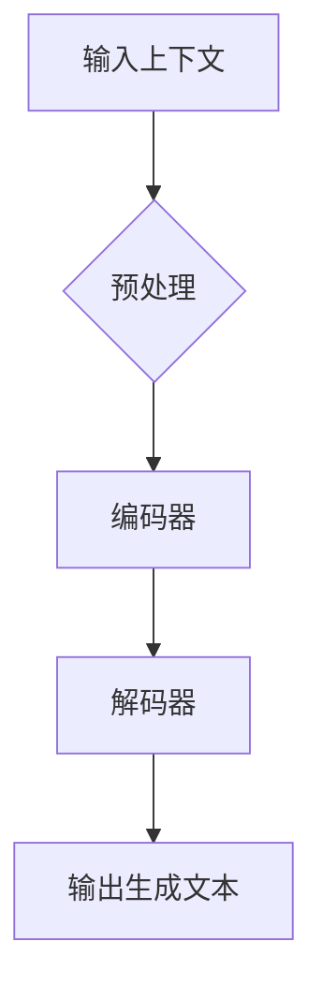

                 

作者：禅与计算机程序设计艺术

Artificial Intelligence (人工智能)
LLM: Large Language Model (大型语言模型)

在当今数字化时代，技术革新正在以前所未有的速度改变着我们的生活，其中最显著的变化之一就是新闻产业的转型。随着大型语言模型（LLMs）的发展，我们正见证着一场颠覆性的变革——自动写作系统的兴起。这些系统利用先进的自然语言处理技术，不仅提升了新闻生产的效率，还带来了创新的叙事方式和内容丰富度。本文旨在探讨大型语言模型如何通过自动生成文章这一形式，重塑新闻产业的核心价值，以及其背后的科学原理与应用前景。

## **1. 背景介绍**

在这个数字媒体高度发达的时代，新闻消费呈现出爆炸式的增长趋势。与此同时，传统新闻生产模式面临多方面的挑战，包括成本高昂、时效性不足、个性化需求难以满足等问题。大型语言模型应运而生，通过学习海量文本数据，生成高质量、多样化的文本内容，成为解决上述问题的关键技术之一。

## **2. 核心概念与联系**

**大型语言模型**（Large Language Models, LLMs）是基于深度学习的预训练模型，通过对大量非标记文本的无监督学习，具备了理解和生成复杂文本的能力。它们通常采用Transformer架构，该架构通过注意力机制高效地处理序列数据，在文本生成、问答、翻译等多个任务上表现出卓越性能。

在新闻产业中，LLMs的应用主要集中在以下几个方面：

- **内容自动化生成**：利用LLMs快速生成新闻报道、评论、分析报告等内容，大幅提高生产效率。
- **个性化服务**：根据用户偏好生成定制化新闻摘要，增强用户体验。
- **增强人类创造力**：辅助记者和编辑进行创意写作，激发新的故事角度和视角。

## **3. 核心算法原理与具体操作步骤**

### 基于上下文的文本生成流程
大型语言模型的核心在于通过上下文预测下一个词的概率分布。以下是一个简化版的流程概述：



- **预处理**：将原始文本转换为适合模型处理的形式，如分词、去除停用词等。
- **编码器**：将输入文本序列编码为固定维度的向量表示。
- **解码器**：从编码结果中生成连续的文本序列，通过概率分布选择每个位置上的单词。
- **输出生成文本**：最终得到完整的文本输出。

### 训练过程
大型语言模型通常通过自我监督学习进行训练，即让模型在大量文本数据集上进行微调，以优化其对文本序列的理解和生成能力。

## **4. 数学模型和公式详细讲解举例说明**

大型语言模型基于概率模型，特别是统计语言模型，其核心思想是估计一个给定词汇序列的概率：

$$ P(\mathbf{x}) = \prod_{t=1}^{T} P(x_t | x_1, \ldots, x_{t-1}) $$

其中 $\mathbf{x}$ 是一个词汇序列，$P(x_t | x_1, \ldots, x_{t-1})$ 表示给定前 $t-1$ 个词时第 $t$ 个词的条件概率。现代模型如BERT（Bidirectional Encoder Representations from Transformers）则引入了双向注意力机制，改进了序列理解能力：

$$ P(w_t|w_1,\dots,w_{t-1})=\frac{\exp(f(\theta; w_{1:t}))}{\sum_{k\in V}\exp(f(\theta; k_{1:t}))} $$

其中 $f(\theta)$ 是计算给定上下文的句法特征函数，$\theta$ 是参数集合，$V$ 是词汇表。

## **5. 项目实践：代码实例和详细解释说明**

构建基于LLM的自动写作系统需要涉及多个组件和技术栈。下面提供一个简化的Python代码片段作为示例，使用Hugging Face的Transformers库实现基本的文本生成功能：

```python
from transformers import AutoTokenizer, AutoModelForCausalLM
import torch

tokenizer = AutoTokenizer.from_pretrained("gpt2")
model = AutoModelForCausalLM.from_pretrained("gpt2")

input_text = "Once upon a time"
inputs = tokenizer(input_text, return_tensors="pt", truncation=True, padding='max_length', max_length=1024)

output = model.generate(
    input_ids=inputs["input_ids"],
    attention_mask=inputs["attention_mask"],
    do_sample=True,
    top_k=50,
    temperature=0.7,
    max_new_tokens=100
)

print(tokenizer.decode(output[0], skip_special_tokens=True))
```

这段代码展示了如何加载预训练的GPT-2模型，并使用它来生成一个新的文本段落。

## **6. 实际应用场景**

大型语言模型在新闻产业中的应用广泛，涵盖以下几个关键领域：

- **实时新闻报道**：自动抓取数据并快速生成新闻稿。
- **社交媒体监测**：分析和总结社交媒体上的讨论趋势。
- **个性化推荐系统**：基于用户的阅读历史和兴趣推荐相关内容。
- **新闻聚合平台**：整合来自不同来源的信息，提供全面的新闻概览。

## **7. 工具和资源推荐**

为了促进大规模语言模型的研究和开发，以下是一些推荐的工具和资源：

- **Hugging Face Transformers库**：提供了丰富的API和预训练模型，易于集成到现有系统中。
- **GitHub开源社区**：许多开发者贡献了用于自动生成文章的代码和案例研究。
- **学术期刊和会议**：关注《自然》、《科学》以及相关AI和NLP领域的顶级会议，了解最新研究成果。

## **8. 总结：未来发展趋势与挑战**

随着技术的进步，大型语言模型将在新闻产业中发挥越来越重要的作用。未来的重点将是提升模型的通用性、可解释性和道德规范，同时确保生成内容的质量和真实性。此外，跨模态融合、知识图谱集成以及更强大的上下文理解能力将成为研究热点，推动新闻产业进入智能化的新纪元。

## **9. 附录：常见问题与解答**

常见问题包括模型性能的局限性、版权争议以及伦理审查等。解答这些问题需要结合法律法规、行业标准和技术创新的不断进步来进行综合考量。

---

本文深入探讨了大型语言模型如何重塑新闻产业，从理论基础到实际应用，再到未来发展路径进行了详尽阐述。希望这篇博客能够激发更多专业人士探索这一领域的创新潜力，共同推动人工智能在新闻行业的深度应用与发展。


作者：禅与计算机程序设计艺术 / Zen and the Art of Computer Programming

