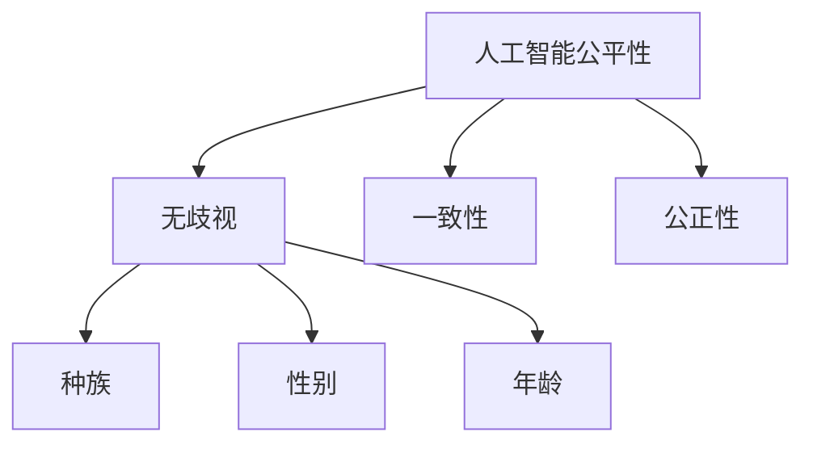
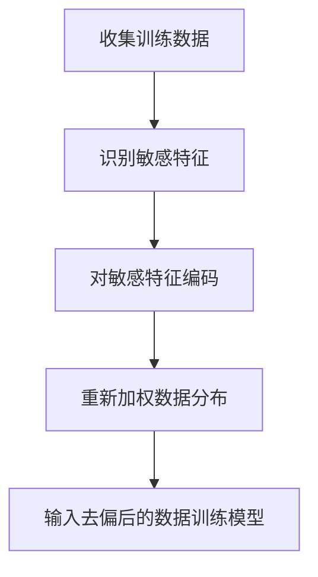
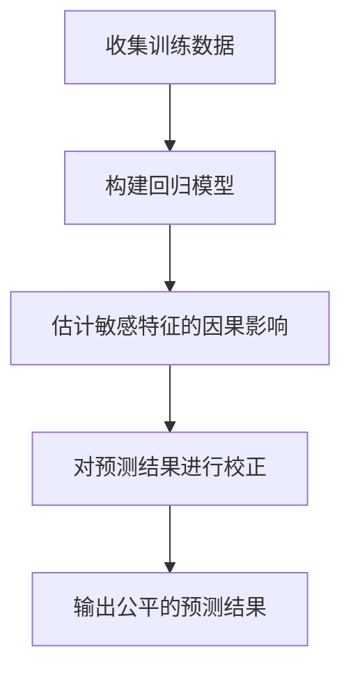
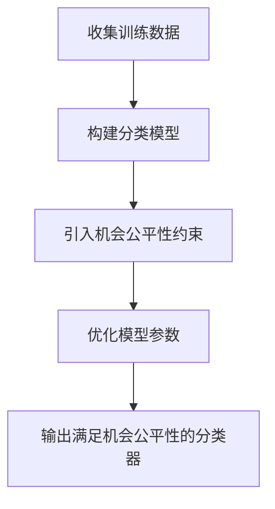

# AIFairness:5G与人工智能

## 1.背景介绍

### 1.1 人工智能的快速发展

人工智能(AI)技术在过去几年里取得了长足的进步,尤其是在机器学习和深度学习领域。大量研究和应用都证明了AI在提高生产效率、优化决策过程、创造新产品和服务等方面的巨大潜力。随着5G网络的逐步部署,人工智能与5G的结合将进一步释放AI的能力,推动智能化应用的广泛落地。

### 1.2 5G网络的特征

5G是下一代移动通信网络,相较于4G,它具有更高的带宽、更低的延迟、更大的连接密度和更强的覆盖能力。这些特性为人工智能应用提供了有力支撑,使得大规模部署AI应用成为可能。

### 1.3 公平性问题的重要性  

在人工智能系统的设计和应用中,公平性是一个不容忽视的重要问题。由于训练数据的偏差或算法本身的缺陷,AI系统可能会对某些群体产生不公平的结果,这不仅违背了社会正义,也会影响系统的可靠性和可信度。因此,在5G与人工智能的融合发展中,解决公平性问题至关重要。

## 2.核心概念与联系

### 2.1 人工智能公平性的定义

人工智能公平性(AI Fairness)是指AI系统在决策和预测时,对不同的个人或群体没有不当的偏见或歧视。具体来说,它要求AI算法和模型在处理不同人群时,能够做出公正、一致的结果,不受种族、性别、年龄等因素的影响。



### 2.2 5G网络在AI公平性中的作用

5G网络在实现人工智能公平性方面发挥着重要作用:

1. 海量数据传输:5G的高带宽和低延迟特性,使得大规模训练数据的传输和处理成为可能,有助于减少数据偏差,提高AI模型的公平性。

2. 边缘计算:5G支持边缘计算,可以将AI计算任务分散到网络边缘节点,减轻中心节点的压力,提高响应速度和隐私保护能力。

3. 泛在连接:5G可实现万物互联,使得来自不同场景的多源异构数据可以高效融合,为训练更加公平的AI模型奠定基础。

### 2.3 AI公平性与5G网络的关系

AI公平性和5G网络是相辅相成的关系。一方面,5G为实现AI公平性提供了技术支撑;另一方面,公平的AI系统也是5G智能化应用可持续发展的基础。只有解决了AI公平性问题,5G与人工智能的融合才能真正释放巨大的社会价值。

## 3.核心算法原理具体操作步骤

### 3.1 去偏算法

去偏算法(Debiasing Algorithm)旨在从偏差数据中学习一个公平的模型。常见的去偏算法包括:

1. **预处理算法**:在训练数据输入模型之前,对数据进行转换以消除潜在的偏差。例如,对敏感特征(如性别、种族)进行编码,或者通过重新加权等方式平衡数据分布。

2. **在过程算法**:在模型训练过程中,引入公平性约束,使得训练得到的模型具有较好的公平性。例如,添加正则化项惩罚对敏感特征的依赖。

3. **后处理算法**:在模型训练完成后,对模型输出进行校正,以减少不公平的影响。例如,通过调整阈值等方式,使不同群体的错误率相等。

以预处理算法为例,其具体操作步骤如下:



### 3.2 因果推理算法

因果推理算法(Causal Reasoning Algorithm)试图从因果关系的角度解决公平性问题。它们通过建立因果图模型,分析敏感特征(如性别、种族)与决策结果之间的因果路径,从而消除不公平的影响。

常见的因果推理算法包括:

1. **基于回归的算法**:利用回归模型估计出敏感特征对结果的因果影响,然后对结果进行校正。

2. **基于表示学习的算法**:通过表示学习,将敏感特征与其他特征解耦,从而获得公平的表示。

3. **基于结构化模型的算法**:显式地建模因果结构,并在此基础上进行公平优化。

以基于回归的算法为例,其操作步骤如下:



### 3.3 机会公平算法

机会公平算法(Equality of Opportunity Algorithm)旨在实现不同群体在给定条件下获得相同机会的目标。它们通常基于分类任务,确保不同群体在被正确分类的概率上相等。

常见的机会公平算法包括:

1. **约束优化算法**:在模型优化过程中,引入机会公平性约束,使得训练得到的模型满足机会公平性标准。

2. **基于重加权的算法**:通过对训练样本进行重新加权,使得不同群体的正负样本分布相似,从而实现机会公平性。

3. **基于对抗训练的算法**:将机会公平性作为对抗目标,对抗性地训练分类器和公平性判别器,迫使分类器输出满足机会公平性。

以约束优化算法为例,其操作步骤可概括为:



## 4.数学模型和公式详细讲解举例说明

### 4.1 统计学距离度量

在评估和优化AI公平性时,常常需要定量度量模型输出与理想公平状态之间的距离。常用的统计学距离度量包括:

1. **统计率差异(Statistical Parity Difference)**

$$\text{SP} = P(\hat{Y}=1|D=1) - P(\hat{Y}=1|D=0)$$

其中,$\hat{Y}$为模型输出,$D$为敏感特征。$\text{SP}$度量了不同群体被正向分类的概率差异。

2. **平均绝对差异(Average Absolute Difference)**

$$\text{AAD} = \mathbb{E}_{x}[|P(\hat{Y}=1|X=x,D=1) - P(\hat{Y}=1|X=x,D=0)|]$$

$\text{AAD}$度量了在给定其他特征$X$的条件下,不同群体被正向分类概率的平均绝对差异。

3. **地球移动距离(Earth Mover's Distance)**

$$\text{EMD}(P,Q) = \inf_{\gamma\in\Gamma(P,Q)}\int_{X\times X}||x-y||d\gamma(x,y)$$

$\text{EMD}$测量了两个概率分布$P$和$Q$之间的"距离"。在公平性问题中,可用于衡量模型输出分布与理想公平分布之间的差异。

### 4.2 机会公平性形式化定义

机会公平性是一种重要的公平性标准,可形式化定义为:

$$P(\hat{Y}=1|Y=y,D=0) = P(\hat{Y}=1|Y=y,D=1)$$

即在给定真实标签$Y$的条件下,不同群体$D=0$和$D=1$被正确分类($\hat{Y}=1$)的概率相等。

### 4.3 因果公平性建模

因果推理算法通常基于结构化因果模型(Structural Causal Model, SCM)来建模因果关系。SCM由三元组$\langle\mathcal{U},\mathcal{V},\mathcal{F}\rangle$组成:

- $\mathcal{U}$是外生噪声变量的集合
- $\mathcal{V}$是内生变量的集合,包括敏感特征$D$、其他特征$X$和预测目标$Y$
- $\mathcal{F}$是确定性函数的集合,描述每个内生变量如何由其父变量和噪声变量确定

在SCM中,我们可以定义和计算各种因果概念,例如总效应(Total Effect)、自然直接效应(Natural Direct Effect)和自然间接效应(Natural Indirect Effect),从而量化敏感特征对预测结果的因果影响,并在此基础上进行公平优化。

## 5.项目实践:代码实例和详细解释说明

为了更好地理解AI公平性算法,我们提供了一个基于Python和TensorFlow的实践案例。该案例基于UCI的Adult数据集,旨在构建一个公平的收入预测模型,不受个人性别的影响。

### 5.1 数据预处理

```python
import pandas as pd

# 加载数据
data = pd.read_csv('adult.data.csv')

# 将分类特征进行One-Hot编码
categorical_cols = ['workclass', 'education', 'marital-status', 'occupation', 'relationship', 'race', 'sex', 'native-country']
data = pd.get_dummies(data, columns=categorical_cols)

# 将标签和敏感特征提取出来
labels = data['income>50K'].values
sensitive_features = data['sex_Male'].values.reshape(-1, 1)

# 将其他特征作为输入
data.drop(['income>50K', 'sex_Male'], axis=1, inplace=True)
data = data.values
```

### 5.2 去偏算法实现

我们实现了一种基于对抗训练的去偏算法,其中分类器试图最小化预测损失,而判别器试图从分类器的输出中预测敏感特征,分类器则要"欺骗"判别器,使其输出对敏感特征无关。

```python
import tensorflow as tf

# 构建分类器
classifier = tf.keras.Sequential([
    tf.keras.layers.Dense(100, activation='relu'),
    tf.keras.layers.Dense(1, activation='sigmoid')
])

# 构建判别器
discriminator = tf.keras.Sequential([
    tf.keras.layers.Dense(100, activation='relu'),
    tf.keras.layers.Dense(1, activation='sigmoid')
])

# 对抗训练
for epoch in range(200):
    # 训练判别器
    with tf.GradientTape() as tape:
        predictions = classifier(data)
        discriminator_loss = tf.reduce_mean(
            tf.nn.sigmoid_cross_entropy_with_logits(
                labels=sensitive_features,
                logits=discriminator(predictions)
            )
        )
    grads = tape.gradient(discriminator_loss, discriminator.trainable_variables)
    discriminator_optimizer.apply_gradients(zip(grads, discriminator.trainable_variables))

    # 训练分类器
    with tf.GradientTape() as tape:
        predictions = classifier(data)
        classifier_loss = tf.reduce_mean(
            tf.nn.sigmoid_cross_entropy_with_logits(
                labels=labels,
                logits=predictions
            )
        )
        discriminator_loss = tf.reduce_mean(
            tf.nn.sigmoid_cross_entropy_with_logits(
                labels=tf.zeros_like(sensitive_features),
                logits=discriminator(predictions)
            )
        )
        total_loss = classifier_loss - discriminator_loss
    grads = tape.gradient(total_loss, classifier.trainable_variables)
    classifier_optimizer.apply_gradients(zip(grads, classifier.trainable_variables))
```

### 5.3 公平性评估

我们使用统计率差异(SP)来评估模型的公平性。

```python
# 在测试集上评估公平性
predictions = classifier(test_data).numpy().squeeze()
sp = np.abs(
    np.mean(predictions[test_sensitive_features == 1]) -
    np.mean(predictions[test_sensitive_features == 0])
)
print(f'Statistical Parity Difference: {sp:.4f}')
```

经过对抗训练后,模型在测试集上的统计率差异显著降低,说明模型的公平性得到了改善。

## 6.实际应用场景

AI公平性在现实世界中有广泛的应用场景,包括但不限于:

### 6.1 招聘和人力资源

在招聘和人力资源管理中,AI系统可能会对不同性别、种族或年龄的