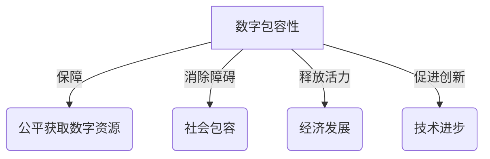
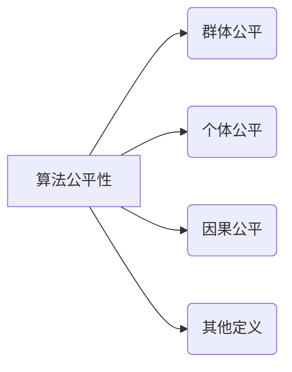
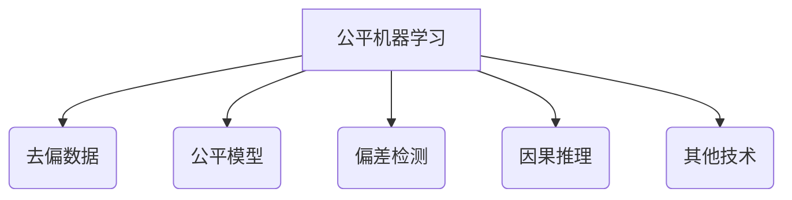

# AIFairness:网络与数字分歧

## 1.背景介绍

### 1.1 数字鸿沟与不公平

在当今时代,互联网和数字技术已经无处不在,渗透到我们生活的方方面面。然而,由于种种原因,并非所有人都能够公平获取和利用这些技术资源,导致了一个显著的"数字鸿沟"。这种数字分歧不仅存在于不同国家和地区之间,同时也体现在同一社会内部不同群体之中。

一些群体由于经济状况、地理位置、教育水平、年龄、性别、种族或其他因素的限制,在获取数字资源、掌握数字技能等方面面临着严重的不公平对待。这种数字不平等加剧了社会分化,扩大了贫富差距,制约了整体的经济发展和社会进步。

### 1.2 算法偏差与不公平

除了获取数字资源的不平等外,算法本身的偏差也是导致数字不公平的一个重要原因。许多人工智能算法在训练数据、模型结构和应用过程中,由于种种原因而产生了种族、性别、年龄等方面的偏差和歧视,从而加剧了现有的不公平现象。

一些算法被发现在招聘、贷款审批、刑事判决等重要决策中对某些群体存在明显的不利偏见。这不仅侵犯了相关群体的合法权益,也损害了整个AI系统的公正性和可信度。因此,消除算法偏差、构建公平的人工智能系统成为了一个紧迫的课题。

## 2.核心概念与联系  

### 2.1 数字包容性

数字包容性(Digital Inclusion)是指所有人都能够公平获取和利用数字技术、资源和服务的状态。它要求消除一切基于经济、社会、地理、身体和其他因素而产生的数字障碍,确保每个人在数字时代都不会被边缘化和排斥。

提高数字包容性不仅有利于保护弱势群体的权益,而且对于释放整个社会的创新活力、推动经济发展也具有重要意义。可持续发展目标(SDGs)中的第九项目标就是"建设具有复原力的基础设施,促进包容性的可持续工业化,并推动创新"。

### 2.2 算法公平性

算法公平性(Algorithmic Fairness)是指算法在做出决策时,不会因为个体的种族、性别、年龄等敏感属性而产生不公正的结果。它要求算法在相关属性上保持组间和组内的统计学平等性。

算法公平性包含多个不同的形式化定义,如群体公平、个体公平、因果公平等。这些定义从不同角度量化和约束算法的偏差程度,为构建公平的AI系统提供了理论基础。

### 2.3 公平机器学习

公平机器学习(Fairness in Machine Learning)是一个新兴的交叉研究领域,致力于从算法、理论和系统等多个层面解决机器学习中的公平性问题。

它包括了去偏数据处理、公平模型学习、偏差检测与缓解、因果推理等多个研究方向。通过改进算法设计和优化流程,公平机器学习力图在提高模型精度的同时,也能够满足相应的公平性标准。

### 2.4 概念关联

数字包容性、算法公平性和公平机器学习三个概念虽然来源不同,但是它们存在着内在的联系:数字包容性为所有人提供了平等获取数字技术的基础;算法公平性则规范了算法在做出决策时应该遵循的公平原则;而公平机器学习则是在算法层面实现这些公平性目标的具体技术手段。

只有三者相互配合、相得益彰,我们才能真正在数字时代构建一个更加公正、包容的社会。消除数字和算法层面的偏见和不平等,是实现更大公平正义的重要一环。

## 3.核心算法原理具体操作步骤

### 3.1 群体公平性

群体公平性(Group Fairness)要求算法对不同的敏感属性组(如种族、性别等)保持统计学上的中性,不会系统性地偏向或歧视某些特定群体。常见的群体公平性定义包括:

1. **统计率无差异**(Statistical Parity)

$$P(\hat{Y}=1|S=0) = P(\hat{Y}=1|S=1)$$

其中$\hat{Y}$为算法输出,S为敏感属性。要求有和无敏感属性的个体获得正面结果(如通过)的概率相等。

2. **等机会**  (Equal Opportunity)

$$P(\hat{Y}=1|Y=1,S=0) = P(\hat{Y}=1|Y=1,S=1)$$

对于同为正例(Y=1)的不同敏感属性组,它们被正确预测为正例的概率相等。

3. **平均误差无差异**(Average Odds Equalized)

$$\begin{aligned}
P(\hat{Y}=1|Y=0,S=0) &= P(\hat{Y}=1|Y=0,S=1) \\
P(\hat{Y}=1|Y=1,S=0) &= P(\hat{Y}=1|Y=1,S=1)
\end{aligned}$$

对于不同敏感属性组,它们的误报率和命中率都相等。

要实现群体公平性,主要有以下几种算法思路:

1. **预处理**:在模型训练之前,对训练数据进行重新加权或者数据增强,以减少数据中的偏差。
2. **在处理**:在模型训练过程中,通过添加正则化约束项或者对损失函数进行改造,使得学习到的模型满足公平性要求。
3. **后处理**:在模型预测结果输出后,对结果进行校正和调整,从而达到公平性目标。

### 3.2 个体公平性

个体公平性(Individual Fairness)的核心思想是:对于相似的个体,算法应该给出相似的结果,而不应该因为敏感属性的差异而有所不同。

形式化地,给定一个相似度度量$D(x,x')$,以及敏感属性集合A,对任意x,x'满足:

$$D(x,x') \leq d \Rightarrow |f(x)-f(x')| \leq c$$

其中f为算法模型,c为一个小的常数。也就是说,对于足够相似的个体,模型输出之差应当在一个较小的范围内。

实现个体公平性的一个重要算法是公平表示学习(Fair Representation Learning),其思路是:

1. 学习一个公平的数据表示,使得敏感属性A与表示之间无关:$R \bot A$
2. 在这一公平表示R的基础上,训练一个预测模型$f(R)$

这样得到的模型f在相似个体x,x'之间就不会有太大的输出差异,从而实现了个体公平性。

### 3.3 因果公平性

因果公平性(Causal Fairness)的核心在于利用因果推理和结构化因果模型,分析出算法中不公平的根源,并对症下药地进行修正。

给定一个因果图G,其中包含了敏感属性S、算法输入X、算法输出$\hat{Y}$以及真实标签Y等节点,我们可以定义以下几种不同的因果公平性:

1. **反事实公平性**:如果去除了敏感属性S对$\hat{Y}$的因果影响,那么对于任意x,x',有:

$$P(\hat{Y}=1|X=x,S=0) = P(\hat{Y}=1|X=x',S=1)$$

2. **路径特定公平性**:不允许敏感属性S通过特定的路径对$\hat{Y}$产生影响。

3. **对因果公平性**:敏感属性S对$\hat{Y}$的影响应当与对Y的影响保持一致。

实现因果公平性的一般算法流程是:

1. 利用观测数据和先验知识,构建出因果图G
2. 根据特定的公平性定义,识别出图G中的不公平路径
3. 在图G中去除或阻断这些不公平路径的影响
4. 在修正后的公平图G'上,重新训练公平的预测模型

### 3.4 小结

群体公平性、个体公平性和因果公平性是目前公平机器学习领域的三大主流范式。它们分别从群体统计、个体相似性和因果机制等不同角度定义和量化了算法公平性的内涵。

在实践中,我们需要根据具体的应用场景和任务需求,选择合适的公平性定义,并采取相应的算法实现方式,以构建出真正公平且高效的人工智能系统。

## 4.数学模型和公式详细讲解举例说明

在上一节中,我们介绍了一些公平机器学习的核心算法原理。这一节,我们将对其中涉及的数学模型和公式进行更加详细的讲解和举例说明。

### 4.1 统计率无差异

统计率无差异(Statistical Parity)要求算法对不同敏感属性组的个体,给予相同的正面结果概率。形式化地:

$$P(\hat{Y}=1|S=0) = P(\hat{Y}=1|S=1)$$

其中$\hat{Y}$为算法输出,S为敏感属性(如性别)。

**例子**:假设我们有一个简单的二元分类任务,需要根据申请人的资料预测是否通过审批。现在我们训练了一个分类器f,在测试集A(男性申请人)和测试集B(女性申请人)上的表现如下:

- 测试集A(男性):通过率为60% 
- 测试集B(女性):通过率为40%

显然,这个分类器f在性别属性上违反了统计率无差异,对女性存在一定程度的负面偏差。我们需要对训练数据、模型或结果进行修正,使得两个群体的通过率达到统计学上的一致性。

### 4.2 等机会

等机会(Equal Opportunity)的定义是:对于同为正例(Y=1)的不同敏感属性组,它们被正确预测为正例的概率相等。形式化地:

$$P(\hat{Y}=1|Y=1,S=0) = P(\hat{Y}=1|Y=1,S=1)$$

**例子**:假设我们有一个对违法行为进行风险评估的系统,目的是预测某人是否会在未来一年内再次实施犯罪(Y=1)。我们在不同种族群体的测试集上评估模型,发现:

- 白人群体:已知会再次实施犯罪的人中,90%被正确评估为高风险
- 非裔群体:已知会再次实施犯罪的人中,只有70%被正确评估为高风险  

这就违反了等机会公平性原则。我们需要调整模型,使得对于已知的"将要再次实施犯罪"的人群,不同种族的命中率保持一致。

### 4.3 平均误差无差异

平均误差无差异(Average Odds Equalized)的定义是:对于不同敏感属性组,它们的误报率和命中率都相等。形式化地:

$$\begin{aligned}
P(\hat{Y}=1|Y=0,S=0) &= P(\hat{Y}=1|Y=0,S=1) \\  
P(\hat{Y}=1|Y=1,S=0) &= P(\hat{Y}=1|Y=1,S=1)
\end{aligned}$$

**例子**:假设我们有一个自动化贷款审批系统,需要根据申请人的资料预测是否批准贷款申请。我们在不同年龄组的测试集上评估模型,发现:

- 青年组(18-35岁):
  - 误报率(拒绝了实际上可以批准的申请)为10%
  - 命中率(批准了确实可以批准的申请)为80%
- 中年组(36-60岁): 
  - 误报