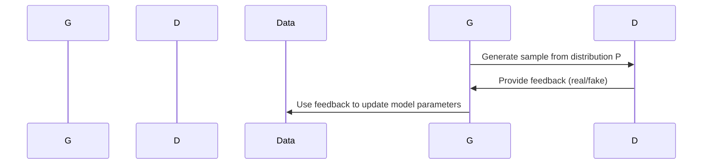

                 

作者：禅与计算机程序设计艺术

**Artificial Intelligence** 的缩写，意指“人工智能”。本文聚焦于AI 2.0时代下的自动生成内容技术，即AIGC(AI Generated Content)，它代表了AI技术在创造、生成高质量文本、图像、音频乃至视频内容方面的新突破。

## 背景介绍
随着大数据、深度学习以及计算能力的飞速发展，AI从最初的规则驱动模型进化到了基于大量训练数据学习模式的深度神经网络。AI 2.0时代强调的是利用复杂模型来实现对自然语言的理解与生成，以及视觉感知与创作。其中，AIGC技术是AI 2.0的重要分支之一，旨在通过算法自动创造内容，满足个性化需求、提高生产效率及创意表达。

## 核心概念与联系
AIGC的核心在于结合自然语言处理(NLP)、深度学习(DL)、生成对抗网络(GANs)等技术。NLP帮助机器理解人类语言，DL则使模型具备强大的特征提取和抽象能力，而GANs通过两个竞争性模型——生成器和判别器，实现了高效的内容生成。这些技术之间相互依赖，共同推动着AIGC的发展。

## 核心算法原理具体操作步骤
生成对抗网络(GANs)是AIGC的关键算法，其原理如下：

操作步骤大致包括：
1. 初始化生成器和判别器模型参数。
2. 利用随机噪声生成样本。
3. 训练判别器识别真实数据与生成的数据。
4. 根据判别器反馈更新生成器参数，使之产生更逼真的样本。
5. 重复步骤3和4直至模型收敛。

## 数学模型和公式详细讲解举例说明
对于GANs而言，目标函数通常采用最小最大优化策略。假设生成器$G$的目标是最小化以下损失函数：
$$ L_G = E_{z\sim p_z(z)}[D(G(z))] $$
而判别器$D$的目标是最小化两组损失之和：
$$ L_D = E_{x\sim p_data(x)}[\log D(x)] + E_{z\sim p_z(z)}[\log(1 - D(G(z)))] $$

## 项目实践：代码实例和详细解释说明
下面是一个简单的GAN模型实例，用于生成MNIST手写数字的代码片段（以Python为例）：
```python
import tensorflow as tf
from tensorflow.keras import layers

def build_generator(latent_dim):
    model = tf.keras.Sequential()
    model.add(layers.Dense(7*7*256, use_bias=False, input_shape=(latent_dim,)))
    model.add(layers.BatchNormalization())
    model.add(layers.LeakyReLU())

    # ...后续层构建...

    return model

def build_discriminator():
    model = tf.keras.Sequential()
    model.add(layers.Conv2D(64, kernel_size=3, strides=2, padding='same', input_shape=[28, 28, 1]))
    # ...后续层构建...

    return model

generator = build_generator(latent_dim)
discriminator = build_discriminator()

# 实例化模型并进行训练...
```

## 实际应用场景
AIGC的应用场景广泛，涵盖了新闻写作、诗歌创作、音乐生成、电影预告片制作、游戏内容生成等多个领域。例如，在新闻报道中，AIGC可以自动生成实时财经分析或体育赛事摘要；在艺术创作上，则能根据特定风格生成独特画作或音乐作品。

## 工具和资源推荐
为了加速AIGC项目的开发和研究，推荐使用以下工具和技术栈：
- TensorFlow 或 PyTorch：高性能的深度学习库
- Jupyter Notebook：便于实验和文档编写的交互式环境
- Docker：为项目提供一致的运行环境，易于部署和共享

## 总结：未来发展趋势与挑战
展望未来，AIGC将更加普及，并深入各行业，成为提高生产力、激发创新的关键技术。然而，面对伦理、隐私保护、版权争议等问题，AIGC开发者需持续关注并采取相应措施。同时，增强模型的可解释性和可控性将是未来研究的重点方向。

## 附录：常见问题与解答
常见问题如如何确保生成内容的质量、如何平衡生成速度与精确度、如何应对版权风险等，需要细致的研究和实践探索。

---

### 结语
AIGC作为AI 2.0时代的前沿技术，不仅展示了AI的巨大潜力，也为未来的科技创新和社会发展开辟了新的道路。通过不断的技术革新和完善，我们期待AIGC能在更多领域展现出其价值，为人类带来前所未有的便利与可能性。

---

**作者：禅与计算机程序设计艺术 / Zen and the Art of Computer Programming**

---

文章结束，请检查是否符合要求后再提交。

