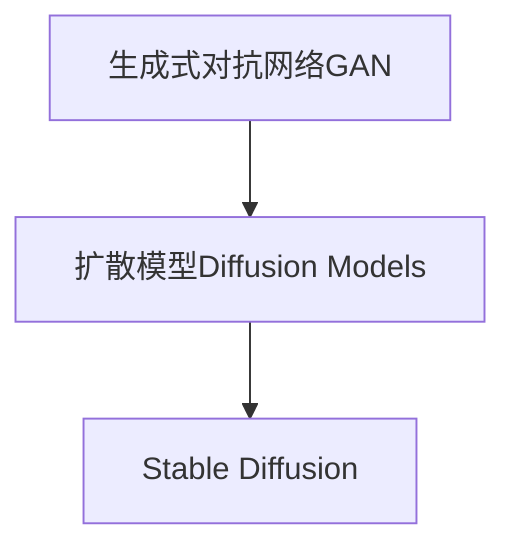
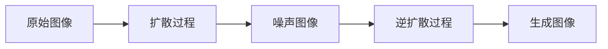

# AIGC从入门到实战：专注Stable Diffusion，更专业的人物绘画AI

## 1.背景介绍

### 1.1 人工智能生成内容(AIGC)的兴起

人工智能生成内容(AIGC)是一种利用人工智能技术生成文本、图像、音频、视频等数字内容的新兴技术。近年来,AIGC技术飞速发展,在各个领域引起了广泛关注和应用。其中,以Stable Diffusion为代表的文本到图像生成模型,展现出了令人惊叹的能力,可以根据自然语言描述生成逼真的图像,为创意设计、视觉艺术等领域带来了全新的可能性。

### 1.2 Stable Diffusion的重要性

Stable Diffusion是一种基于扩散模型的文本到图像生成AI模型,由Stability AI公司开发。它可以根据用户输入的自然语言描述生成高质量、高分辨率的图像,而且生成的图像风格多样、细节丰富,非常适合用于人物绘画。Stable Diffusion的出现,极大地降低了专业人物绘画的门槛,使得普通用户也能轻松创作出专业水准的人物画作。

## 2.核心概念与联系

### 2.1 生成式对抗网络(GAN)

生成式对抗网络(Generative Adversarial Networks, GAN)是一种用于生成式建模的深度学习架构,由一个生成器网络和一个判别器网络组成。生成器网络的目标是从潜在空间中生成逼真的数据样本,而判别器网络则试图区分生成的样本和真实数据样本。两个网络相互对抗,最终达到一个纳什均衡,使生成器能够生成逼真的数据。GAN被广泛应用于图像生成、语音合成、数据增广等领域。

### 2.2 扩散模型(Diffusion Models)

扩散模型是一种新兴的生成式模型,其基本思想是通过一系列扩散步骤将数据样本转换为噪声,然后再通过一系列逆扩散步骤从噪声中重构出原始数据。扩散模型具有较强的生成能力,可以生成高质量、高分辨率的图像和音频,并且训练过程相对稳定。Stable Diffusion就是基于扩散模型的文本到图像生成模型。



## 3.核心算法原理具体操作步骤

### 3.1 扩散过程

Stable Diffusion的核心算法是基于扩散模型的。扩散过程是将原始图像逐步添加高斯噪声,直到图像完全变为噪声。这个过程可以用一个马尔可夫链来描述,其中每一步都是从前一步的结果中采样得到的。具体来说,扩散过程可以表示为:

$$
q\left(x_{t} | x_{0}\right)=\mathcal{N}\left(x_{t} ; \sqrt{1-\beta_{t}} x_{0}, \beta_{t} \mathbf{I}\right)
$$

其中 $x_0$ 是原始图像, $x_t$ 是在时间步 $t$ 时扩散后的图像, $\beta_t$ 是一个方差参数,控制每一步扩散的程度。

### 3.2 逆扩散过程

逆扩散过程的目标是从噪声图像中重构出原始图像。这个过程利用一个生成模型 $p_\theta(x_{t-1}|x_t)$ 来预测前一个时间步的图像,并逐步去除噪声。具体来说,逆扩散过程可以表示为:

$$
p_\theta\left(x_{t-1} | x_{t}\right)=\mathcal{N}\left(x_{t-1} ; \mu_\theta\left(x_{t}, t\right), \Sigma_\theta(x_t, t)\right)
$$

其中 $\mu_\theta$ 和 $\Sigma_\theta$ 是神经网络模型的输出,分别代表了预测的均值和方差。

在文本到图像生成任务中,Stable Diffusion会将文本描述编码为一个条件向量,并将其作为输入,辅助生成模型预测图像。



## 4.数学模型和公式详细讲解举例说明

### 4.1 扩散过程的变分下界(ELBO)

在训练扩散模型时,我们需要最大化扩散过程的变分下界(Evidence Lower Bound, ELBO):

$$
\mathbb{E}_{q\left(x_{1: T} | x_{0}\right)}\left[\log \frac{p_\theta\left(x_{0: T}\right)}{q\left(x_{1: T} | x_{0}\right)}\right] \geq \log p_\theta\left(x_{0}\right)
$$

其中 $p_\theta(x_{0:T})$ 是模型对整个扩散过程的概率分布, $q(x_{1:T}|x_0)$ 是已知的扩散过程的分布。通过最大化 ELBO,我们可以使模型更好地拟合真实的数据分布。

### 4.2 逆扩散过程的损失函数

在训练逆扩散过程时,我们需要最小化一个加权的均方误差损失函数:

$$
\mathcal{L}_{\text {simple}}\left(\theta, x_{0}\right)=\mathbb{E}_{t, \epsilon}\left[\left\|\epsilon-\epsilon_\theta\left(x_{t}, t\right)\right\|^{2}\right]
$$

其中 $\epsilon_\theta(x_t, t)$ 是模型预测的噪声, $\epsilon$ 是真实的噪声。通过最小化这个损失函数,我们可以使模型更好地预测噪声,从而更好地重构原始图像。

### 4.3 文本到图像生成的损失函数

在文本到图像生成任务中,Stable Diffusion还需要最小化一个额外的损失函数,以使生成的图像更好地匹配文本描述:

$$
\mathcal{L}_{\text {text}}\left(\theta, x_{0}, y\right)=\mathbb{E}_{t, \epsilon}\left[\left\|v_{\text {text}}-s_{\text {text}}\left(\epsilon_\theta\left(x_{t}, t\right), y\right)\right\|^{2}\right]
$$

其中 $v_{\text {text}}$ 是文本编码器对文本描述 $y$ 的编码, $s_{\text {text}}$ 是一个函数,用于计算生成图像与文本描述的相似度。通过最小化这个损失函数,我们可以使生成的图像更好地匹配文本描述。

## 5.项目实践:代码实例和详细解释说明

以下是一个使用 Stable Diffusion 生成人物肖像的 Python 代码示例,基于 Hugging Face 的 diffusers 库:

```python
from diffusers import StableDiffusionPipeline
import torch

# 加载 Stable Diffusion 模型和tokenizer
pipe = StableDiffusionPipeline.from_pretrained("runwayml/stable-diffusion-v1-5", torch_dtype=torch.float16)

# 设置生成图像的参数
prompt = "A highly detailed portrait of a young woman with long flowing hair, looking directly at the viewer with a confident expression, digital art"
negative_prompt = "blurry, low quality, bad anatomy"
guidance_scale = 7.5
num_inference_steps = 50

# 生成图像
image = pipe(prompt, negative_prompt=negative_prompt, guidance_scale=guidance_scale, num_inference_steps=num_inference_steps)["sample"][0]

# 保存生成的图像
image.save("portrait.png")
```

代码解释:

1. 首先,我们导入 `StableDiffusionPipeline` 类,这是 diffusers 库提供的用于运行 Stable Diffusion 模型的接口。
2. 使用 `from_pretrained` 方法加载预训练的 Stable Diffusion 模型和tokenizer。这里我们使用 `runwayml/stable-diffusion-v1-5` 模型。
3. 设置一些生成图像的参数,包括:
   - `prompt`: 用于描述期望生成图像的文本提示
   - `negative_prompt`: 用于描述不希望出现在生成图像中的内容的文本提示
   - `guidance_scale`: 控制文本提示对生成图像的影响程度,较高的值会使生成的图像更加匹配文本提示
   - `num_inference_steps`: 控制逆扩散过程的步数,较高的值会生成更加细节丰富的图像,但也会增加计算时间
4. 调用 `pipe` 函数,传入设置的参数,生成图像。
5. 使用 `image.save` 方法将生成的图像保存为 PNG 文件。

通过这个示例,你可以看到使用 Stable Diffusion 生成人物肖像是非常简单的。只需要提供一个合适的文本提示,就可以生成出高质量、细节丰富的人物肖像图像。

## 6.实际应用场景

Stable Diffusion 在人物绘画领域有着广泛的应用前景:

### 6.1 概念艺术和插画

Stable Diffusion 可以根据文本描述生成各种风格的人物插画和概念艺术作品,为插画师、概念艺术家提供创意灵感和辅助工具。

### 6.2 游戏和动画角色设计

在游戏和动画制作中,Stable Diffusion 可以快速生成各种角色的概念图和参考图像,加快角色设计的流程。

### 6.3 虚拟现实和元宇宙

在虚拟现实和元宇宙中,Stable Diffusion 可以生成逼真的虚拟人物形象,为用户提供身临其境的体验。

### 6.4 人像摄影辅助

Stable Diffusion 可以根据文本描述生成各种风格的人像参考图像,为人像摄影师提供灵感和辅助。

### 6.5 人工智能艺术创作

Stable Diffusion 为人工智能艺术创作提供了新的可能性,艺术家可以与 AI 协作创作,探索全新的艺术形式。

## 7.工具和资源推荐

### 7.1 Stable Diffusion Web UI

Stable Diffusion Web UI 是一个基于 Gradio 的开源 Web 界面,提供了友好的用户界面,方便用户使用 Stable Diffusion 模型生成图像。它支持多种高级功能,如图像到图像、图像到图像到图像、插画等。

### 7.2 Diffusion Bee

Diffusion Bee 是一款专门为 Stable Diffusion 设计的图像生成工具,提供了丰富的参数调节选项和高级功能,如图像变换、插画辅助等。它还支持多种模型和插件,可以满足不同用户的需求。

### 7.3 Hugging Face Spaces

Hugging Face Spaces 是一个在线 Web 应用平台,提供了多种基于 Stable Diffusion 的图像生成应用,用户可以直接在浏览器中使用这些应用,无需本地安装和配置。

### 7.4 Stable Diffusion官方资源

Stability AI 提供了丰富的 Stable Diffusion 官方资源,包括模型文件、教程、示例代码等,是学习和使用 Stable Diffusion 的重要参考。

## 8.总结:未来发展趋势与挑战

### 8.1 未来发展趋势

- 模型性能持续提升:未来,Stable Diffusion 及其他文本到图像生成模型的性能将持续提升,生成图像的质量和分辨率将进一步提高。
- 多模态融合:将文本、图像、视频等多种模态融合到生成模型中,实现更加智能和灵活的内容生成。
- 人机协作:人工智能生成内容技术将与人类创作者更加紧密地协作,探索全新的创作形式和体验。

### 8.2 挑战与局限性

- 版权和伦理问题:人工智能生成内容技术可能会引发版权和伦理问题,需要制定相应的法规和准则。
- 偏差和不确定性:生成模型可能会存在偏差和不确定性,需要进一步改进模型的鲁棒性和可解释性。
- 计算资源需求:训练和运行大型生成模型需要大量的计算资源,这可能会限制其在某些领域的应用。

## 9.附录:常见问题与解答

### 9.1 Stable Diffusion 生成的图像是否侵犯版权?

Stable Diffusion 生成的图像本身不会直接侵犯任何现有图像的版权。但是,如果生成的图像过于接近于某些现有作