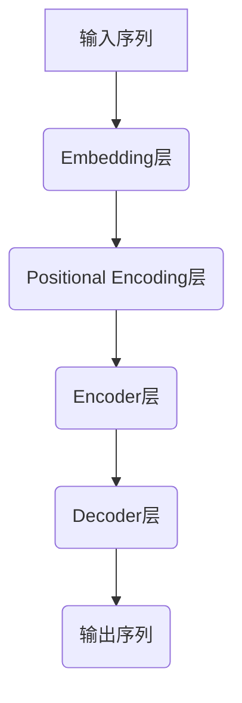
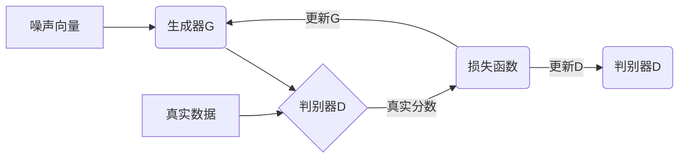

# AIGC从入门到实战：人工智能应用大规模涌现的原因

## 1. 背景介绍

### 1.1 人工智能的发展历程

人工智能(Artificial Intelligence, AI)是当代科技领域最具革命性和颠覆性的技术之一。自20世纪50年代AI概念被正式提出以来,经历了几个重要的发展阶段:

- 1950年代至1970年代:AI的孕育期,主要集中在博弈问题、逻辑推理和知识表示等领域。
- 1980年代至1990年代:专家系统和机器学习算法的兴起,推动了AI在特定领域的应用。
- 21世纪初:大数据和强大计算能力的出现,使得深度学习等算法得以发展,推动了AI的新一轮繁荣。

### 1.2 AIGC的兴起

近年来,以ChatGPT为代表的大型语言模型(Large Language Model, LLM)技术取得了突破性进展,催生了全新的人工智能生成内容(AI Generated Content, AIGC)领域。AIGC技术可以生成高质量的文本、图像、视频、音频等多种形式的内容,在内容创作、虚拟数字人等多个领域展现出巨大的应用潜力。

### 1.3 AIGC大规模涌现的原因

AIGC技术的大规模涌现,主要源于以下几个方面的驱动力:

- 算力硬件的飞速发展
- 大规模训练数据的积累
- 深度学习算法的创新突破
- 商业应用需求的迫切性
- 社会对AI技术的广泛关注

## 2. 核心概念与联系

### 2.1 大型语言模型(LLM)

大型语言模型是AIGC技术的核心,它通过在海量文本数据上训练,学习人类语言的模式和规律,从而获得生成自然语言内容的能力。常见的LLM包括:

- GPT(Generative Pre-trained Transformer)
- BERT(Bidirectional Encoder Representations from Transformers)
- T5(Text-to-Text Transfer Transformer)
- PanGu、武恩等中文预训练模型

### 2.2 生成对抗网络(GAN)

生成对抗网络是AIGC中生成图像、视频等视觉内容的关键技术。GAN由一个生成网络和一个判别网络组成,两者相互对抗,最终使生成网络能够生成逼真的图像。

### 2.3 多模态AI

多模态AI指的是能够处理和生成多种形式数据(文本、图像、语音等)的AI系统。它融合了LLM、GAN、语音识别等多种技术,是实现泛化AIGC的关键。

### 2.4 AIGC与其他AI技术的关系

AIGC是基于深度学习、自然语言处理、计算机视觉等多种AI技术的融合和创新,与这些技术存在紧密的联系。同时,AIGC也为这些技术的发展提供了新的应用场景和需求。

## 3. 核心算法原理具体操作步骤 

### 3.1 Transformer架构

Transformer是LLM和GAN等AIGC核心模型的基础架构,由编码器(Encoder)和解码器(Decoder)组成。它采用Self-Attention机制捕捉输入序列中元素之间的长程依赖关系,从而更好地建模序列数据。

Transformer的工作流程如下:



1. 输入序列被映射为嵌入向量表示
2. 嵌入向量通过Positional Encoding层引入位置信息
3. Encoder层通过Multi-Head Attention和前馈神经网络捕捉输入序列的上下文信息
4. Decoder层基于Encoder的输出和前一步生成的输出,预测当前位置的输出
5. 重复第4步直至生成完整输出序列

### 3.2 注意力机制(Attention Mechanism)

注意力机制是Transformer的核心,它允许模型动态地聚焦于输入序列中的关键信息,从而更好地捕捉长程依赖关系。

注意力机制的计算过程如下:

$$
\begin{aligned}
\text{Attention}(Q, K, V) &= \text{softmax}(\frac{QK^T}{\sqrt{d_k}})V \\
\text{MultiHead}(Q, K, V) &= \text{Concat}(head_1, \ldots, head_h)W^O\\
\text{where } head_i &= \text{Attention}(QW_i^Q, KW_i^K, VW_i^V)
\end{aligned}
$$

其中 $Q$、$K$、$V$ 分别表示查询(Query)、键(Key)和值(Value)向量。通过计算查询与所有键的相似性,并根据相似性分配注意力权重,从而获得加权求和的值向量作为注意力的输出。

### 3.3 掩码自回归(Masked Autoregressive)

掩码自回归是LLM中常用的训练方式,它通过掩码部分输入token,使模型学习基于上文生成下文的能力。

具体操作步骤如下:

1. 随机掩码输入序列中的部分token
2. 将掩码后的序列输入Transformer
3. 最大化掩码token位置的正确预测概率作为损失函数
4. 通过反向传播更新模型参数

掩码自回归训练使LLM获得了强大的上下文理解和生成能力,是实现高质量文本生成的关键。

### 3.4 生成式对抗网络(GAN)

生成式对抗网络是AIGC中生成图像、视频等视觉内容的核心算法,由生成器(Generator)和判别器(Discriminator)两个对抗模型组成。

GAN的训练过程如下:



1. 生成器 $G$ 从噪声向量生成假数据
2. 判别器 $D$ 判断生成数据和真实数据的真实性
3. 生成器 $G$ 和判别器 $D$ 的损失函数为:
   $$\min_G \max_D V(D,G) = \mathbb{E}_{x\sim p_\text{data}}[\log D(x)] + \mathbb{E}_{z\sim p_z}[\log(1-D(G(z)))]$$
4. 通过反向传播交替更新 $G$ 和 $D$ 的参数
5. 最终 $G$ 生成的数据足以欺骗 $D$,即达到了生成逼真数据的目的

## 4. 数学模型和公式详细讲解举例说明

### 4.1 Transformer中的缩放点积注意力(Scaled Dot-Product Attention)

缩放点积注意力是Transformer中注意力机制的核心,它通过计算查询(Query)与键(Key)的点积,并除以一个缩放因子来获得注意力分数,从而实现对输入序列元素的加权求和。

具体计算公式如下:

$$
\begin{aligned}
\text{Attention}(Q, K, V) &= \text{softmax}(\frac{QK^T}{\sqrt{d_k}})V\\
\end{aligned}
$$

其中 $Q$、$K$、$V$ 分别表示查询、键和值向量。$d_k$ 是键向量的维度,用于缩放点积结果,防止过大的值导致 softmax 函数的梯度消失。

以一个简单的例子来说明这个过程:

假设我们有一个长度为4的输入序列 $X = (x_1, x_2, x_3, x_4)$,我们希望计算第三个元素 $x_3$ 对应的注意力向量。

1. 将输入序列 $X$ 映射为查询 $Q$、键 $K$ 和值 $V$ 向量:
   $$
   Q = (q_1, q_2, q_3, q_4), \quad K = (k_1, k_2, k_3, k_4), \quad V = (v_1, v_2, v_3, v_4)
   $$

2. 计算查询 $q_3$ 与所有键的点积,并除以缩放因子 $\sqrt{d_k}$:
   $$
   \text{scores} = (q_3 \cdot k_1, q_3 \cdot k_2, q_3 \cdot k_3, q_3 \cdot k_4) / \sqrt{d_k}
   $$

3. 对分数向量应用 softmax 函数,获得注意力权重:
   $$
   \text{weights} = \text{softmax}(\text{scores})
   $$

4. 使用注意力权重对值向量 $V$ 进行加权求和,得到注意力输出:
   $$
   \text{output} = \sum_{i=1}^4 \text{weights}_i \cdot v_i
   $$

通过这种方式,Transformer能够动态地聚焦于输入序列中的关键信息,从而更好地捕捉长程依赖关系,提高了序列建模的性能。

### 4.2 GAN中的最小化-最大化损失函数

生成式对抗网络(GAN)中,生成器 $G$ 和判别器 $D$ 的目标是一个最小化-最大化问题,即生成器希望最小化判别器识别出生成数据的能力,而判别器则希望最大化这个能力。

这种对抗关系可以用下面的损失函数来表示:

$$
\begin{aligned}
\min_G \max_D V(D,G) &= \mathbb{E}_{x\sim p_\text{data}}[\log D(x)] + \mathbb{E}_{z\sim p_z}[\log(1-D(G(z)))]\\
&= \mathbb{E}_{x\sim p_\text{data}}[\log D(x)] + \mathbb{E}_{x\sim p_g}[\log(1-D(x))]
\end{aligned}
$$

其中 $p_\text{data}$ 是真实数据的分布, $p_z$ 是生成器输入噪声的分布, $p_g$ 是生成器生成数据的分布。

对于判别器 $D$,它希望最大化对真实数据的正确分类概率 $\log D(x)$,同时最大化对生成数据的错误分类概率 $\log(1-D(G(z)))$。

对于生成器 $G$,它希望最小化判别器对生成数据的正确分类概率 $\log(1-D(G(z)))$,即让生成数据足以欺骗判别器。

通过交替优化生成器和判别器,最终可以达到生成器生成逼真数据、判别器无法区分真伪的状态,从而实现了GAN的目标。

以下是一个简单的例子,说明GAN的训练过程:

假设我们有一个生成器 $G$ 和判别器 $D$,分别用多层感知机实现。我们希望生成器能够生成逼真的手写数字图像。

1. 从噪声先验分布 $p_z$ 采样一个噪声向量 $z$,输入生成器 $G$ 生成一个假图像 $G(z)$。
2. 从真实数据分布 $p_\text{data}$ 采样一个真实图像 $x$。
3. 将真实图像 $x$ 和生成图像 $G(z)$ 输入判别器 $D$,计算它们被判别为真实图像的概率 $D(x)$ 和 $D(G(z))$。
4. 根据上述损失函数,计算判别器 $D$ 和生成器 $G$ 的损失:
   $$
   \begin{aligned}
   \mathcal{L}_D &= -\mathbb{E}_{x\sim p_\text{data}}[\log D(x)] - \mathbb{E}_{z\sim p_z}[\log(1-D(G(z)))]\\
   \mathcal{L}_G &= -\mathbb{E}_{z\sim p_z}[\log D(G(z))]
   \end{aligned}
   $$
5. 通过反向传播分别更新判别器 $D$ 和生成器 $G$ 的参数,使得 $D$ 能够更好地区分真伪图像,而 $G$ 能够生成更加逼真的图像。

通过不断地对抗训练,最终可以达到生成器生成的图像足以欺骗判别器的状态,从而实现了GAN的目标。

## 5. 项目实践: 代码实例和详细解释说明

以下是一个使用PyTorch实现的简单GAN模型,用于生成手写数字图像。

### 5.1 导入必要的库

```python
import torch
import torch.nn as nn
import torchvision
import torch