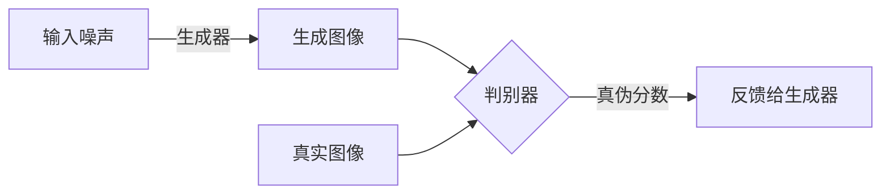
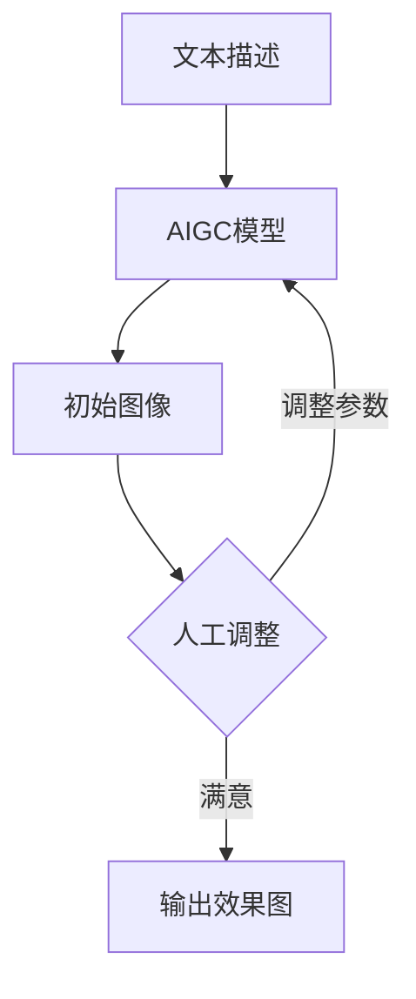

# AIGC从入门到实战：掌握建筑设计要领，创建各种大师风格的效果图

## 1.背景介绍

### 1.1 AIGC的兴起

近年来,人工智能生成式内容(AIGC)技术在各个领域获得了广泛应用和关注。AIGC是利用人工智能算法从少量或无种子内容出发,生成新的内容的技术,包括文本、图像、音频、视频等多种形式。在建筑设计领域,AIGC可用于快速创建各种风格的建筑效果图,为设计师提供无限的创意灵感,大幅提高工作效率。

### 1.2 建筑设计中的痛点

传统的建筑设计过程耗时耗力,需要设计师反复绘制草图、3D模型和渲染效果图。对于同一设计方案,常需要制作多种风格的效果图以满足不同客户需求,工作量巨大。此外,创作灵感的缺乏也常常制约设计师的发挥。AIGC技术的出现为解决这些痛点带来了全新的机遇。

## 2.核心概念与联系  

### 2.1 生成对抗网络(GAN)

AIGC的核心技术是生成对抗网络(GAN),包括生成器(Generator)和判别器(Discriminator)两部分:



生成器从随机噪声出发,尝试生成逼真的图像;判别器则努力区分生成图像与真实图像,并将分数反馈给生成器。两者相互对抗、相互提升,最终使生成器能生成高质量图像。

### 2.2 AIGC建筑设计流程



在建筑设计中,设计师首先输入文本描述,如"一座现代风格的办公楼"。AIGC模型生成初始图像后,设计师可调整参数如构图、材质、光影等,模型即时渲染新效果图,直至设计师满意为止。

## 3.核心算法原理具体操作步骤

AIGC建筑设计的核心算法主要分为以下几个步骤:

### 3.1 文本编码

将设计师的文本描述编码为语义向量,输入到AIGC模型。常用的文本编码模型有BERT、GPT等。

### 3.2 图像生成

基于文本语义向量,AIGC模型的生成器网络生成初始图像。生成器一般采用卷积网络(CNN)等深度学习模型。

### 3.3 图像细化

设计师调整参数如构图、材质、光影等,AIGC模型对图像进行细化,输出新的效果图。这个过程是反复迭代的。

### 3.4 对抗训练

判别器网络判断生成图像的真实性,将分数反馈给生成器,促使生成器不断改进,最终达到高质量输出。

## 4.数学模型和公式详细讲解举例说明

### 4.1 生成器损失函数

生成器的目标是使生成图像$G(z)$尽可能逼真,以骗过判别器。其损失函数可表示为:

$$\underset{G}{\mathrm{min}}\,\mathbb{E}_{z\sim p_z(z)}[\mathrm{log}(1-D(G(z))]$$

其中,$z$是随机噪声向量,$p_z(z)$是其概率分布,$D(G(z))$是判别器对生成图像的真实性评分。

### 4.2 判别器损失函数  

判别器的目标是最大化对真实图像的评分,最小化对生成图像的评分:

$$\underset{D}{\mathrm{max}}\,\mathbb{E}_{x\sim p_{\mathrm{data}}(x)}[\mathrm{log}D(x)]+\mathbb{E}_{z\sim p_z(z)}[\mathrm{log}(1-D(G(z)))]$$

其中,$x$是真实图像,$p_{\mathrm{data}}(x)$是其概率分布。

### 4.3 示例:生成办公楼效果图

假设设计师的文本描述为"一座现代风格的办公楼,玻璃幕墙,简洁利落"。经过文本编码,得到语义向量$t$。

生成器$G$输入随机噪声$z$和语义向量$t$,生成初始图像$G(z,t)$。设计师调整参数如构图、材质、光影,得到新的噪声向量$z'$,生成新图像$G(z',t)$。

判别器$D$评估真实图像$x$和生成图像$G(z',t)$的真实性,计算损失函数并反馈给生成器,使其不断改进生成质量。

通过这种对抗训练,最终可获得高质量、符合设计师意图的办公楼效果图。

## 5.项目实践:代码实例和详细解释说明

以下是一个使用PyTorch实现的简化GAN模型,用于生成手写数字图像:

```python
import torch
import torch.nn as nn

# 生成器
class Generator(nn.Module):
    def __init__(self):
        super(Generator, self).__init__()
        self.model = nn.Sequential(
            nn.Linear(100, 256),
            nn.LeakyReLU(0.2),
            nn.Linear(256, 512),
            nn.LeakyReLU(0.2),
            nn.Linear(512, 1024),
            nn.LeakyReLU(0.2),
            nn.Linear(1024, 784),
            nn.Tanh()
        )

    def forward(self, z):
        img = self.model(z)
        img = img.view(img.size(0), 1, 28, 28)
        return img

# 判别器      
class Discriminator(nn.Module):
    def __init__(self):
        super(Discriminator, self).__init__()
        self.model = nn.Sequential(
            nn.Linear(784, 512),
            nn.LeakyReLU(0.2),
            nn.Linear(512, 256),
            nn.LeakyReLU(0.2),
            nn.Linear(256, 1),
            nn.Sigmoid()
        )

    def forward(self, img):
        img_flat = img.view(img.size(0), -1)
        validity = self.model(img_flat)
        return validity
```

上述代码定义了生成器和判别器的网络结构。生成器将100维噪声输入编码为784维向量,再reshape为28x28的图像。判别器则将28x28图像压平为784维,再编码为0-1之间的真实性分数。

```python
# 超参数
device = 'cuda' 
latent_dim = 100
batch_size = 64
n_epochs = 200

# 初始化模型
generator = Generator().to(device)
discriminator = Discriminator().to(device)

# 损失函数和优化器
criterion = nn.BCELoss()
g_optimizer = torch.optim.Adam(generator.parameters(), lr=0.0002)  
d_optimizer = torch.optim.Adam(discriminator.parameters(), lr=0.0002)

# 训练循环
for epoch in range(n_epochs):
    for i, (imgs, _) in enumerate(dataloader):
        
        imgs = imgs.view(batch_size, 784).to(device)
        
        # 生成噪声
        z = torch.randn(batch_size, latent_dim).to(device)
        
        # 生成图像
        gen_imgs = generator(z)
        
        # 训练判别器
        d_real = discriminator(imgs).view(-1)
        d_loss_real = criterion(d_real, torch.ones(batch_size).to(device))
        d_fake = discriminator(gen_imgs.detach()).view(-1)  
        d_loss_fake = criterion(d_fake, torch.zeros(batch_size).to(device))
        d_loss = (d_loss_real + d_loss_fake) / 2
        d_optimizer.zero_grad()
        d_loss.backward()
        d_optimizer.step()
        
        # 训练生成器  
        z = torch.randn(batch_size, latent_dim).to(device)
        gen_imgs = generator(z)
        g_fake = discriminator(gen_imgs).view(-1)
        g_loss = criterion(g_fake, torch.ones(batch_size).to(device))  
        g_optimizer.zero_grad()
        g_loss.backward()
        g_optimizer.step()
        
    # 保存模型和生成图像
    if (epoch+1) % 10 == 0:
        torch.save(generator.state_dict(), f'generator_{epoch+1}.pth')
        gen_imgs = generator(fixed_noise).detach().cpu()
        save_image(gen_imgs, f'images/fake_{epoch+1}.png')
```

上述代码实现了GAN的训练过程。每个epoch中,首先训练判别器,使其能够较好地区分真实图像和生成图像。然后训练生成器,使其生成的图像能够骗过判别器。通过这种对抗训练,生成器的输出质量不断提高。每10个epoch保存一次生成器模型和生成图像。

以上是一个简化的GAN实现,实际应用中的AIGC模型会更加复杂和强大。但基本思路是相似的,通过生成器和判别器的对抗训练,不断改进生成质量。

## 6.实际应用场景

AIGC技术在建筑设计领域有着广阔的应用前景:

### 6.1 建筑概念设计

通过输入文本描述,AIGC可快速生成各种风格的建筑概念草图,为设计师提供无限创意灵感。

### 6.2 建筑效果图渲染

AIGC能够自动渲染逼真的建筑效果图,解放设计师从繁重的手工渲染工作中解脱出来。

### 6.3 室内设计

AIGC可生成各种家居、办公等室内环境的效果图,为室内设计师节省大量时间和精力。

### 6.4 景观设计

园林景观设计同样可借助AIGC技术,快速呈现各种景观布局和效果图。

### 6.5 虚拟现实/增强现实

将AIGC技术与VR/AR相结合,可构建高度沉浸式的虚拟建筑环境,为客户提供身临其境的体验。

## 7.工具和资源推荐  

以下是一些实用的AIGC建筑设计工具和学习资源:

### 7.1 AI绘画工具

- Midjourney: https://www.midjourney.com
- DALL-E 2: https://openai.com/dall-e-2/
- Stable Diffusion: https://stability.ai/stable-diffusion

### 7.2 开源框架

- PyTorch: https://pytorch.org
- TensorFlow: https://www.tensorflow.org  
- Diffusers: https://huggingface.co/docs/diffusers/index

### 7.3 教程和社区

- Coursera AI for Artists: https://www.coursera.org/learn/ai-for-artists
- Prompt Craft: https://www.promptcraft.com
- Reddit r/StableDiffusion: https://www.reddit.com/r/StableDiffusion/

### 7.4 数据集

- Google Open Buildings: https://research.google.com/datasets/open-buildings/
- Archvizor: https://archvizor.com/datasets

## 8.总结:未来发展趋势与挑战

AIGC技术在建筑设计领域正在迅速发展,未来可期:

### 8.1 多模态融合

未来的AIGC模型将融合视觉、语音、文本等多种模态,实现更自然、高效的人机交互。

### 8.2 可控性和可解释性

提高AIGC模型的可控性和可解释性,使生成结果更符合设计意图,并可解释内在原理。

### 8.3 个性化和定制化

AIGC将朝着个性化和定制化方向发展,为每位设计师量身定制专属的AI助手。

### 8.4 虚实融合

将AIGC与VR/AR、物理模拟等技术融合,打造高度沉浸式的虚拟建筑环境。

### 8.5 伦理和隐私

AIGC技术的发展也带来了一些伦理和隐私方面的挑战,需要制定相应的规范和标准。

## 9.附录:常见问题与解答

### 9.1 AIGC会取代人类设计师吗?

AIGC旨在辅助而非取代人类设计师。它可以极大提高工作效率,释放设计师的创造力,但仍需要人类的审美判断和创意驱动。

### 9.2 AIGC生成的图像是否存在版权问题?

目前,由AI生成的作品在大多数国家均无法获得版权保护。但使用他人作品训练AI模型,可能会产生潜在的版权纠纷。

### 9.3 AIGC模型需要大量计算资源吗?

是的,训练大型AIGC模型需要强