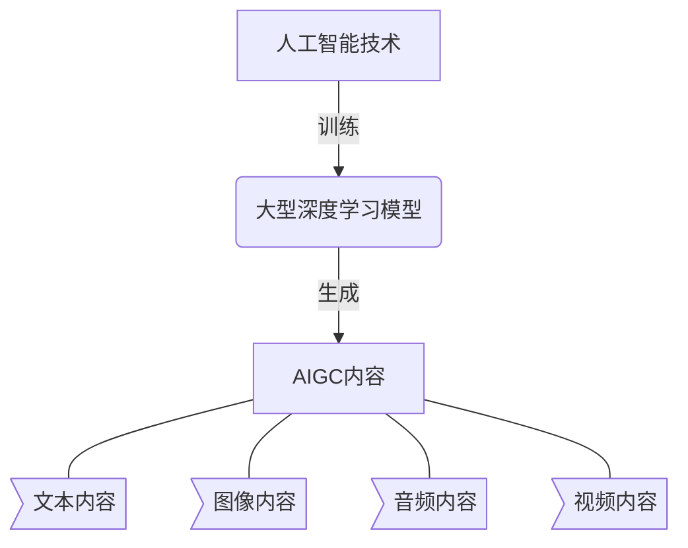
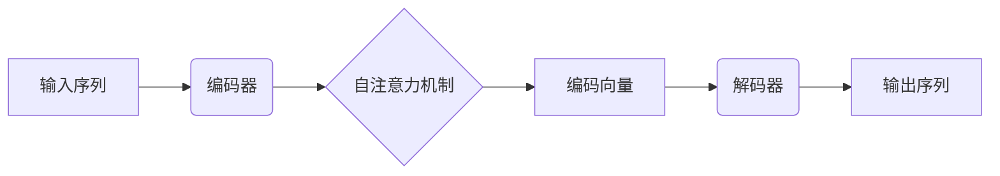
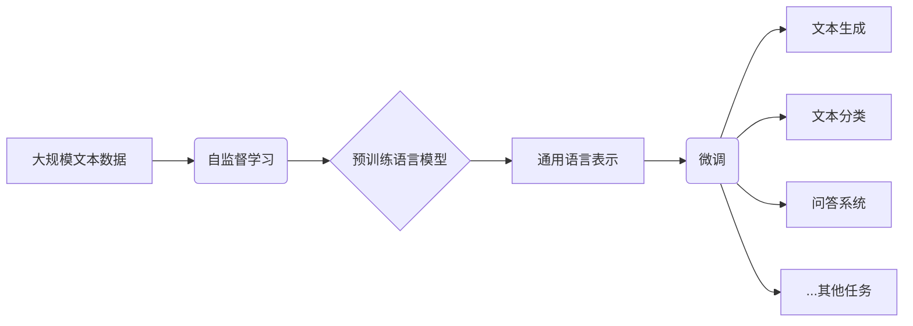
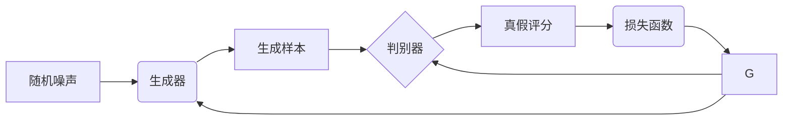

# AIGC从入门到实战：探究ChatGPT的原理和成本

## 1.背景介绍

### 1.1 人工智能的发展历程

人工智能(Artificial Intelligence, AI)是当代科技发展的重要领域之一,自20世纪50年代问世以来,已经经历了几个重要的发展阶段。早期的人工智能系统主要基于规则和逻辑推理,如专家系统、决策树等。随着大数据和计算能力的不断提升,机器学习(Machine Learning)算法开始兴起,使得人工智能系统能够从海量数据中自动学习模式和规律。

### 1.2 深度学习的兴起

2010年左右,深度学习(Deep Learning)技术在计算机视觉、自然语言处理等领域取得突破性进展,推动了人工智能的新一轮发展浪潮。深度学习是机器学习的一种技术,它通过构建深层神经网络模型,对海量数据进行表示学习和特征提取,从而完成复杂的预测和决策任务。

### 1.3 大模型和AIGC时代的到来

近年来,随着算力和数据的持续积累,人工智能发展进入了"大模型"时代。大型的深度学习模型通过对海量数据的学习,展现出了惊人的泛化能力,可以完成诸多看似不相关的任务。以ChatGPT为代表的大型语言模型,正在引领人工智能生成内容(AIGC)时代的到来。

## 2.核心概念与联系

### 2.1 什么是AIGC?

AIGC(AI Generated Content)是指利用人工智能技术自动生成的内容,包括文本、图像、音频、视频等多种形式。AIGC的核心是通过训练大型的深度学习模型,使其能够理解和学习人类创作的内容,并基于此生成新的内容。

### 2.2 AIGC的核心技术

AIGC的核心技术主要包括以下几个方面:

1. **大型语言模型**: 通过对海量文本数据进行预训练,学习语言的语义和语法规则,形成通用的语言表示能力。
2. **多模态模型**: 能够同时处理文本、图像、音频等多种模态数据,实现跨模态的内容理解和生成。
3. **生成式深度学习**: 基于生成对抗网络(GAN)、变分自编码器(VAE)等生成式模型,从底层特征学习内容生成的规律。
4. **强化学习**: 通过与环境交互并获取反馈,不断优化生成内容的质量和策略。
5. **知识增强**: 融合外部知识库、常识知识等,提升模型的理解和推理能力。

### 2.3 AIGC与ChatGPT的关系

ChatGPT是OpenAI开发的一款大型语言模型,被视为AIGC时代的重要里程碑。它通过对海量文本数据进行预训练,形成了强大的自然语言理解和生成能力,可以应用于对话交互、文本创作、问答系统等多个领域。

ChatGPT展示了AIGC在文本生成方面的巨大潜力,但同时也存在一些局限性,如知识的滞后性、缺乏常识推理能力等。未来的AIGC系统需要融合更多的技术,如多模态处理、知识增强等,才能实现真正的通用人工智能。

## 3.核心算法原理具体操作步骤

### 3.1 自然语言处理基础

自然语言处理(Natural Language Processing, NLP)是AIGC的核心技术之一。它主要包括以下几个关键步骤:

1. **文本预处理**: 对原始文本进行分词、去除停用词、词形还原等预处理,将文本转化为模型可以理解的形式。
2. **词向量表示**: 将文本中的词语映射为向量表示,常用的方法有Word2Vec、GloVe等。
3. **序列建模**: 对文本序列进行建模,捕捉上下文信息,常用的模型有RNN、LSTM、Transformer等。
4. **模型训练**: 基于大量标注数据,使用监督学习或自监督学习的方式训练序列模型。
5. **推理和生成**: 对新的输入文本进行编码,通过训练好的模型进行推理和生成输出。

### 3.2 Transformer和自注意力机制

Transformer是一种全新的序列建模架构,它基于自注意力(Self-Attention)机制,能够更好地捕捉长距离依赖关系,并支持并行计算。自注意力机制的核心思想是让每个位置的表示向量不仅与当前位置的输入相关,也与其他位置的输入相关。

Transformer的编码器和解码器都采用了多头自注意力机制,能够从不同的子空间捕捉序列的不同特征。此外,Transformer还引入了位置编码,用于注入序列的位置信息。

### 3.3 预训练语言模型

预训练语言模型(Pre-trained Language Model, PLM)是AIGC中一种常用的技术路线。它通过在大规模无标注文本数据上进行自监督学习,获得通用的语言表示能力,然后在下游任务上进行微调(fine-tuning),快速适配到特定的应用场景。

常见的预训练语言模型包括BERT、GPT、T5等,它们采用了不同的预训练目标和架构。以GPT为例,它的预训练目标是基于给定的上文,预测下一个词的概率分布,这个过程被称为因果语言建模(Causal Language Modeling)。

预训练语言模型的优势在于,通过自监督学习获得了良好的语义和语法理解能力,在下游任务上只需要少量标注数据即可实现快速迁移。这极大降低了人工标注的成本,推动了AIGC在多个领域的应用。

### 3.4 生成式深度学习

生成式深度学习(Generative Deep Learning)是AIGC中另一条重要的技术路线,主要用于生成连续数据,如图像、音频、视频等。常见的生成式模型包括变分自编码器(VAE)、生成对抗网络(GAN)等。

以GAN为例,它由一个生成器(Generator)和一个判别器(Discriminator)组成。生成器从随机噪声中生成假样本,判别器则判断样本是真是假。两者通过对抗训练的方式,生成器不断努力生成更逼真的样本来迷惑判别器,而判别器也在努力区分真假样本。

GAN的生成质量在很大程度上取决于对抗训练的平衡性。如果生成器过于强大,判别器将无法有效区分真假;如果判别器过于强大,生成器将难以产生逼真的样本。通过改进对抗训练的策略和网络结构,GAN可以生成越来越逼真的图像、视频等内容。

## 4.数学模型和公式详细讲解举例说明

### 4.1 词向量表示

在自然语言处理任务中,需要将词语转换为向量表示,以便输入到深度学习模型中。常用的词向量表示方法包括One-Hot编码、Word2Vec、GloVe等。

#### 4.1.1 One-Hot编码

One-Hot编码是最简单的词向量表示方法。对于词汇表中的每个词,使用一个长度为V(词汇量)的向量,在对应位置为1,其余位置为0。

$$\text{one-hot}(x_i) = \begin{bmatrix} 0 \\ \vdots \\ 1 \\ \vdots \\ 0 \end{bmatrix}_{V \times 1}$$

One-Hot编码的缺点是向量维度过高且词与词之间是正交的,无法体现词之间的语义相似性。

#### 4.1.2 Word2Vec

Word2Vec是一种基于神经网络的词向量表示方法,它通过在大规模语料库上进行无监督训练,将每个词映射到一个低维的密集向量空间中,相似的词在该空间中距离较近。

Word2Vec有两种主要模型:连续词袋模型(CBOW)和Skip-Gram模型。以Skip-Gram为例,给定中心词 $w_t$,模型的目标是最大化上下文词 $w_{t-n}, \dots, w_{t-1}, w_{t+1}, \dots, w_{t+n}$ 的条件概率:

$$\max_{\theta} \frac{1}{T} \sum_{t=1}^{T} \sum_{-n \leq j \leq n, j \neq 0} \log P(w_{t+j} | w_t; \theta)$$

其中 $\theta$ 为模型参数, $T$ 为语料库中的词数。通过训练,每个词 $w_i$ 都可以获得一个 $d$ 维的向量表示 $\mathbf{v}_i \in \mathbb{R}^d$。

Word2Vec能够很好地捕捉词与词之间的语义关系,但无法处理词义消歧等问题。

#### 4.1.3 GloVe

GloVe(Global Vectors for Word Representation)是另一种基于词共现统计信息的词向量表示方法。它的基本思想是,如果两个词在语料库中经常同时出现,则它们的词向量应该较为接近。

具体来说,GloVe试图最小化以下加权最小二乘函数:

$$J = \sum_{i,j=1}^{V} f(X_{ij}) \left( w_i^T \tilde{w}_j + b_i + \tilde{b}_j - \log X_{ij} \right)^2$$

其中 $X_{ij}$ 表示词 $w_i$ 和 $w_j$ 在语料库中的共现次数, $f(X_{ij})$ 是一个权重函数, $w_i, \tilde{w}_j, b_i, \tilde{b}_j$ 分别是词向量和偏置项。通过优化该目标函数,可以获得每个词的向量表示。

GloVe能够捕捉到更丰富的语义和语法信息,在多项自然语言处理任务上表现优异。

### 4.2 自注意力机制

自注意力机制是Transformer模型的核心,它能够有效捕捉序列中长距离的依赖关系。给定一个长度为 $n$ 的序列 $\mathbf{x} = (x_1, x_2, \dots, x_n)$,自注意力机制首先计算每个位置 $i$ 与所有位置 $j$ 之间的相关性分数:

$$\text{Attention}(Q_i, K_j, V_j) = \text{softmax}\left(\frac{Q_iK_j^T}{\sqrt{d_k}}\right)V_j$$

其中 $Q_i, K_j, V_j$ 分别表示查询(Query)、键(Key)和值(Value)向量,它们是通过线性变换得到的:

$$\begin{aligned}
Q_i &= x_iW^Q \\
K_j &= x_jW^K \\
V_j &= x_jW^V
\end{aligned}$$

$W^Q, W^K, W^V$ 是可学习的权重矩阵。相关性分数 $\alpha_{ij}$ 反映了位置 $i$ 对位置 $j$ 的注意力程度。通过对所有位置的注意力加权求和,可以得到位置 $i$ 的输出表示:

$$\text{Attention}(Q_i) = \sum_{j=1}^{n} \alpha_{ij}V_j$$

自注意力机制能够自适应地为每个位置分配注意力权重,从而更好地捕捉长距离依赖关系。多头自注意力则是从不同的子空间捕捉序列的不同特征,进一步提高了模型的